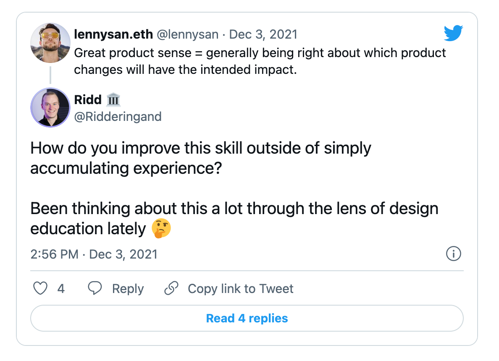
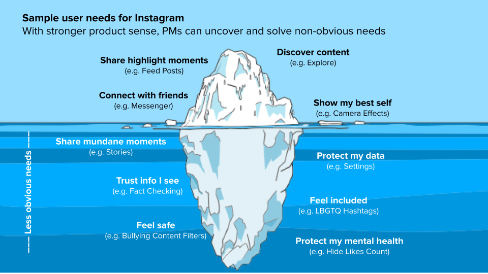

👋 Hey, [Lenny](https://twitter.com/lennysan) here! Welcome to a ✨ **monthly free edition** ✨ of my weekly newsletter. Each week I tackle reader questions about building product, driving growth, working with humans, and anything else that’s stressing you out about work.  

嗨，Lenny 在这里！欢迎来到我每周通讯的✨免费版✨。每周我都会解答读者关于构建产品、推动增长、与人合作以及任何让你在工作中感到压力的问题。

If you’re not a subscriber, here’s what you missed this month:  

如果您不是订阅者，以下是您这个月错过的内容

1.  [Freemium vs. trial  免费增值模式与试用模式](https://www.lennysnewsletter.com/p/freemium-trials-free?s=w)
    
2.  [What is good waitlist conversion  
    
    什么是好的候补名单转化](https://www.lennysnewsletter.com/p/what-is-good-waitlist-conversion?s=w)
    
3.  [What is good monthly churn  
    
    什么是好的月度客户流失率](https://www.lennysnewsletter.com/p/monthly-churn-benchmarks?s=w)
    

Your question implies that it _can_ be developed, and to that point, I 1,000% agree. Contrary to what a lot of PMs believe, product sense is not something you need to be born with. It’s a learned skill, just like any other PM skill. Sure, some people are naturally better at it, but that’s OK. You don’t need to be in the 99th percentile of this skill to be an incredibly successful PM. That being said, you are building a product as your job, and are often the final word on product decisions, so you absolutely do need to develop your product sense muscle, especially as you move up in seniority.  

您的问题暗示这可以开发，并且在这方面，我 100%同意。与许多项目经理所相信的相反，产品感并不是你与生俱来的东西。它是一种学习到的技能，就像任何其他项目经理技能一样。当然，有些人在这方面天生更擅长，但这没关系。你不需要在这个技能的 99%百分位上才能成为一个极其成功的项目经理。话虽如此，您正在将产品作为您的工作，并且通常是产品决策的最终决定者，因此您绝对需要发展您的产品感肌肉，尤其是在您晋升到更高层级时。

To help you build your product sense, I’ve asked [Jules Walter](https://www.linkedin.com/in/juleswalter/), a longtime PM at Slack and YouTube who’s also a prominent leader in the broader PM community, to share his hard-earned wisdom with us. Below, Jules unravels the mystery that is product sense. He shares a ton of actionable and practical advice to develop your product sense, explains what product sense is, how to know if you’re getting better, and dives deep into four concrete ways to build this skill with a bunch of examples from his own experience. Enjoy!  

为了帮助您建立产品感，我邀请了 Slack 和 YouTube 的资深产品经理 Jules Walter，他也是更广泛的产品经理社区中的杰出领导者，与我们分享他辛勤积累的智慧。下面，Jules 揭示了产品感的神秘面纱。他分享了许多可操作和实用的建议来培养您的产品感，解释了什么是产品感，如何知道自己在进步，并深入探讨了四种具体的方法来培养这项技能，并附带了他自己的许多经验案例。享受吧！

You can follow Jules on [Twitter](https://twitter.com/julesdwalt) and [LinkedIn](https://www.linkedin.com/in/juleswalter).  

您可以在 Twitter 和 LinkedIn 上关注 Jules。

P.S. You can now hear this post in audio form 👇  

P.S. 您现在可以以音频形式收听这篇帖子 👇

Product sense is not only one of the most important PM skills (see chart below from [Lenny’s survey of ~1,000 PMs](https://www.lennysnewsletter.com/p/product-management-survey?s=w#:~:text=Being%20a%20Product%20Manager))—it’s also the most vague. And it’s often the hardest to learn.  

产品感不仅是最重要的产品经理技能之一（参见下方的 Lenny 对约 1000 名产品经理的调查图表）——它也是最模糊的。而且，它往往是最难学习的。

There isn’t much written on the subject, and as a PM trying to improve your product sense, you may not know if you’re any good at it, or how to get better. I want to help.  

关于这个主题的资料并不多，作为一个试图提升产品感觉的产品经理，你可能不知道自己在这方面做得如何，也不知道如何提高。我想帮助你。

**Product sense is the skill of consistently being able to craft products (or make changes to existing products) that have the intended impact on their users.** Product sense relies on (1) **empathy** to discover meaningful user needs and (2) **creativity** to come up with solutions that effectively address those needs.  

产品感是指持续地能够设计出（或对现有产品进行改进）对用户产生预期影响的产品（或对现有产品进行改进）的技能。产品感依赖于（1）同理心来发现有意义的用户需求，以及（2）创造力来提出有效解决这些需求的解决方案。

You likely have good product sense if you’ve championed successful features or products that were not obvious to others. Here are some examples of products born out of strong product sense:  

如果你曾倡导过其他人看来并不明显的成功功能或产品，那么你很可能拥有良好的产品感。以下是一些源于强烈产品感的产品的例子：

-   The original iPhone was built on the insight that people value aesthetics, and not just functionality, in their products. It was designed around the idea that consumers needed a smartphone that felt personal.  
    
    原始 iPhone 的构建基于人们对产品美学的重视，而不仅仅是功能。它的设计理念是消费者需要一部感觉个性化的智能手机。
    
-   The original Gmail responded to unmet user needs at the time. It addressed common user problems, including low storage quotas, poor search experience, and related messages separated from each other (instead of being combined in a thread).  
    
    原始 Gmail 当时满足了用户的需求。它解决了常见的用户问题，包括低存储配额、糟糕的搜索体验以及相关消息彼此分离（而不是合并到一条线程中）。
    
-   Superhuman saw a need for a modern email client to allow busy professionals to get through emails quickly. It used thoughtful design to support fast email workflows and limit distractions.  
    
    超级人类看到了现代电子邮件客户端的需求，以便忙碌的专业人士能够快速处理电子邮件。它采用了深思熟虑的设计来支持快速电子邮件工作流程并限制干扰。
    

Each of these products originated with strong product sense and offered creative solutions to previously unmet user needs.  

每个这些产品都源于强烈的产品意识，并为之前未满足的用户需求提供了创新解决方案。

I was the first PM on Slack’s growth team, where I spent more than four years building product experiences used by millions of people. I’m now a product leader at YouTube, where I’m building a yet-to-be-released zero-to-one product.  

我是 Slack 增长团队的第一任产品经理，在那里我花了超过四年时间构建了数百万用户使用的用户体验。现在我是 YouTube 的产品领导者，在那里我正在构建一个尚未发布的零到一的产品。

In my roles, I’ve relied on product sense to bring unique insights to the table and drive user value and business impact. In this article, I will be discussing four practices for building product sense.   

在我的角色中，我依靠产品感为会议带来独特的见解，并推动用户价值和商业影响。在本文中，我将讨论四种建立产品感的方法。

**Building empathy:  构建同理心：**

1.  Observe people interacting with products  
    
    观察人们如何与产品互动
    
2.  Deconstruct everyday products  
    
    解构日常产品
    

**Improving creativity:  提升创造力：**

3.  Learn from great product thinkers  
    
    学习优秀的产品思考者
    
4.  Be curious about changes in technology and your domain  
    
    对技术和您所在领域的变革保持好奇
    

Let’s get to it.  让我们开始吧。

One approach to developing empathy—and thus, product sense—is to repeatedly observe people using products, whether yours or other companies’. This practice will help you get better at identifying subtle user needs that others miss (e.g. social, emotional, or functional needs).  

一种培养同理心——从而获得产品感的方法是反复观察人们使用产品，无论是您的还是其他公司的。这种做法将帮助您更好地识别其他人忽视的微妙用户需求（例如，社交、情感或功能需求）。

You can start small. Initially, I recommend doing this two to four times a month for your product. Don’t just read reports from researchers on your team; instead attend user research sessions to get firsthand exposure to user experiences and reactions. What’s important is to pay attention to micro details and ask yourself why people react to your product the way they do. Observe their facial expressions as they try various aspects of your product, and try to spot moments when they’re hesitant, confused, excited, etc. In those moments, ask open-ended questions to better understand not just how they feel but, more importantly, _why_.  

您可以从小处着手。最初，我建议您每月进行两次到四次的产品测试。不要只是阅读您团队研究人员提供的报告；相反，参加用户研究会议，以便亲自体验用户感受和反应。重要的是关注细节，并问自己为什么人们会以这种方式对您的产品做出反应。观察他们在尝试您产品各个方面的面部表情，并试图捕捉到他们犹豫、困惑、兴奋等时刻。在这些时刻，提出开放式问题，以更好地了解他们的感受，更重要的是，了解原因。

Here are some sample questions you can ask:  

以下是一些您可以提出的问题示例：

1.  What do you think the purpose of this product is? Who do you think it’s for? _This will give you a sense of how effective your product’s landing page is. It also gives you ideas for words to describe your product that resonate with people._  
    
    你认为这个产品的目的是什么？你认为它是为谁设计的？这将让你了解你的产品着陆页的有效性。它还为你提供了描述产品的词汇，这些词汇能引起人们的共鸣。
    
2.  Now that you’re in the product, what actions do you want to take? _This will help you understand which features are easy to discover and how clear your product’s navigation and calls to action are._  
    
    现在您已经进入产品，您想执行哪些操作？这将帮助您了解哪些功能易于发现，以及您产品的导航和行动号召是否清晰。
    
3.  What are you thinking right now? How does that make you feel? _I tend to ask this at every new step the user lands on, because people tend not to notice their self-talk and feelings otherwise._  
    
    你现在在想什么？这让你感觉如何？我倾向于在用户到达每个新步骤时问这个问题，因为人们通常不会注意到他们的自我对话和感受。
    

When I joined Slack in 2016, our data indicated high churn rates for new users on mobile. We wanted to understand why, so we set up user research sessions and asked questions such as the ones above. Through those questions and through observing users, we learned that:  

当我于 2016 年加入 Slack 时，我们的数据显示移动端新用户流失率很高。我们想了解原因，因此设置了用户研究会议并提出了类似上述的问题。通过这些问题和观察用户，我们了解到：

-   Many people didn’t really understand what Slack did, even after visiting our homepage, which was too abstract at the time.  
    
    许多人实际上并不真正理解 Slack 是做什么的，即使访问了我们的主页，那时的主页内容也太抽象了。
    
-   People would land in the Slack app and not know what to do because of competing calls to action.  
    
    人们会进入 Slack 应用却不知道该做什么，因为存在相互竞争的行动号召。
    
-   People didn’t want to give permission to their mobile address book, because it had their friends’ contact info and not their colleagues’.  
    
    人们不想授权他们的手机通讯录，因为它包含的是他们的朋友联系信息，而不是同事的。
    

These new insights led us to come up with experiment ideas that enabled us to improve Slack’s product experience for new users and significantly increase the product’s retention rate. Below is one such experiment, which removed friction in the invite step and addressed users’ concerns around giving permission to their address books.  

这些新见解使我们能够提出实验想法，这些想法使我们能够改善新用户对 Slack 的产品体验，并显著提高产品的留存率。以下是一个这样的实验，它消除了邀请步骤中的摩擦，并解决了用户在允许访问他们的通讯录方面的担忧。

After observing hundreds of people use products I’ve worked on (whether in research sessions or coffee shops etc.) and asking them questions about their usage, I’ve developed better instincts about how people will react to various product experiences. Here are five quick lessons about product usage that have stuck with me:  

观察了数百人使用我参与开发的产品（无论是在研究会议还是咖啡店等地方），并询问他们关于使用情况的问题后，我对于人们将如何对各种产品体验做出反应有了更好的直觉。以下是我牢记的五条关于产品使用的快速经验教训：

1.  **People are time-crunched and distracted when they use your product.** They might not read labels or text and might not be willing to spend even a few seconds to figure out what to do next. Pick the right defaults and use visual design and cues to make primary actions obvious (e.g. prominence, lack of distractions).  
    
    人们在使用您的产品时感到时间紧迫且分心。他们可能不会阅读标签或文本，甚至可能不愿意花几秒钟时间来弄清楚下一步该做什么。选择合适的默认设置，并使用视觉设计和提示使主要操作明显（例如，突出显示，减少干扰）。
    
2.  **People will drop out of a product flow as soon as they feel confused or nervous** that they might be doing something wrong. Make sure labels are unambiguous and contrast options appropriately.  
    
    人们一旦感到困惑或紧张，担心自己可能做错了什么，就会从产品流程中退出。确保标签清晰明确，并适当对比选项。
    
3.  **Don’t give people too much information at once**, because once they feel overwhelmed, they tend to leave. For example, we ran pricing page experiments at Slack and saw increases in purchases when we moved some of the information on the various purchase options behind a dropdown list.  
    
    不要一次性给人们提供太多信息，因为他们一旦感到不知所措，往往会离开。例如，我们在 Slack 上进行了定价页面实验，当我们把各种购买选项的一些信息移到下拉列表后面时，我们发现购买量有所增加。
    
4.  **Context impacts decisions.** Use tools like comparisons, contrasting, and social proof to make it easier for users to make a decision.  
    
    上下文影响决策。使用比较、对比和社交证明等工具，让用户更容易做出决策。
    
5.  **Make sure the goal of your product and possible actions are clear to users.** At Slack, we often heard from users that they didn’t know what Slack was really about and what they could do with the app. We experimented with various onboarding experiences to address that issue, and one early experiment on mobile increased user retention just by telling new users what Slack is and linking to a video showing people how a work team might use it on desktop and mobile.  
    
    确保您的产品目标和可能采取的行动对用户来说清晰易懂。在 Slack，我们经常听到用户表示他们不知道 Slack 真正是什么，以及他们可以用这款应用做什么。我们尝试了各种入门体验来解决这一问题，其中一项早期的移动端实验仅通过告诉新用户 Slack 是什么，并链接到一个视频展示人们如何在桌面和移动端使用工作团队，就提高了用户留存率。
    

The more frequently and closely you watch people using products, the more observant you’ll become and the more empathy you’ll develop.  

你越频繁、越细致地观察人们使用产品，你就越会变得敏锐，也越能培养同理心。

Another approach to developing empathy is to observe _yourself_ using everyday products. I spend one or two hours a month trying out new products and deconstructing them. The goal is to strengthen my intuition about why some products work well and others don’t—this also helps me identify common UX best practices and paradigms. While deconstructing products, I recommend asking the types of questions Julie Zhuo shares in the article [How to Do a Product Critique](https://medium.com/the-year-of-the-looking-glass/how-to-do-a-product-critique-98b657050638#.v5o81mocz), such as:   

另一种培养同理心的方法是观察自己使用日常产品。我每个月花一到两个小时尝试新产品并拆解它们。目标是加强我对为什么有些产品效果良好而有些则不然的直觉——这也有助于我识别常见的用户体验最佳实践和范式。在拆解产品时，我建议提出类似于朱莉·朱在《如何进行产品评论》一文中分享的问题类型，例如：

1.  What’s the experience of getting started or signing up?  
    
    什么是有开始或注册的经验？
    
2.  How does this app explain itself in the first minute?  
    
    这个应用如何在第一分钟内介绍自己？
    
3.  How easy to use was the app?  
    
    这个应用使用起来有多简单？
    
4.  How did you feel while exploring the app?  
    
    您在探索应用时感觉如何？
    
5.  Did the app deliver on your expectations?  
    
    该应用是否达到了您的期望？
    

If you want to go deeper in your understanding of a product, I recommend also looking at other products in the same category and comparing and contrasting them. For example, to better understand a product like [Cash App](https://cash.app/), compare it with [Venmo](https://venmo.com/). You’ll see that these two seemingly similar money apps are fundamentally different. Below are a few dimensions you can look at to compare two products and better understand how they approach product decisions.  

you 想要深入了解一个产品，我建议你也看看同一类别的其他产品，并进行比较和对比。例如，为了更好地了解像 Cash App 这样的产品，可以将其与 Venmo 进行比较。你会发现这两个看似相似的钱包应用在本质上是有区别的。以下是一些你可以用来比较两个产品并更好地了解它们如何处理产品决策的维度。

By comparing a product with others in the space, some of the product design choices become more salient and it’s easier to get hints of the product’s strategy. For example, in the Cash App vs. Venmo comparison, it seems Venmo’s strategy is to lean into its social graph (use Venmo because your friends are already on it and you can easily make sure you’re sending the money to the right person), whereas Cash App is focused on ease of use and breadth of capabilities for people who want to go beyond just peer-to-peer transfers (run your personal finances or small business from your phone).  

通过将产品与该领域内的其他产品进行比较，一些产品设计选择变得更加明显，更容易了解产品的策略。例如，在 Cash App 与 Venmo 的比较中，Venmo 的策略似乎是利用其社交图谱（因为你的朋友已经在 Venmo 上，你可以轻松确保将钱发送给正确的人），而 Cash App 则专注于易用性和功能范围，以满足那些想要超越仅限点对点转账的人（通过手机管理个人财务或小型业务）。

When I use new products, I also observe my own self-talk and feelings, including moments of frustration, such as:  

当我使用新产品时，我也会观察自己的自言自语和感受，包括挫败的时刻，例如：

-   I’m trying to log in to my medical app to set up an appointment, but I’m unable to because I can’t remember my password. The password reset flow never sent me an email, even after multiple attempts, and I just stopped using the service.  
    
    我试图登录我的医疗应用以安排预约，但我无法登录，因为我记不起我的密码。即使多次尝试，密码重置流程也从未给我发送电子邮件，我只好停止使用这项服务。
    
-   I’m trying to rent a car, but as soon as I input the start time, the interface shows an error message telling me that the end time can’t be before the start time. I was going to update the end time anyway, and now I feel stupid and frustrated while using this product, which is not a feeling you want your users to have.  
    
    我试图租车，但当我输入开始时间时，界面显示错误信息，告诉我结束时间不能早于开始时间。我本来打算更新结束时间，但现在在使用这个产品时感到愚蠢和沮丧，这不是你希望用户拥有的感觉。
    

I also note moments when I experience delight, such as:  

我也注意到我感到快乐的时刻，例如：

-   Carta’s stock-vesting email could have been just text letting me know that I’ve vested into more shares, but it also includes an animation with confetti that takes my feeling of celebration to another level.  
    
    Carta 的股票期权电子邮件本可以只是一封告知我已获得更多股份的纯文本邮件，但它还包含了一个带有彩带的动画，将我的庆祝感提升到了另一个层次。
    
-   Google Photos collages combine multiple photos of the people who matter to me the most in delightful ways.  
    
    谷歌照片拼贴以令人愉悦的方式结合了我最在乎的人的多个照片。
    

One bonus practice I recommend for improving your empathy and observation skills is meditation. I’ve been meditating for years, and it’s helped me become more perceptive—not just of other people’s feelings but also of my own. If you are new to meditation, I recommend starting with an [app](https://www.fitmind.co/fitmind-meditation-app) or joining a [meditation community](https://sundaysangha.net/) to help you form a daily habit.  

一项我推荐的提高同理心和观察力的额外练习是冥想。我已经冥想了多年，这帮助我变得更加敏锐——不仅对别人的感受，也对自己的感受。如果你是冥想的新手，我建议从使用应用程序或加入冥想社区开始，以帮助你养成每日的习惯。

The more frequently and closely you observe people (and yourself), the more insight you will gain into their motivations and needs, and the more your empathy will grow.  

你观察人们（以及自己）的频率越高、越细致，你对他们的动机和需求就会获得越多的洞察，你的同理心也会随之增长。

One of the biggest levers for developing creativity (and again, product sense) is to spend time with people who already have it.  

创意（以及产品感）发展最大的杠杆之一是与已经拥有它的人共度时光。

My creativity improved significantly after I joined Slack, partly because I observed how people like CEO Stewart Butterfield approached building products. If you’ve never worked at a company with strong product thinkers, I recommend joining such a company at some point in your career to strengthen your product fundamentals—the earlier, the better. If you’re not sure which companies to consider, start by thinking of companies whose products you use and love.  

我的创造力在加入 Slack 后显著提高，部分原因是我观察了像 CEO 斯图尔特·巴特菲尔德这样的人是如何构建产品的。如果你从未在拥有强大产品思维的公司工作过，我建议在你的职业生涯中某个时刻加入这样的公司，以加强你的产品基础——越早越好。如果你不确定要考虑哪些公司，可以先想想你使用并喜爱的公司产品。

Once you’re at a company with great product thinkers, I recommend attending as many product reviews as you can. Take copious notes during the reviews, and look for patterns in the questions and feedback you hear—i.e. what type of comments keep coming up. Over time, you’ll understand the mental checklists your product leaders use to ensure that new product ideas will be successful, and you’ll identify the principles they use to make product decisions and trade-offs.  

一旦你加入了一个拥有优秀产品思考者的公司，我建议尽可能多地参加产品评审。在评审过程中做大量笔记，并寻找你听到的提问和反馈中的规律——即哪些类型的评论反复出现。随着时间的推移，你会了解你的产品领导者用来确保新产品想法成功的心理清单，并识别他们用来做出产品决策和权衡的原则。

One of the things I learned from my exposure to Stewart Butterfield is that _every_ detail about the user experience matters. “The details are not the details,” he would say, quoting designer Charles Eames. “They make the design.” Stewart’s obsession with the details is one of the main reasons why Slack exists and is used by millions of people.  

我从接触斯图尔特·巴特菲尔德中学到的一件事是，用户体验的每一个细节都很重要。“细节不是细节，”他会引用设计师查尔斯·伊姆斯的话说，“它们构成了设计。”斯图尔特对细节的痴迷是 Slack 存在并被数百万人所使用的主要原因之一。

For example, if a user tries to use @channel to message a large number of teammates across multiple time zones in Slack, they’ll see a cartoon rooster (below) asking them to think twice about notifying these people. It’s a detail that wasn’t built to move metrics but rather to prevent anxiety for people who would otherwise receive work notifications at odd hours. The rooster icon was chosen to keep the tone playful so that the message sender doesn’t feel ashamed or guilty when they read the warning.  

例如，如果用户尝试在 Slack 中使用@channel 向多个时区的大量队友发送消息，他们将会看到一个卡通公鸡（如下所示），询问他们是否真的想通知这些人。这是一个不是为了推动指标而设计的细节，而是为了防止那些本应在非正常时间收到工作通知的人感到焦虑。选择公鸡图标是为了保持轻松的语气，这样信息发送者在阅读警告时不会感到羞愧或内疚。

This type of product detail can mean a lot to users. When I would review customer tickets at Slack, many of them were positive feedback from people thanking us for the thoughtfulness that the team put into the product. Sometimes people couldn’t even say exactly _why_ they loved Slack—partly because what drew them wasn’t one big feature, but rather the attention to details across the product. I’ve learned that if you remove from your product lots of small annoyances that people deal with on a daily basis, the value you get from doing that adds up to something meaningful.  

这种产品详情对用户来说意义重大。当我审阅 Slack 的客户工单时，其中许多都是对团队的细心投入表示感谢的积极反馈。有时人们甚至无法确切地说出他们为什么喜欢 Slack——部分原因是因为吸引他们的不是一项大功能，而是产品中对细节的关注。我了解到，如果你从你的产品中去除人们日常遇到的许多小烦恼，这样做带来的价值会累积成有意义的东西。

Another lesson I learned from Stewart is to spend time understanding user problems and framing them in a way that sets strong constraints for the team. Many PMs jump into solution-finding before they truly understand the problem. This leads to ineffective solutions, or indecisiveness as their teams struggle to eliminate potential solutions. If you understand why a problem exists and frame it clearly, you will identify enough constraints that only a few solutions will be left, streamlining the decision-making process. For example, in the article [Are You Solving the Right Problems?](https://hbr.org/2017/01/are-you-solving-the-right-problems), Thomas Wedell-Wedellsborg gives an example of how two different framings of a problem lead to completely different solutions:  

从斯图尔特那里学到的另一课是花时间理解用户问题，并以一种为团队设定强烈约束的方式提出这些问题。许多项目经理在真正理解问题之前就急于寻找解决方案。这导致无效的解决方案，或者由于团队努力消除潜在解决方案而导致的犹豫不决。如果你理解问题存在的原因，并清楚地提出它，你将能够识别出足够的约束，从而只剩下少数解决方案，简化决策过程。例如，在《你是在解决正确的问题吗？》这篇文章中，托马斯·韦德尔-韦德尔索格给出了一个例子，说明了两种不同的问题表述如何导致完全不同的解决方案：

This ability to reframe problems and set opinionated constraints is a key skill I’ve seen product thinkers use to drive creative solutions.  

这种重新定义问题和设定有偏见的限制的能力是产品思考者用来推动创造性解决方案的关键技能。

If, on the other hand, you don’t work at a company with strong product thinkers, look for external mentors and read articles or interviews from people such as [Julie Zhuo](https://www.youtube.com/watch?v=b78zq-kimVs), [Stewart Butterfield](https://medium.com/@stewart/we-dont-sell-saddles-here-4c59524d650d), [David Lieb](https://www.ycombinator.com/library/5f-on-starting-and-scaling-one-of-the-biggest-ios-apps), and [Rahul Vohra](https://www.youtube.com/watch?v=zaxAdRlyZQ8).  

另一方面，如果你在一家没有强大产品思维的公司工作，寻找外部导师，并阅读来自朱莉·朱、斯图尔特·巴特菲尔德、大卫·莱布和拉胡尔·沃拉等人撰写的文章或采访。

If you’re able to connect with great product thinkers, here are some sample questions you can ask to better understand their processes and insights:  

如果您能联系到优秀的产品思考者，以下是一些您可以提出的问题，以更好地了解他们的流程和见解：

-   What prompted you to build your product? _This will give you a sense of the type of user insights you should be looking for and the process to get them._  
    
    什么促使你构建你的产品？这将让你了解你应该寻找的用户洞察类型以及获取它们的过程。
    
-   What were the key decision points along the way?  
    
    一路上关键决策点有哪些？
    
-   What alternative approaches did you consider? _For ambiguous problems, you have to explore multiple approaches before you land on one that works. Understanding the solutions that were discarded, and why, will help you get a sense of how they test hypotheses and make trade-offs._  
    
    您考虑了哪些替代方案？对于模糊问题，您必须探索多种方法，才能找到一种有效的方法。了解被舍弃的解决方案及其原因，将帮助您了解它们如何检验假设和做出权衡。
    
-   What were surprising insights or results? _Knowing when their initial hypotheses were wrong and understanding why can help you uncover great insights._  
    
    令人惊讶的见解或结果是什么？知道他们的初始假设是错误的，并理解原因可以帮助你发现深刻的见解。
    
-   What principles or frameworks helped you navigate the ambiguity? _Great product thinkers internalize product principles they use to evaluate solutions. If you can uncover those principles, you can use them to guide your decisions as well._  
    
    哪些原则或框架帮助您应对模糊性？优秀的产品思考者将他们用来评估解决方案的产品原则内化。如果您能揭示这些原则，您也可以用它们来指导您的决策。
    

Gaining access to strong product thinkers may be difficult, but try to read as many blog posts or watch as many videos as you can where product leaders who you look up to share their thought processes.  

获取强大产品思维者的访问可能很困难，但尽量阅读尽可能多的博客文章或观看尽可能多的视频，在这些视频中，你尊敬的产品领导者分享他们的思考过程。

Another practice for developing creativity is to spend time learning about emerging trends in technology, society, and regulations. Changes in the industry create opportunities for launching new products that can address user needs in new ways. As a PM, you want to understand what’s possible in your domain in order to come up with creative solutions. For example:  

另一种培养创造力的方法是花时间了解技术、社会和法规方面的新兴趋势。行业的变化创造了推出新产品、以新方式满足用户需求的机会。作为项目经理，您希望了解您所在领域的可能性，以便提出创新解决方案。例如：

-   Cash App decided to support Bitcoin transactions, and as a result, 76% (nearly $4.6 billion) of its 2020 revenues came from Bitcoin. For more examples of products that benefited from new trends, see Lenny’s article [Why now](https://www.lennysnewsletter.com/p/why-now?).  
    
    Cash App 决定支持比特币交易，因此，其 2020 年收入的 76%（近 46 亿美元）来自比特币。有关受益于新趋势的产品更多示例，请参阅 Lenny 的文章《为什么现在》。
    
-   Uber became possible because of the proliferation of smartphones with GPS capabilities and the availability of Google Maps APIs.  
    
    优步之所以成为可能，是因为具备 GPS 功能的智能手机的普及以及谷歌地图 API 的可用性。
    
-   Clubhouse took off quickly because of the pandemic, which accelerated the need for virtual public discourse.  
    
    Clubhouse 因疫情迅速崛起，这加速了虚拟公共话语的需求。
    

There are two levels at which you can look at emerging trends: the macro and the micro. At the macro level, you should keep track of important platform shifts (e.g. web3, AR/VR, AI), social shifts (e.g. the shift to remote work), and changes in regulations (e.g. new privacy protection laws). It’s important to keep an open mind about new technologies, because at first they receive a lot of skepticism and have obvious flaws. I still remember when people were skeptical of e-commerce and assumed it would never be safe to use credit cards online. When you see a new trend, instead of dismissing it as a fad, ask yourself, “If this trend reaches its full potential, what opportunities will it create that I can pursue?”  

有两个层面可以观察新兴趋势：宏观和微观。在宏观层面，你应该关注重要的平台转变（例如 web3、AR/VR、AI）、社会转变（例如远程工作的转变）以及法规变化（例如新的隐私保护法律）。保持对新技术开放的心态很重要，因为一开始它们会遭到很多怀疑，并且存在明显的缺陷。我仍然记得当人们对电子商务持怀疑态度，认为在线使用信用卡永远不会安全的时候。当你看到一个新的趋势时，不要将其视为一种时尚，而是要问自己：“如果这个趋势达到其全部潜力，它将创造哪些我可以追求的机会？”

There are many places to keep up with macro technology trends. For example, you can:  

有许多地方可以了解宏观技术趋势。例如，您可以：

-   Watch annual developer conferences from major tech companies to understand what areas they see as promising (e.g. [Google](https://io.google/2021/?lng=en), [Apple](https://developer.apple.com/wwdc21/), [Meta](https://developers.facebook.com/f8/), [Amazon](https://reinvent.awsevents.com/)).  
    
    观看主要科技公司举办的年度开发者大会，了解他们认为有潜力的领域（例如：谷歌、苹果、Meta、亚马逊）。
    
-   Read commentary from industry analysts (e.g. [Ben Thompson](https://stratechery.com/)).  
    
    阅读行业分析师的评论（例如本·汤普森）。
    
-   Follow tech founders and investors on Twitter (e.g. [Naval Ravikant](https://twitter.com/naval?), [Elad Gil](https://twitter.com/eladgil?), [Balaji Srinivasan](https://twitter.com/balajis)) and pay attention to trends they’re bullish on.  
    
    关注 Twitter 上的科技创始人及投资者（例如 Naval Ravikant、Elad Gil、Balaji Srinivasan）并留意他们看好的趋势。
    
-   Invest in or advise startups operating in spaces that interest you. If that’s not possible, pay attention to what companies top VCs are investing in, and follow those companies.  
    
    投资或咨询您感兴趣领域的初创企业。如果这不可能，关注顶级风险投资家所投资的公司，并跟随这些公司。
    

While the macro trends are helpful in seeing where the industry is going, many of the non-obvious opportunities lie in deeply understanding micro changes that may unlock new possibilities. For example, Figma’s high-quality browser-based application for designers became possible only once WebGL became performant enough. In order to understand the nuances of micro changes, I recommend meeting with engineers and domain experts and going deep with them on topics of interest, such as new APIs or platform capabilities.  

宏观趋势有助于看清行业走向，但许多非显而易见的机会则在于深入理解微观变化，这些变化可能开启新的可能性。例如，Figma 为设计师提供的基于浏览器的应用程序之所以成为可能，仅仅是因为 WebGL 的性能足够强大。为了理解微观变化的细微差别，我建议与工程师和领域专家会面，并就感兴趣的话题（如新的 API 或平台功能）与他们深入探讨。

As Paul Graham said in [How to Get Startup Ideas](http://paulgraham.com/startupideas.html), “Live in the future, then build what’s missing.” Living in the future is also an effective approach to developing your product sense.  

保罗·格雷厄姆在《如何获得创业想法》中说：“生活在未来，然后构建缺失的部分。”生活在未来也是培养你的产品感觉的有效方法。

Developing product sense takes time and practice. As you get better at it, you’ll:  

产品感培养需要时间和实践。随着你越做越好，你会：

-   Notice subtle things about products and people that you would have missed before (e.g. micro frustrations and delights)  
    
    注意你以前可能错过的关于产品和人的微妙之处（例如，微小的挫折和喜悦）
    
-   Anticipate non-obvious user problems when you look at product experiences or before you present at product reviews  
    
    预见在使用产品体验时或产品评论前可能出现的非明显用户问题
    
-   Develop higher-quality hypotheses about product experiences to build, even in the face of ambiguity  
    
    提高关于产品体验构建的高质量假设，即使在面对模糊的情况下
    
-   Contribute more unique insights to your team, given your improved understanding of users and the landscape  
    
    为您的团队贡献更多独特的见解，鉴于您对用户和环境的理解有所提高
    
-   Be right more often than not about what impact a change to a flow has on metrics  
    
    通常来说，关于对流程的更改对指标的影响，判断是正确的
    
-   And, potentially, receive comments from your design partner on how impressed they are with a detail you noticed  
    
    可能还会收到您的合作伙伴对您注意到的细节的评论
    

I hope you decide to invest in developing your product sense, and that the practices in this article, on strengthening empathy and creativity, are as useful to you as they’ve been to me.  

我希望你决定投资于培养你的产品感，并且这篇文章中关于增强同理心和创造力的实践对你来说像对我一样有用。

1.  [The First Secret of Great Design](https://www.youtube.com/watch?v=9uOMectkCCs): 16-minute TED talk with Tony Fadell about how keeping a beginner’s mind led to the creation of Nest  
    
    设计的第一大秘密：与 Tony Fadell 的 16 分钟 TED 演讲，关于保持初学者的心态如何导致了 Nest 的创立
    
2.  _[Inspired](https://www.amazon.com/Inspired-Create-Products-Customers-Love/dp/0981690408/ref=sr_1_2?)_: Book by Marty Cagan about creating products people love  
    
    灵感：Marty Cagan 关于创造人们喜爱的产品的书籍
    
3.  [Intro to the Design of Everyday Things](https://www.udacity.com/course/intro-to-the-design-of-everyday-things--design101): Two-week course with Don Norman on applying design principles  
    
    《日常事物设计入门：Don Norman 教授的为期两周的设计原则应用课程》
    

Thanks to Lenny for the opportunity to contribute to this newsletter. And thanks to others who’ve shared thoughts or feedback for this article, including Courtney Lessard, Bangaly Kaba, Camille Edwards, David Lieb, Erin Teague, Lawrence Ripsher, Todd Sherman, and Shreyas Doshi.  

感谢 Lenny 提供这次为这份通讯投稿的机会。还要感谢其他为此篇文章分享想法或反馈的人，包括 Courtney Lessard、Bangaly Kaba、Camille Edwards、David Lieb、Erin Teague、Lawrence Ripsher、Todd Sherman 和 Shreyas Doshi。_

For more, follow Jules on [Twitter](https://twitter.com/julesdwalt) and [LinkedIn](https://www.linkedin.com/in/juleswalter).  

更多内容，请关注 Jules 的 Twitter 和 LinkedIn。_

1.  **Perfect Venue:** [Founding Team Full Stack Engineer](https://www.lennysjobs.com/jobs/461940f7-6f12-42af-a0d7-8fca71b2c693) (Remote-US)  
    
    完美场所：创始团队全栈工程师（远程-美国）
    
2.  **Snackpass:** [Senior Product Manager](https://www.lennysjobs.com/jobs/3e5c5552-cb71-4b23-9773-95f21ab14dfc) (NYC, LA, SF)  
    
    Snackpass：高级产品经理（纽约、洛杉矶、旧金山）
    
3.  **Silo Finance:** [Technical Product Manager](https://lennys-jobs.pallet.com/jobs/dceac63a-d817-47e7-a4a5-5f653f298bdd) (Remote-Global, Remote-EU)  
    
    赛洛金融：技术产品经理（远程-全球，远程-欧盟）
    
4.  **Donut:** [First Product Manager](https://lennys-jobs.pallet.com/jobs/6259d930-475f-4ed4-82a3-fea29273b40a) (Remote-US, Remote-EU)  
    
    甜甜圈：首位产品经理（远程-US，远程-EU）
    
5.  **Mindbloom:** [Product Designer](https://lennys-jobs.pallet.com/jobs/0db1f9c0-266c-4d77-9852-df27b58f8779) (Remote-US, Remote-Canada)  
    
    Mindbloom：产品设计师（远程-美国，远程-加拿大）
    
6.  **Finch Care Inc.:** [Product Designer](https://lennys-jobs.pallet.com/jobs/18311f14-d482-48a1-808e-3716a7f1aabe) (Remote)  
    
    Finch Care Inc.: 产品设计师（远程）
    
7.  **Mos:** [Product Manager](https://lennys-jobs.pallet.com/jobs/86e76563-7237-4a39-8465-3682823f7506) (Remote-US)  
    
    产品经理（远程-美国）
    
8.  **Airhouse:** [Senior Product Manager](https://lennys-jobs.pallet.com/jobs/1739a7ee-41ab-43fb-8ac9-788738baad22) (SF, Oakland)  
    
    Airhouse：高级产品经理（旧金山，奥克兰）
    
9.  **CommerceHub:** [Director of Product Management, Delivery](https://lennys-jobs.pallet.com/jobs/5e4c79e3-9c75-4cd3-aa6f-0b9fc40636bf) (Remote-US)  
    
    CommerceHub：产品管理总监，交付（远程-美国）
    
10.  **CommerceHub:** [Sr. Product Manager](https://lennys-jobs.pallet.com/jobs/125eafba-2e93-41ee-98aa-abaae84c1b35) (Remote-US)  
    
    CommerceHub：高级产品经理（远程-美国）
    
11.  **Elevate Labs:** [Senior Product Manager, Balance](https://lennys-jobs.pallet.com/jobs/54802bbd-3ad4-4abf-bd0f-308e86d52586) (Remote)  
    
    提升实验室：高级产品经理，平衡（远程）
    
12.  **Oath Care:** [UX Designer](https://lennys-jobs.pallet.com/jobs/0e35e470-6b81-4dae-a706-33139219fa68) (Remote-US)  
    
    誓言护理：用户体验设计师（远程-美国）
    

Browse more open roles, or add your own, at [Lenny’s Job Board](https://lennysnewsletter.com/jobs).  

浏览更多开放职位，或在 Lenny 的招聘板上添加您自己的职位。_

If you’re finding this newsletter valuable, consider sharing it with friends, or subscribing if you haven’t already.  

如果您觉得这份通讯有价值，请考虑与朋友分享，或者如果您还没有的话，订阅它。

Sincerely,  诚挚地

Lenny 👋
