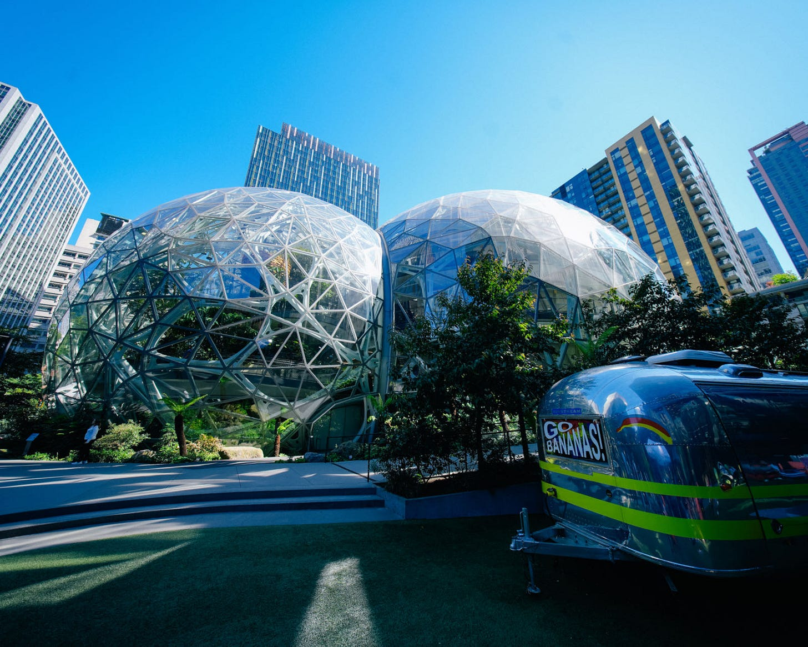
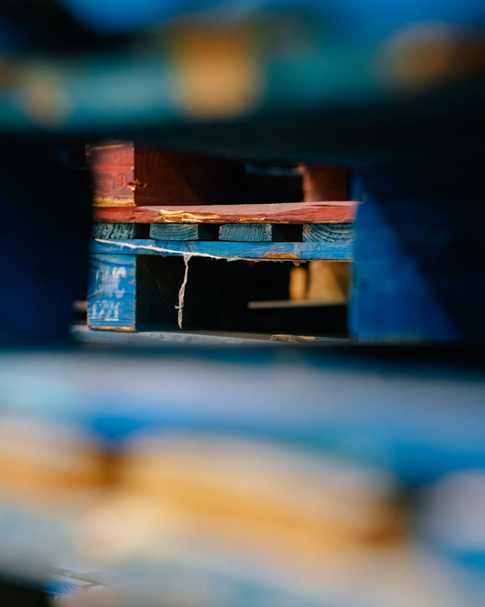
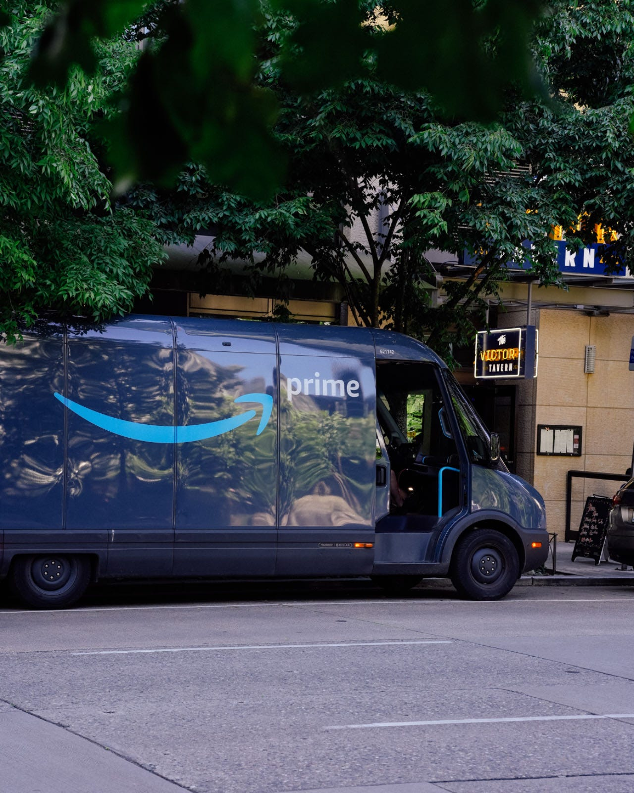
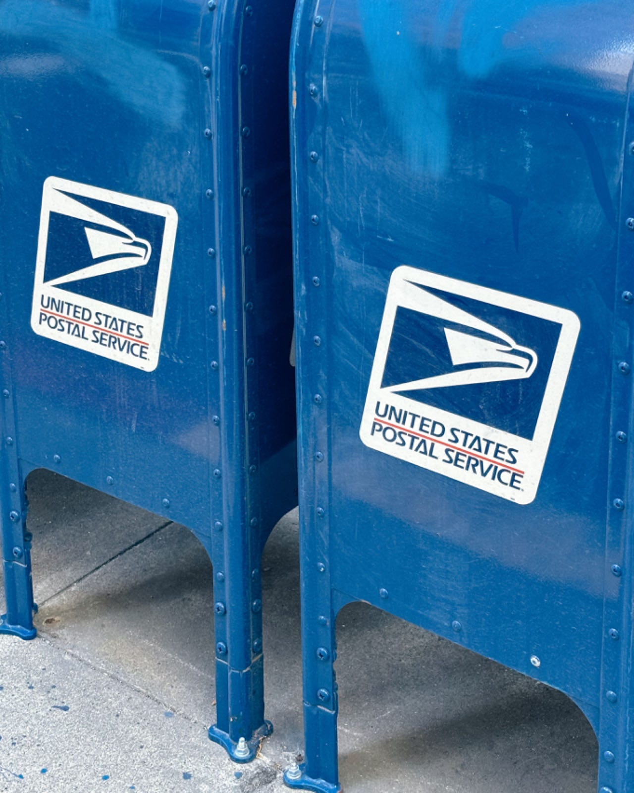
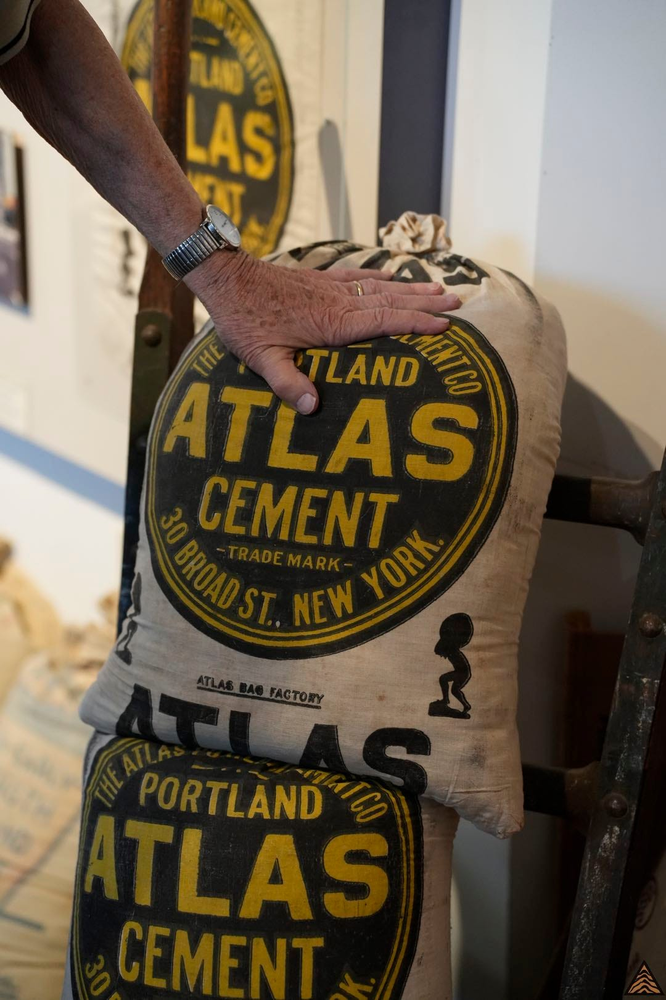
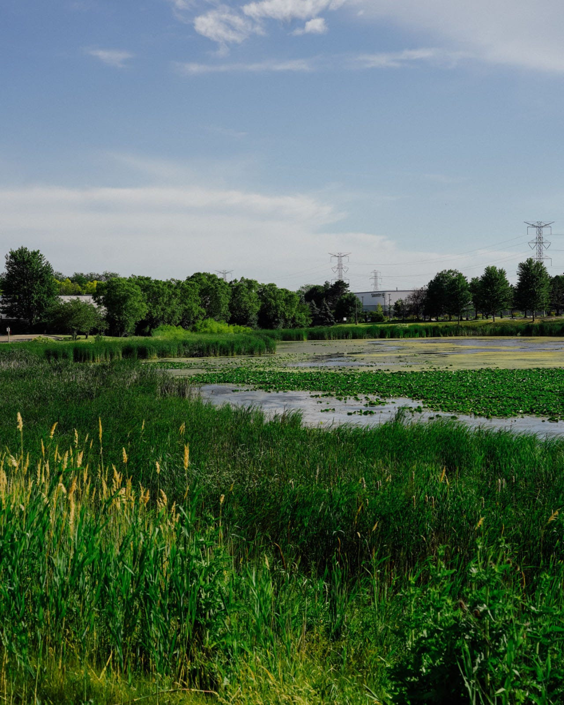

> **摘要**:
>  文章讲述了王华从一个小车库开始，逐渐建立起美国仓储网络的故事，并探讨了跨境电商的演变。随着亚马逊流量成本的上升，商家面临库存积压问题，Temu通过“全托管”和“半托管”模式为商家提供了新的选择。Temu依赖中国供应链的低价优势，但面临美国物流最后一英里的高成本挑战。文章还分析了美国去工业化对电商的影响，指出Temu的成功不仅依赖于低价，还需解决复杂的物流和社会问题。
> 
>  **要点总结**:
>  1. 王华从车库起步，逐步建立美国仓储网络，帮助跨境电商商家解决库存积压问题。
>  2. 亚马逊流量成本上升，商家面临高仓储费用，Temu通过“全托管”和“半托管”模式为商家提供新的销售渠道。
>  3. Temu依赖中国供应链的低价优势，但面临美国物流最后一英里的高成本挑战，尤其是郊区配送效率低。
>  4. 美国去工业化导致大量仓库取代工厂，Temu等电商平台依赖中国商品填补市场空缺。
>  5. Temu的成功不仅依赖于低价，还需解决复杂的物流和社会问题，尤其是美国城市规划带来的配送难题。

---

原文我[发在了晚点](https://mp.weixin.qq.com/s/Jy8l2mpcN9xOYlTZ5mlo8A)，现在这个版本更长一些。加入了原本为了适应微信公众号限制所删除的部分。

王华用了十年的时间从芝加哥一个小小的车库开始，逐渐编织出了一群美国仓储网络。但是就在不久之前，他还面临着三万平方米多层仓库无货可发的窘境。

十年前一位王华的高中同学问能不能借用他家里的车库，用来存手机壳并帮忙代发。彼时的亚马逊还不能接受全部商品入库，很多都需要卖家自行发货。王华每天抽出两个小时帮忙拆包、代发，能赚一百多美元。那可能是中国跨境电商的黄金时代，大量便宜商品快速涌入美国市场。

仅仅两个月后，车库已经装不下等待发货的手机壳了。他和朋友只得另寻他处。最后考虑到 USPS（美国邮政）需要从临街的门面揽件，就用每月 1,500 美元租了一个合适的仓库。此时王华每个月利润就有上万美元。因为几乎任何中国来的小商品，在美国都便宜。只要能把这些高性价比的产品带到美国，任何人都可以参与跨境电商的游戏。

更多在中国或来自中国商家发现了亚马逊这片电商沃土，开始纷纷涌入。但大量乘兴而来的商家因为缺乏对美国市场的了解，只得败兴而归。加之疫情后，随着亚马逊自身获得流量的价格也在逐渐升高。为了应对流量的成本，亚马逊选择提高仓储价格。此时早已今非昔比，商家需要提前把商品发到亚马逊指定的仓库后才能上架。就这样，大量的货物扛不住亚马逊的仓储成本，成了积压库存。

单靠便宜已经玩不转亚马逊了，更何况太便宜还会亏本。对于大部分小商品来说，卖不出去要给亚马逊钱，拿回来让亚马逊发回中国也要花钱。于是王华的仓库就成为了这些尾货的归宿，他又多了一个生意。

王华原以为 TikTok 是下一个沃土，所以在去年就提前备好了新仓库。可是事与愿违，TikTok 在美国并没能快速崛起。他的仓库最后也就用了 10% 左右。

不过做仓库生意有一个优势：如果有一个客户的货物在疯狂起量，自己会第一时间知道。他去问一位突然开始放量的客户用了什么平台，答曰：Temu。王华也想试试。Temu 也需要王华这样有着海外仓库的商家，所以在各个有海外华人的平台都有它中介在活跃着。王华 很容易就从小红书上找到了中介对接 Temu。他为了在 Temu 开店还交了一万人民币的保证金，

Temu 之所以热切地寻找王华这样的人，是因为它从「全托管」的模式变成了「全托管」+「半托管」的混合。

在「全托管」模式下，商家只需要把商品发到 Temu 在中国的仓库，约等于成为 Temu 的供货商，剩下就不用管了。Temu 会负责流量、物流、清关、仓储等一切原本需要跨境商家自己解决的问题。这让很多原本没有经验的商家看到了机会。

可 Temu 作为后起之秀，在美国远没有亚马逊那样完善的仓储和物流体系。所以它更多依赖于以轻小件的形式，直接走空运发到美国，然后交给仓储和物流公司。这一方面让 Temu 要比亚马逊多几倍的时间送货，而 75% 的美国消费者愿意支付额外费用以更快地获得商品。

低价毕竟街边杂货店可能比沃尔玛价格更低，但它永远无法超越沃尔玛，因为商品不够好、选择不够丰富。Temu 的低价优势也极大限制了其商品的数量——毕竟重大件还要走海运。所以 Temu 需要有本地的仓库，才能提升物流速度、增加商品选择。亚马逊全球共有 8.5 亿 SKU，速卖通全球过亿，但 Temu 只有千万级，单看种类还不及一些便利店。

为了解决物流问题，亚马逊依靠十余年的时间在全美建设了 110 个配送中心。有的大型配送中心比故宫还大，里面有一千五百个全职员工。

> 亚马逊总部

Temu 没办法等那么久，它只争朝夕。既然自己没有能力去搭建这套体系，那就找有能力的人。所以它在美国物色自己有仓库的商家，将其变成 Temu 的海外仓。「Temu 不再负责国内仓储、国际物流、海外仓储、退换货这四个环节。大卖家会直接把货提前备好，运到海外的合作仓库中。平台省下来的费用会被商家加在半托管商品的售价中。」

王华的那些尾货也有了去处，因为这些都在美国的货是最快能保证发货的，Temu 也愿意把流量倾斜给这类本地的库存——前提是王华能每天保证上架 20 个新的 SKU。他说：「只要上了就有流量，上了就出单，不用花一分钱。亚马逊不刷几千块的 review 都不行。这个模式太适合清仓了。」 不过每天 20 个 SKU 的任务不轻松，尾货供应不稳定。所以他在全美范围内到处寻找。但基本上只要上架，几天就能都卖光。所以也有自带尾货的商家主动来找他帮忙处理。

但他在一开始从没想到 Temu 的增速能这么快，很快就让他的新仓库不再闲置。

王华只是众多在这波 Temu 浪潮中的受益者之一。而 Temu 也的确十分努力的在吸引这些人。Temu 之前做到的是用一切办法确保商品比其他人更便宜。现在它希望持续便宜，且更快。

Temu 的加速崛起更加凸显了行业老大 Amazon 的问题：它便宜不下来。

亚马逊发展到今天是一个商家过度饱和的平台。有非常强的议价能力。所以亚马逊抬升了分配给商家流量的价格。在亚马逊 24 年第一季度财报中，这一点体现得尤为明显：虽然 GMV 增长了 12.5%，但是广告收入增长了 24.3%，远超 GMV 的增速。这意味着卖家花了更多钱投放，但销售却没有获得对应幅度的增长。而卖家花越多的钱投放，就越意味着这些钱最后会反应在售价上。在美国的电商游戏里中国玩家已经够多了，但在 Temu 给了这些玩家亚马逊之外一个可能目前更好的选择。

跨境电商从业者举了一个例子：假设有 50 把成本 6 美元，售价 19.99 美元的折叠椅。亚马逊代发货要收额外的十美元。商家还要自己出从仓库发到亚马逊仓库的费用。这样平均下来每一把椅子大概的利润是三美元。

放在 Temu 上，平台会压价到 16 美元。每把椅子的运费差不多是 7 美元。商家交给海外仓，这 50 把椅子仓储费用是 15 美元一个月，并不高。这样一把椅子的利润差不多还是 3 美元。

Temu 能比亚马逊更便宜，商家利润还相同。

这样计算还是亚马逊的理想情况。现实中商家还需要从买流量甚至自己花钱刷评论。而按照现在 Temu 的流量，商家有信心不投流的情况下短期内全部卖完。亚马逊不光很难卖完，退回来还要收退仓费。还有商家表示，Temu 虽然退货简单，目前他的退货率只有 2%，但是亚马逊在 5%-8%。

这让一大批原本是亚马逊的卖家有动力同步入驻到 Temu 上。Temu 也比亚马逊更懂中国卖家。亚马逊对这些中国卖家并不算友好。流量难以获得、遇到问题卖家很难找到相关的负责人、大部分事情都要靠自己琢磨。有卖家反应现在发给亚马逊仓库的丢件率已经从 1% 上升到了 5%。相当于还没入库开卖，这 5% 就没了。而以前这种事在亚马逊开 case 一定会有人回，现在无人问津。

而 Temu 完全相反，这些加入半托管的卖家们发现发任何信息都有人秒回、有专职人员会教他们如何上新、如何维护链接；Temu 选品的买手也会提前通知这些卖家，告诉他们平台下一步会推什么。有商家说 Temu 的运营和他保证，只要能每天上新一定量的 SKU，就会一直给首页流量。也有商家说 Temu 的运营会指导商家如何上架那些亚马逊不收的商品，整体上要比亚马逊灵活很多。最重要的是 Temu 会帮商家买流量、引流量；亚马逊只会给自己买流量，而平台上的商家则基本分不到亚马逊花钱买广告所带来的流量。

虽然是在美国的比赛，但在这场关于便宜的游戏里，没人能离开中国卖家。

根据 Marketplace Pulse 的研究，中国卖家几乎占据了美国亚马逊上顶级卖家的 50%，并且可能贡献了接近 50% 的第三方 GMV；另外的研究机构 ecomcrew 认为中国卖家占到了全部卖家的 63%。有美国卖家感叹：「不要与亚马逊上的中国卖家竞争。如果他们进入你的品类，直接放弃吧。他们对亚马逊系统的了解远超  99.99% 的非中国卖家。」亚马逊在自己的年度财务报告（10-K）里用「significant」（重要的）来形容这些中国卖家。

一面是热情似火的 Temu 客服，凡事靠微信都能商量清楚；另一面是干什么都麻烦的亚马逊。中国卖家自然更倾心 Temu。

这也为什么 Temu 在相当长的一段时间里只允许中国和香港地区的卖家开店，因为这足够了。Temu 用中国工厂、亚马逊不要的库存和原本就是他们供应商的中国大卖，以极致的低价从贝佐斯的国度撕开了一条裂缝。

电商的游戏有着复杂的面向：供货商、供应链、运营效率、产品......都做好的情况下才能被允许参与比赛。但每个版本的赢家都在不同面向中找到了自己最大的优势。在中国，最新版本的游戏里拼多多依靠比其他玩家更精细化的供应商与供应链管理取得了极致的低价。依靠低价它从原本被认为已经结束了的游戏里生生重新开了一局，让所有人再次加入游戏的竞赛。

低价永远是电商比赛的最高目标，在美国也是一样。虽然目标一致，但美国游戏的关卡却和中国不同。在美国，半托管的服务商有多种选择，让 Temu 无法像控制国内的供货商一样控制它们；更重要的是，美国的问题不是靠卷能赢的。

远在王华租下他的第一个仓库之前，美国就早已经完成了从第二产业向第三产业转移的去工业化。美国并不生产大部分美国人购买的商品，所以美国的电商先天就是「跨境」电商。在美国的电商游戏里，想要参与就一定要解决物流的问题。但美国需要解决的物流问题和中国完全不是一个。

商品从义乌发往中国绝大部分地区的邮费最低可以到 0.5 元，所以才会有拼多多全平台包邮。消费者购物时基本上可以不必在成本中考虑运费。对于中国买家来说，从国外买东西运费更贵是显而易见的。这都不需要解释，距离更远还跨国，贵点不是更合理吗？但在美国情况却相反：从中国到美国的物流成本甚至低于美国境内的物流成本。

早在 2015 年，亚马逊就在听证会上表示：「从北卡罗来纳州发往弗吉尼亚州一个 100 克的包裹至少需要 1.94 美元，距离为 547 英里；但是从上海发出同样重量的包裹只需 1.12 美元，其距离超过一万一千公里。同样地，从南卡罗来纳州向纽约市发送一磅重的包裹几乎需要六美元，但从北京发出仅需 3.66 美元。」

亚马逊可能没想过，在多年后这件事能被 Temu 玩出新的花样。因为美国邮政对轻小件的补贴让 Temu 为代表的中国跨境电商在成本上有优势，从而小商品可以在中国航空小件的形式直邮美国。亚马逊全美建仓，相对应就要求商家必须预先把商品发到不同的仓库。但在 Temu 的「全托管」模式下，商品在被消费者订购后直接从中国发到最近的国际机场，再进行派送。

美国东岸人口更多，但西岸却距离生产基地亚洲更近。横跨东西海岸的境内陆地物流成本高，海运到东岸价格贵。从产地直飞最便宜。利用与顺丰等快递公司的协议价格，加上小包裹的补贴，大部分情况下 Temu 在商品到达美国的仓库之前的每个环节都比亚马逊物流成本更低。连亚马逊自己都意识到了问题所在，据报道它即将提出从中国直接发货的特价专区。这无疑是对 Temu 的模仿。

Temu 和亚马逊在游戏里做的完全是同一件事：把产自美国之外的产品以尽可能低的价格采购然后用尽可能低的成本移动到消费者面前。Temu 和亚马逊的不少卖家其实是同一批人。而尾货之所以成为尾货，肯定有商品本身的问题（不见得是质量问题）。Temu 无法依靠和亚马逊相同的供货商和清理美国的库存尾货来赢过亚马逊。

大家都在利用同样的工厂生产商品、同样的卖家在卖货、同样的物流运到美国，这里最耗费成本的关卡也类似：最后一英里。因为美国人可以为了降低成本把一切都转移到境外，唯独最后一英里是实打实的需要在美国境内处理的美国问题。

> 美国仓库里密密麻麻的叉车托盘

这一步也是整个物流过程中最昂贵的一步：Capgemini 的报告指出，最后一公里配送占整个运输成本的 53% 和整体供应链成本的 41%。一位卖家用自己家举了个例子：「有次一个快递员把车开到我家送了一个件就走了，用了一个小时。他时薪 25 美元，那这一单的成本就是这么高。」虽然这个情况有些极端，但它说明了一件事：不论如何在生产端降低成本，降低的部分都有可能会被最后一英里物流吞没。

虽然大部分都不至于如此极端，总体而言小件每单的成本大概在三美元左右。在美国不同的供应商价格也不尽相同。一家美国中部的供应商计算后认为自己能做到每单 3.9 美元，一家西海岸的供应商认为如果量大，最多能做到每单 2.5 美元。亚马逊的成本并不透明，但它向未达到最低消费额的会员收取 2.99 美元的邮费。

根据 YipitData 的分析，Temu 在美国的客单价在 30-40 美元之间。这意味着每一单可能有高达 10% 的成本被消耗在了最后一英里上。Temu 认为这都太贵了，合理成本应该是一美元，早期可以再补贴一美元，一共两美元。

大部分本地服务商知难而退，但 Temu 的单量之下必有勇夫。一家华人创办名为UniUni 的最后一英里承包商想了一个主意：最后一英里的成本中一半来自人工成本，所以他们选择不招全职的快递员合作。解决方法是和兼职司机合作，让兼职司机在拉乘客的时候顺便送货。UniUni 在一开始并没有直接和司机打交道，而是通过一个叫 Beans Route 的程序来给司机下订单。

但这不可行，司机根本没办法在拉乘客的同时送货，一小时只能送七到八件。一位司机给朋友展示他其中一天需要送 59 个包裹，Beans Route 给他规划了一条路线。但实际上如果按照这个路线走，根本不能兼顾载客和载货。所以后来 UniUni 也只能另想办法。

最后 Temu 只好不断的将价格提升到 2.5 美元一单。有一段时间 Temu 与半托管海外仓，几乎把这件事都交给了 USPS（美国邮政服务）。统一交给USPS 承运，量越大还能越便宜。但这样是不可能比亚马逊更低的。有海外仓的老板计算，认为现在即便 Temu 在跨境这段成本低，但算上最后一英里之后总体和亚马逊差不多。

这或许只是成本游戏的中场休息，因为亚马逊已经证明了在美国建设物流体系的重要性。首先是美国消费者对时效的追求。根据 Emarketer 在 2022 年统计，美国消费者的线上消费有 53% 会在 2-3 天内到货；只有 10% 的收货时间超过五天。但超过三分之一（38%）的消费者更希望一天内能到货。Temu 从中国来的商品，即使是半托管的本地仓时效也不过是 7 天，全托管的商品要更久。

电商游戏追求便宜，把一切成本剥开后，最后一英里依然屹立在成本中心。Temu  无法在这里把全部环节都变成它在国内的供货商那样任其摆布。任何人想要把这个游戏玩的更好，就一定要面对这个问题。It’s all in the game.

物流成本问题一直是美国挑战。早在旧金山等西岸城市兴起的时候，东西海岸就没有横贯的铁路。十九世纪中叶纽约到旧金山的时间比香港到旧金山多了两倍。香港也抓住机会成为了加州货物的主要供应地。这简直就像是 Temu 的早期版本。接近二百年过去了，具体的问题变了，可物流作为大问题还在困扰着美国企业。

现在的具体问题就是最后一英里。不论是 Temu、亚马逊还是 Shein、独立站，所有的美国电商都要面对这个始终无法降下去的成本巨兽。或许可以粗暴的把整个美国的物流成本简化成一个问题：如果减少最后一英里的人工成本。

人工成本就是时薪、时长和福利。砍时薪和福利都很难，似乎唯一能做的就是提高物流效率，单位时间内送更多的货。

以最后一英里做的最好的亚马逊为例，一个快递员通常需要负责 5-6 个邮编的区域。一个邮编内少则几个街区，多则几个镇合在一起。每天送货前，快递员会看到今天的停靠点（Stops）——这就是说算法认为要停多少个目的地。

如果一天的任务在 150 个停靠点之内，那就会是比较轻松的一天。但大部分情况下一个快递员每天的工作量在 150-200 个停靠点之间。但这并不代表实际的派送数量，因为系统会把挨着比较近的地方合并为一次停靠点。实际的需要送货的地点可能在 200 甚至 300 个以上。

> 美国常见的亚马逊电动配送车

这些停靠点和停靠点之间，是实打实的物理距离。它们中间可能是 40 分钟的车程、可能是拥挤的街道、可能是没人开门的收发室。一位快递员负责给富人区的大房子送货，这些房子前的车道长达一英里。而大部分车道不允许其他车辆进入的，他还甚至需要擅长奔跑才能拿着快递过去。

不光是距离，还有一堆乱码七糟不身处其中就无法意识到的困难。几乎所有快递员都讨厌夜间送货因为很难看清邮箱和房屋上的地址，尤其是一栋栋独立的房子。还要担心这些房子里不要有没有拴绳的狗突然出来吓人——FedEx 可以因此拒绝派送，但亚马逊不行。而根据 Earnest 的统计，Temu 在高收入人群中增长最快。所以 Temu 的最后一英里派送也躲不开亚马逊会遇到的问题。

人工成本的挑战是送货的效率，但效率无法无限提高。归根结底，挑战的本质是美国城市规划。上世纪理性主义的规划者们，认为城市应该简化降低密度、以高速公路穿行其间甚至居民应该直接离开城市，搬到郊区。所以美国的中产和富裕阶级像是披萨上的香肠一样被平铺洒在城市周边的郊区。

这些市郊的住宅区，加上那些在高速公路上路过了一辈子也不会下来看一眼的广大乡村地区组成了美国的最后一英里。Temu 无法像拼多多在国内卷卖家一样的靠卷来解决这个问题，因为最后一英里不是个商业问题，是社会问题。社会问题就像是天气，要面对它。

不过正如拼多多在国内对供应商的控制一样，Temu 在海外也沿用了自己熟悉的方法：让更多玩家加入，然后卷起来价格。现在除了 UniUni 之外，还有SpeedX、RoRo 和菜鸟等最后一英里承运商加入了竞赛。有知情人士透露，目前 Temu 给华人为主的承运商的运费是一件 1.8 美元、墨西哥裔为主的承运商是1.6 美元，昂撒裔为主的承运商则是 2 美元。

而压低价格的方法，一是一个司机只送一个邮编，这样更容易熟悉路线并且增加了一个小时内的派送数量；二是许多非法移民作为相对廉价劳力的加入，他们在等待身份时可以通过美国政府发放的工卡打工。有司机表示自己一个小时可以挣到 20-30 美元左右的收入。

但是这个方法只适用于密度高的大城市，还无法覆盖美国绝对距离间隔很远的的广大郊区和农村。

这不是说一个城市规划方便送货就是好的，显然现实不是如此非此即彼。但在美国，中产继承了旧贵族的生活想象，既然地有的是，那就一直建。最后城市像富人城堡等比例缩小排在一起。

这么做显然是不可行的。「郊区大 House」的生活图景在几十年后最终把美国割裂成了两个地理空间：一半是中产阶级和富人，另一半是中下层中产和贫民。而这个几十年城市规划错误的持续积累，把它的苦果也喂给了 Temu 在内的所有需要配送的服务者。

美国居民生活的场景可以分为四个：市区（Downtown）、郊区（suburb）、乡村（rural）和 Hood。Hood 经常被翻译成贫民区，但这并不准确。按照大部分国家的标准 Hood 里的居民算不上贫民，他们吃得起饭，有地方住。但 Hood 确实是美国中下层居民所居住的空间。

一个人这样形容自己曾经在 Hood 里的生活：「你害怕走出户外。你害怕慢行的汽车，因为担心遭遇驱车枪击。由于害怕被抢劫，你不会外出散步或遛狗。总有人在任何时候闲逛，看起来没有工作。你不敢报警，因为担心遭到报复。如果发生了犯罪，你什么都没看见。邻居让你拆除安全摄像头。有人偷了你的自行车或宠物，然后回来提出用 20 美元将其归还给你。你也不去公园玩。」

还有人以玩笑的口吻给出了残酷却真实的建议：「如果你不确定自己住在 Hood、郊区还是乡村，就站在前门廊上小便来测试一下。如果没人看你，那你在 Hood。如果有人报警，那你在郊区。如果周围没人注意到，那就是乡村。」

这就是 Hood。在这里一切都会变得更难。

美国市场整合营销公司 HashMatrix 的 CEO Jennie 认为 Temu 在销售渠道和营销策略上都进行了本土化调整。在美国人眼中 Temu 不光是便宜，而是定位为一个便捷可靠的在线市场，满足消费者的生活便利需求。这样 Temu 在美国有了丰富的用户圈层。但总体而言在美国低收入家庭更有可能在 Temu 购物。任何凭借更低的价格争夺市场份额的平台，受众都注定如此。根据 ChinaTalk 的报道：2023 年上半年，55% 的应用用户年收入低于 50,000 美元；下半年，50% 的用户年收入在 50,000 美元到 100,000 美元之间。根据谷歌趋势显示，在美国搜索 Temu 最多的地方来自西弗吉尼亚州、阿肯色州和密西西比州——都在美国最贫困的州排名中榜上有名。对比之下，Temu 用户的收入水平普遍低于亚马逊用户。

这意味着 Temu 的顾客更有可能在 Hood 里。当 Temu 还在用标志性的橙色做包装时，一位快递员对着视频抱怨：「每天都是 Temu、Temu、Temu，我受够了 Temu。它把你买的 17 个东西放到一个袋子里，又大又沉。为啥要把你买的 29 个东西全放到那个大橙色袋子里？当他们被偷了，你又来找我说快递员，我的 Temu 包裹和里面 47 个东西呢？我不知道！可能被谁偷了吧。他妈的 53 个物件从同一个地方来。」不过现在 Temu 已经用普通的包装了，所以快递员们也失去了直接的感受。

丢快递在 Hood 里甚至都不是什么严肃的问题。

快递员们互相分享在 Hood 配送的经验。不过就算是新人，他很快也能学习到其中的技巧：因为几乎每个 Hood 里的订单都会在备注里写上注意事项。最常见的是绝对不要放在前门，永远不要，放了很快就会被人偷走。实际上，Hood 里的很多业主回家都不使用自家前门。

一位负责的快递员演示他会把快递放在外层的铁门和房门中间。他说连收发室都不能放，因为你不能相信任何人。实在不行还能藏在门口的灌木丛里。就在他送快递的时候，有收件人问他要不要毒品。很多 Hood 里路窄不好停车，还经常有人对着快递员大喊。

甚至发件的商家也会受到影响。一位海外仓的工作人员说他们的仓库不再什么好的区。进来都要走小门，因为有同事在正门被抢过。作为 Temu 的半托管服务商，他们现在也都发 USPS。USPS 每次拿走全部快递后到公司才会扫码，每次都会丢 5% 的件。这几年的 美国阵亡将士纪念日（Memorial Day）更是夸张，几乎每年这天的丢件率都接近 100%。他猜测是因为上半年没什么节假日，而去还是报税季大家都比较缺钱。

物流工作人员无奈的说：I want help you but couldn’t. It’s a culture here.

> USPS 的邮筒

这就是 Temu 和所有电商都要面对的问题。这也是为什么妄想靠机器人和无人驾驶来全面解决送货是不可能的。面对如此复杂的情况却依然认为可以靠机器取代人，要么是愚蠢，要么是无知。既然能融到资的创始人并不愚蠢，那就只能说明大部分生活在良好社区的科技从业者从来不知道这个国家另一部分居民的现实生活。

Temu 今天依然在补贴用户，但在美国的物流挑战钱只能解决一部分。

虽然送货不易还容易丢快递，但 Hood 里面的居民可能比其他人更需要 Temu。因为 Hood 最显著的特点，就是它没有商业。Hood 里有被 Led 灯照亮的支票兑现店、当铺和酒类商店，但它严重缺乏正常的商业。很多 Hood 里面遑论大型商超，甚至连杂货店和饭店都没有。

新冠疫情加速了 Hood 本就不繁荣的商业加速消失。美国著名主播 Peter Santenello 在两年前探访了底特律的几个 Hood，在视频里他展示了一个正在重新恢复的街区生态。很多人也想去看看，但肯定会失望：因为节目里提到的每一家店铺都关闭了。这样的街区往往最后剩下的就是 Dollar General、Dollar Tree 之类的“一元店”。[\[HW1\]](https://hanyang.wtf/p/354#_msocom_1) 

而 Temu 在这个时候进入了美国。伴随着高通胀和商业的加速衰退，Temu 简直在最「合适」的时间来到了这里。一位住在 Hood 里的家庭主妇说她当然知道 Temu 的质量可能不如亚马逊，但她用最便宜的价格给她的孩子买一些玩几次可能就失去兴趣的玩具，这没什么不好。

Hood 就是美国的五环外。即使今天 Temu 已经在全美流行，可美国互联网依然还在讨论 Temu 是不是个骗局，相当多的博主也在劝大家拒绝 Temu。大量声讨 Temu 的内容逐渐再次回到了那个老生常谈的问题上：美国人不要用中国的应用，也不要买中国低质量的东西。如果单纯看美国互联网的讨论，可能观者甚至会以为美国人根本就不用 Temu。

从二三十年前开始，美国人就不断的在讨论、试图离开 Made in China；甚至试图用政策离开一切其他国家，自己来重新生产。但直到今天源源不断的商品依然以海路或空运的形式从亚洲流向到美国。因为为期几十年的「去工业化」不只是让一批工厂消失，也带走了工厂的上下游、不再培养熟练工人，它失去了大规模生产的能力。而苦果被这个国家的所有人一同咽下。在 Temu 之前，沃尔玛、亚马逊的大半商品已经来自中国。

今天源源不断的商品以海路或空运的形式从亚洲流向到北美，曾经方向相反。

巴拿马运河是全球最重要的航运要道之一，它也是中国到美国东海岸的重要航线。虽然 Temu 和 Shein 带动了航空运输的增长，但海运仍然是中国到美国大宗货物运输的主要方式。

1914 年巴拿马运河开通时，3500 公里外的美国宾夕法尼亚州南安普顿县（Northampton County）的一位名为碧翠丝·迪默（Beatrice Deemer）的工人感叹：当巴拿马运河归还给巴拿马时，南安普顿的一部分消失了。

因为巴拿马运河的水泥，几乎全部来自南安普顿里碧翠丝服务了 38 年的阿特拉斯水泥厂（Atlas Cement Company）和其周边的矿坑。阿特拉斯水泥厂曾经是世界上最大的水泥厂，当地人自豪的称之为世界水泥的首都[（我们刚上线了一期节目专门聊这个水泥厂）](https://shanyouhu.xyz/atlas)。鼎盛时期这里的 5,000 名工人们生产的水泥建造了巴拿马运河、帝国大厦、洛克菲勒中心等一个时代的象征。一位老员工感叹：我们还出口给日本，然后他们飞过来炸了珍珠港。

> 曾经阿特拉斯水泥厂的的包装袋

在今天我们难以想象水泥竟然还需要进口。因竞争激烈，水泥的价格已经低到远一个城市的运费买家都不会买单的程度。但在上个世纪，从水泥、钢材再到之后的飞机、军舰和汽车，美国工业所生产的产品建造了大半个世界。这些在我们今天来最平常的产品，确实当年的高科技。

阿特拉斯水泥厂在南安普顿并不是偶然。这里属于大阿巴拉契亚山脉的里海河谷。在没有电力的年代，河谷水流的落差是绝佳的动力来源。所以这里也是美国最古老的工业区。此处不光孕育了阿特拉斯水泥厂，抚养了伯利恒钢铁厂（Bethlehem Steel）。

伯利恒钢铁厂曾是美国乃至全世界最大的钢铁厂，最大的成就是发明了批量生产工字梁的方法。工字梁是现代基础设施的基石之一。来自伯利恒钢铁厂的材料建造了金门大桥、帝国大厦、洛克菲勒中心和二战期间的 1,127 艘军舰。这家企业在一段时间里仿佛就是美国的象征，它也参与塑造了美国和整个现代世界。

伯利恒钢铁厂直到两千年初年倒闭，始终都是钢铁巨头。它的子公司伯利恒船舶工业曾是最大的美国造船企业。而伯利恒集团的倒塌直接参与摧毁了伯利恒船舶工业所在的巴尔的摩。这些失去工作的工人们再也没能等到下一份薪水，甚至失去了他们的养老保险。没了工业的巴尔的摩再也没能重现辉煌，现在超过一半的人口没有长期工作。住在费城的建筑考古学者王可达说：「它的倒闭带来的苦果，至今还在被宾州这个州每天尝到。现实世界的残破与悲壮，那些尸骨未寒的记忆，不会出现在互联网上。」

这个现象就是我们常说的「去工业化」，一场六十年代后美国为期几十年的衰退。而它的苦果不止被宾州，更是被整个国家一同咽下。

失去工业的美国，却有 96% 的工业空间都被仓库租走了。这是个仓库的国家，密密麻麻的大型仓库、个人仓库出现在乡村、郊区、港口、城市之间。美国有全球最大规模的仓库，而且还在不断增加。从 2007 年的 14,600 个仓库增长到了 2023 年大约 22,000 个。即便如此，美国依然面临仓库短缺的问题。

很多大型仓库为了雨水管理旁边还经常会配有池塘，风景如画。在里面工作的，可能是很多连英语都说不好的墨西哥新移民。一位电商从业者感叹自己为了给新仓库招人，只要求有基本技能和不吸毒。结果用了一周收了二百多份简历，就四个人来面试，最后只有一位能招进来还不确定是否可以留下。如果进不了大厂，很多人宁愿打零工随时搞点钱，也不愿意再去做一份辛苦的工作。

> 池塘与仓库

这些美丽的仓库仅仅是为了暂存商品，那些可能是来自中国、日本、韩国、Temu、Shein、亚马逊等商品。仓库的快速增长伴随的是工业的持续萎靡。而那些原本应该长存的工业已经永远的从这里消失了，不会再第二次出现。

失去工业的结果就是大量的人口再也无法找到一份体面的工作。而当年城市规划的恶果在在这里彻底显现出来了：缺乏公共设施、人行道的低密度社区，经济一旦开始下行就会慢慢崩塌。原本还能过上体面生活的中产搬走或沦为底层，这让一个又一个社区变成鬼城或者 Hood。在收入难提高并且体面工作难以获得的情况下，中国制造的商品反而成为了他们对抗通胀的武器之一。

美国著名的社会学家威廉·朱利叶斯·威尔逊（William Julius Wilson）在他的著作《当工作消失时》第一章就提出了一个观察：美国的城市从制度聚集区转变成了失业聚集区。在 20 世纪许多城市中心的居民聚集区首次出现了绝大多数成年人无所事事的情况。在 1959 年，美国贫困人口生活在大都市中心地区的不到三分之一；但是在 1991 年，一半的穷人生活在中心城区——这些地方就是 Hood，各种本地人或旅游攻略里建议游客不要去的地方。

今天大量美国贫穷的年轻人已经没有了对工作的想象。如果进不了大厂，很多人宁愿打零工随时搞点钱，也不愿意再去做一份辛苦的工作。因为人人都明白：在这些风云变幻的成本竞赛中，有的只是随时变化随时消失、予取予求的任务。「工作」二字的意涵已经被掏空。

原本生产一切的美国产业先被转移到欧洲、日本；然后是韩国、四小龙；现在是中国，我们成为了新的世界工厂。未来还有一部分可能会去到越南、印度、印尼......而美国的工厂变成仓库、中产社区衰退成 Hood、工人变成朝不保夕的穷人。

接住了工业的地方会源源不断的生产，商品漂洋过海和再次回到一切的起点与曾经的生产者汇合。经济对人的抛弃结了痂，成了电商企业报表中一条别别扭扭的、需要解释的成本细项。

Temu 作为一款产品，瞥见的是过去几十年这个世界所酿造出来的结果。依靠在中国对供应商高强度控制所带来的低价，终究逃不脱来到美国后面对的问题。

Temu 从来不只是一个关于电商的游戏，更是一个有关城市规划与国家发展的隐喻。隐喻所代表的那一切，不止会出现一次，也不止会出现在美国。 We all in the game.

低价仅仅是游戏表面上最容易看到的部分，但却是一些人眼中的全部。

如果你对我最后写的这段去工业化感兴趣，我们正在做一系列专门的播客节目。可以[在山有虎收听](https://shanyouhu.xyz/)。

所有图片均由作者拍摄

汉洋：播客晚点聊与山有虎主播，X@hanyangwang 更多信息在 hanyang.wtf