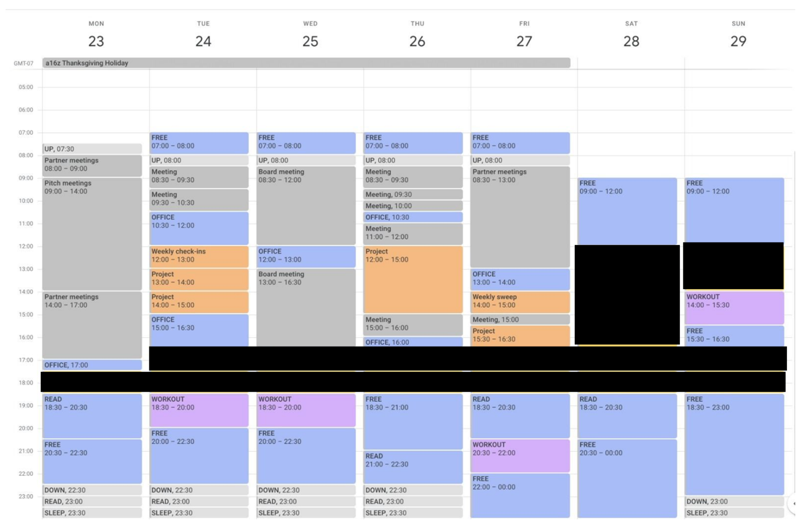
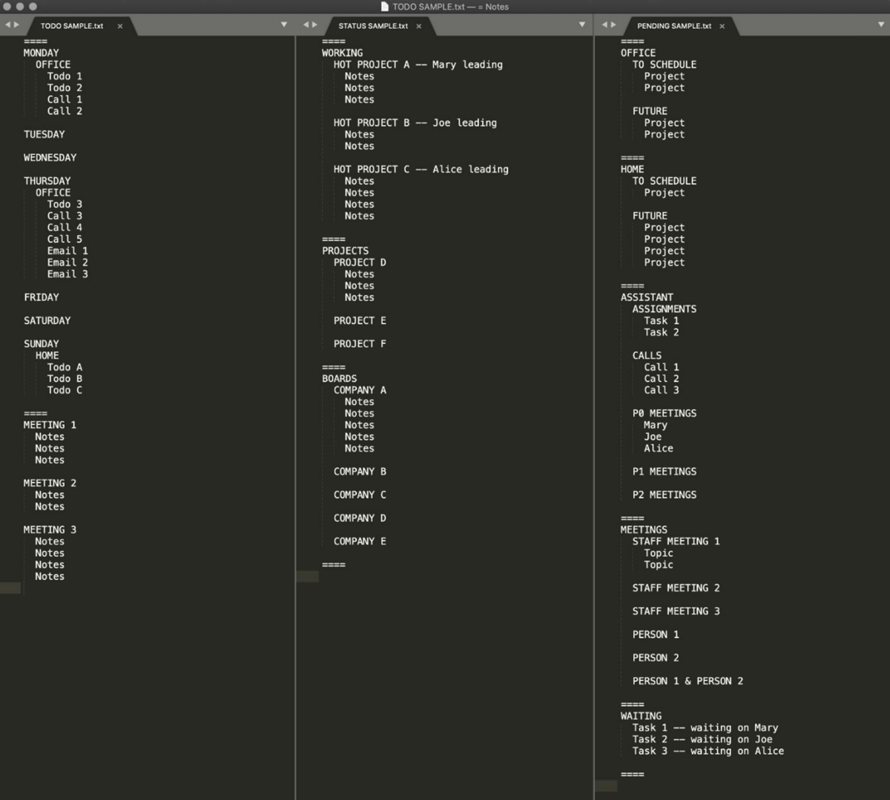

*Welcome to the first ever interview on 'The Observer Effect'. When planning for these series of interviews with interesting leaders and institutions, there was only one person I had in mind to have here first - Marc Andreessen. This interview was published on June 13th, 2020.  

欢迎来到《观察者效应》首次访谈。在策划这些与有趣领袖和机构的访谈系列时，我心中只有一个人，他将是第一个出现在这里的人——马克·安德森。这次访谈于 2020 年 6 月 13 日发布。*

*Marc is one of the most notable and influential figures in the history of the internet. We were lucky to have a wide ranging conversation with him on how he spends his time, how he tries to set goals for himself, how he reads so much, what keeps him so plugged in after all of these years and what he wants people to build. Marc was generous and open with his responses and I hope you enjoy this conversation as much as I did.  

马克是互联网历史上最著名和最有影响力的人物之一。我们很幸运能与他进行一场广泛深入的对话，了解他如何度过自己的时间，如何为自己设定目标，如何阅读如此之多，以及这么多年来他如何保持如此紧密的连接，以及他希望人们能创造出什么。马克在回答问题时非常慷慨和开放，我希望你们能像我一样享受这次对话。*

***Note:** This interview was recorded in mid May 2020 before we hit major crises in this country. Therefore we don’t address any of the very painful issues that we all struggle with.  

注意：这次采访是在 2020 年 5 月中旬录制的，在我们国家遭遇重大危机之前。因此，我们没有涉及任何我们都感到非常痛苦的难题。*

**[Sriram Krishan  斯里兰姆·克里山](https://sriramk.com/)**  

***Let’s start off on a very serious note. Marc - what are the odds of you regretting agreeing to this interview in the first place?  

让我们以非常严肃的态度开始。马克——你最初同意接受这次采访，后悔的几率有多大？***

**Marc Andreessen  马克·安德森**  

*\[\[laughs\]\]  \[哈哈\]*  

You can see how much public stuff I'm doing these days. And so you can gauge that pretty accurately.  

你可见我最近做了多少公共事务。所以你可以相当准确地判断。

## On Productivity  关于生产力

***Let’s get into it. Over a decade ago, you wrote a famous post called the [“Pmarca guide to productivity”](https://pmarchive.com/guide_to_personal_productivity.html). What is the 2020 version of the Marc Andreessen guide to productivity?  

让我们开始吧。十多年前，你写了一篇名为“Pmarca 效率指南”的著名文章。那么，2020 年的马克·安德森效率指南是什么样子呢？***

The big thing is I've basically done a complete 180 degrees off of the model that I had from 13-14 years ago. A lot of that was just driven by starting and then scaling this firm.At this point we have a large number of companies in the portfolio and a large number of investments in the works at any point in time. The sheer load of the number of things coming at me and coming at the senior partners here is just very intense. That has forced a comprehensive shift to a far more structured way of living. It's actually by far the most structured I’ve ever been.  

我基本上完全转变了 13-14 年前我所持有的模式。这其中的很多都是由于开始并扩展这家公司所驱动的。到目前为止，我们的投资组合中有大量公司，在任何时候都有大量正在进行中的投资。我所面临的事情数量以及这里的资深合伙人所面临的事情数量 sheer load 简直非常庞大。这迫使我对生活方式进行了全面的转变，变得更加有结构。实际上，这是我迄今为止最结构化的生活方式。

The typical day for me right now is quite literally following the calendar very closely. I'm trying to have as “programmed” a day as I possibly can.

  

我现在典型的日子可以说是字面意义上紧跟日历。我正试图让我的每一天尽可能“程序化”。

***Walk me through what a day looks like.  

带我去看看一天的样子。***

I should start by saying that none of what follows would be possible without the help of my amazing and indefatigable assistant Arsho Avetian. She's been my secret weapon for more than 20 years.  

我应该首先说，如果没有我那位神奇且不知疲倦的助手 Arsho Avetian 的帮助，以下的一切都不可能实现。她是我超过 20 年的秘密武器。

It's more by week than by day. The day of the week determines a lot. Monday and Friday have very specific schedules because we run in the rhythm of a venture capital firm. There’s an all day sort-of marathon on Monday which is when most of the actual teamwork happens. We also use Friday for that.Tuesdays, Wednesdays and Thursdays are much more open ended. Those tend to be a lot more outwards-facing and have lots of board meetings, entrepreneur counsels and so on. Running Monday through Friday in this kind of regimented schedule, I do now finally understand why people have the concept of a weekend.I'm trying my best to preserve Saturday and Sunday for at least a little bit of downtime.  

每周的变化比每天的变化更明显。一周中的某一天决定了很多事情。周一和周五有非常具体的日程安排，因为我们遵循风险投资公司的节奏。周一全天都有一种马拉松式的活动，那时大部分的实际团队合作都会发生。我们也会用周五来安排这样的活动。周二、周三和周四则更加灵活。这些日子往往更加外向，有很多董事会会议、企业家咨询等等。按照周一到周五这种有规律的日程安排，我现在终于理解了为什么人们有周末的概念。我正尽力保留周六和周日至少有一点休息时间。

 *Image courtesy Marc Andreessen*

***In your old post you talked about Arnold Schwarzenegger’s open calendar and the upside of having unstructured time in your day and the flexibility you get with that.  

在你的旧帖子中，你提到了阿诺德·施瓦辛格的开放日程以及拥有无结构时间在日常生活中的好处和你从中获得的灵活性。***

When Arnold did that interview I think he was in ‘entrepreneur mode’. At the time he was engaged in lots of entrepreneurial projects and starting lots of new businesses. I think there's certainly virtue to that if you're an entrepreneur in heavy creation mode.  

当阿诺德接受那次采访时，我认为他处于“企业家模式”。当时他正忙于许多创业项目，并创立了许多新公司。如果你是一位处于高度创造状态的企业家，我认为这确实是一种美德。

I lived a fair amount like that earlier in my career when I was programming. Basically working on exactly one thing all the time until you're exhausted and collapse. And then get up the next morning and work on that thing some more. I never really had a calendar. I just knew what I was working on. In a sense, that’s the same as having no schedule.The challenge obviously shows up when you're trying to do anything that involves either running an organization or being in a customer service role. That is how we think about parts of what we do now. If part of your job is to deal with a large amount of incoming, you actually need to respond in a timely manner and not let people down. Maybe some people can do that off the cuff. I don't know how to do that.  

我职业生涯早期编程时，生活就是这样。基本上一直专注于一件事情，直到筋疲力尽倒下。然后第二天早上再继续做那件事。我从来没有真正有过日程表。我只知道我在做什么。从某种意义上说，这就像没有日程安排。显然，当你试图做任何涉及管理组织或担任客户服务角色的事情时，挑战就会出现。这就是我们现在思考我们所做事情的一部分方式。如果你的工作的一部分是处理大量涌入的信息，你需要及时回应，不要让人失望。也许有些人可以即兴发挥。我不知道怎么做到这一点。

***Was there a moment when you decided to change your old system? Was it when you founded the firm?  

曾经有过决定更换旧系统的时刻吗？是在你创立公司的时候吗？***

Yeah, honestly, when we started the firm in 2009 we just got right into it. It was just a hurricane of new activity. We had decided one of the values of the firm is respect for the people we work with. And part of that respect is - we don't drop balls. We respond quickly and we have SLAs on getting back to people in a specific period of time. We use the old JP Morgan saying of “first class business in a first class way”. If you contact us, you're going to get a response. If we commit to doing something, we're going to do that thing. It was just a necessity to be able to have some sort of system.  

是的，说实话，我们在 2009 年开始公司时，就直接深入其中了。那是一阵新的活动的飓风。我们决定公司的一个价值观是尊重我们与之共事的人。尊重的一部分是——我们不掉链子。我们快速响应，并且我们有在特定时间内回应人们的 SLA。我们使用 JP Morgan 的旧说法：“一流的业务，以一流的方式”。如果你联系我们，你会得到回应。如果我们承诺做某事，我们会去做那件事。仅仅是有某种系统的必要性。

Venture capital, I think, is very ‘close to the ground’ work. The VCs who have tried to abstract themselves from the day to day have not done well. You have to really know what's going on. You have to really be in close touch with what's happening in these markets and with these technologies and where these entrepreneurs are. And you have to be talking to a lot of people all the time, right? It just necessitates a more structured approach.  

风险投资，我认为，是非常“接地气”的工作。那些试图将自己从日常事务中抽离出来的风险投资家并没有做得很好。你必须真正了解正在发生的事情。你必须真正与这些市场、这些技术和这些企业家保持紧密联系。而且你必须一直与很多人交谈，对吧？这需要一种更加结构化的方法。

***You're waking up on Monday morning, or on a Sunday night, you're looking at this \[\[your calendar\]\], what are you thinking?  

你周一早上醒来，或者周日晚上，你看着这个\[\[你的日历\]\]，你在想什么？***

I’m thinking “God, I’m organized! I have a plan!”. If I didn’t have this, I’d be in a panic the very first moment I wake up.  

我在想，“上帝啊，我太有条理了！我有计划！”如果我没有这个，我会在醒来的第一刻就陷入恐慌。

The big thing is basically \*everything\* is on the calendar. Sleep is on the calendar, going to bed is in there and so is free time. Free time is critical because that's the release valve. You can work full tilt for a long time as long as you know you have actual time for yourself coming up. I find if you don't schedule enough free time, you get resentful of your own calendar. When I was younger, I didn't really have the concept of turning off. But there comes a time, a little bit with age, when your body rebels. And obviously, if you have a family, that’s not great with a system where you're just always working.  

大事基本上就是 \*一切\* 都在日程表上。睡眠在日程表上，上床睡觉也在里面，空闲时间也在。空闲时间至关重要，因为那是释放压力的阀门。只要你知道自己有真正属于自己的时间，你就可以全力以赴地工作很长时间。我发现如果你没有安排足够的空闲时间，你会对自己的日程表感到不满。当我年轻的时候，我并没有真正有“关机”的概念。但是，随着年龄的增长，你的身体会开始反抗。显然，如果你有家庭，那么一直工作的系统对你来说并不是什么好事。

## **The value of open time and delegation  

开放时间与委派的价值  

**

***One of the things I find interesting about your calendar is that there is a lot of allocated open space. We've often spoken about how some of the most interesting, influential people in the world tend to have large chunks of open space. As opposed to executives who are scheduled for every 30 minutes back to back from 8am to 7pm.  

我发现您日历上有趣的一点是，有很多预留的空闲时间。我们经常讨论世界上一些最有意思、最有影响力的人往往拥有大量的空闲时间。这与那些从早上 8 点到晚上 7 点每 30 分钟都有安排的执行人员形成对比。***

You know, we’ve both worked with executives where they were scheduled to the ‘nth’ degree. The three things you tend to notice with executives like that.  

你知道，我们俩都曾与那些日程排得满满当当的高管共事过。与这类高管共事时，你往往会注意到以下三点。

> *...It's like those classic movie scenes when there's a huge crisis and somebody calls out to their secretary “Cancel my schedule!”...  
> 
> ...就像那些经典电影场景，当出现重大危机时，有人对他们的秘书喊道“取消我的日程！”...*

One, they just never have any time to actually think. And that turns out to be a fairly important thing.  

一，他们根本没有时间去真正思考。这竟然是一个相当重要的事情。  

Two, they have a hard time adjusting to changes in circumstances. In our business of venture capital, you get a lot of problems that come up. There is a lot of firefighting. It's like those classic movie scenes when there's a huge crisis and somebody calls out to their secretary “Cancel my schedule!”. Well, maybe you wouldn’t need to do that if you had some flexibility in your calendar.  

两个，他们在适应环境变化方面有困难。在我们风险投资业务中，会遇到很多问题。有很多救火工作要做。就像那些经典电影场景，当出现巨大危机时，有人对他们的秘书喊道：“取消我的日程！”嗯，如果你在日程上有一些灵活性，可能你就不需要这么做。

Then the other thing you’ve probably seen is the managers who are regimented to that degree end up being micro managers. You’ve probably seen examples of this where some of these folks end up in the weeds on everything. The good news is they've got the pulse of everything happening in the organization. The bad news is they’ve become the bottleneck. The extreme form - and I've worked with a couple of people like this - end up having a long line outside their office. The lines will stretch *waaaay* down the hallway with people waiting to get in and see them. They kind of bottleneck your organization too. It's demoralizing to work in an organization like that because basically, whatever that is, it’s the opposite of delegation.  

然后，你可能看到的是那些被严格管理到一定程度的管理者最终变成了微观管理者。你可能见过这样的例子，其中一些人陷入到所有事情的细节中。好消息是他们掌握了组织内发生的所有事情。坏消息是他们变成了瓶颈。极端形式——我和几个这样的人合作过——最终导致他们办公室外排起长队。队伍会延伸到走廊深处，人们等着进去见他们。这也让你的组织变得拥堵。在这样一个组织中工作很令人沮丧，因为基本上，那是什么，它完全与授权相反。

***A related topic is delegation. For a lot of those folks, it's hard to let go. Delegation can often be a platitude. It’s easy to talk about but in practice a lot of people struggle with it. So when you want to clear up open space on your calendar, how do you do it? How do you \*actually\* say, “I am not going to do this”, “I'm going to say no”, or “I'm going to have someone else do this”  

相关话题是委托。对于很多人来说，放手很难。委托常常是一种陈词滥调。谈论起来容易，但在实践中很多人都会遇到困难。所以当你想在日历上腾出空间时，你该如何做？你该如何真正地说，“我不打算做这件事”，“我要说‘不’”，或者“我要让别人来做这件事”？***

Yeah, well, the good news is because of the way I run things, I don't directly manage anybody.  

是的，好消息是因为我管理事情的方式，我并不直接管理任何人。

***You're a very unusual person for me to do these sets of interviews with because you're not a traditional CEO running a huge organization.  

你对我来说是一个非常不寻常的人，因为我跟你做这些系列访谈，因为你不是一个传统意义上的 CEO，管理着一个庞大的组织。***

That's right. So that's necessarily going to be different, at least to some degree. I don't have the pressure of all of the one on ones, all the management responsibilities. I'm involved in a fair amount of management stuff for the firm but it's stuff that we cover in our internal meetings. And then we've got all these incredible people to manage all these teams.What we all kind of have to do at some point is to figure out how to just say no and triage the incoming.  

没错。所以这必然会有所不同，至少在某种程度上。我没有那么多一对一的压力，也没有那么多的管理责任。我确实参与了公司相当一部分管理工作，但这些都是在我们的内部会议上讨论的内容。然后我们还有这么多出色的人来管理这些团队。我们最终都需要做的是找出如何说“不”并处理不断涌入的工作。

***Which may be good segue to these text files that you sent me a screenshot of. Every executive has to have their own check-in system. You have finite time and you have a bunch of projects you care about that you need to keep an eye on. What’s your system to make this work?  

这或许是一个很好的过渡，谈到你发给我的那些截图中的文本文件。每位高管都必须有自己的检查系统。你时间有限，你有一堆你关心的项目需要密切关注。你是如何让这一切运作起来的？***

 *Image courtesy Marc Andreessen*

So basically, there's two kinds of projects. Apple has this concept they call the directly responsible individual - the D-R-I. For any project, I’ve tried to identify the DRI. Who is the person responsible for delivering the project? If that's me, then the project itself gets on my calendar. If it doesn't go on the calendar, it is not getting done. The weekly check in is for all the projects other people are responsible for. As an example,you could have a company raising money or going through a big transaction. I don't want to hound the entrepreneur or the CEO every day necessarily but at least want to stay up-to-date on a frequent basis, right? I never want these things to just go dark where you’re going “Whatever happened to that?”  

所以基本上，有两种类型的项目。苹果有一个他们称之为直接责任人的概念——D-R-I。对于任何项目，我都试图确定 DRI。谁负责交付这个项目？如果是我，那么这个项目就会出现在我的日程上。如果它没有出现在日程上，那就不会完成。每周的检查是为了所有其他人负责的项目。举个例子，可能有一家公司正在筹集资金或进行一笔大交易。我并不想每天纠缠企业家或 CEO，但至少希望频繁地保持更新，对吧？我绝不想让这些事情变得暗淡无光，让你去想“那件事怎么了？”

## **Goals and systems  目标和系统**

 ***I want to zoom out just a little bit. Talk to me about a longer time horizon, say at a yearly level. Is there a week where you're off meditating on top of a mountain and saying “Well, this year I need to spend more time with founders” or “This year I need to spend more time reading scientific papers” or some such allocation.* *And tied to that, how do you connect your goals and the firm's goals to how you spend your time and attention?*** ***Is there a mountain top?***  

我想稍微缩小一下范围。和我谈谈更长的时间跨度，比如说按年来看。有没有一周你是去山顶冥想，然后说“今年我需要花更多时间与创始人相处”或者“今年我需要花更多时间阅读科学论文”之类的分配。与此相关，你是如何将你的目标和公司的目标与你如何分配时间和注意力联系起来？有没有山顶时刻？

*\[\[lMarc laughs\]\]  \[lMarc 笑了\]*  

There’s no mountain top dammit! Keep me off the mountaintop! No mosquitoes. No, no, none of that. So a couple of things happen. One, about every six months or so I feel overwhelmed. It all starts to kind of get away from me. And so typically about every six months, I'll basically sit down and do a come-to-Jesus with myself. Which is ‘Okay, you've got this great system, but it's becoming overloaded’. And ‘you're saying yes to too many things and are involved in too many things’.  

没有山顶！见鬼！别让我待在山顶上！没有蚊子。不，不，没有那些。所以发生了一些事情。一是，大约每六个月左右，我会感到不知所措。一切开始变得有点失控。所以通常每六个月左右，我就会基本上坐下来，和自己进行一次耶稣降临的对话。也就是说，“你有一个很棒的系统，但它开始过载了。”还有“你答应得太多，参与的事情也太多了。”

You really have to uplevel and figure out what's important. I usually take a good hour to look at what I've been doing. It’s basically figuring out the threshold for ‘yes’ versus ‘no’. I try to revise that about once a year. Also about once a year, I rewrite my personal plan. I just write from scratch what I'm actually trying to do and my goals and then line up the activities that are below that. I would say a couple things about time allocation. One, it's not spreadsheet driven. You read about these executives/CEOs having this very complex exercise and they use a spreadsheet for their calendar...

  

你真的需要提升自己，弄清楚什么才是重要的。我通常会用一个小时的时间来审视自己做过的事情。这基本上是在确定“是”与“否”的临界点。我大约每年会修改一次。同样，我大约每年也会重新撰写我的个人计划。我只是从头开始写我真正想要做的事情以及我的目标，然后列出那些低于这个目标的行动。我想谈谈时间分配的问题。一点，它不是由电子表格驱动的。你听说过这些高管/CEO 们进行这种非常复杂的练习，他们用电子表格来安排他们的日程……

***Steve Ballmer famously used Excel for this calendar.  

史蒂夫·鲍尔默曾著名地使用 Excel 制作这个日历。***

Yeah, exactly. And so they've got all these detailed analytics and pie charts and reports and all this stuff and if you're running a fortune 500 company, I can maybe understand that. You're almost a head of state at that point. You're trying to like time-slice between so many different constituents and you're trying to hyper optimize every 10 minutes slot. I sympathize with the people who have that challenge. That's a level of rigor that I'm not willing to go to. 

  

是的，确实如此。所以他们拥有所有这些详细的分析、饼图、报告等等，如果你是一家财富 500 强的公司，我或许可以理解这一点。在那个阶段，你几乎是国家元首。你试图在众多不同的利益相关者之间进行时间分割，试图每 10 分钟就进行超优化。我对那些面临这种挑战的人表示同情。那是一种我不愿意达到的严谨程度。

I do try to have some sort of intuitive sense of what's going on and how to rebalance. The firm is built to accomplish what I want to accomplish. And then my role here is to accomplish that within the context of the firm. And so the short answer is always the same - how do we optimize for the success of the firm? For the projects the firm is involved in, how do I optimize my contribution to that? So, you know, it's been the same answer to the question every year for 11 years in a row and I don't think it'll change anytime soon. I think it's more of trying to tune against a single goal as compared to trying to rethink the goals.

  

我确实试图对正在发生的事情以及如何重新平衡有一种直观的感觉。公司是为了实现我的目标而建立的。那么我的角色就是在这个公司的背景下实现这些目标。所以简短的回答始终如一——我们如何优化公司的成功？对于公司参与的项目，我如何优化我对这些项目的贡献？所以，你知道，对于这个问题，我已经给出了同样的答案，连续 11 年了，而且我认为在不久的将来也不会改变。我认为这更多的是尝试针对一个单一目标进行调整，而不是尝试重新思考目标。  

## **Process, outcomes and bets  

流程、结果和赌注**

***That's such an interesting topic, because, as you know, there's two schools of thought on how to set goals. Either on a personal level or at an organizational level. One is you use OKRs and metrics and you look at something very quantifiable to measure results objectively. The other school of thought is to just focus on the inputs and the process, not the actual results themselves.*** ***And to add to that, your job is unique in the sense that it has such a multi year long term feedback loop as opposed to a business unit with quarterly results.***  

这是一个非常有趣的话题，因为正如你所知，关于如何设定目标，有两种不同的观点。要么是在个人层面，要么是在组织层面。一种观点是，你使用 OKR 和指标，通过观察一些非常可量化的结果来客观地衡量成效。另一种观点则是只关注投入和过程，而不是实际的结果本身。而且，你的工作在某种程度上是独一无二的，因为它有一个长达多年的长期反馈循环，而不是像业务单元那样有季度结果。

Yeah, we're basically all about inputs. It's basically process versus outcome. And it's exactly for the reason you said. Venture capital is too elongated an activity. We don't really know whether something is going to work or not work in the first five years of its life after we passed. And so it’s - *okay, what do I learn*? Like, what, what do I learn in the first three years when it's not working? Because sometimes these companies really struggle for a while and then they really succeed. Sometimes it’s the opposite - they really succeed fast and then they have serious issues later.  

是的，我们基本上都是关于输入的。这基本上是过程与结果的对立。这正是你所说的原因。风险投资是一个过于漫长的活动。我们实际上不知道在我们通过后的前五年里，某件事是否能够成功或失败。所以，好吧，我学到了什么？比如，当它不工作时，我在前三年里学到了什么？因为有时候这些公司真的会挣扎一段时间，然后它们真的成功了。有时候情况相反——它们快速成功，然后后来有严重的问题。

It's really hard to get good metaphors but it's poker, right? It's really, really, really hard to be a good poker player. And if you're kicking yourself every time you have a bad hand, the bad habits just simply happen. You just need to be able to have a system that lets you think through the process...  

真的很难找到好的比喻，但这是扑克，对吧？成为一个好的扑克玩家真的、真的、真的很困难。如果你每次拿到坏牌就自责，坏习惯就会自然而然地产生。你需要有一个系统，让你能够思考整个过程...

***“Thinking in Bets” by Annie Duke is one of the best books on this.  

《安妮·杜克《思考中的赌注》是这方面的最佳书籍之一。》***

Yeah, exactly. Michael Mauboussin has written extensively in his books about this as a profession. The craft of investing as a process of separating process and outcome.We are almost entirely a world of trying to optimize the process. The outcomes come when they come 5,6,8 or 10 years out. At that point, I'm a skeptic when it comes to games where you try to look back and describe the causal relationship between the things that you did and the outcomes. It's always uncertain and kind of sketchy.  

是的，确实如此。迈克尔·莫布辛在他的书中广泛地论述了这一点作为一个职业。投资作为一种区分过程和结果的过程。我们几乎完全是一个试图优化过程的世界。结果会在 5、6、8 或 10 年后出现。在那个时刻，当涉及到试图回顾并描述你所做的事情和结果之间的因果关系时，我是一个怀疑者。这总是不确定的，有点模糊不清。

***It’s really hard to derive causal relationships.  

很难推导出因果关系。***

Yeah, and so we really don't spend a huge amount of time on that. What we’ve zeroed in on is - what's the optimal way to run the process? What’s the optimal way to run the firm? What’s the optimal way to help the entrepreneur?By the way, the optimal way to help is not too much help. The optimal way is to make sure we understand what's happening in the industry, what's the best way to help with our network, the optimal way to help the management teams. It's all a process.   

是的，我们确实没有在那个上面花费大量时间。我们关注的是——最优的运行流程是什么？最优的运营公司的方式是什么？最优的帮助企业家的方式是什么？顺便说一句，最优的帮助方式不是过多的帮助。最优的方式是确保我们了解行业正在发生什么，我们如何通过我们的网络提供最佳的帮助，最优的帮助管理团队的方式。这一切都是一个过程。

Honestly, this also goes a little bit to my psychology - I actually don’t have the gambling gene. I get no rush from the bet or the result. I sit down for one of those and *nothing* happens. My pulse chemistry is just flat. And then the mathematical part of my brain is like, well, the expected return for this exercise is negative, what the fuck am I doing? And so it becomes unfun in the first 10 seconds and then I just walk away. One of the things in the firm is we actually don’t celebrate our successes enough. We don't get enough of a rush out of actually winning. We're extremely competitive but the payoff is not the point.  

老实说，这也稍微触及了我的心理学——我实际上没有赌博基因。我从赌博或结果中得不到任何快感。坐下来玩一会儿，什么也没发生。我的脉搏化学成分就是平淡无奇。然后我的大脑数学部分就会想，嗯，这个练习的预期回报是负的，我到底在做什么呢？所以，在最初的 10 秒内就变得不再有趣，然后我就走开了。我们公司里有一件事就是，我们实际上并没有足够庆祝我们的成功。我们赢的时候并没有得到足够的快感。我们非常具有竞争力，但回报并不是重点。

***That’s a fascinating point because often people on the outside compare venture capitalists to gamblers when on the inside it’s incredibly different.  

这是一个引人入胜的观点，因为通常外界的人会将风险投资家比作赌徒，而实际上内部情况却大相径庭。***

I would never be a professional gambler but one of the things you find about professional gamblers - they may play poker at night but what they do during the day is they hang out together and they make side bets for large amounts of money. And it's literally a side bet of sitting in a diner and betting on whether there are going to be more red cars than blue cars passing by. What they're doing is ‘steeling’ their own psychology to be able to pull the trigger on bets like that with a purely mathematical lens and with no emotion whatsoever. They're trying to steel themselves to be able to be completely clinical.And so as contrast, what they then hope for that night when they sit across the table from someone is to hope they’re dealing with somebody who's super emotional. Because the clinical person is going to just slaughter the emotional person.  

我永远不会成为职业赌徒，但关于职业赌徒，你会发现的一件事是——他们可能在晚上玩扑克，但他们在白天做的事情是聚在一起闲逛，并且他们会为大量金钱打赌。这实际上是在餐馆里坐着打赌，看是红色汽车比蓝色汽车多还是少。他们所做的是“调整”自己的心理，以便能够以纯粹数学的角度和毫无情感的方式下注。他们试图调整自己，以便能够完全客观。因此，当他们坐在桌对面的人对面时，他们希望对方是一个超级情绪化的人。因为那个客观的人将会彻底击败那个情绪化的人。

It's this weird thing where it's the kind of activity that should result in these wild highs and lows but the true pros are just indifferent. They don't care because it's a probabilistic outcome. That's just part of the game and they'll come back and they'll probably be better the next day.  

这是一种奇怪的现象，它应该导致极端的高潮和低谷，但真正的专业人士却对此毫不在意。他们不在乎，因为这只是一个概率事件。这只是游戏的一部分，他们明天回来时可能会表现得更好。

## **On books  关于书籍**

***I'm going to switch gears just a bit. I asked a lot of people we both know for questions for this interview. The single most common question: how do you read so much?  

我打算稍微转换一下话题。我向了我们俩都认识的好多人询问了这次采访的问题。最常见的一个问题就是：你是怎么读这么多书的？***

> *...The world's an incredibly complex and erratic place and trying to figure that out ...is kind of a lifetime occupation....  
> 
> ...世界是一个极其复杂和多变的场所，试图弄清楚这一点...几乎是一项终身的职业....*

I’ve really read all the time since I was a little kid, it's been a lifelong thing. It's basically trying to try to fill in all the puzzle pieces for the big discrepancies.A great term is “sense-making”. Essentially, what the hell is happening and why? The world's an incredibly complex and erratic place and trying to figure that out ...is kind of a lifetime occupation.  

我从小就一直在读书，这已经成为了一生的习惯。基本上就是试图填补所有大差异的拼图碎片。有一个很好的词叫“意义构建”。本质上，究竟发生了什么，为什么会这样？世界是一个极其复杂和多变的场所，试图弄清楚这一点……几乎是一项终身的事业。

The thing I've tried to do the last few years is really ‘barbell’ the inputs. I basically read things that are either up to this minute or things that are timeless...  

过去几年，我一直在尝试“杠铃式”地筛选输入。我基本上阅读的是最新资讯或永恒的经典……

***They are   他们*[Lindy safe.  Lindy 安全。](https://en.wikipedia.org/wiki/Lindy_effect)**

Yeah. I’m trying to strip out all the stuff in the middle. What I've discovered is the number of people who can write something in the middle zone - when they're trying to explain something that happened last week, month, a year or even a decade - and who I trust to actually give me an objective read on the situation is just a really, really short list. There's a handful but there aren't very many.We have one situation currently - what’s literally happening right now *\[with COVID-19\]*. Coronavirus is one where everyday I'm looking at all the science and all the economics because these are critical issues. And I'm trying to avoid all the commentary and all of the interpretation.   

是的，我正在尝试去除中间的所有内容。我发现能够写出中间区域内容的人——当他们试图解释上周、上个月、一年甚至十年前发生的事情时——并且我信任他们能给我一个客观情况分析的人，名单非常非常短。只有少数几个，但并不多。目前我们有一个情况——现在正发生的事情\[与 COVID-19 相关\]。冠状病毒是我每天都要看所有科学和经济数据的地方，因为这些是关键问题。我试图避免所有评论和解读。  

And then the other, as you said, there's just a very large amount of timeless stuff that really has been proven right over time. You could spend your entire life only reading timeless works which is what smart people used to do.  

然后，正如你所说，还有大量永恒的东西，在时间中被证明是正确的。你可以花一生的时间只阅读永恒的作品，这就是聪明人过去所做的事情。

***So how do you go from zero to one in a new space? Where do you start? Do you go breadth first or depth first?  

所以，你是如何从一个全新的领域从零到一？你从哪里开始？你是先广度探索还是深度挖掘？***

Part of being a firm is - we get to know and talk to a lot of people. So a lot of it, honestly, is face to face conversations. Often the way you learn about something is because somebody tells you about it. So, the first thing is to be alive and alert in every interaction. And then somebody gives you big things/new areas. I call them “things from the future”. Something is happening in the world. It's only happening in one place. But..wow, it’s something that might end up actually ultimately happening everywhere. I’ll often ask those people who else I can talk to or what I can read.  

企业的一部分是——我们认识并与人交谈很多。所以，老实说，大部分都是面对面的交谈。你了解某件事往往是因为有人告诉你。所以，首先要做的是在每一次互动中都保持警觉。然后，有人给你带来大事/新领域。我称它们为“未来的东西”。世界上正在发生某事。它只在一个地方发生。但是……哇，这可能是最终发生在每个地方的事情。我经常会问这些人我还可以和谁交谈，或者我可以阅读什么。

Every once in a while, something nice happens. When I ask what can I read, they say…’*well, there really isn't anything’*. And that's just the best case scenario because that means we might be the first to it. If it's tech or business or finance, we basically cast inside the firm. It’s not me going off and doing a two-week deep dive but we'll have one of the other people in the firm go off and do that work. We want to do that because it's part of their own development and their role. It’s also an opportunity to educate us about the present.

  

偶尔会有好事发生。当我问能读些什么时，他们会说：“嗯，实际上没什么。”这已经是最好的情况了，因为这意味着我们可能是第一批接触到的。如果是技术、商业或金融，我们基本上是在公司内部进行。这不是我去进行两周的深入研究，而是我们会让公司里的其他人去完成这项工作。我们之所以这样做，是因为这是他们自身发展和角色的一部分。这也是让我们了解现状的机会。  

> *...The problem of having to finish every book is you’re not only spending time on books you shouldn’t be but it also causes you to stall out on reading in general...  
> 
> ...必须读完每本书的问题在于，你不仅浪费了本不应该花在书上的时间，而且还会导致你在阅读上停滞不前...*

***In a recent podcast, Naval Ravikant talks about how he doesn't finish books anymore. He let go of the guilt of needing to finish books. Tyler Cowen has said something similar. Do you finish every book?  

在最近的一期播客中，Naval Ravikant 谈到了他不再读完一本书的情况。他放下了读完书的罪恶感。Tyler Cowen 也说过类似的话。你读完每一本书吗？***

Yeah, I really struggle with that. I have a whole bunch of books that I haven’t finished which I really should just toss. Patrick Collison talks about this too. The problem of having to finish every book is you’re not only spending time on books you shouldn’t be but it also causes you to stall out on reading in general. If I can't start the next book until I finish this one, *but* I don't want to read this one, I might as well go watch TV. Before you know it, you’ve stopped reading for a month and you're asking “what have I done?!” I think that's part of it. This moral hectoring of ‘don't do that’ which can only be so successful. The other technique is to read a dozen books at a time.  

是的，我真的很困扰这个问题。我有一大堆没读完的书，我真的应该把它们扔掉。帕特里克·科利森也谈到了这一点。必须读完每本书的问题是你不仅浪费了不应该花在书上的时间，而且还会导致你在阅读上停滞不前。如果我必须读完这本书才能开始下一本，但我不想读这本书，我可能就去看电视了。不知不觉中，你一个月都没读书了，然后你会问“我到底做了什么？！”我认为这可能是原因之一。这种“不要这样做”的道德说教只能取得有限的成功。另一种技术是同时读十二本书。

***How does that work? Do you have a stack of books next to you at all times? Are you flipping through the Kindle app on your phone?  

这是怎么工作的？你一直旁边有一摞书吗？你在手机上的 Kindle 应用里翻页吗？**  

*

It’s a pile of physical books and then the Kindle books. And you're reading them all at the same time. When you sit down to read, you just read the one that's the most interesting of that pile. It turns out those are the ones that you finish. A month later, there's a bunch that you're theoretically reading and you’re on Chapter Three and you're never gone back to it. That’s like having the shirt in your closet you haven’t worn in a year. It’s a signal to get rid of it.  

这是一堆实体书和 Kindle 电子书。你同时阅读它们。当你坐下来阅读时，你只读那一堆中最有趣的一本。结果，这些就是你读完的书。一个月后，有一大堆你理论上在阅读，你只读到第三章，再也没有回去过。这就像是你衣柜里一年没穿过的那件衬衫。这是一个该扔掉它的信号。

## **On Learning and Alternate Viewpoints  

关于学习和不同的观点  

**

***Michael Nielsen and Andy Matuschak talk about the power of spaced repetition. Some people go back and read the books just to absorb things better. Do you find yourself like going back and re-reading books at all?  

迈克尔·尼尔森和安迪·马图沙克讨论了间隔重复的力量。有些人会回头阅读书籍，以便更好地吸收内容。你发现自己有回头重读书籍的习惯吗？***

> *...When you take notes, it's actually like a double helping of memory, a double chance to remember something...  
> 
> ...当你做笔记时，实际上就像是在记忆上加了双份，是记住某事的两次机会...*

*\[\[Marc laughs\]\]  \[马克笑了\]*  

I aspire to be that kind of person who does that but it's not happening. I remember instructions. I don't remember specifics. I remember ideas really well and concepts and explanations but fail on details. I fade on people, I fade on dates, I fade on contents of specific conversations.   

我渴望成为那种能做那种事的人，但事情并没有发生。我记得指令。我不记得具体细节。我记住了想法、概念和解释，但在细节上却失败了。我对人、日期和特定对话的内容都会逐渐淡忘。

I take a lot of notes though I’ve never referred to the notes later. I was reading this great book about memory. When you take notes, it's actually like a double helping of memory, a double chance to remember something.The other book technique is from Chris Dixon. He thinks of chapters in books like blog posts. When he sits down to read, he goes and looks at the table of contents as a set of blog posts, Oh, those two look interesting already? And then you say - okay, I can throw the rest away. I'm not gonna read every post in the blog either, right? I'm only gonna read interesting ones,

  

尽管我从未查阅过笔记，但我总是记很多笔记。我在读一本关于记忆的精彩书籍。当你做笔记时，实际上就像是在记忆上加了双份，有双倍的机会去记住某件事。另一本书的技巧来自 Chris Dixon。他认为书籍的章节就像博客文章。当他坐下来阅读时，他会把目录看作一系列博客文章，哦，那两个看起来很有趣？然后你说——好吧，我可以把剩下的都扔掉。我可不是要读博客里的每一篇文章，对吧？我只读那些有趣的。  

***This only works for non-fiction though...***<  

这仅适用于非虚构作品...

Totally different process for fiction.  

完全不同的小说创作过程。

***We’ll get to fiction another day.*** ***In an earlier interview, you spoke of how you're delighted when you're proven wrong. So how do you seek out alternative opinions?***   

我们将在另一天讨论虚构作品。在之前的采访中，您提到当您被证明是错误的时候，您感到很高兴。那么，您是如何寻求不同意见的呢？

This is like a big kind of self development. So, generally speaking, most of the people you're around most of the time *hate* being told that they're wrong, right? They absolutely hate it.It's really an interesting question as to why that's the case. The best explanation I'm able to come up with is: people treat their ideas like they're their children. I have an idea the same way that I have a child and if you call my idea stupid, it's like calling my child stupid. And then the conversation just stops.I've really been trying hard to do is to spend less time actually arguing with anybody. Because people really don't want to change their mind. And so I'm trying to just literally never argue with people.  

这就像是一种大型的自我发展。所以，一般来说，你大部分时间周围的人都不喜欢被告知他们是错的，对吧？他们真的很讨厌。为什么会有这种情况，这真是一个很有趣的问题。我能想到的最好的解释是：人们对待他们的想法就像对待他们的孩子一样。我对我的想法的态度就像我对孩子一样，如果你认为我的想法愚蠢，那就好像是在说我孩子愚蠢。然后对话就结束了。我一直在努力做的就是尽量少花时间去争论。因为人们真的不想改变他们的想法。所以我尽量不去和任何人争论。

However, there \*is\* a group of people who do love to change their mind. And interestingly, it's the people everybody wants to hate. It's hedge fund managers. The really good hedge fund managers seem to all have this characteristic: if you get into this heated argument with them, they'll actually listen to what you're saying. They won’t always change their mind but sometimes they'll go “Oh, that's a really good point”. And then they'll say, “Oh, thank you” which is just really weird for it’s not usually the result of an argument. The reason they're thanking you is because they're gonna go back to the office next morning to reverse the trade.

  

然而，确实有一群人喜欢改变主意。有趣的是，这些人正是每个人都想恨的人。他们是对冲基金经理。真正优秀的对冲基金经理似乎都有这样一个特点：如果你和他们争论得激烈，他们实际上会听你说什么。他们不总是改变主意，但有时他们会说：“哦，那确实是一个很好的观点。”然后他们会说：“哦，谢谢你。”这真的很奇怪，因为通常这不是争论的结果。他们感谢你的原因是他们第二天早上会回到办公室去逆转交易。

***I think in some ways, that's almost a function of the job where an alternate point of view is arbitrage, something they can monetize. In most typical leadership roles, your identity could be tied up, say, in the strategy that you're running to build 1000 people on. So proving someone wrong - while the best thing for the organization - may not be great for that executive.  

我认为在某些方面，这几乎是工作的一个功能，即不同的观点是一种套利，是他们可以货币化的东西。在大多数典型的领导角色中，你的身份可能会与你在执行的战略中绑定，比如，在建立一个拥有 1000 人的团队上。所以证明某人错误——虽然对组织最好——可能并不适合那位高管。***

Yes. Hedge fund people are the ultimate example because they can literally change their trades every day. They can be long a company on Tuesday and reverse that later in the week. And they love throwing away old ideas - for exactly your point - it's going to make them money. Sometimes internally it’s my goal to have that kind of mentality but It's very difficult.  

是的。对冲基金的人是终极例子，因为他们可以每天 literally 改变他们的交易。他们可以在周二持有某家公司的股票，然后在周中后期反手。他们喜欢放弃旧想法——正好符合你的观点——这会让他们赚钱。有时，我内部的目标是拥有那种心态，但非常困难。

***Well, if you want people who are going to tell you how wrong you are, you should get back on Twitter.  

嗯，如果你想找人来告诉你你有多错，你应该回到推特上。***

*\[\[Marc laughs\]\]  \[马克笑了\]*

##   

**On improvement and motivation  

关于改进与激励  

**

***Changing the topic, Tyler Cowen has this analogy he uses where he asks what’s the equivalent for knowledge workers to a pianist playing scales. Or Steph Curry doing drills. For you, especially given the long feedback loop, what do you do every single day to get better?  

转换话题，泰勒·科文有一个他经常使用的类比，他会问知识工作者相当于钢琴家练习音阶，或者斯蒂芬·库里进行训练的对应是什么。对你来说，尤其是考虑到漫长的反馈周期，你每天都会做什么来提升自己？***

**

What you’re always struggling with is to understand what's actually happening. Like, what's actually happening on the ground.  

你所一直努力的是理解实际上发生了什么。比如，实际上在地面上发生了什么。

An obvious example is if you ask an entrepreneur how the company is, they’re always going to say “great”. And that’s probably not right. You're probably dealing with a hurricane because that's generally the job. So, what's actually happening inside a company? What are customers actually buying? What's actually being adopted? What's actually happening with the technology? What’s happening with the competition? And if you pull back to much broader issues today - what's actually happening with Coronavirus? The actual fatality rate for Coronavirus is still this giant open question and there's new research coming out every day. Despite that, a lot of people have locked into opinions that have become almost like moral positions. You want to say - *‘No, no, what's \*actually\* happening’*? We're living a life of new science literally every day. This is what I meant earlier by being close to the ground and the previous topic of being willing to revise your views. 

  

一个明显的例子是，如果你问一个企业家公司怎么样，他们总是会说“很好”。这可能并不正确。你可能正在处理一场飓风，因为那通常是这份工作的性质。那么，公司内部实际上发生了什么？顾客实际上在购买什么？实际上在采用什么？技术实际上发生了什么？竞争实际上发生了什么？如果你拉回到今天更广泛的问题——冠状病毒实际上发生了什么？冠状病毒的实际死亡率仍然是一个巨大的未解之谜，每天都有新的研究出现。尽管如此，很多人已经形成了几乎像道德立场一样的观点。你想说——“不，不，实际上发生了什么”？我们每天都在经历新的科学。这就是我之前所说的接近地面，以及之前提到的愿意修正你的观点。

One of the things I talk a lot about is this concept of ‘strong views weakly held’.I think in any business you do want to commit, you do want to act, you do want to bias towards action. Now, obviously, as you know, venture capitalists are on the opposite side of the spectrum from the hedge fund example since we have to wait like 10 years. We do end up much more committed to these things.

  

我经常谈论的一个概念是“强烈的观点，弱化的持有”。我认为在任何一个你从事的商业中，你确实想要承诺，你确实想要行动，你确实想要偏向于行动。显然，正如你所知，与对冲基金例子相比，风险投资家处于光谱的另一端，因为我们不得不等待大约 10 年。我们最终对这些事情更加有承诺。

> *...We have the potential over the course of the next century or over the next few centuries to really dramatically advance and have life be better for virtually everybody....  
> 
> ...我们有可能在未来一个世纪或几个世纪内真正大幅进步，让几乎每个人的生活都变得更好……*

***You have been plugged into and focused on the future for so long. Some of it is due to the nature of your role but I believe even if you didn’t have this job, you would be doing this every day. What motivates you to go read up on a new topic every day?  

你已经深入关注未来这么久。其中一部分是因为你角色的性质，但我相信即使你没有这份工作，你也会每天都这么做。是什么激励你每天去研究一个新主题？***

They're the most interesting things in the world, right?  

他们是最有趣的事情，对吧？

I am a deep believer in - after learning a lot over the years about economic history and of cultural history - that technology really is the driver. There were basically millennia of just subsistence farming industry and all of a sudden, there was this vertical takeoff a few hundred years ago. And quality of life exploded around the world. Not evenly but starting in Europe and expanding out. It’s basically all technology. It's always the printing press, it’s the internet and on and on. And you get this incredible upward trajectory. We have the potential over the course of the next century or over the next few centuries to really dramatically advance and have life be better for virtually everybody. Technology is quite literally the lever for being able to take natural resources and able to make something better out of them.  

我坚信——在多年的经济史和文化史学习之后——技术确实是推动力。基本上有数千年只是维持生计的农业产业，然后突然在几百年前出现了垂直起飞。全球的生活质量爆炸式增长。虽然并不均匀，但始于欧洲并扩展出去。这基本上都是技术。总是印刷机，互联网，等等。你得到了这个令人难以置信的上升趋势。在接下来的一个世纪或几个世纪中，我们有潜力真正大幅进步，让几乎每个人的生活都变得更好。技术可以说是能够利用自然资源并从中创造出更好的东西的杠杆。

And so it's just it's the most interesting and by far the most useful and the most beneficial thing I can think of doing.

  

所以，这无疑是最好玩、最有用、最有益的事情，我想不出还有什么比这更吸引人的了。

> *...I literally just sat down and pounded out that essay over the next four hours, fueled by rage....  
> 
> ...我简直一屁股坐下，接下来的四个小时里愤怒地写出了那篇论文……*

## **On the “Build” essay  在“构建”论文**

***Which is a good segue. I would be remiss if I didn’t ask about this. A few weeks ago you obviously had your famous essay calling on people to ‘build’.* *Can you walk us through the process of writing that? Was it a Jerry Maguire-style one-night memo?*  

这是一次很好的过渡。如果我不问这个问题，那就太失职了。几周前，你显然发表了一篇著名的文章，呼吁人们“建设”。你能带我们了解一下写这篇文章的过程吗？是那种杰瑞·马奎尔风格的临时备忘录吗？**

Yeah, that was a single night. It was literally a single night. It started with the [ponchos](https://www.wsj.com/articles/new-york-city-seeks-rain-ponchos-as-surgical-gowns-dwindle-11586821702) thing.  

是的，那是一个单独的夜晚。字面上说，那是一个单独的夜晚。它始于雨衣那件事。  

I would describe it as a combination of ‘bottoms up’ and ‘top down’. So the bottoms-up - I read the [story](https://www.wsj.com/articles/new-york-city-seeks-rain-ponchos-as-surgical-gowns-dwindle-11586821702) in the Wall Street Journal about how during the height of the virus with people dying all over the place, not only did the hospitals not have enough masks for hospital workers but they also didn’t have enough medical gowns. And so the city put out a call for citizens to be able to volunteer their rain poncho so the hospital system can protect their healthcare workers.  

我会将其描述为“自下而上”和“自上而下”的结合。所以自下而上的部分——我在《华尔街日报》上读到了一个故事，讲述了在病毒高峰期，人们四处死亡，不仅医院没有足够的口罩给医护人员，而且也没有足够的医疗防护服。因此，市政府呼吁市民自愿捐赠雨衣，以便医院系统能够保护他们的医护人员。  

And...I decided I couldn't take any more. I just snapped. I literally just sat down and pounded out that essay over the next four hours, fueled by rage.  

我……决定我不能再承受了。我彻底崩溃了。我真的是坐下来，在接下来的四个小时内，愤怒地写出了那篇论文。

***What were the most surprising responses you’ve seen?  

您见过最令人惊讶的回应是什么？***

The most surprising thing was it was a positive response for both sides of the political aisle. In particular, U.S. Representative Kevin McCarthy who is a sort of conservative and a leader in the House right now. He picked up and ran with it. He sent it to all the Republican Congress people that night and they were talking about it quite a bit. And then on the other hand, I got a very nice [tweet](https://twitter.com/saikatc/status/1251644092091527168) from Saikat Chakrabarti who was the guy who worked with U.S. Representative Alexandria Ocasio-Cortez.  

最令人惊讶的是，政治两翼都给出了积极的回应。特别是美国众议员凯文·麦卡锡，他现在在众议院中是一位保守派领袖。他迅速行动起来。那天晚上，他将这消息发送给了所有共和党国会议员，他们对此讨论了很多。另一方面，我还收到了萨亚特·查克拉巴蒂的一条非常友好的推文，他是与美国众议员亚历山德里亚·奥卡西奥-科尔特兹共事的人。

So you've got staunch conservatives and a staunch progressive, let's say and both with an equally positive response. And that was representative of a broad base of responses. What was interesting was both sides of the political aisle found it equally compelling and that's kind of what I was going for.Look, there are definitely a lot of conversations to be had about, like free market versus government versus this or that. But both sides know that something's wrong, they can feel it.

  

所以，你有一个坚定的保守派和一个坚定的进步派，比如说，他们都有同样积极的反应。这代表了广泛的反应。有趣的是，政治两翼都认为这同样吸引人，这正是我所追求的。看，肯定有很多关于像自由市场与政府、这个与那个之间的对话。但双方都知道有问题，他们能感觉到。

> *"...And so we need to rethink. Quite literally, it's like, okay, where are the schools? Where are the hospitals? Where are the houses?..."  
> 
> "所以我们需要重新思考。字面意义上来说，就像，好吧，学校在哪里？医院在哪里？房子在哪里？..."*

***One of the most interesting things about the essay was you actually didn't prescribe what to build. So now that I have you, if you could pick just one thing that you wish somebody reading this would go out and think of building - what would that be?  

关于这篇论文最有趣的一点是，你实际上并没有规定要建造什么。既然现在你在这里，如果你只能选择一件事情，希望阅读这篇论文的人能走出去思考去建造，那会是什么？***

Well, I will pick three! It's kind of the holy trinity of our modern dilemma. It’s health care, it’s education and it's housing. It's the big three. So basically, what's happened is the industries in which we build like crazy, they have crashing prices. And so we build TVs like crazy, we build cars like crazy, we make food like crazy. The price on all that stuff has really fallen dramatically over the last 20 years which is an incredibly good thing for ordinary people. Falling prices are really, really good for people because you can buy more for every dollar.  

嗯，我会挑选三个！这就像是我们的现代困境的圣三位一体。它是医疗保健，它是教育，它是住房。这是三大问题。所以基本上，发生的事情是我们疯狂建设的行业，它们的物价正在崩溃。所以我们像疯了一样制造电视，我们像疯了一样制造汽车，我们像疯了一样制作食物。所有这些商品的价格在过去 20 年里真的大幅下降，这对普通人来说是非常好的事情。价格的下降对人们来说真的是非常好，因为你可以用每一美元买到更多的东西。

There are two ways here: you get paid more or everything you buy is cheaper. And people always really underestimate, I think, the benefits of everything getting cheaper. And so the stuff that we actually build is getting cheaper all the time. And that's fantastic. The stuff we \*don't\* build, and very specifically, we don't have housing, we're not building schools, and we're not building anything close to the health care system that we should have - for those things the prices just are skyrocketing. That's where you get this zero sum politics.I think people have a very keen level of awareness. They can't put it into formal economic terms but they have a keen awareness of the markers of a modern western lifestyle. It’s things like - I want to be able to own a house, I want to live in a nice neighborhood and I want to be able to send my kids to a really good school and I want to have really good health care.   

这里有两条路：要么你赚得更多，要么你买的所有东西都更便宜。人们总是大大低估了，我认为，所有东西变得更便宜的好处。所以我们真正建造的东西一直在变便宜。这真是太棒了。我们不建造的东西，而且非常具体，我们没有住房，我们不建学校，我们也没有建造我们应有的医疗保健系统——对于这些事情，价格只是飞涨。这就是你得到这种零和政治的地方。我认为人们有非常敏锐的觉悟。他们不能把它用正式的经济术语表达出来，但他们对于现代西方生活方式的标志有敏锐的觉悟。比如——我想拥有自己的房子，我想住在好社区，我想送我的孩子去一所非常好的学校，我想拥有非常好的医疗保健。

And those are the three things where the price levels are increasingly out of reach. However we built those systems in the past, it's failing us. And so we need to rethink. Quite literally, it's like, okay, where are the schools? Where are the hospitals? Where are the houses?  

这些是三个价格水平越来越难以触及的地方。然而，我们过去构建的那些系统现在却让我们失望。因此，我们需要重新思考。字面意义上来说，就像，好吧，学校在哪里？医院在哪里？房子在哪里？

***So one final last question. Now that you've done this, how much do you actually regret doing this interview?   

所以，最后一个问题。既然你已经做了这件事，你实际上后悔做这个采访了吗？***

*\[\[Marc laughs\]\]  \[马克笑了\]*  

it hasn't been that painful.  

它没有那么痛苦。

***Not that painful. Okay, I can live with that. Marc, thank you very much.  

不太疼。好吧，我可以忍受。马克，非常感谢你。***

*Thank you for reading the first ever interview here on The Observer Effect. You can [subscribe here](https://www.theobservereffect.org/marc.html#) and get an email for every new interview (which should be about every few weeks). Send any thoughts/comments/questions by [email](mailto:sriram@sriramk.com) or via [Twitter](https://twitter.com/ObserverOrg).  

感谢您阅读《观察者效应》的首次访谈。您可以通过这里订阅，并获取每场新访谈的电子邮件通知（大约每几周一次）。请通过电子邮件或 Twitter 发送任何想法/评论/问题。*

**
