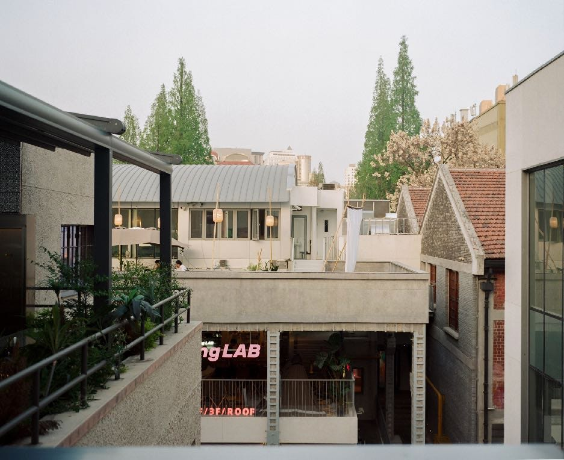

> **摘要**:
>  本文是作者与摄影师轶轩对小红书平台以及其影响力的深入研究和观察。作者起初认为通过对消费社会的理论分析就足以理解小红书，但随着深入交流和观察，逐渐认识到这一社交电商平台的复杂性与多样性。文章描绘了小红书总部的文化氛围、博主对内容创作的理解与实践，探讨了小红书在用户生活和商业变现中的重要角色，以及平台与品牌之间的互动。作者还讨论了博主在创作时要面临的挑战，以及平台对内容发布的严格规定，阐释小红书如何让生活与消费交织，并被视为现代消费文化的一部分。
> 
>  **要点总结**:
>  1. 小红书作为社交电商平台，极大地影响了用户的线下生活及购物决策。
>  2. 博主在小红书上需要不断适应新趋势，创作高质量内容以维持关注度与商业价值。
>  3. 平台的去中心化流量机制使得腰部博主有更多机会获得商业合作。
>  4. 小红书的内容创作被视为生活的一部分，而不单纯是工作的延续。
>  5. 消费文化在小红书的投射显现出个人生活方式与消费行为的深层次关联。

---

这篇文章[去年首发在 T Magazine](https://mp.weixin.qq.com/s/9zByKJH87YM7IFa5mhhyyw)，是我和[轶轩](https://www.instagram.com/mamiya7ii.eth?igsh=ZWJwOTFpdjN6c3l0)用了一年半的时间探索小红书的结果。

2022 年，晚点的编辑和我说可以写写小红书。用了半年发现自己写的和屎一样烂，因为我不玩小红书。那年年底，发现身边朋友都在玩小红书，感觉还是应该仔细研究研究。就接下来用了一段时间自己玩、采访和瞎寻思，写了这篇出来。不过文风已经不适合晚点这样的财经媒体了。幸好有 T 当时的编辑 Kuma 帮忙，在她的帮助下顺利发表出来。可惜因为微信平台的一些规则，原文实在太长了、图又太多了（T 这样的厚道的时尚媒体要单独给图片付费，所以会有上限）。只得删除一半的文字，和绝大多数图。你看到没有 logo 的图，都是当时没放出来的。

一直想找机会全文发表出来——不过发之前我意识到原文里有很多细节在最终版和受访者确认时改了，现在重新发原文会出现问题。所以你现在看到的版本，是就用 T 的那版加些当时没发的段落，并且补充上大部分原本想放的图片。

出于个人写作哲学原因，整篇文章并未采访任何一位小红书的员工。同时感谢所有的受访者！

2022 年 8 月，我曾经构思过一个大纲，写小红书。当时我有一种傲慢，认为写小红书需要知道的，不外乎《消费社会》《景观社会》或者《欲望几何学》说过的那些观点。对着消费主义深挖就够了。

但另一方面，我也有所犹豫。消费对当今时代的渗透之深，意味着针对单一平台的批评，有避重就轻之嫌。小红书抓住了时代的脉搏，自然也要承受时代的压力。更何况，相对容易的写作不一定是对的写作，面对小红书这样一个复杂的系统，应该展示好一个切面，还是应该向读者强调，切面绝不等于整体视角？这些问题盘绕在脑中，让我时时感到无能为力。

直到去年底，我去上海出差，发现朋友们都在聊如何做小红书，如同人们一度都在聊怎么运营微信公众号。在他们口中，小红书仿佛已经成为内容创作的应许之地 —— 收入可观、商业变现更快、制作成本更可接受 —— 这让我意识到，从创作者切入，可能是理解这个复杂系统的方法之一。

邀上摄影师谢轶轩，我们一道先去看了看小红书的总部。那是个周六，我们想拍拍员工加班的样子。

轶轩平时的拍摄大多是静物，核心是大量观看后细节呈现。在转了几圈，引起他拍照兴趣是其中一栋办公楼的天井：每一层都有植物从办公室里向外，朝着阳光倾泻而下的天井方向生长。这让我想到在南京西路看到的 LV 旗舰店，它们在每层阳台都放了修建精致的盆栽，和这里有异曲同工之处。但我没进去过 LV，从远处看不出盆栽是真的植物还是假的。小红书这里不一样，我也进不去，但就冲着这些植物肆意生长的方向，它们肯定是活的。

> ###### 小红书总部，抬头可以看见天窗和绿植。
> 
> ###### 不过因为是周末，办公室的灯都灭着。

一些细节明示访者，此处是家互联网公司。会议室门上贴着标语「#说好今天上线，就绝不会晚于明天太阳升起的时候」；门口的玻璃墙上贴着一堆字母，其中有 5 个单词被单独用红色标注出来：Result、Judgement、Focus、Trust 和 Leadship；办公室的各个屏幕里播放着「内推新玩法上线啦」的字样。

但眼前的更多细节，并不符合我们对于互联网大厂的刻板印象。那天虽然办公桌上还亮着灯，但几乎无人加班，甚至连门前的扶梯都停止运行。后来才知道，小红书偶尔几次周六没人都被我们碰上了。不过即便是工作日再去，也很少会看见工牌、格子衫、冲锋衣或双肩包这类具有「大厂」气质的穿着。只有少数人穿得西装革履，但肩膀上会有一个绿色贴纸，上面写着：供应商。

地理位置就更不用说。小红书上海总部被称为 Red City，这里不光是制造小红书的地方，更是小红书里的打卡点。北京的大厂同行们还在纠结周末要不要去东边逛街，小红书总部办公室之一的正楼下却是一家来自台湾的知名买手店。店员会体贴地告诉你，某双摆在货架中间的鞋子没复刻好，鞋底中部会断开。不过，也无需进店，小红书里早有博主为你整理好了介绍「这里有乡绅地痞气息浓厚的 Wacko Maria、美国潮牌鼻祖 Stussy、东京型男最爱的 N.Hoolywood，以及 WTAPS、Visvim 等等」；店员也会在应用里分享自己的 #OOTD（今日穿搭）。

从办公室出来，步行几分钟就是新天地商圈，一个可以「既要」「又要」的地方：游客把这当成景点，本地人也会来这购物。新天地有 18 个橱窗里展示着 96 支均价为 240,542 元的手表。如排除 11 只售价 2,010 元特选门店才有售的斯沃琪与欧米伽联名款，那么橱窗里余下的 85 支手表均价会上升到 271,410 元。

> ###### 新天地商圈

成立 10 年，小红书月活已经达到 2.6 亿，月活创作者已有 2000 万，笔记日发布量达到 300 万+，人均单日使用时长从 2018 年的 26.49 分钟上升至 55.31 分钟。

但在新天地，很少有人注意到这里走出了一款月活 2.6 亿的应用。常有来打卡的人在小红书上感叹：「小红书的总部竟然在这里！」

走了一圈，最后轶轩说他还有张照片想回小红书拍。就是天井那栋楼里的状态。他在小红书办公室的入口处看了半天，和我说：「你注意到了吗？他们玻璃上贴的那些字，从里面看是反的，所以这是给公司外面的人看的。」

罗马不光一天建不成，一个人也建不成。建设小红书这样的城市需要合力：平台、用户、博主、商家、MCN，甚至是线下的空间。每个人都在给这座城市添上新的橱窗。

很少有一款线上产品可以如此深入的影响用户的线下生活甚至物理空间。用户会使用它辅助购买决策、商家把它当作最重要的推广阵地、线下的店面会特意为拍照打卡发贴设置摆设。甚至全新的风潮都会从这里起步，比如露营、飞盘和在滑雪场穿比基尼拍照。

「武夷｜MIX320」是一个新鲜的例子：原本是农贸市场和社区卫生中心的地块被组合在一起，经过「城市更新」变身为一个复合式街区。菜市场还在，但是更漂亮，加上工业风的配套建筑，让这里成为小红书上的热门打卡地。有博主说，这里很像首尔；另有一位博主评价：「重点是这里大多是西餐，咖啡，brunch 等网红店，好适合打卡拍照📷！拍照也好出片！」

> ###### 武夷｜MIX320

不能说「武夷｜MIX320」是为了小红书而建，但其中的店铺多少受到了小红书逻辑的影响——因为适合打卡，所以吸引更多人来，因为更多来打卡的人，造就了更多适合拍照的店面，一种循环。每个人都能从中找出一小块自己需要的地方，将它变成图文或者视频，供人端详。

小红书博主是这套循环的一个枢纽。出片不仅仅是拍照，更类似一次迷你版产品发布。根据是想带货还是涨粉，流程也各有差异。当不了解的人称呼博主为「网红」时，一些博主会不厌其烦地纠正：网红只需要有粉丝就行，但博主已经成为一个需要专业技巧，高质量、高效率地全职输出内容的职业。

Sonya（昵称，[小红书@HiyaSonya](https://www.xiaohongshu.com/user/profile/58904a5a5e87e73c3a7131b2?xhsshare=CopyLink&appuid=65bfaba6000000000903f49e&apptime=1725245149&share_id=f9d7394d5d4f4e49b583159b124fcd99)）就是一位典型的博主。她曾是电视台的新闻播音员，兼做小红书博主。2017 年她得知有广告公司寻求与小红书博主合作，便创立了一家供应商机构，为其提供博主资源。仅一个月内，她合作的 200 多位头部博主的广告均价，就从六七千涨到了一万元一条。如今，当年这批头部博主中，一些人报价已经变成单条广告 20 多万，而 Sonya 在小红书上也拥有了 103 万的关注者。

我们见面这天，她的任务之一是在一小时内换上合适的衣服、寻找拍摄场地然后为某产品拍摄一组照片；另一个任务是测试租来的相机和镜头，决定要不要添置设备。她选择的场地便是「武夷｜MIX320」。

> ###### Sonya 在外景进行拍摄。

这天武夷路上人不多，但依然会对拍摄画面产生干扰。Sonya 看了一圈，迅速带摄影师上了人更少的二楼，指导拍摄角度。之后她不断切换场景，让摄影师尝试相机的不同设置，再拍一组 Live 图，作为硬照的补充，这样更随意真实。她的被拍摄状态称得上「娴熟」 —— 并非是做好了随时被拍摄的准备，而是让自己几乎每刻都可以被拍摄。

任务在 30 分钟内完成，随后是再换衣服，去参加另一个活动。

拍照前的整个下午，Sonya 都呆在办公室里，和编导梳理接下来一段时间要发布的内容。她感叹已经很难用「小红书风格的内容」做小红书了，穿搭想吸粉难了好多；最近有很多抖音甚至 TikTok 的内容涌入，需要学习短视频风格的新趋势；本月还有至少 3 条视频要发；前一段去了中国香港 Art Basel 展览，拍了很好的视频但没空剪辑发出来，现在热度过了发也意义不大......

一位传统媒体的编辑如果此刻在场，他可能会惊讶的发觉在小红书发好看照片和视频的博主竟然与自己的工作如此类似。但这只是第一印象，仔细观察也有不同：一直有一位摄影师在拍摄。这不是说和编导开会是假的，而是因为要更新的太频繁了，所以不能错过任何一次的素材。哪怕拍了一下午最后只用上了一个空镜，那也值了。因为缺素材就是缺素材，后期无法补救。

> ###### Sonya 在办公室内和同事讨论接下来的内容选题

一位博主说：「在小红书，不少人在分享完整的生活方式，但抖音快手都是没有的。」分享生活方式需要大量地拍摄生活作为素材，而不能仅仅是为了发笔记，每天抽出点时间做拍摄。正确的做法是反过来：拍摄一天，然后抽出时间发笔记。任何一个成功的博主，都会持续拍摄这种视觉版「起居注」；开会、吃饭、出门遛弯，都要变成素材。

Kelly（昵称，小红书@[洪辰瑶Kelly](https://www.xiaohongshu.com/user/profile/551b57d32e1d9318ce9e182d?xhsshare=CopyLink&appuid=65bfaba6000000000903f49e&apptime=1725245173&share_id=c3e7c5aed75f4a9fba6f82e3e74e5fbf)）的家里有 4 个不同背景的角落。要拍摄书籍分享，还是护肤美妆，决定了她会选择堆满了书的一角，还是坐在梳妆台和镜子之间。即使作为博主多年，她面对摄像师的镜头依然有些紧张。可一旦面对自己的相机，一种利落且自信的神态就会自然浮现在她脸上。

> ###### Kelly 在家中用于拍摄背景的一个角落。

2018 年从公司辞职之后，她开始分别运营小红书和 Bilibili 上的两个视频账号。在 Bilibili，UP 主们所属分区的编辑会对流量的分发有一定影响，因此会有前辈提及与 Bilibili 官方账号及聊天群多互动的重要性。而在小红书，由于其始终去中心化的流量机制，人们发布内容的心理门槛更低。

回头看，「其实平台只需要很明确告诉我们什么东西不能做就够了。」Kelly 如此总结。玩小红书的第二年，有人私信说很喜欢她做的内容，自己是她的老乡，创业做的是打底裤，想送她一条。签收了打底裤，那人又说，能不能帮忙发一条小红书笔记。她不知该怎么拒绝，只好硬着头皮发了。那是她做博主以来的第一次「商业化」。

也是在这一年，小红书平台开始联系 Kelly 这样的博主，告知该如何定价、要去接触什么样的品牌、平台有什么规则。「心理上有一个平台在你后面支撑着，就没有那么害怕了。」她说。

去中心化的流量分发方式，让小红书变得近似一个理想的纺锤形社会 —— 缺乏顶流，但腰尾部博主占据主流，这也反过来让 KOC（关键意见消费者）代替 KOL 成为对品牌而言在该平台上性价比更高的选择。

根据新红数据的不完全统计，截至去年底（2022 年底），像 Kelly、Sonya 这样的 50 万粉丝以上头部博主，在小红书上至少有 2,800 人。小红书上还有大量 20 - 30 万粉丝的腰部博主，单条推广报价平均在 2 - 3 万左右，也就是粉丝数量的 1/10。一些努力的、尤其是美妆护肤领域的博主，甚至可以做到每个月接十几条推广。

更小一些的博主也雨露均沾，几千粉丝就能接到几百元一条的推广。博主们称它为「小广子（轻声）」，甚至有的「小广子」就是几箱酸奶。投放广告的客户已经习得以下认知：在小红书上可以投 KOC（关键意见消费者），即体量更小但价格也划算的 KOL。甚至对于一些品牌来说，投 KOC 默认等于投小红书。

在大小博主、品牌和平台之间起到润滑剂作用的是 MCN（多矩阵频道 Multi-Channel Network）合作。MCN 机构蕃茄蛋的办公室会客区域里，65 寸的电视屏幕来轮番播放着合作博主的视频。柜子里摆着某位博主的十万粉银色纪念牌，上层是她的百万粉金色纪念牌。

> ###### 蕃茄蛋会议室

蕃茄蛋合作的博主大约有小一百人，一半内部孵化，另一半来自签约。对于任何想尝试做内容的人，联合创始人罗锴都会先推荐从小红书开始。在罗锴眼中，只要在小红书做一个好的内容编辑，就可以获得初始流量。学习细分领域高赞笔记，然后用同样手法去编辑自己的内容，成为一个 KOC 没有想那么难。

但 Kelly 有时也会感叹：「说了很多，B 站网友会写很长的回复来说自己的想法，小红书有人在问『姐姐裙子哪里买的？』」

摄影师谢轶轩想拍「破绽」—— 不是光鲜亮丽的一面，也不是疲惫、凌乱、不知所措的另一面，它们都太过直接。「破绽」也就是那些光鲜亮丽时刻的线头；顺着线头，也许会牵引出另一幅面貌。

我也一样，想当然的以为博主会有一种「营业」的状态，和另外一种某个状态。但实际上没有。博主呈现在屏幕里的生活与现实生活是没有分界线的。

Kelly 拍摄视频的场地就是她家，可她不光把那些布景当作背景，而是那些地方就是她生活的角落。Sonya 不是为了拍照摆出姿势，而是她的生活随时值得被拍摄。还有其他许许多多的博主，我发现了小红书非常不同于其他平台的地方：

这里没有一个明确的分界线来来昭示台前幕后，博主永远在台前。

我自己写作、做播客、也拍纪录片和 Vlog，所以内容生产我很熟悉。绝大部份内容生产者，都和曾经的明星一样，是有台前幕后的。比方说一个抖音乡村博主，她会在上山采蘑菇前进入一个「我今天要进山拍摄」的模式，拍完就结束了，正常该咋生活就咋生活。一个微信公众号的作者，会每天抽出时间专门用于写作，但那个写作状态也就仅限于一段时间。我只需要在创作内容的时候进入创作内容的状态。

换句话说，内容创作是一个工作，所以有上班和下班。可小红书博主不一样，我分不出上班和下班，她们随时营业。那条存在多年的、屏幕前和屏幕后的分界线正在被融化。我无法指给读者：看，博主背后是这样。

> ###### Kelly 的猫

因为在其他所有的地方，创作内容（无论文字图像视频）都是工作；而在小红书，创作内容不是工作而是生活，内容本身也有关于生活。大家在这里分享完整的生活。

我也无法想象一个比小红书更终极的平台。它仿佛剥去了一切繁琐的外壳，把生活本身作为内容来源；再往后退一步，就是让人皱眉的真实世界。毋需通过电影、舞台、表演来那么「麻烦」地模仿生活，小红书恰好处于生活的水面；在这里，可被享受的生活总是漂浮在那无趣的日常生活之上。你无法日复一日地表演一种生活，于是只能把自己活成值得被表演的样子，然后展示它。

有人说这不是真实的，我想这恰恰是另外一种终极的真实。波兰诗人 Adam Mickiewicz 谈到拜伦时说：「他是第一个人向我们表明，人不仅要写，还要像自己写的那样去生活。」博主，尤其是小红书的博主们，在此基础上更进一步：人如何展示生活，就会变得如何生活。

但挣钱从来就不容易。即使小红书看起来许诺了一个可以轻松商业化变现的路径，也还是难。变化正在发生，头部博主最先感受到这一点。

[G 僧东（昵称）](https://www.xiaohongshu.com/user/profile/557da0d3f5a2635abdf036f3?xhsshare=CopyLink&appuid=65bfaba6000000000903f49e&apptime=1725245651&share_id=fa6ea8cdb9c843ceabc1b5086b6248da)工作室所在的园区里，有一家品味很好的艺术书店，办公室里有多种多样的绿植和鱼缸。他旗下有两个全平台频道，同名《G 僧东》和[街采栏目《好叫好伐》](https://www.xiaohongshu.com/user/profile/5fd6ef3b000000000100b1cf?xhsshare=CopyLink&appuid=65bfaba6000000000903f49e&apptime=1725245668&share_id=a45dba94441648ce95d018bdf251167d)。自从小红书于 2020 年 8 月放开视频时长限制之后，G 僧东就开始做小红书。虽然在各个平台都算得上头部博主，但他自己平时最爱刷的是小红书。最近他还在小红书单独做了个小号，叫《G 僧东买了啥》。

> ###### G 僧东在办公室接受作者的采访

他感到近几年小红书上的内容越来越多元，变得更像是朋友圈，或者没有朋友圈之前的微博。但对他和工作室来说，最重要的一点还是：生意不好做了。

原本品牌客户可能有 1,000 万预算，投放给 20 个 KOL 去传递 5 个不同角度的信息给消费者，但现在可能只有 10 万元预算去投放给一个 KOL，而希望传递的信息量却没有变化。

这让内容输出变得非常「惨烈」：「以前说服不了客户，可能是客户真没有理解；也可能是大家对搞笑的理解是有偏差的，每个人笑点不一样。所以跟他解释清楚以后，客户是能接受的。但是现在客户不是不理解，但是没办法接受。因为对接的人也没办法在内部和上面与老板交差，真没钱了。」G 僧东的合伙人林仙子也感叹，做到第 6 年了，为了争取客户有限的预算，2023 年刚过去的一个月，他们和客户见面、电话开会的次数，比前 5 年加起来还要多。

这样的感叹不光 G 僧东与林仙子有，几乎我采访的大部分博主都有所表达。有人说：「已经不是赚多赚少的问题了。是如果这个客户有 10 万块的预算，我不把这个钱拿下来，公司就要倒闭了。」

Carol（[昵称，小红书@萧萧Carol](https://www.xiaohongshu.com/user/profile/566c634c44760813c81388ea?xhsshare=CopyLink&appuid=65bfaba6000000000903f49e&apptime=1725246737&share_id=c24f3678946e4cecad1aaba519e599a7)）是一名美妆博主，在成为博主之前，她在杭州做过几年 MCN 机构的商务总监。2016 - 2017 年，她所在的公司已经发现小红书的数据不错，于是 Carol 自己也开始研究。

她观察到，现在很多头部博主因为报价太高，有时候甚至两到三个月都没有一条广告。这也和客户的投放逻辑有关：一笔预算会同时被投放给头部与腰部博主。考虑到受众的触及面和新鲜感，客户会迭代投放名单。上一批投放过的头部博主，客户会记得很清楚，下一次大概率就要换；反而是腰部博主，下次可能继续拿到投放，因为客户难以记清那么多名字。

然而即使是腰部博主也要面对僧多粥少的局面：虽然用户量在增长，但 Carol 认为最根本的挑战还是「广告主一直是同一批，没变过。」

> ###### 小红书总部的橱窗。

甚至连「看脸」这件事，都不容易。Carol 的小红书只发产品介绍，本人从来不出镜，这是因为她不想分散用户的关注点，引出「姐姐睡衣哪里买的？」「姐姐沙发有链接吗」之类的问题。

我感到好奇 —— 她既然这么懂美妆，也知道如何运营，为何不考虑尝试做更容易变现的颜值博主。曾经，如果一家 MCN 机构大批量签约颜值博主，营业额还是可观的。北上广深杭的颜值博主基本被签完后，很多人开始去长沙、成都等城市，挖掘新的博主和运营模式。

「当网络上的美女的隐性成本非常高。高到什么程度，你没有办法想象。」Carol 否定了我的提议，「变美需要太多细节：光是护理头发就 5 - 8 个工序，要用到洗发水、发膜、蒸汽发罩、头皮精华......敷面膜也可以搞半个小时的沉浸式敷，洗澡可以在浴室里面待两个小时不出来。化妆为了上镜，至少要一个多小时才能精细点。P 图会细节到眼睛大小是不是一样、怎么调双眼皮......虽然熟练，10 分钟修完一张，但你一天修个十张八张，一小时又过去了。为了在网络上呈现一个好看的样子，每天可能要花七八个小时。」

「修图难道不是可以交给博主自己的团队吗？」我问。

「修图要自己做，因为别人 P 不好。头部博主如张大奕和雪梨，都是自己修图，因为自己最懂自己的脸。我合作过一些 50 万、100 万粉丝的颜值博主，每天都要花一两个小时修 9 张图，这是她们的工作。」Carol 接着说，「我有个好朋友，已经是小红书百万粉丝博主了，有次修图修到一半，感觉自己做了 4 年博主，好像变丑了，又想到每个月都有新的漂亮妹妹出来，边修边想『为什么我这么丑？这么不好 P ？』，然后就崩溃了，为自己『变丑』这件事哭了一个小时。」

这次聊天以 Carol 建议我去小红书搜「服美役」 收尾。

无论如何，每天仍然有大量心怀梦想的人入场，而已经入场的人，更是无法离开它。这些建设者们一同努力，在小红书上每天产出超过 300 万篇内容：从刮台风都不掉的底妆、到纽约酒店分享，再到网购砍价省钱技巧。有 2000 万人每个月在这里标记自己的生活，同时试图帮助别人寻找想要的生活。

恰如小红书的口号「标记我的生活」，线上之梦是线下生活的延续，线下生活是线上之梦的显化 —— 另一个循环。小红书还在今年推出了「TrueInterest 种草值」这个概念，CMO 之恒提到：「在一些企业的整体营销规划上，产品种草已被列为独立的营销目标。」

> ###### 小布自行车

被爱好者们昵称为「小布」的 Brompton 折叠自行车在小红书上有 45 万条笔记。这种能 20 秒内折叠、英国手工生产的自行车象征着一种生活方式。光是关于如何改装小布，让它更美、更轻、更快的笔记，就有一万篇。小布产能很低，渴望它的人常常需要排队、抢购或者直接买二手，然而在小红书上，很多人都拥有不止一台小布：周末喝咖啡时与长距离骑行的并不是同一台，10 台颜色不同的小布可以搭配不同风格的衣服。

一位曾经在小布专卖店工作过的人向我感叹：原本以为目标客户都是专业自车爱好者，结果大部分顾客都是把小布当成穿搭配饰的道具。仔细一问，「从小红书上看到的」是常见反馈。

但也不是所有品牌都喜欢小红书的「种草」效力。因为种草会严重窄化消费者对品牌的理解，甚至带来误解。

Freitag 被爱好者们昵称作「福海他哥」，主要回收废旧卡车的防水布制作斜挎包和双肩包。长期以来，骑小布背 Freitag 成为了小红书上一种标配穿搭。

一位 Freitag 员工告诉我，这家品牌流行度的增加与小红书上笔记数量的增长呈正相关。因为 Freitag 的外观有随机性，常有人在小红书分享如何「蹲」到自己喜欢配色的过程，也有人会分享最近上新都有哪些图案；当然，也有贩子专门哄抬一些「稀少」颜色的价格。

但这种随机性也引发了消费者和品牌的小型矛盾。在小红书上，最不受待见的颜色就是红色和蓝色，它们太常见了 —— 因为绝大多数卡车防水布是红蓝配色的，广告效果最显眼的颜色。而消费者会拿着小红书的照片问店员，为什么没有某种颜色；店员更是疲于应付「粉色什么时候上新」这样的问题，因为卡车部门每一批次收到什么样的防水布没人知道。

更大一点的矛盾发生在 Freitag 的旗舰店里。Freitag 的 F 商店在上海胶州路的弄堂里，前身是著名的乐途青年旅店。这是一个非常漂亮的店铺。选址在此是因为 Freitag 的价值观里有一条是「No Spot」。一位工作人员发给我的文案中写道：「我们以后院而非大街为家」（We call the backyard our home, not the boulevard）。我想这是在说，比起摩肩接踵的打卡地，他们更想关注常被忽略的地方。所以这家 F 商店选在了上海的一条街区之中，两边都是民居。为了方便社区内的人员流动，特意把一层辟出一块空地。

讽刺的是，Freitag 旗舰店的存在把这里从「No Spot」变成了一个「Spot」，一个打卡地。因为门店离社区太近，当有人来这里在窗边自拍时，邻居的阳台也会入镜。为此 Freitag 甚至用砖头封闭了一扇窗户。

> ###### Freitag 的店旁边就是居民生活的空间

最深层次的矛盾还在于，Freitag 的工作人员发现自家品牌在小红书上的标签是「环保、时尚、潮流」。这偏离了其本意 —— 原本为了长期使用所设计的产品，变成了穿搭的配饰。甚至连「环保」也不贴切，Freitag 的卡车防水布是无法降解的，主要特点是升级利用（upcycling），而非环保。

这种品牌主张与标签的错位，让很多人在小红书上批评 Freitag 是「智商税」和「假环保」。最后 Freitag 只好自己开了一个小红书账号来解释一些常见问题，并且在中国单独设立了一个本地内容岗位，以便解决这个挑战。

但在现在的模式下，又有谁能好好解释自己的品牌价值呢？少有人在乎解释的过程，要的仅仅是一个可被三言两语总结、发笔记的结果。一切可被消费的，都可以被「种草」。种草带来消费、消费带来更多消费。

而为了创造更多可以被种草的机会，更多种生活方式、更多种自我也被创造出来。小红书官方参与出版的杂志《关于》第一本主题是《啊！原来我是这样的自己！》。在占据最多篇幅的「万分之一中生活」栏目里，对话了 11 位不同年龄和职业的人：脱口秀演员、策展人、音乐剧演员、投资人、街舞舞者.....象征生活的种种可能性。

最后一页只有一句话：「原来我们都还在找自己啊。」合上书，封底印着：在 10,000 种生活中找到属于你的独 1 种自己。

> ###### 在「宝宝辅食」标签下，
> 
> ###### 由随意挑选 100 篇内容的截屏堆叠形成的图片

法国社会与哲学家 Jean Baudrillard 1970 年就在《消费社会》一书中对类似观点打趣道：「如果我是我自己，那么我怎么能『比以往』更像我自己：难道昨天的我不完全是我自己吗？我可以把我培养成我的二次方吗？」鲍德里亚说的没错，但在当今所谓「自己」只不过是个遮掩。真正重要的是「自己」背后所蕴含那些生活方式。因为「自己」无法和种草消费挂钩，但生活方式可以。每一个被标注出来的生活方式，都可以配合无数个种草场景。所以不管小红书如何强调寻找「自己」，可它只有生活方式博主，绝没有「自己」博主。

只要有生活方式，就可以产生消费行为。甚至是极简生活，也无法简化掉消费，反而要通过消费更多来达到极简。一位倡导极简生活的博主写到：「每天一杯手冲对我来说是一种习惯也是一种享受，我不会把他们简化掉」，配图特意标注了豆子用的是当地买的云南小粒咖啡。另一位博主用了 9 个月装修，实现了无门框、无踢脚线、无主灯的极简主义风格，虽然看着空无一物，但地上用微水泥作为装饰涂层已经暗示了高昂造价；一条评论说：「恨不得把微水泥都起走。」

极简主义的生活方式无法靠一无所有来实现，要的仅仅是「看起来」一无所有。这就是生活与生活方式的区别：生活略带苦涩，生活方式通过消费来消解生活的苦涩。

正是无数不断在更新的生活方式，塑造了小红书最深的护城河。只要想到了各种好生活，那就是小红书。小红书口号的变化，从「全世界的好东西」到如今「标记我的生活」，刚好反映出种草场景的扩大。

在小吴（[昵称，小红书@阳光开朗的小吴](https://www.xiaohongshu.com/user/profile/5d237736000000001600aa11?xhsshare=CopyLink&appuid=65bfaba6000000000903f49e&apptime=1725246867&share_id=9f9325226728495784c470e382dac3b0)老师）的体验里，小红书在带来更多商业化机会的同时，也更希望博主们展示一个美好的、不能出问题的世界。

> ###### 商场附近的海报

小吴今年刚 20 岁出头，在 Bilibili 上有超过 100 万关注者。他是那种有天赋的内容创作者，极具「网感」并且善于输出，主做美妆护肤品类，这也是最容易商业化的品类之一。在成为成功的 UP 主之后，他感觉应该多平台发展，就开始做小红书，没用多久关注人数就超过了 40 万。虽然在 Bilibili 上粉丝更多，但他的大部分收入却来自没做多久的小红书。

然而小红书似乎比 Bilibili 多了一层隐形限制，让创作者经常摸不到内容的边界在哪里。小吴做过一期吐槽欧阳娜娜的视频，Bilibili 上播放量超过 400 万，发在小红书，一开始流量也很好，但他感觉在 6000 多个赞之后视频明显被限流了。

小红书上的人「可能更希望看到这个世界的美好」，这是他对此事的结论，也让他把接下来的小红书视频调整得更加积极向上。

可现实世界不可能永远美好。近年来在小红书上流行主题之一，是原相机无美颜测评 —— 在不打光的情况下，让关注者们看看画出来的妆到底是什么效果。

「小红书非常严格，不大希望有负面信息。尤其是商广。我之前用皮肤瑕疵当做封面，一些毛和皱纹之类的，都会被限制住。不让发。给个名头就说你展示不美好信息，把稿件打回去。要重新更换。」小吴说。

皮肤有瑕疵本来是很正常的一件事。他的毛孔就那么大，为什么是展示不美好？

20 世纪 80 年代，艺术史学者 Heinrich Klotz 就注意到：纯粹为了满足使用目的功能主义现代建筑逐渐退潮，新的建筑开始超越实用目的，成为了「想象世界」的表现媒介。新一代建筑师们开始把建筑当作「美好世界的表象」去创作。建筑不只是给人住的，更是价值观的体现。

今天消费品对人的影响比建筑更为普遍，也一样是价值观的体现。如果我们能接受「山水城市」代表了人与自然和谐相处的人居精神，那小红书上流行的 Snow Peak 的钛折叠马克杯，为何不能也代表消费者对自然的热爱？

2023 年 4 月份，我在上海呆了接近两周的时间，除了本职工作，其他时间都在研究小红书。回到北京后，我把自己的观察分享给了同样是内容创作者的重轻。

「你说的对。但我想再补充一点。就是小红书的内容大部分都诉诸于感受。」重轻说，比如如何获得松弛感、如何自然、如何获得钝感力......感受就是结果。他举出的一个例子是知识分子风穿搭：「你不需要成为知识分子，不需要读书，直接可以得到这个结果。有时候我感觉，小红书就像是一个张着血盆大口去吃感受的怪物，一本关于感受的说明书。」

重轻接着说起今年春节时的经历。那时他住在海南通什（zá）市。

「我查了，只有在这一个地名中读『zá 』。这个市在相当长的时间里都乏善可陈。于是它就申请改名成了五指山市。五指山好歹有点名。」

「确实，五指山我听过。」我说。

「但你知道吗，这个地方现在成了一个网红圣地。我春节在家呆着无聊，就看小红书想找找这里都有什么，发现有些人来这一住好几个月，而这里成为打卡点的全部原因，是建筑色彩鲜艳，却总阴天下雨，自带一个低饱和度滤镜，像 90 年代的氛围。」

他边说，我边打开小红书搜索「五指山市」。

「什么叫关于感受？就是你完全不需要真的知道 90 年代什么样、不需要知道为什么这里是这样、不需要知道所谓『像 90 年代』是像什么，只需要知道这里出片，像 90 年代就够了。这就是感受，我们唯一要的就是那个结果。万事万物被扒光实在的东西，把感受拿出来待价而沽。」

「归根结底，小红书还是和消费主义脱不开关系。我不反对消费，我也消费。但消费主义不一样。极端被动，是消费主义最大的特点。你必须把感受拿出来，直接给消费者。不能指望他们主动去感受什么。开个玩笑，就像是我去看一片树林，以前是我们走进去研究；现在是我们希望树被装上轮子、被推到面前。」

> ###### 橱窗中的电子屏透过透明的衣架，
> 
> ###### 呈现奇异的纹理

「我无法想象会有比小红书更极端，更注重感受的平台。退无可退了。就像你说的，小红书就是生活本身了，你还能怎么做呢？」重轻最后总结说。

后来我见到了文化人曹柠，和他转述了重轻的看法。

「现在讲书，只要说这个书很好哭就能卖。『好哭』就是感受。这不是一个行动的社会，这是一个呈现的社会。做什么不重要，但看起来是什么很重要。」曹柠又补充了一个例子。

虽然这么说，但他那天的任务是在酒店试睡一款床垫，然后把感受告诉观众们。

小红书的故事在继续，创作也还在继续。在和博主们的交流过程中，我能明显感受到他们对于未来的期待。这是一个发展中的平台上的用户应有的状态。这种状态曾经出现在微博大 V、微信公众号作者、Bilibili Up 主的身上，这一次是小红书。

小吴认为他在美妆内容的潜力还远没有穷尽，打算努力输出，早日也在小红书达到百万粉丝；G 僧东曾经的一个尝试，街采节目《好叫好伐》开始结出果实，让他充满信心；Sonya 的办公室里、Kelly 家中的白板上都写着未来几个月的出国外拍计划，因为根据经验，小红书里「人在国外流量更高，风景好还出片」。

而小红书正起步于几本关于境外的购物指南，第一个宣传口号是「找到国外的好东西」。中国经济腾飞与融入世界的时间线是重合的，小红书的崛起，同样处于中国经济更加深度融入世界的延长线上。

> ###### 橱窗中的放在盒子里的假花、
> 
> ###### 闪闪发光的鞋子、
> 
> ###### 不会飞起也无法降落的塑料蝴蝶

这么多年来，日本始终位列小红书笔记最火爆目的地之一，平台上有超过 535 万篇笔记。摄影师谢轶轩说，他结束小红书这个项目后要去东京。有博主说那他不如顺势也开个小红书账户，日本多出片啊。提前多看看其他人发的学习下。成为 KOC 挣回胶片钱，他心动了。

中日两国共享了很多相似的文化。随着佛教净土信仰兴起，人们对营造「彼岸世界」产生了更大的兴趣。所以两国设计者常常会在园林中布置「可望而不可及的对岸」作为隐喻。小红书上一个推荐的打卡地：京都府宇治的平等院凤凰堂，就是很好的例子。

拍照的游客们隔着水面，看到对岸鲜红的凤凰堂。它向四周绽放的庞大屋檐，足足上下两层，仿佛振翅欲飞的鸟儿。可它的上层被特意设置为一个华丽摆设，无法攀登，可望，永不可及。这是一个真实而又绝望的比喻：对于建造者来说，我们一生仿佛就是穿过漫长的水域，摆脱污浊的尘世，才能到达光明无瑕的对岸。而凤凰堂在暗示，此世也许只是一个璀璨的幻梦。

一条小红书笔记写到：「（凤凰堂）倒映在水中零死角怎么拍都好好看。」

在上海采访期间，我和摄影师谢轶轩突发奇想：要不我们也开个小红书号试试吧？就聊化妆。我们猜想直男从零学化妆应该是个市场空白，也幻想一旦把号做起来能挣钱。于是回北京之后，我俩加上另外一个会剪辑视频的朋友，[开了一个新号《直男化妆💄有意思吗》，用小红书学习化妆技巧](https://www.xiaohongshu.com/user/profile/644a7438000000001f0312f0?xhsshare=CopyLink&appuid=65bfaba6000000000903f49e&apptime=1725247213&share_id=e24d36b5aeb4405cb5deef9aaaf90896)。

这时我们才发觉，有许多认知无法靠旁观小红书获得：它看似资料丰富，可教直男这般的新手化妆的却不多。纵使我们看了几十个视频，到了化妆品店，我们才意识到化妆也需要卸妆、上妆前需要保湿。

这些到还是小事儿，我无法通过采访和写作理解的，仍然是小红书的运营逻辑。

我们发的第一支视频，评价不错，数据一般。原因可太复杂了：有人说是不同账号有个随机的权重、有人说是封面不好、有人说我们数据作为新号挺好了，那种爆火的不能作为参考。

我们像无头苍蝇一样的试图找到原因，随着视频越发越多，逐渐学会了看数据榜来选择 Tag、做更合适的封面、参考同类型的视频 ...... 这只不过是我采访那些博主每日挑战的九牛一毛，也是我们在宏大叙事里是写不出来的。

给《直男化妆有意思吗》做数据研究时，我在小红书分析工具「新红」上看到了一组有趣的数据：食品饮料、家居生活、服饰鞋帽、运动户外、美妆护肤等领域里，家居生活不论是推广度、讨论度还是曝光度都排在第一位。而在家居生活的子分类里，住宅家具、家居饰品分列 Top 推广品类第二和第三。

从这个角度来看，装修和家具应该是小红书里流行度最高的品类之一，而种草达人的男女性别分布是 18.75% 和 81.25%。这是个合理的数字，小红书本身女性用户更多，在其最火热的领域有更多女性达人也是正常的。要说这数字代表了什么，应该是女性更在乎家具，并且一定程度上掌握了家装的主导权。

但让我更感兴趣的是这背后藏着的一个非常有趣的细节：在中国漫长的历史上，家具这件事意味着什么？由谁来负责？

历史学者巫仁恕写过一本书叫《品味奢华 —— 晚明的消费社会与士大夫》。这本书的第五章是以家具为例，分析「物」的商品化与特殊化。在文章里巫仁恕通过几种不同的家具消费形态探讨了不同阶层的消费文化，和家具在身份区分与市场区隔中起到的作用。而士人与文人则通过建立特殊的品味，来反映自己的生活方式。也就是说，明代家具早已超出纯粹生理需求，更有别的意义和作用。这很难不让人联想到今日的社会。

但更重要的事情在本书的开头：「消费并不只是满足需求而己，文化人类学观点下的消费文化，强调人类的欲望是受到文化的影响，物品消费的本身就是一种人际关系、社会义务。社会学者认为研究消费文化，与社会竞争、社会阶级或社会阶层、社会化以及身分地位等等因素息息相关。政治学的观点主张高度市场化的消费文化，系为文化帝国主义或是具有文化霸权的统治阶级所服务，作为宰制或操纵大众文化的工具。由此可知，消费文化的研究是一门非常复杂的领域，牵涉的因素与面向很广。」

在写作过程中我经常在想：假设有人在 500 年后像巫仁恕先生一样研究今日中国，他肯定会研究小红书吧？他又能研究出什么呢？至少，他会比巫仁恕先生更容易获取资料。至少，家具这种在中国传统上原本由男性主导、却变为女性更占话语权的物件，已足够成为一个有趣的社会学研究对象。

消费是我们当代生活最重要的现代性特征之一，小红书则已经成为今日中国最重要的消费展现空间，或许没有之一。如果把社会比作生物体，小红书或许就是载有消费片段的 DNA 表达。虽然它只是一个 App，但它的创造者、使用者、受到影响的人彼此交织，相互影响。面对如蜘蛛网般复杂的关系，每个人都只能从浩如沧海的信息中轻舀一瓢。没有人能够真正看清楚整体 —— 甚至一个统一的「整体」都不存在，从不同角度看会得到完全不同的看法，试图通过只言片语来清楚地解释这个系统，是一种傲慢。

但在网上，小红书不过是商业故事、产品经理分析的道具，偶尔被当作消费主义的批判对象。这让我感到有些愤怒，或许这才是我写作的最直接动力 —— 我们能不能抛开那些老生常谈的陈词滥调，以一种更开阔的视野来看待互联网和互联网公司？

全部采访完成后，我回到北京去找轶轩，看看他洗出来的照片什么样。再我俩忙完进城吃饭的路上，他突然问我：

「最近我在想，你说小红书、抖音、快手如果九十年代就有了，该是什么样？」

「估计那个年代版本的小红书上是喇叭裤、Walkman 或者烫头。」

「这都有可能。但我敢肯定，你在小红书上看不到国企改革和大下岗。」

最近新开了一个小红书号，[汉洋在拍照](https://www.xiaohongshu.com/user/profile/65bfaba6000000000903f49e?xhsshare=CopyLink&appuid=65bfaba6000000000903f49e&apptime=1725247319&share_id=db6f24b779674c03bf33dd798f7016a1)。看看有什么消费主义的陷阱，让我也来踩一踩。专门用来发照片。欢迎关注～

