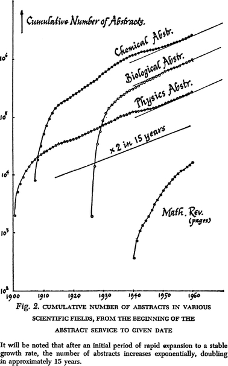

**摘要**：  
文章探讨了当前信息时代的四大趋势，这些趋势旨在提高我们处理信息的能力，包括记忆、整理、搜索和编程效率的提升。作者认为，随着社会的开放和动态发展，知识的产生速度加快，传统的知识管理方式已无法满足需求。这些趋势不仅帮助个人更高效地消费和生产信息，还可能推动科学和创新的进步，打破学科间的界限，促进跨领域的知识融合。作者还提到，科学进步放缓可能与过度专业化有关，而通过跨领域的思考，我们仍能找到新的突破点。

**要点总结**：  
1. **信息处理工具的进步**：包括基于间隔重复的记忆工具（如Anki）、笔记技术（如zettelkasten）、信息搜索工具（如搜索引擎和大型语言模型）以及编程效率提升工具（如VS Code和GitHub）。
2. **知识爆炸带来的挑战**：随着信息量的激增，传统的知识管理方式（如期刊和会议）已不足以应对，需要新的工具和方法来组织和消化信息。
3. **跨学科知识融合的重要性**：作者认为，科学进步放缓可能与过度专业化有关，而通过跨领域的思考，可以发现新的问题和突破点。
4. **工具对创新的推动作用**：这些趋势不仅帮助个人更高效地处理信息，还可能推动科学和创新的进步，打破学科间的界限，促进知识的跨领域传播和应用。

The era of thinking about thinking

November 30, 2024

Here are four trends that I’m excited about (some older than others, but all ongoing):

- Improving our ability to remember and digest the information that we read, with tools like [Anki flashcards](https://apps.ankiweb.net/) based on the idea of [spaced repetition](https://en.wikipedia.org/wiki/Spaced_repetition).
- Improving our note-taking technology, with tools like [zettelkasten](https://zettelkasten.de/overview/), [digital gardens](https://www.reddit.com/r/DigitalGardens/?rdt=52281), and [second brains](https://www.buildingasecondbrain.com/).
- Improving our ability to efficiently search information space. Here the tools range from search engines (older) to large language models (newer).
- Improving programming productivity and collaboration. Tools range from code production environments like VS Code and cursor, to code sharing tools like Github, to code generating tools like co-pilot and LLMs.

What connects all of these areas?

They are all focused on making us more efficient about information consumption and production. They are tools for thought—technology for helping us connect our thinking, spot patterns in our ideas, produce and spread knowledge more quickly, and surf the world of information more easily. They might all be considered advances in [metascience](https://en.wikipedia.org/wiki/Metascience): the study of how to improve the technology and institutions in charge of creating and disseminating knowledge[^1].

I suspect these trends will only become more prominent over time. They are solving a problem that earlier societies did not have, or at least did not have to the same extent we do. The more dynamic and open a society, the more ideas it produces—from science and mathematics to art and literature. And the more ideas produced, the more technology is needed to remember, find, spread, manipulate, and digest those ideas.

While earlier societies made progress, the rate of progress was slower and the depth of knowledge shallower. If you go back far enough, it was possible to know most of what had been written about even fairly broad subjects, perhaps even to personally know those who had written it. There were only a handful of prominent philosophers in ancient Athens (Socrates, Plato, Aristotle, Epicurus, and a few others), economics in the 1800s was dominated by a few figures (Smith, Ricardo, Galiani, and arguably Bentham, Mill, and Marx), and even 20th century physicists were a relatively small community.

But now there are tens or hundreds of thousands of people interested in most fields, from credentialed researchers to bloggers. And it’s easy for all of them to upload their newest idea to the internet. We’re swimming in ideas. The number of formal scientific papers has exploded (e.g., the arXiv alone [went from receiving roughly 50 monthly submissions in 1991 to over 24,000 in October 2024](https://arxiv.org/stats/monthly_submissions)), let alone the number of informal books, blogs, and podcasts.

A figure from [Derek J. de Solla Price’s](https://en.wikipedia.org/wiki/Derek_J._de_Solla_Price) 1963 work on tracking the number of scientific publications over time, [*Little Science, Big Science*](https://en.wikipedia.org/wiki/Little_Science,_Big_Science). Price was one of the first people interested in tracking these trends.

You can no longer read everything published about a topic, unless you drastically narrow the subject matter down to sub-sub-sub-field. One can barely keep up with the publications of a handful of journals in microeconomics, let alone economics as a whole.

This puts pressure on discovering new ways to organize this information, both personally and institutionally. This pressure is what originally led to the invention of journals, which were circulated in order to keep scholars informed about developments in various fields. Some of the earliest journals were [The Philosophical Transactions of the Royal Society](https://royalsocietypublishing.org/journal/rstl), [The Proceedings of the Royal Society](https://royalsociety.org/journals/), and [Annalen der Physik](https://onlinelibrary.wiley.com/journal/15213889) (all still active).

This pressure also led to correspondence networks between academics so that they could tell each other about new work. Famously, [Charles Darwin sent more than 7,500 letters and received more than 6,500; Einstein sent more than 14,500 and received more than 16,000](https://www.nature.com/articles/4371251a). It also led to organized meetings and conferences between those working in the same area. The [Solvay conference of 1911](https://en.wikipedia.org/wiki/Solvay_Conference) was the first international conference on physics and chemistry, bringing together the few dozen people who were working on radiation and quanta.

The first Solvay conference, held in 1911 at the Hotel Metropole in Brussels. Participants included Solvay, Lorentz, Curie, Poincaré, Planck, de Broglie, Rutherford, Langevin, and Einstein.

While we still have journals and conferences, more is needed to stay apace with all the ideas floating around. And that’s where the four trends come into play. We’re learning how to remember more about what we read, organize our knowledge more efficiently, and find information more easily. (The fourth trend may at first seem unrelated, but programming has become such a key part of so many fields, that advances here translate to advances everywhere.)

Part of my excitement is purely personal. Nerds like me who want to Know Things have never had it better. We can sit in front of our computers and learn about everything from the French revolution and tort law, to general relativity and art history.

But more importantly (and more loftily), I think these trends hold part of the key to fighting [the great stagnation](https://en.wikipedia.org/wiki/The_Great_Stagnation)—a period of slow economic growth starting in the early 1970s. A lot of [bad things happened in the 1970s](https://wtfhappenedin1971.com/), but part of the great stagnation was a slowing of innovation and scientific progress. I’m not going to get into the history of and evidence behind this claim here, instead you can [read Scott Alexander talk about it](https://slatestarcodex.com/2018/11/26/is-science-slowing-down-2/) and show you fancy graphs to make the point.

There are several hypotheses for why this is the case. Some cite [institutional and cultural reasons](https://youtu.be/EVwjofV5TgU?si=_hXHqXCjFM3XSd5U&t=3193), from pessimism and an anti-progress ideology, to the distorted incentives created by funding agencies who are [only willing to fund safe research](https://mattsclancy.substack.com/p/biases-against-risky-research). Others cite the low-hanging fruit hypothesis, the idea that the biggest and most fundamental discoveries tend to happen earlier, and as time goes on good [ideas get harder to find](https://web.stanford.edu/~chadj/IdeaPF.pdf). You can only discover that DNA has the shape of a double-helix once—the next insight is going to be fundamentally harder than this.

I lean closer to the culture argument. ([I side with Adam Mastroianni](https://www.experimental-history.com/p/ideas-arent-getting-harder-to-find?utm_source=publication-search).) The low-hanging fruit hypothesis strikes me as a priori implausible because it misrepresents the discovery process. It treats knowledge generation as static, assuming that the set of ideas is fixed and that we’re simply trying to grab the next one within reach. But the next idea—whether in science, art, or literature—is a function of what questions we’re asking. And the questions we ask change constantly, not least because of what we learn. New knowledge suggests new questions and adds new fruit to the tree.

But there’s a catch: new questions may not be entirely within the original field of inquiry. This is because everything is related: we’ve erected artificial boundaries between scientific fields purely as a matter of administrative convenience. But if we take EO Wilson’s idea of [consilience](https://en.wikipedia.org/wiki/Consilience_%28book%29) seriously, then answering a question in physics can (and will!) have ramifications in chemistry, biology, mathematics, and even the humanities and social sciences.

The slowing of scientic progress is arguably a byproduct of hyper-specialization. Physicists do only physics, biologists only biology. And, of course, ideas get harder to find if you’re always asking the same questions. But if you’re open to new questions at the frontier between fields, then there will always be new low-hanging fruit to pick. To recognize these new questions, however, one has to be aware of the connections between domains of inquiry. And that’s what these four trends are doing—helping us recognize new relationships by helping us productively interact with and digest a wealth of information.

---

[Back to all writing](https://benchugg.com/writing/)

[Subscribe](https://benchugg.com/subscribe/) to get notified about new essays.