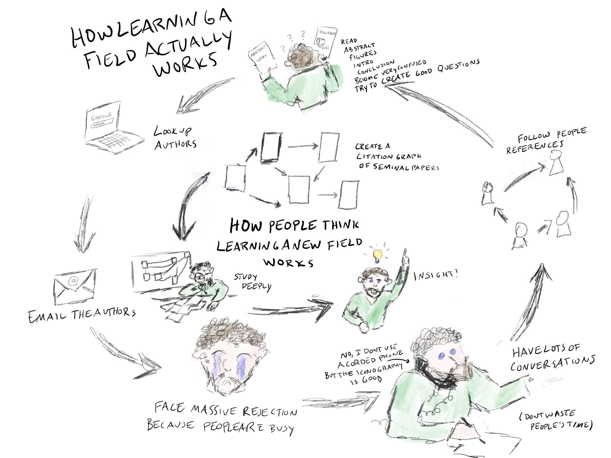

> **摘要**: 诺贝尔奖得主P.B.梅达沃提到，科学家应研究“重要问题”。但重要问题的定义不容易获得，往往通过经验和人与人之间的互动来学习。本文讨论隐性知识(Harry Collins与Robert Evans的定义)以及在科学、工程等领域对知识获取的影响。隐性知识是专家所拥有，但无法清晰表达的知识，尽管和专家对话可以获得部分显性知识。私有显性知识难以扩展由于其涉及利益问题而常保持隐秘；科学领域的知识一般都基于公共信息，但在具体实践中存在知识缺口。此外，通过大量示例与上下文的接触，以及高效的学习环境，可以加速学习过程。通过分析各类例子，本文建议利用专家表现的录像库来提升学习效率。最终，隐性知识的有效传递依赖于情境体验，并非单靠书本知识。
> 
>  **要点总结**:
>  1. 隐性知识是专家所拥有、但难以表达的知识，在科学和工程领域中，单凭学习显性知识不足以获得深入理解。
>  2. 私有显性知识难以扩展，常因知识的专业优势而保持隐藏，探索如何传递此类知识成为关键。
>  3. 学习领域的复杂性需要大量的实践和例子，简单阅读或被动学习不够。
>  4. 利用专家表演的录像库及其评论，结合实例学习，有助于提升专业技能。
>  5. 在特定领域，嵌入式学习和社交互动能够增加对领域内部信息的获取及知识体系的建立。

---

> Nobel Prize winner P.B. Medawar once wrote, in Advice to a Young Scientist, that 'any scientist of any age who wants to make important discoveries must study important problems.' But what makes a problem "important"? And how do you know it when you see it? **The answers don't come from reading them in a book, or even by explicitly being taught them. More often, they're conveyed by example, through the slow accretion of mumbled asides and grumbled curses, by smiles, frowns, and exclamations over years of a close working relationship between an established scientist and his or her protege**. ([Apprentice to Genius](https://www.amazon.com/Apprentice-Genius-Making-Scientific-Dynasty/dp/0801847575/ref=sr_1_1?crid=8INZEZHTIK12&keywords=apprentice+to+genius&qid=1636312702&sprefix=apprentice+to+genius%2Caps%2C142&sr=8-1))  
> 诺贝尔奖得主 P.B.梅达沃在《致年轻科学家》一书中曾写道：“任何年龄的科学家，如果想要做出重要发现，就必须研究重要问题。”但什么才是一个“重要”的问题？你如何知道它何时出现？答案并非来自书本阅读，甚至也不是通过明确的教学获得。更常见的是，它们通过例子传达，通过多年的密切合作中，一位资深科学家和他的门生之间的咕哝、抱怨、微笑、皱眉和惊呼逐渐积累而成。（天才的学徒）

Ben Reinhardt posted earlier in October the picture below. It shows two ways to "learn a field": one is the "right one" (talking to people, the outer loop) and another is depicted as a misconception, where one just reads key papers. Learning a field can take multiple meanings, it can be learning the content of the field, learning the social context of the field (what are the active areas of research, key labs, its history), or learning to do research in the relevant field.  
本·雷因哈特在十月初发布了下面的图片。它展示了“学习一个领域”的两种方式：一种是“正确的方式”（与人交流，外部循环）另一种则被描绘为一种误解，即只是阅读关键论文。学习一个领域可以有多个含义，可以是学习该领域的内容，学习该领域的社会背景（有哪些活跃的研究领域，关键实验室，其历史），或者学习在该相关领域进行研究。

As someone who's an example of being in that inner loop, I thought it'd be worthwhile to engage with this, but over time that ended up growing into a longer and somewhat meandering essay on the nature of tacit knowledge. If you are left wondering what do I really mean, worry not: the conclusion has an enumeration of points I want to make. This essay makes a heavy use of examples and analogies, everything you need is linked from this essay, so you should probably be clicking in all the links! If you want the TLDR now, here it is: Expertise requires acquiring a degree of private and tacit knowledge. Expertise cannot be taught using only explanations. Acquiring expertise can be accelerated by means of being exposed to a large library of examples with context. We are not leveraging this as much as we can and we should experiment more to explore how far this method can get us. What I describe in this post is a hypothesis that is looking to be tested and I offer indirect evidence for why it may work.  
作为一个身处那个内部循环的例子，我认为参与其中是有价值的，但时间久了，这最终演变成了一篇关于隐性知识本质的更长且有些漫无目的的论文。如果你还在想我究竟是什么意思，不用担心：结论部分列举了我想要阐述的观点。这篇文章大量使用了例子和类比，你需要的一切都可以从这篇文章中找到，所以你可能需要点击所有链接！如果你现在想要快速了解（TLDR），这里就是：专业知识需要获得一定程度的私有和隐性知识。专业知识不能仅通过解释来传授。通过接触大量带有背景的例子，可以加速获得专业知识。我们没有充分利用这一点，我们应该进行更多实验来探索这种方法能带我们走多远。我在这篇帖子中描述的是一个有待验证的假设，我提供了间接证据来解释为什么它可能有效。

Ben is not the only one with a person-first approach to learning: In the same Twitter thread, Alexey Guzey [joins](https://twitter.com/ArtirKel/status/1446187172873179139) Ben with a 90/10 split between talking to people and reading. This is not due to some limitation with the written vs verbal form. There are some people out there like Rob [Wiblin](https://medium.com/@robertwiblin/have-the-attention-span-of-a-goldfish-heres-how-to-read-long-things-761bcec9f2dc) that find it hard to read anything at all. Ben and Alexey's point is very different: Is there knowledge that can only be gained by talking to the experts? Is it faster to gain certain kinds of knowledge by talking to the experts?  
本不是唯一一个采用以人为本的学习方法的人：在同样的 Twitter 帖子中，Alexey Guzey 与 Ben 一起，以 90/10 的比例在与人交谈和阅读之间分配时间。这并非由于书面形式与口头形式的某些限制。有些人，比如 Rob Wiblin，发现阅读任何东西都很困难。Ben 和 Alexey 的观点非常不同：是否只有通过与专家交谈才能获得某些知识？通过与专家交谈是否可以更快地获得某些类型的知识？

Ben Reinhardt doing research  
本·雷因哈特进行研究

To be sure, I don't *only* read papers, nor does Ben exclusively talk to researchers (There's a "reading papers" Ben at the top of the picture). Reading papers and talking to people are clearly both useful.  
当然，我不仅阅读论文，本也不只是和研究人员交谈（图片顶部有个“阅读论文”的本）。阅读论文和与人交谈显然都是有益的。

Why would one talk to people instead of just reading? Reading has the advantage of input speed: I don't know anyone that can speak faster than I can read. Reading also has the advantage of being able to incorporate figures, links, tables, or citations. And even better: One can jump and skip ahead in text, have multiple documents open at once, go back and forth and traverse more knowledge than a single person can possibly have in their head, zoom deeply into the specifics of one given paper, find related and novel work. It's hard to do this within the time box of a video call or an in person meeting.  
为什么人们要与人交谈而不是仅仅阅读？阅读的优势在于输入速度：我不知道有谁能比我的阅读速度快。阅读还有优势在于能够融入图表、链接、表格或引用。更好的是：一个人可以在文本中跳跃和跳过，同时打开多个文档，来回穿梭，获取比一个人头脑中可能拥有的更多知识，深入到某一给定论文的具体细节中，找到相关和新的工作。这在视频通话或面对面会议的时间限制内很难做到。

However, the reading-first approach means that at first one will take a very long time to get to answer a question that would just take seconds to ask an expert. For example, if one just wants the answer to "Does rapamycin extend lifespan in mice?", getting to understand the relevant literature can take months. Sure one could do a quick Google Scholar (or plain Google) search and find a [bunch of papers](https://www.google.com/search?q=rapamycin+extend+lifespan+in+mice&oq=rapamycin+extend+lifespan+in+mice&aqs=chrome..69i57j33i22i29i30l2.3407j0j7&sourceid=chrome&ie=UTF-8), but that comes with some built in confidence level (How sure are you that the papers you found are good?). A quick call with an expert can just give you the answer, the rationale for the answer, debates around the answer (Does it work in some mice but not others? Will it work in humans?), considerations or assumptions that you had not initially considered (The idea of compounds analog to rapamycin (rapalogs), that the answer may differ by dosing schedule) and so forth. You can't interrogate a paper, but you can ask questions to an expert (As Ben put it, in conversation).  
然而，先阅读的方法意味着一开始回答一个只需几秒钟就能向专家询问的问题可能需要非常长的时间。例如，如果只是想知道“拉帕霉素是否能延长小鼠的寿命？”理解相关文献可能需要数月时间。当然，你可以快速进行谷歌学术（或普通谷歌）搜索，找到一堆论文，但这伴随着一些内置的信心水平（你有多确定你找到的论文是好的？）。与专家快速通话就可以直接得到答案，以及答案的理由、围绕答案的辩论（它在某些小鼠身上有效，但在其他小鼠身上无效吗？它会在人类身上有效吗？），以及你没有最初考虑到的考虑或假设（类似于拉帕霉素的化合物（拉帕洛斯），答案可能因剂量时间表而异），等等。你不能质问一篇论文，但你可以向专家提问（正如本在谈话中所说）。

This one-off interaction with the expert also comes with its own built in uncertainty: Was the expert chosen correctly? Do they have their own biases that should be factored in? What if multiple experts contradict each other? This interaction wouldn't lead you to learn a field, just to gain a small piece of knowledge about one molecule, rapamycin. For this one particular case, it seems to me the heuristic "Check on the internet for 10 minutes and find an answer, otherwise call the expert" would work, but it would work only if one has some prior background to quickly find and aggregate research work.  
这次与专家的一次性互动也伴随着其固有的不确定性：专家是否选得正确？他们是否有应该考虑在内的个人偏见？如果多位专家意见相左怎么办？这次互动不会让你了解一个领域，只会让你对一种分子——雷帕霉素——获得一点知识。对于这个特定案例，在我看来，这种启发式方法“在网上查 10 分钟，找不到答案就联系专家”可能适用，但前提是必须有一些先前的背景知识，以便快速找到和汇总研究工作。

Here's a more complex example: Suppose you want to learn how much salt you should be taking. The Google approach yields 2.3g per day (FDA guidelines). But then you are of course smarter than this and you keep digging; you deploy the heuristic of inverting common knowledge (more salt is worse, period) and try to find evidence that actually, too little salt can be bad. You [come](https://www.bbc.com/future/article/20181029-eating-less-salt-benefits) [across](https://academic.oup.com/ajh/article/27/9/1129/2730186) [some](https://www.scientificamerican.com/article/its-time-to-end-the-war-on-salt/) [work](https://www.health.harvard.edu/blog/in-defense-of-the-salt-shaker-2019110618175) on [that](https://en.wikipedia.org/wiki/Health_effects_of_salt), showing that there's a U-shaped relation and that perhaps the right amount of salt to consume is *more* than the guidelines say. You feel smug and smart. You talk to some doctors that vaguely gesture at the U/J-shaped relation between salt and mortality. But some time after, you learn of a piping hot meta-analysis fresh off the press, analyzed and endorsed by this one [Stephan](https://twitter.com/whsource/status/1463248014395396098) J. Guyenet on Twitter, reasserting accepted knowledge: less salt is better. This is the answer I would believe, but for this particular one, I started with an advantage because I have done the prior work of searching experts to trust in that one space (As it happens, my [other](https://nutritionfacts.org/video/sodium-skeptics-try-to-shake-up-the-salt-debate/) go-to expert for nutrition matters concurs with Guyenet). Whether here one ends up with the correct answer or not would depend on how good one is at interpreting primary sources and how good one is at finding good experts. But here we don't have to talk to the experts, for this one very simple question that asks a relation between two variables, we can rely on short analyses from the experts; this both points to primary sources and explains where the contradictions may be coming from. This is better in one regard than talking to the experts; they probably can't cite all these papers from memory, nor immediately address what the trouble is with the discordant paper you found that morning. Particularly illustrative was this podcast between Gary Taubes (Who subscribes to the "carbs are bad" view) and Guyenet (Who think carbs are fine in moderation). Guyenet came [prepared](https://www.stephanguyenet.com/references-for-my-debate-with-gary-taubes-on-the-joe-rogan-experience/) with a list of arguments and relevant work he could point to where he had pre-answered potential counterarguments to his views. Imagine now trying to talk to either of them vs reading their writings, or writing a best evidence synthesis of what they are saying. It seems obvious reading will yield the superior understanding, but not necessarily a better answer and definately it will take longer.  
这是一个更复杂的例子：假设你想知道你应该摄入多少盐。谷歌的方法是每天 2.3 克（FDA 指南）。但当然，你比这更聪明，你继续挖掘；你运用了反转常识的启发式方法（盐越多越不好，这是肯定的）并试图找到证据，实际上，盐过少也可能不好。你发现了这方面的研究，显示存在 U 形关系，也许推荐的盐摄入量应该比指南上说的要多。你感到自鸣得意，觉得自己很聪明。你和一些医生交谈，他们含糊地提到了盐和死亡率之间的 U/J 形关系。但过了一段时间后，你得知有一篇刚发表的热门荟萃分析，由 Twitter 上的 Stephan J. Guyenet 分析并背书，重申了公认的知识：少盐更好。我相信这是答案，但在这个特定的情况下，我有一个优势，因为我已经做了之前的工作，搜索了可以信赖的那个领域的专家（碰巧，我另一位营养问题上的首选专家与 Guyenet 意见一致）。 无论是否得到正确答案，这取决于一个人解读原始资料的能力以及寻找优秀专家的能力。但在这里，我们不必与专家交谈，对于这个询问两个变量之间关系的问题，我们可以依赖专家的简短分析；这既指向了原始资料，也解释了矛盾可能来自何处。在这方面，这比与专家交谈更好；他们可能无法凭记忆引用所有这些论文，也无法立即指出你那天早上找到的矛盾论文的问题所在。特别具有说明性的是 Gary Taubes（持有“碳水化合物不好”的观点）和 Guyenet（认为碳水化合物适量是可行的）之间的这个播客。Guyenet 准备了论据和可以指出的相关工作，他事先回答了对他观点可能的反驳。想象一下，现在尝试与其中任何一个人交谈，与阅读他们的著作，或者撰写他们所说内容的最佳证据综合，会有什么不同。 阅读似乎能带来更深入的理解，但不一定有更好的答案，而且肯定会更耗时。

But these two topics are still very simple and by no means get anywhere close to "learning a field", they are about very specific questions. If instead we want to know what are [open questions](https://www.google.com/search?q=open+questions+in+aging+research&oq=open+questions+in+aging+research&aqs=chrome..69i57j0i512l6j69i60.3374j0j9&sourceid=chrome&ie=UTF-8) in the field? Or, what would be projects that could [accelerate](https://www.google.com/search?q=how+to+accelerate+aging+research&oq=how+to+accelerate+aging+research&aqs=chrome..69i57j69i64.3538j0j4&sourceid=chrome&ie=UTF-8) the field, or something of that sort? Those links do not yield good answers. There is no trivial googling that will in general get you answers there so one can't use the shortcut of finding expert analyses. One truly has to get the field, and doing this *can* require acquiring forms of knowledge that are harder to find out there by reading papers.  
但是这两个话题仍然非常简单，绝对达不到“学习一个领域”的程度，它们只是关于非常具体的问题。如果我们想了解该领域中的开放性问题？或者，哪些项目可以加速该领域的发展，或者类似的问题？那些链接并不能提供好的答案。一般而言，简单的谷歌搜索并不能在那里找到答案，因此不能使用寻找专家分析这种捷径。真正需要的是了解该领域，而要做到这一点，可能需要获取那些通过阅读论文难以找到的知识形式。

## Tacit knowledge  隐性知识

What [tacit knowledge](https://commoncog.com/blog/the-tacit-knowledge-series/) means differs by whom you ask, but in general the definition refers to knowledge that is very hard to acquire (In the broadest definition) or knowledge that is embodied in a person (or group) and that they can't make fully explicit. Of importance here is that *talking to an expert wouldn't get you that knowledge*, in this second definition. An obvious example is riding a bike; one could read books about cycling or talk to Tour de France winners for months and not have much idea how to skillfully ride a bike on a first trial. Tacit knowledge may be hard or impossible to get from experts, but this is not that bad: one doesn't need this tacit knowledge for many purposes. If all you need is a precise answer to a question, asking a panel of experts (if they agree on the answer, at least) can yield a reasonably trustworthy answer even if we are not fully aware of the chains of reasoning and specific pieces of evidence the experts are relying on when delivering that judgement.  
隐性知识意味着什么因人而异，但一般来说，这个定义指的是很难获得的知识（在广义上）或者体现在一个人（或团体）中，他们无法完全明确表达的知识。在这里重要的是，与专家交谈不会让你获得这种知识，在第二种定义中。一个明显的例子是骑自行车；一个人可以阅读关于骑自行车的书籍或与环法自行车赛冠军交谈数月，但仍然不太清楚如何在第一次尝试时熟练地骑自行车。隐性知识可能很难或无法从专家那里获得，但这并不糟糕：在很多情况下，你不需要这种隐性知识。如果你只需要对一个问题有一个精确的答案，那么询问一个专家小组（如果他们至少在答案上达成一致）可以提供一个相当可靠的答案，即使我们并不完全了解专家在提供判断时所依赖的推理链条和具体证据。

Experts are worth talking to for reasons other than them having tacit knowledge: in the example earlier the expert may know the right answer to the rapamycin effectiveness question, but this piece of knowledge happens to be publicly available (a form of explicit public knowledge). Experts also possess *private* explicit knowledge which can be important and is what one mostly gets from one-off calls from experts. They could tell you that "That paper that seems promising from 30 years ago? Yeah, a friend was there and it's quite sketchy, anyone you talk to from that lab will confirm".  
专家值得与其交谈的原因不仅仅是因为他们拥有隐性知识：在之前的例子中，专家可能知道关于雷帕霉素有效性的正确答案，但这一知识恰好是公开可得的（一种显性公共知识）。专家还拥有私人的显性知识，这可能是重要的，而且通常是从与专家的一次性通话中获得。他们可能会告诉你：“那篇看起来有希望的 30 年前的论文？是的，有个朋友在那里，相当模糊，你从那个实验室接触到的任何人都会证实这一点。”

In an ideal world, one would learn this from reading about later attempts at, say, replicating or extending that line of work, but we don't always live in that world. This kind of knowledge is different from tacit knowledge in its purest form in that once we gain that knowledge, we could make it public and anyone could effortlessly learn it without having to talk to the expert again. Systems like [Pubpeer](https://pubpeer.com/) try to scale this sort of knowledge by providing a centralized repository for commentary (generally critiques) of scientific work.  
在一个理想的世界里，人们会通过阅读关于复制或扩展该领域工作的后续尝试来学习这一点，但并不总是生活在那样的世界里。这种知识在它的最纯粹形式上与隐性知识不同，因为一旦我们获得这种知识，我们就可以将其公之于众，任何人都可以轻松地学习它，而无需再次与专家交谈。像 Pubpeer 这样的系统试图通过提供一个集中存储库来扩展这种知识，该存储库用于对科学工作的评论（通常是批评）。

Here's a brief typology of the knowledge relevant for the purposes of this essay. The lenses that are driving these categories are two: First, can we scale the knowledge without having access to a tutor, and second, can an expert even teach you without them being present.  
这里简要介绍了本论文目的相关的知识类型。推动这些类别的视角有两个：首先，我们能否在没有导师的情况下扩展知识，其次，专家是否可以在他们不在场的情况下教你。

- Explicit knowledge   显式知识
- Public  公共
- Private  私人
- Tacit knowledge   隐性知识
- Public   公共
- Motor skills  运动技能
- Intellectual skills  智力技能
- Private   私人
- Social  社交
- Individual  个人

## Explicit knowledge  显式知识

### Public  公共

These are facts that are easy to come by and not particularly worth saying much about. "What's the capital of the United Kingdom" or "What's the market capitalization of Tesla as of today" can be quickly looked up on the internet.  
这些是容易找到的事实，不值得过多讨论。"英国的首都是哪里"或"截至今天，特斯拉的市值是多少"可以很快在互联网上查到。

A problem with public explicit knowledge is that there is a lot of it, and interesting chunks of it are not trivial to interpret. As in the example of the salt and mortality correlation earlier, there is no general oracle that will spit out facts that are guaranteed to be true. Interpreting available public knowledge, and knowing where to find it in the first place, in some situations requires nontrivial amounts of *other* kinds of knowledge, some of it tacit.  
公共显性知识的问题在于其数量庞大，其中有趣的部分并不容易解读。例如，在之前关于盐和死亡率相关性的例子中，并没有一个普遍的预言者能够吐出保证真实的事实。解读现有的公共知识，以及最初知道在哪里找到它，在某些情况下需要大量的其他类型知识，其中一些是隐性的。

### Private  私人

Some knowledge is not particularly hard to transmit if someone wanted to but they may not have incentives to do so, and so it remains private. For example, when designing a scientific experiment it may be useful to know the cost of various reagents, supplies, and equipment. Many of these prices are available online. But others are not, hidden behind a "talk to sales" button or an email to the right person. If one is in the relevant social circle, a quick message to a colleague can get you that information. This knowledge could be made public, but generally there are incentive problems why this is not the case. In the pricing example, vendors may make buyers sign NDAs to avoid leakage of the pricing information.  
一些知识如果有人愿意传播并不特别困难，但他们可能没有这样做的好处，因此它保持私密。例如，在设计科学实验时，了解各种试剂、供应品和设备的成本可能很有用。许多这些价格都可以在网上找到。但有些则不行，隐藏在“联系销售”按钮或发送给正确的人的电子邮件后面。如果一个人在相关的社交圈子里，给同事发条信息就能得到这些信息。这些知识本可以公开，但通常存在激励问题，导致这种情况并不常见。在定价的例子中，供应商可能要求买家签署保密协议（NDA），以避免价格信息的泄露。

## Tacit knowledge  隐性知识

Harry Collins and Robert Evans, in [their](https://press.uchicago.edu/ucp/books/book/chicago/R/bo5485769.html) *Rethinking Expertise* define tacit knowledge as t*he deep understanding one can only gain through social immersion in groups who possess it*. This is *one* possible definition, but to my purposes here, an overly narrow one. Tacit knowledge in the Collins-Evans sense will correspond to what I call here private individual tacit knowledge. Note that "groups" could be a single person (as in a master-apprentice relation).  
哈利·柯林斯和罗伯特·埃文斯在他们的《重新思考专业知识》中定义隐性知识为一个人只能通过融入拥有这种知识的群体中才能获得的深刻理解。这是可能的定义之一，但对我来说过于狭隘。在柯林斯-埃文斯的意义上，隐性知识将对应于我这里所说的私人个体隐性知识。请注意，“群体”可以是一个人（如师徒关系）。

### Public  公共

The first type of tacit knowledge is one I'll call public to mean that one could acquire the skills with publicly available information, without need of a coach, tutor, or apprenticeship.  
第一种隐性知识，我将其称为“公共隐性知识”，意味着一个人可以通过公开可获得的信息来掌握技能，无需教练、导师或学徒。

I divide this set of skills into two: motor and intellectual. In practice this distinction is not clear cut, but broadly for "motor" think riding a bike and for intellectual think activities that all look like sitting at a computer typing away. An example of a hybrid is instrument-playing; playing an instrument requires some very fine motor skills but also some sense of what good music sounds like. One can hire a teacher to learn how to play, but anecdotally many famous guitar [players](https://theconversation.com/the-secrets-of-self-taught-high-performing-musicians-34301) are self-taught.  
我将这套技能分为两类：运动和智力。在实践中，这种区分并不明显，但大体上，“运动”可以想象为骑自行车，“智力”则是指所有看起来像坐在电脑前打字的活动。一个混合的例子是演奏乐器；演奏乐器需要一些非常精细的运动技能，但也需要一些对好音乐听起来是什么样的感觉。一个人可以雇佣老师学习如何演奏，但据传说，许多著名的吉他手是自学成才的。

#### Motor skills  运动技能

There's a type of tacit knowledge where you need to do something (as opposed to reading about it or talking to an expert about it) to gain the skill. A bike theoretician that has spent a year reading about bike riding and videocalling with bike pros can't hope to ride a bike proficiently, if at all, on a first trial. At the same time, one can learn to ride a bike alone. If you watch this [video](https://www.youtube.com/watch?v=UOg1hHmGIQQ), you can see a sequence of steps that would orient you in the right direction. You still need to ride a bike and practice, but the video has enough guiding to learn the skill.  
存在一种隐性知识，你需要亲自去做某事（而不是阅读关于它或与专家讨论它）来获得技能。一个花了一年时间阅读自行车骑行和与自行车专家视频通话的自行车理论家，在第一次尝试中不可能熟练地骑自行车，甚至可能做不到。与此同时，一个人可以独自学会骑自行车。如果你观看这个视频，你可以看到一系列步骤，这些步骤会指引你走向正确的方向。你仍然需要骑自行车并练习，但视频提供了足够的指导来学习这项技能。

But this kind of knowledge (the one involving novel movements or fine motor coordination) is not the kind of knowledge relevant to most knowledge work, the focus of this essay.  
但是这种知识（涉及新颖动作或精细运动协调的知识）并不是与大多数知识工作相关的知识，也不是本文的重点。

#### Intellectual skills  智力技能

One example of this is judging the doneness of a particular item being cooked (could be a steak or a quiche). Someone that has cooked it a lot could tell when it is ready, but if asked to explain it, she could point to the appearence of some brownish patches, but not too many, or there being such and such smell. But despite not being able to verbalize this knowledge, we can still teach it to some degree, in this case, in video format. Watching someone cooking the item repeatedly can give a sense of what "done" means. This is a trivial example of how tacit knowledge can still be scaled, despite the expert not being able to verbalize it. It also points to a key factor in enabling scalable tacit knowledge: Whether there are external artifacts that we can observe. A video of someone meditating wouldn't teach much about how to meditate.  
一个例子是判断烹饪中特定食物的熟度（可能是牛排或千层面）。一个烹饪经验丰富的人能判断出何时食物已经熟透，但如果被要求解释，她可能会指向一些棕色斑点的出现，但不会太多，或者有某种特定的气味。尽管无法用言语表达这种知识，我们仍然可以在一定程度上传授它，在这种情况下，以视频的形式。观看某人反复烹饪这个食物可以让人对“熟透”有一个感觉。这是隐性知识仍然可以扩展的一个简单例子，尽管专家无法用言语表达。这也指向了实现可扩展隐性知识的关键因素：是否存在我们可以观察到的外部物品。一个关于某人冥想的视频不会教人如何冥想。

Skills that fit here would be chess (Where we have external artifacts, the chess board) or writing (Where the output can be read).  
技能适合这里的有棋类（我们这里有外部物品，比如棋盘）或写作（输出可以阅读）。

### Private  私人

This is the kind of knowledge that could only be acquired by means of an apprenticeship and/or being deeply embedded in a community of practice. It requires someone to transmit that knowledge. The fact that it is private need not be an intrinsic feature, as with explicit private knowledge. But supposing we could overcome these incentives issues and actually get to sit down with multiple experts, could we make private tacit knowledge into a form that is amenable to individual learning, and thus scaling? This is one of the core driving questions of this essay, but getting there will require some meandering through examples.  
这种知识只能通过学徒制和/或在实践社区中深入融入来获得。需要有人传授这种知识。它是私人的并不一定是一个内在特征，就像明确的私人知识一样。但如果我们能够克服这些激励问题，实际上与多位专家坐下来，我们能否将私人隐性知识转化为适合个人学习的形式，从而实现规模化？这是本文的核心驱动问题之一，但要达到这一点将需要通过一些例子进行迂回。

#### Individual  个人

This is the class of knowledge Collins and Evans have in mind in their definition earlier; for this it's not enough to apprentice, you need to be embedded in the relevant community. Individual private tacit knowledge is the one that you can gain as an apprentice. An example that comes to mind is learning how to design glass sculptures in the style of a particular niche artist that is not recorded in video.  
这是柯林斯和埃文斯在他们之前的定义中所指的知识类别；对于这一点，仅仅当学徒是不够的，你需要融入相关的社区。个人私有的隐性知识是你可以作为学徒获得的那种。一个例子是学习如何以特定细分艺术家的风格设计玻璃雕塑，而这种风格没有在视频中记录。

This is the knowledge that somehow would be embodied not in the nodes but in the [edges](https://twitter.com/krishnanrohit/status/1452954528806998019) of a network of knowledge workers. It's different from the other categories in that the knowledge is not in anyone's head (so no apprenticeship will get you there) but it's embodied in an entire organization. As an example, I will claim the CEO of [TSMC](https://en.wikipedia.org/wiki/TSMC) does not know how TSMC works. Nor does anyone know exactly the entire chain of processes that lead to the production of a humble [pencil](https://en.wikipedia.org/wiki/I,_Pencil). But somehow the economy as a whole does. As with motor skills, this class of knowledge is outside of the scope of this essay.  
这是某种知识，它并非体现在知识工作者网络的节点上，而是在网络的边缘得以体现。它与其它类别不同，因为这种知识并非存在于任何人的头脑中（因此没有学徒制能让你达到那里），而是体现在整个组织中。以一个例子来说，我会声称台积电的 CEO 并不了解台积电是如何运作的。也没有人确切地知道导致一支铅笔生产的整个流程。但不知何故，整个经济体系却做到了。就像运动技能一样，这类知识超出了本文的范围。

I want to close off this section with a brief discussion of an example that illustrates an example of social tacit knowledge, how hard it can be to reconstruct, and how we tend to see these sort of examples.  
我想以一个示例的简要讨论来结束这一部分，这个示例说明了社会隐性知识的例子，重建它的难度以及我们倾向于如何看待这类例子。

##### Fogbank  雾团

Suppose you hire an army of smart physics PhDs that have zero knowledge of how to build nuclear weapons, then ask them to design one. Could they do that? In a recent post from [Rohit Krishnan](https://www.strangeloopcanon.com/p/two-stories-about-tacit-knowledge) the answer from a real world experiment is *apparently yes* and to the extent one distrusts that one report, I think some trial and error of their own (they were not building the device, just designing it) would have set them in the right trajectory. But Rohit also notes there the case of [Fogbank](https://en.wikipedia.org/wiki/Fogbank), where trying to manufacture a material used in atomic weapon manufacturing that was last made decades prior, took many years and millions of dollars to recreate, despite having access to the original instructions for how to make it, and despite being able to talk to those that worked on the project originally. Turned out some impurity being added was key, and no one in the original team was aware of this! This is interestingly very similar to Collins ([2001](https://www.gwern.net/docs/philosophy/epistemology/2001-collins.pdf)), where US-based researchers tried to replicate Soviet measurements of a parameter of sapphire samples, unsuccessfully. Turned out that the key to take the measurements in a comparable way was to  
假设你雇佣了一支对如何制造核武器一无所知的聪明物理学博士，然后让他们设计一个。他们能做到吗？在 Rohit Krishnan 最近的一篇文章中，一个现实世界实验的答案显然是肯定的。尽管有人不相信这份报告，我认为他们自己的尝试（他们并没有制造设备，只是设计它）已经让他们走上了正确的轨道。但 Rohit 还提到了 Fogbank 的案例，试图制造用于原子武器制造的、几十年前最后一次生产的材料，尽管有如何制作的原始说明，并且能够与最初参与该项目的人交谈，但这个过程花费了多年和数百万美元。结果发现，添加的一些杂质是关键，而原始团队中没有人意识到这一点！这非常有趣地类似于 Collins（2001）的研究，当时美国的研究人员试图复制苏联对蓝宝石样品参数的测量，但未能成功。结果发现，以可比方式测量该参数的关键是

> The second method of greasing thread demonstrated by Checkhov, and used interchangeably with the first method, was direct greasing of the fine thread with human body grease. Checkhov would run the fine Chinese thread briefly across the bridge of his nose or behind his ear. The ear method was adopted by the Glasgow group, though it turned outthat only some people had the right kind of skin. Some, it transpired, had very effective and reliable grease, others’ grease worked only sporadically, and some experimenters’ skins were too dry to work at all. All this was discovered by trial and error, and made for unusual laboratory notebook entries such as: ‘Suspension 3: Fred-greased Russian thread; Suspension 12: switched from George-grease back to Fred-grease’, and so forth. As with James Joule’s famous measurement of the mechanical equivalent of heat,”! it seems that the experimenter’s body could be a crucial variable.  
> 第二种由契诃夫展示的润滑螺纹方法，与第一种方法可互换使用，是直接用人体油脂润滑细螺纹。契诃夫会将细的中国螺纹在鼻梁上或耳朵后面轻轻擦过。这种方法被格拉斯哥小组采用，但结果发现只有一些人拥有合适的皮肤。有些人发现他们的油脂非常有效且可靠，而有些人油脂的效果只是偶尔出现，还有一些实验者的皮肤太干燥，根本无法使用。所有这些都是在试错中发现的，并导致了实验室笔记中不寻常的记录，例如：“悬浮液 3：弗雷德润滑的俄罗斯螺纹；悬浮液 12：从乔治油脂切换回弗雷德油脂”，等等。正如詹姆斯·焦耳著名的测量热量机械当量一样，似乎实验者的身体可能是一个关键变量。

The Sapphire example is referenced elsewhere; Ben's [notes](https://notes.benjaminreinhardt.com/Tacit_Knowledge%2C_Trust%2C_and_the_Q_of_Sapphire?stackedNotes=How_much_does_the_reproducibility_crisis_have_to_do_with_low_trust_and_tacit_knowledge%3F) and most discussions of the paper focus on the central point of the paper: the need for personal interactions and trust to effectively convey tacit knowledge. But the conclusion of the paper is almost as important: Collins suggests a way forward! Instead of resigning ourselves to lenghty and costly trial and error we could do better:  
蓝宝石示例在其他地方被引用；本（Ben）的笔记以及大多数关于该论文的讨论都集中在论文的核心观点上：为了有效地传达隐性知识，需要个人互动和信任。但论文的结论同样重要：柯林斯（Collins）提出了一种前进的方法！我们不必满足于漫长且昂贵的试错过程，我们可以做得更好：

> Reporting a Second Order Measure of Skill: This kind of science could be made easier if the importance of knowing the difficulty of an experimental skill or procedure was recognized and emphasized. The conventional style of writing scientific journal papers (and even books) excludes details of this kind. **Yet someone trying to rediscover how to produce a result in the absence of a laboratory visit could be helped by knowing just how hard the experiment or measurement was to carry out in the first place**, and just how hard it continues to be. Such information could be roughly quantified — it is a ‘second order measure of skill’.\*° Experimenters could record something along theselines:  
> 报告技能的第二级度量：如果认识到并强调了解实验技能或程序难度的必要性，这种科学可能会变得更容易。传统的科学期刊论文（甚至书籍）的写作风格排除了这类细节。然而，试图在没有实验室访问的情况下重新发现如何产生结果的人，如果知道实验或测量最初有多难进行，以及它继续有多难，可能会得到帮助。这类信息可以大致量化——它是一个“技能的第二级度量”\*°。实验者可以记录如下内容：
> 
> *It took us some 17 months to accomplish this result in the first instance, during which time wetried around 165 runswith different set-ups, each run taking around a day to complete. Most successful measurements on new samples are now obtained in around 7 runs, butthere is a range of approximately 1 to 13 runs; each run now takes about 2 hours. The distribution of numbers of runs on the last 10 samples we have measured is shown in the following diagram ...  
> 我们首次完成这项成果花费了大约 17 个月的时间，期间我们尝试了大约 165 次不同的设置，每次运行大约需要一天时间来完成。现在，对新样品的成功测量通常在 7 次运行内完成，但运行次数的范围大约在 1 到 13 次之间；每次运行现在大约需要 2 小时。以下图表显示了我们在最后 10 个样品上测量的运行次数分布……*
> 
> Information of this sort could be expressed briefly, without radically changing the conventional style of scientific paper-writing, and yet could be of significant benefit to those trying to repeat the work.It is just a matter of admitting that most things that seem easy now were very hard to do first time round, and that some remain hard even for the experienced experimenter. We concede, of course, that within the current conventions of scientific writing, setting out these difficulties would look like weakness; science is conventionally described as though it were effortless, and the accepted scientific demeanour reinforces this impression. What we are suggesting is a slight transformation of convention and demeanour—with a view to improving the transmission of scientific knowledge.  
> 此类信息可以简要表达，而不会根本改变科学论文写作的传统风格，同时对于试图重复这项工作的人来说可能具有重大益处。这仅仅是一个承认，现在看似简单的事情最初都是非常困难的，而且即使对于经验丰富的实验者来说，有些仍然很困难。当然，我们承认，在当前科学写作的惯例中，提出这些困难看起来像是弱点；科学传统上被描述得似乎是无懈可击的，而公认的科学家态度强化了这种印象。我们建议的是对传统和态度进行轻微的转变——目的是为了改善科学知识的传播。

This is just one way to enhance scientific writing for ease of reproducibility, but one could think of others.  
这是提高科学写作可重复性的一个方法，但人们也可以想到其他方法。

The same is true of discussions of Fogbank: The core lesson is acknowledged (Tacit knowledge is real, and *hard* to transmit!) but such acknowledgement is so strong that *hard* is made to seem impossible, so no solutions to the problem of tacit knowledge transmission are proposed. We should not look at tacit knowledge in awe of its fractal richness, being humbled by its existence. Rather we should look at tacit knowledge as a challenge to be overcomed!  
同样适用于对雾库的讨论：核心教训得到了认可（隐性知识是真实的，难以传递！），但这种认可如此强烈，以至于“难以传递”被夸大成了“不可能”，因此没有提出关于隐性知识传递问题的解决方案。我们不应该对隐性知识的分形丰富性感到敬畏，被其存在所折服。相反，我们应该将隐性知识视为一个需要克服的挑战！

## Some examples  一些例子

## Tacit (and private) knowledge in the life sciences: the Rejuvenome  
默示（及私人）知识在生命科学领域：Rejuvenome

One can get a textbook on molecular biology and read it, yielding knowledge of various facts about molecular biology. Does then one become a molecular biologist? No, because the knowledge required to do that is of a different sort.  
一本分子生物学教科书，阅读后可以获得关于分子生物学的各种事实知识。那么，这样就成为分子生物学家了吗？不，因为成为分子生物学家所需的这种知识是另一种类型的。

This is clear with a brief example: Suppose somehow a copy of *[A single combination gene therapy treats multiple age-related diseases (2019)](https://www.pnas.org/content/116/47/23505)* lands in your desk. You read it. Assuming you remember what is literally written in the paper you will be able to answer questions like:  
这是通过一个简短的例子来说明的：假设某种方式下，一份关于单一组合基因治疗可治疗多种与年龄相关的疾病（2019）的副本落在了你的桌子上。你阅读了它。假设你能记住论文中实际写的内容，你将能够回答诸如以下问题：

- Who authored the paper?  
谁撰写了这篇论文？
- What genes were delivered? (FGF21, Klotho, sTGFbR2)  
交付了哪些基因？（FGF21，Klotho，sTGFbR2）
- How were they delivered? (AAVs, one with each gene)  
他们是如何递送的？（AAVs，每个基因一个）
- What was one test that showed effective treatment of a disease? (improved glucose response)  
什么是显示疾病有效治疗的测试？（改善的葡萄糖反应）

There is a second kind of questions that you could be able to answer if you have read many papers of this sort that you won't be able to answer if you only read this one paper:  
存在一种你若阅读了大量此类论文就能回答的问题，而仅阅读这一篇论文则无法回答的问题：

- What other ways are there of delivering these genes?  
有哪些方法可以传递这些基因呢？
- Are the tests they are using "good"? Do they support their claims?  
他们使用的测试“好”吗？他们支持他们的主张吗？

Now even if you understood perfectly well the context of this paper, and were able to discuss it passing for an actual expert in the field, if you wanted to repeat the experiment they did, by yourself, without any help, would you be able to? In exactly the same way the authors did? Probably not, and this becomes more clear the more you try to design the actual study. For example, you need to feed the mice something, but the study doesn't say what the control group gets other than it's a "normal diet", so you need to assume one. This is also a case where you could ask the authors (The answer: Normal diet means something like [NIH-31](https://www.jax.org/news-and-insights/jax-blog/2020/january/mouse-diet-guide)). Then, would you be able to inject the viruses in the way described in the paper (retroorbital injection) without prior training? And what anesthesia would you use (the paper doesn't say; is isoflurane good?). For qPCR, what temperatures and timings would you use (the paper doesn't say).  
即使你完美理解这篇论文的背景，并且能够像该领域的真正专家一样讨论它，如果你想要独立重复他们所做的实验，没有任何帮助，你能够做到吗？以完全相同的方式，作者们做到了吗？可能不行，而且随着你尝试设计实际研究，这一点会变得更加清晰。例如，你需要给老鼠喂食某种东西，但研究并没有说明对照组得到的是什么，除了它是一个“正常饮食”，所以你需要假设一个。这也是你可以询问作者的情况（答案：正常饮食可能类似于 NIH-31）。那么，你能够在没有事先培训的情况下，按照论文中描述的方式（眶上注射）注射病毒吗？你会使用什么麻醉剂（论文中没有说明；异氟烷好吗？）。对于 qPCR，你会使用什么温度和时间（论文中没有说明）。

There is something you wouldn't get in any way other than asking the authors: Why is the study the way it is? Why those three genes? And why did they test the things they test?<a href="https://nintil.com/#sidenote-1">1</a>  
有些事情，除了询问作者，你无法以任何方式获得：这项研究为什么是这样的？为什么是这三个基因？以及他们为什么要测试他们测试的那些东西？

\[1\]. In case you wondered, I did ask, and there is no principled answer, just some background knowledge, cited in the paper, that overexpressing those genes led to some health benefits in the past, and the evidence for those was seemingly stronger than for other of the thousands of other genes, but there was no model that singled out those three as optimal. However, knowing the -exact- way that the authors went from knowledge of the literature to those exact three genes is a form of tacit knowledge, they wouldn't be able to tell me if they tried  
\[1\]. 顺便问一下，我确实问过，但没有原则性的答案，只是论文中引用的一些背景知识，即过去这些基因过度表达带来了一些健康益处，这些证据似乎比其他数千个基因的证据更强，但没有一个模型将这三个基因单独选为最佳。然而，了解作者从文献知识到这三个特定基因的确切方式是一种隐性知识，他们不会告诉我是否尝试过。

There is a hierarchy of knowledge at work here:  
这里存在着一种知识层次结构：

1. Learning core facts (What's on the abstract and conclusion)  
了解核心事实（摘要和结论）
2. Learning how facts relate to each other (e.g. what subfields are in a field, what alternatives are there to a particular choice, where does this piece of work fit in the field)  
学习如何事实相互关联（例如，一个领域中的子领域有哪些，针对某个特定选择有哪些替代方案，这项工作在这个领域中处于什么位置）
3. Learning how the knowledge was generated in the first place, all the way down to specific pieces of equipment (The methods section and beyond)  
学习知识最初是如何产生的，一直追溯到具体的设备（方法部分以及更远）
4. Learning to design novel experiments  
学习设计新颖的实验

The last one is the hardest one to make fully explicit because by then you're dealing with the frontiers of knowledge where the "facts" to rely on are not so much published results and more like hearsay from someone that tried this or that in their lab, and some .csv files you are sent from data pre-publication along words of caution not to further share it.  
最后一个是最难完全明确的，因为那时你正在处理知识的边界，那时可以依赖的“事实”更多的是来自尝试过这个或那个的人的传闻，以及一些在数据预发布时发送给你的.csv 文件，还有附带的一些警告，不要进一步分享。

Here's a concrete example of 4: When designing the [Rejuvenome](https://astera.org/rejuvenome/) project (That ultimately ended up being hosted at the Astera Institute), one of the design considerations was to have genetically heterogeneous mice. Usually lab mice are *inbred*, they are crossed sibling-to-sibling for generations until the resulting population is isogenic. Why do this? The textbook rationale is that if the genetic background is the same then that can reduce the variance of the experiment, leaving only experimental conditions, which can be controlled as well. However, this can also lead to a given therapy working only in one particular kind of mouse, but not others, making the results less robust. Maybe the mouse tends to develop a particular kind of cancer very fast and therapies that target that will show outsized increases in lifespan that will not generalize. This kind of reasoning is why the gold standard for intervention effectiveness in the aging field, the [Interventions Testing Program](https://www.nia.nih.gov/research/dab/interventions-testing-program-itp) uses genetically heterogeneous mice known as UM-HET3. These mice have drawbacks: You have to (at the time) breed them yourself, then wait 18 months to age them. Based on this reasoning and the fact that they were good enough for the ITP, those were the mice that went into the original Rejuvenome draft. At that stage, I had no idea of how they would be housed (Answer: ~5 a cage) or what they would be fed (Answer: [this](https://www.envigo.com/rodent-natural-ingredient-2018-diets)), but I knew the ITP was running a similar program so those answers must exist somewhere. These particulars therefore, were left as "mere" implementation details that would be elucidated later, but which didn't affect the high level design of the study.  
这是一个具体的例子：在设计 Rejuvenome 项目（最终在 Astera 研究所托管）时，其中一个设计考虑因素是拥有基因异质的小鼠。通常实验室小鼠是近交的，它们经过多代兄妹交配，直到产生的种群是同源的。为什么要这样做呢？教科书上的理由是，如果遗传背景相同，那么可以减少实验的变异性，只留下实验条件，这些条件也可以得到控制。然而，这也可能导致某种疗法只对一种特定的小鼠有效，而对其他小鼠无效，使结果不那么稳健。也许小鼠倾向于迅速发展某种类型的癌症，而针对这种癌症的疗法将显示出寿命显著增加，但不会普遍适用。这种推理是为什么在衰老领域的干预效果金标准——干预测试计划使用被称为 UM-HET3 的基因异质小鼠。这些小鼠有缺点：当时你必须自己繁殖它们，然后等待 18 个月来老化它们。 基于这个推理以及它们足够好以至于被纳入 ITP 的事实，这些就是进入原始 Rejuvenome 草案的小鼠。在那个阶段，我并不知道它们会被如何饲养（答案：每笼约 5 只）或者会被喂食什么（答案：这个），但我知道 ITP 正在运行一个类似的计划，所以这些答案肯定存在于某个地方。因此，这些细节被留作“仅仅”的实施细节，稍后将会阐明，但它们不影响研究的高级设计。

After that initial stage however, we learned some new things that were not obvious from just reading papers, this time from talking to researchers in the field:  
在那最初的阶段之后，然而，我们从与该领域研究人员交谈中学到了一些仅从阅读论文中不明显的新事物：

- That some, believe the "isogenic=less variable" argument is actually false, on the grounds that isogenicity makes the mice weaker and couples them more to the environment (if an effect=genes+environment+interaction, this latter term would go up), amplifying that noise. This view is not universally shared.  
有些人认为“同源=更少变化”的论点是错误的，理由是同源性使小鼠变得更弱，并将它们与环境联系得更紧密（如果效应=基因+环境+相互作用，那么后者的值会上升），放大了这种噪声。这种观点并非普遍认同。
- That there are other kinds of outbred mice, like the [Diversity Outbred](https://www.jax.org/strain/009376) (DO). That naturally leads to the question of whether to use *those*  
那存在其他类型的非纯种小鼠，例如多样性非纯种（DO）。这自然引出了一个问题：是否要使用那些
- Some time after that, we learned that DO male mice are very jumpy and aggressive. Given that we knew that for females you could have 5 in a cage, what happens if the males have to be single housed? Should we just do the more peaceful HET3s?  
在那之后不久，我们了解到 DO 雄性小鼠非常活跃且好斗。鉴于我们知道雌性小鼠可以笼养 5 只，那么如果雄性小鼠必须单笼饲养会怎样？我们是否应该选择更平和的 HET3s？
- Some researchers opted instead for studying *only* female mice. The papers using these all-female DO cohorts wouldn't explain *why it was only females*. In retrospective that was because of an undisclosed fact (That the authors told us, but did not write down: That they thought the male DOs would be too aggressive)  
一些研究人员选择只研究雌性小鼠。使用这些全雌性 DO 队列的论文没有解释为什么只选择雌性。回顾起来，那是因为一个未公开的事实（作者告诉我们，但没有写下来：他们认为雄性 DO 会过于好斗）。
- We had lifespan data for the HET3s that's publicly available but not so for the DOs. We only got that by asking around and we were sent a .csv file with data from an upcoming study. Lifespan data is important to do some statistical calculations regarding sample size and power.  
我们拥有 HET3s 的寿命数据，这些数据是公开可用的，但 DOs 的数据则不是。我们是通过询问才得到的，并且收到了一份包含即将进行的研究数据的.csv 文件。寿命数据对于进行有关样本量和功效的统计计算非常重要。
- We wanted to do all sorts of "omics" on the blood. But how much blood does each of these methods require? How much blood is in a mouse anyway? (1.7-2.4mL) How often can one get this blood? (Once a month) This is not so much tacit knowledge, all this information is publicly available and there are guides and even videos of how one would go about doing it. But initially these seemingly minor details were not in our mind which meant that very concrete questions like how many mice get sampled how often, or whether the same mice would be sampled throughout the study or even whether samples would be pooled were not considered. And some of these affect the study design!  
我们想对血液进行各种“组学”分析。但是每种方法需要多少血液呢？一只老鼠体内有多少血液？（1.7-2.4 毫升）多久可以采集一次这种血液？（每月一次）这并不是什么隐秘的知识，所有这些信息都是公开可得的，甚至有指南和视频介绍如何进行操作。但最初，我们并没有考虑到这些看似微不足道的细节，这意味着像有多少只老鼠被采样、多久采样一次，或者是否在整个研究过程中对同一只老鼠进行采样，甚至是否将样本混合等问题都没有被考虑。而且这些问题中的一些会影响研究设计！
- Altos! [Altos Labs](https://www.technologyreview.com/2021/09/04/1034364/altos-labs-silicon-valleys-jeff-bezos-milner-bet-living-forever/) was one of the big reveals of the year in the field. But in the field people had been talking about it for months prior, in various online seminars and Q&As one could hear references to a new "Milky Way Foundation" launched by "some" billionaire. PIs here and there would mention that they had gotten a grant from them. This kind of knowledge is not so much about the domain the field studies (aging) but about the field itself and definitely impossible to acquire just by reading papers. Probably also impossible to acquire by trying to talk to researchers unless you were deep enough in the field for the other party to assume that you are already in the know.  
Altos！Altos Labs 是今年该领域的一大亮点。但在该领域，人们已经谈论它几个月了，在各种在线研讨会和问答环节中，人们可以听到关于由“一些”亿万富翁发起的名为“银河基金会”的新组织的提及。这里的 PI 们会提到他们已经从他们那里获得了资助。这种知识与其说是关于该领域研究的领域（衰老）不如说是关于该领域本身，并且肯定不可能仅仅通过阅读论文就能获得。也许除非你足够深入该领域，以至于对方会认为你已经了解情况，否则试图与研究人员交谈也无法获得这种知识。
- A certain promising study in a subfield of aging that showed substantial lifespan gains was not fully accepted as generalizable because it used progeroid ("fast-aging") mice, so there was the possibility that the intervention wouldn't work in regular mice. Many in the field when asked wished to know what would happen if it were repeated in regular mice. I had coffee with a scientist in the field who mentioned to me (While discussing unrelated matters) that the study had been done (along with the results) and that would be released eventually. This knowledge would make one be slightly less bullish on said intervention, which has implications for study design: We had planned to actually do that study ourselves as part of Rejuvenome, but now we can use that prior art to decide whether to improve upon it.  
一项在衰老子领域内进行的、显示出显著寿命增益的具有潜力的研究并未被完全接受为具有普遍性，因为它使用了早老素（“快速老化”）小鼠，因此存在干预措施可能不会在普通小鼠中起作用的可能。当被问及时，该领域的许多人希望知道如果它在普通小鼠中重复进行会发生什么。我与该领域的科学家喝咖啡时，他（在讨论无关事宜时）提到这项研究（包括结果）已经完成，并最终会发布。这一知识会使人们对该干预措施稍微不那么乐观，这对研究设计有影响：我们原本计划在 Rejuvenome 项目中亲自进行这项研究，但现在我们可以利用这项先前技术来决定是否改进它。

Most of these pieces of knowledge are actually explicit private knowledge, not tacit knowledge, but in practice the borders between both are blurry. Yes, in theory the answers to all the questions one wants to ask about study design are in someone's head and they could tell you if you asked. *But you don't know what questions to ask*. Knowing what the right questions to ask is a form of tacit knowlege. A novice in study design (i.e. me, at first), when hearing "We're going to do X,Y,Z things with blood" would probably just nod. An expert would probably ask how much blood each assay requires perhaps because X,Y,Z sound like too much. It's not like the expert had to think about that objection, it's that the relevant questions to ask become more salient with expertise.  
大多数这些知识实际上是显性私人知识，而非隐性知识，但在实践中，两者之间的界限模糊。是的，从理论上讲，关于研究设计的所有问题的答案都在某人的脑海中，如果提问，他们可以告诉你。但你不知道该问什么问题。知道该问什么问题是隐性知识的一种形式。研究设计的新手（即最初的我），当听到“我们将用血液做 X、Y、Z 件事”时，可能会只是点头。专家可能会问每个检测需要多少血液，也许是因为 X、Y、Z 听起来太多。并不是专家必须考虑那个反对意见，而是随着专业知识，需要问的相关问题变得更加明显。

Going back to what I said earlier about the Diversity Outbred being aggressive, you can get from [here](https://www.jax.org/strain/009376) that they can be jumpy and the males can be very aggressive. The jumpiness point can be learned from other public [sources](https://link.springer.com/article/10.1007/s00335-012-9410-6). That males are aggressive and necessitate single housing (Usually you can have say 5 mice in one cage) was something that as a matter of fact *could have been learned* from [public](https://www.sciencedirect.com/science/article/pii/S0168952519300654) sources but it wasn't, it took someone to tell us that this specific issue was relevant.  
回到我之前提到的 Diversity Outbred 的攻击性，你可以从这里了解到它们可能会很紧张，雄性可能会非常具有攻击性。紧张感这一点可以从其他公共来源中学习。雄性具有攻击性并且需要单独饲养（通常你可以在一个笼子里放 5 只老鼠）这一点实际上可以从公共来源中了解到，但并没有，直到有人告诉我们这个问题是相关的。

However! Even after these and many other findings, the latest iteration of Rejuvenome still looks very similar to the original vision and overall the tacit knowledge I've gained has played more of a finetuning role rather than informing the core vision of the study.  
然而！即使在这些以及其他许多发现之后，Rejuvenome 的最新版本仍然与原始愿景非常相似，总体而言，我所获得的不言而喻的知识在研究中更多地起到了微调的作用，而不是提供核心愿景。

## Tacit knowledge in meetings  
会议中的隐性知识

Meetings are universally hated and rarely [loved](https://twitter.com/ArtirKel/status/1463044040694198272). Running effective meetings is a form of tacit knowledge. There are for sure principles that can be distilled but I don't think just stating them would be very useful. For example, consider someone that suggests *having an agenda* for a meeting. If one just gets that suggestion one may be tempted to think *why do that, we can just wing it as we go*. One can add *have an agenda, because otherwise you won't cover the topics you want, you'll drift and reprioritizing during the meeting is harder*. But even then one could think *I'm smarter than that, can still do it*. Situations like this one abound in other domains on life. Does one need to fail to really understand why some norms and frameworks exist?  
会议普遍不受欢迎，很少受到喜爱。有效召开会议是一种隐性知识。当然有一些原则可以被提炼出来，但我认为仅仅陈述这些原则并不会非常有用。例如，考虑有人建议会议要有议程。如果只是得到这个建议，可能会让人想问为什么这么做，我们不是可以边走边看吗。可以增加“要有议程”，因为否则你不会涵盖你想要的话题，你会偏离主题，在会议中重新排序会更难。但即便如此，有人可能会想，我比那聪明，我还是可以做到。生活中其他领域也有类似的情况。是否需要失败才能真正理解为什么某些规范和框架存在？

Conversely, when one accepts as obvious the idea that *if a meeting is going in circles one should do something to stop that*, knowing that in the abstract doesn't mean one will do it. At least in my own experience, I've been in meetings where the loopiness was only seen after the fact. In later meetings loopiness can be picked up by a sense of distress ("Something is off with this meeting"), a sense of impatience ("I've heard this before") and a sense of doubt ("Are we repeating ourselves?... or maybe they are just clarifying what they said"). Eventually when one should or should not voice that the group is running in circles (vs clarifying and weighing various options, incrementally adding) becomes clearer and clearer. Eventually one ends up thinking of ways to avoid getting there, studying why those frustrating conversations happen in the first place, leading up to say what I describe [here](https://nintil.com/programming#meetings). There's nothing new I can add to how to run effective meetings (Though I could write a post on that summarizing what I know). But when thinking about them I've ended up thinking that when giving advice it's important in many cases to explain where the advice is coming from, and at the receiving end being humble enough to override your rational judgement ("I know better; I don't see why I am wrong") and follow a principle instead ("Experts tend to be right in this context")<a href="https://nintil.com/#sidenote-2">2</a> .  
相反，当一个人认为如果会议陷入僵局，就应该采取措施阻止，而知道这一点并不意味着他真的会这么做时，情况就不同了。至少在我自己的经历中，我参加过一些会议，只有在事后才意识到会议的混乱。在后来的会议中，可以通过一种不安的感觉（“这个会议有点不对劲”）、一种不耐烦的感觉（“我以前听过”）和一种怀疑的感觉（“我们是不是在重复自己？……或者他们可能只是在澄清他们说过的话”）来察觉到混乱。最终，当一个人应该或不应该指出小组是否在原地打转（与澄清和权衡各种选项、逐步增加相比）变得越来越清晰时。最终，人们会开始思考如何避免陷入这种境地，研究为什么那些令人沮丧的对话最初会发生，直到说出我这里所描述的内容。我无法在这方面添加任何新的东西关于如何有效地召开会议（尽管我可以写一篇总结我所知的内容的文章）。 但是，当我思考这些时，我意识到在很多情况下，在提供建议时解释建议的来源是很重要的，并且在接收方要谦虚到足以超越你的理性判断（“我知道更好；我不明白为什么我是错的”）而遵循一个原则（“在这个背景下，专家往往是对的”） <a href="https://nintil.com/#sidenote-2">2</a> 。

\[2\]. If this sounds strange, consider an optical illusion. You have reason to believe that two sticks are of different length because that's what your eyes are telling you. But you can also pattern-match this situation to situations where you have been before (being shown an optical illusion) and say and act as if the sticks were the same length, despite some form of belief in 'they are different'. Even when asked whether they are the same length and you say that they are, there's a discomfort in the answer, something within says 'But they are not!'. That same something must be suppressed in the case of taking advice from experts in some cases. Knowing when is an art.'  
\[2\]. 如果这听起来很奇怪，考虑一下视觉错觉。你有理由相信两根棍子长度不同，因为那是你的眼睛告诉你的。但你也可以将这种情况与之前经历过的情况（被展示视觉错觉）进行模式匹配，并说和表现得好像棍子的长度相同，尽管有些“它们是不同的”信念。即使当被问及它们是否长度相同而你说是的时候，答案中会有一种不适感，内心深处会说“但它们不是！”。在某些情况下，对专家的建议也是如此。知道何时是艺术。

## Tacit knowledge in reference checks  
隐性知识在参考调查中

Ok I cheated there is a third one, but this one is brief. Investor Graham Duncan (profiled [here](https://commoncog.com/blog/graham-duncan-on-evaluating-expertise/)) has an article, *[What's going on here, with this human](https://grahamduncan.blog/whats-going-on-here/)* on hiring, with a strong empasis on obtaining references. At the bottom of the essay, Graham gives us a guide to do references, questions to ask, and a guide to do interviews. That's the explicit knowledge that the author tries to use to capture what is going on in his head. Reading the essay (And Commoncog's profile) changed my mind on the idea of obtaining references. Whereas before I would think that "Why get references, they are going to be biased" now I think that "There is going to be some truth mixed with the potential bias, but if one asks the right questions one can get to some of that truth. By asking multiple people the right questions, one can triangulate how the person really is.". But I still do not know how to do Duncan-level reference checks!  
好的，我作弊了，还有一个，但这个比较简短。投资者格雷厄姆·邓肯（在此处介绍）有一篇文章，《这里发生了什么，关于这个人的招聘，强调获取推荐信》。在文章底部，格雷厄姆给我们提供了一个如何做推荐信的指南，包括要问的问题，以及如何进行面试的指南。这就是作者试图用来捕捉他头脑中想法的显性知识。阅读这篇文章（以及 Commoncog 的简介）改变了我对获取推荐信的看法。以前我会想，“为什么要获取推荐信，它们会有偏见”，现在我认为，“可能会有一些真相和潜在的偏见混合在一起，但如果问对问题，就可以接触到一些真相。通过问多个人正确的问题，可以三角定位这个人的真实情况。”。但我仍然不知道如何进行邓肯级别的推荐信检查！

## Tacit knowledge in scientific literatures broadly  
隐含知识在科学文献中广泛

There is more knowledge in science than is written down in the whole of published papers in a given field. But at the same time, there is more knowledge embodied in a set of papers than is written down in the papers. If you read [this](https://twitter.com/michael_nielsen/status/1468760234298527746) tweet maybe you can relate to that phenomenon, you can read a paper and get what it means while acknowledging (from past experience) that such understanding is very thin. Last year I wrote a post on [understanding](https://nintil.com/framework-biology/) biology where I try to explain the process that takes you from that to a richer understanding. If you read enough papers you end up noticing things that the papers are not saying; this can be how often certain entities are mentioned, which labs tend to publish what kind of work, what methods are more frequent, whether a given paper is being thorough or not (by comparison to others), or even whether a given result is a priori trustworthy (e.g. is this an area where contradictory results abound or no matter how you measure you get the same thing). Reading research literatures is like an example I'll discuss below (language learning). One is constructing a model of the domain by using the papers as pieces of data. The task is not to memorize the specific papers (after all they can be wrong) but to build a model from which the papers become predictable. A trivial example is if a paper claims an association between A and B and another between B and C, nowhere in the literature says that A could lead to C, but if one is aware of A->B and B->C one could infer A->C and then try to look for evidence of that relation.  
科学中的知识比任何特定领域的已发表论文所记载的知识都要多。但与此同时，一套论文中所体现的知识比记载在论文中的知识还要多。如果你阅读这条推文，也许你能体会到这种现象：你阅读一篇论文可以理解其含义，同时（根据以往的经验）承认这种理解非常浅薄。去年我写了一篇关于理解生物学的帖子，其中我试图解释从浅薄理解到更深入理解的过程。如果你阅读足够多的论文，你最终会注意到论文没有说的事情；这可能包括某些实体被提及的频率，哪些实验室倾向于发表什么类型的工作，哪些方法更常见，给定论文是否详尽（与其他论文比较），甚至给定结果是否先验可信（例如，这是一个存在矛盾结果很多或无论你如何测量都会得到相同结果的研究领域）。阅读研究文献就像下面我将讨论的例子（语言学习）。一个人通过使用论文作为数据点来构建该领域的模型。 任务不是去记忆具体的论文（毕竟它们可能出错），而是建立一个模型，使得论文变得可预测。一个简单的例子是，如果一篇论文声称 A 与 B 之间存在关联，另一篇论文声称 B 与 C 之间存在关联，文献中没有任何地方说 A 可能导致 C，但如果一个人知道 A->B 和 B->C，那么他可以推断出 A->C，然后尝试寻找这种关系的证据。

## Sharing tacit knowledge  分享隐性知识

Tacit knowledge cannot be taught verbally, or written down. It can be distilled in various ways, and hinted at, but that's it. This doesn't mean we are doomed to lose that knowledge once the expert dies: tacit knowledge still can be acquired. The issue is that not everything that can be taught can be *explained*. The expert can [introspect](https://commoncog.com/blog/the-mental-model-fallacy/) and derive some rules and principles that try to capture the depth of their knowledge, but that is not the knowledge itself. This is why one can read [books](https://www.amazon.com/High-Output-Management-Andrew-Grove/dp/0679762884) by people that clearly knew what they were doing and yet not be able to get anywhere near the performance of said experts.  
隐性知识无法通过口头或书面传授。它可以以各种方式提炼和暗示，但仅此而已。这并不意味着一旦专家去世，我们就注定会失去这种知识：隐性知识仍然可以习得。问题在于，并非所有可以传授的知识都可以解释。专家可以内省并推导出一些规则和原则，试图捕捉他们知识的深度，但这并不是知识本身。这就是为什么人们可以阅读那些显然知道自己在做什么的人写的书，却仍然无法接近这些专家的表现。

But surely there is somewhere in the middle between asking experts to write down what they know (and fail at it) and apprenticing with the expert. What would it take to accelerate learning of a domain, and facilitate diffusion of the knowledge embedded in it? I think that the answer is being exposed to a library of expert performances (or examples) in context. Rather than asking the expert to write down how to do great job interviews, watch a few dozen hours of the expert doing interviews. The expert wouldn't be explaining how to interview, he would be doing the actual task. This seems a close proxy for the apprenticeship version of this, sitting next to the expert. The video probably captures most of what is relevant. Software engineering could be taught to proficiency similarly. The same is true, I reckon, for scientific skills (study design, literature evaluation, problem finding) if one added some running commentary.  
但肯定存在一个中间地带，介于让专家写下他们所知（并失败）和与专家学徒之间。要加速一个领域的知识学习，并促进其中嵌入的知识传播，需要什么？我认为答案是暴露于一个专家表现（或例子）的图书馆中。与其让专家写下如何进行出色的面试，不如观看几十个小时的专家进行面试。专家不会解释如何面试，他会实际完成任务。这似乎是学徒版本的近似，坐在专家旁边。视频可能捕捉到了大部分相关内容。软件工程可以以类似的方式教授到熟练程度。我认为，对于科学技能（研究设计、文献评估、问题发现）也是如此，如果再加上一些实时评论的话。

This approach to learning is not new, despite it seeming unusual: This is how language learning works!  
这种方法学习并不新鲜，尽管它看起来很奇特：这就是语言学习的原理！

## Language learning  语言学习

As various personal reports scattered through the internet show (e.g. [this](https://www.reddit.com/r/languagelearning/comments/2qmru2/how_many_of_you_have_successfully_learned_a/)), one can learn a language from a basement in complete social isolation from the community of speakers of said language, without ever talking to other human being in the target language. We also know that being thrown into a foreign country and forced to interact with such an environment can greatly accelerate language learning. Anecdotally, when I visited Japan some time ago I kept seeing "出口" near exits, so I started associating that to the concept of exit. I didn't try consciously to make that association, it effortlessly emerged from seeing it all the time.  
互联网上散布的各种个人报告显示（例如这个），一个人可以在完全与社会说该语言的人隔离的地下室里学习一门语言，而无需与任何其他说目标语言的人交谈。我们还知道，被抛入一个外国并被迫与这种环境互动可以极大地加速语言学习。据我所知，当我几年前访问日本时，我经常看到“出口”这个词在出口附近，所以我开始将这个词与出口的概念联系起来。我并没有有意识地尝试建立这种联系，它自然而然地从经常看到它中产生。

The interesting thing of language learning is how effortless it seems to be for children. The conjunction of [massive input](https://www.youtube.com/watch?v=NiTsduRreug) of examples with the right context leads initially to remember salient words first, then noticing overall patterns, inferring grammar, and ultimately speaking the language proficiently. Adults can learn languages in the same way in about a year by the same means: exposure to a large library of examples with the right context. In one case, 18 months was enough for [this one person](http://www.alljapaneseallthetime.com/blog/pure-pwnage-how-fluent-was-i-after-18-months/) to go from zero to [near-native proficiency](https://www.youtube.com/watch?v=3qWqIo1FR-8) in Japanese.  
语言学习的有趣之处在于，孩子们似乎毫不费力。通过大量示例与正确语境的结合，最初是记住显著词汇，然后注意到整体模式，推断语法，最终流利地使用该语言。成年人可以通过相同的方式，在大约一年内学习语言：接触大量带有正确语境的示例。在一种情况下，18 个月对于这个人来说足够了，他从零基础达到了接近母语者的日语水平。

I am not claiming we can learn everything using the same mental structures we use for language. Perhaps language is easier than other domains because we are [pre-wired](https://en.wikipedia.org/wiki/The_Language_Instinct) for language acquisition in a way we are not for other domains. I am saying that there is a domain where this (massive input of examples with context) obviously works and we should think about seeing if we can expand that to other domains.  
我并不声称我们可以使用相同的认知结构来学习一切。也许语言比其他领域更容易，因为我们天生就为语言习得做好了准备，而其他领域则不然。我的意思是，有一个领域，这种（大量带有上下文的例子）显然是有效的，我们应该考虑是否可以将这种做法扩展到其他领域。

## The fractal complexity of tacit knowledge: Polymerase Chain Reaction  
分形复杂性的隐性知识：聚合酶链式反应

Here's something that is at first conceptually simple but then happens to be quite complicated: for context read this essay from David Chapman on [PCR](https://metarationality.com/rational-pcr). There are many videos and resources online that I perused writing this section and the full complexity of what doing and understanding PCR actually entails is not obvious at first.  
这里有一些内容，一开始在概念上很简单，但后来却变得相当复杂：关于背景，请阅读大卫·查普曼关于 PCR 的这篇文章。在撰写这一部分时，我浏览了许多在线视频和资源，PCR 的实际操作和理解的全貌一开始并不明显。

Polymerase Chain Reaction is a technique in biology to do amplify fragments of a specific sequence of DNA. Could one learn how to do PCR just by reading about it? Maybe. Even if not impossible, we'd agree it would be hard, for the reasons explained in Chapman's essay. One could then supplement text with video: Watching someone actually perform PCR seems to be a substantially better way to learn how to do it. Even better: watching someone *fail* at it, and explain what went wrong, and how to fix things along the way. Even then, I wouldn't suspect one would get it right on Trial 1, but you could probably get better at it. With the videos and written materials, and clear examples of what success looks like, you could get there. I don't think this is easy, because to do PCR if one has never been in a lab entails a range of accessory knowledge and skills that have to be gained first.  
聚合酶链反应是生物学中用于扩增特定 DNA 序列片段的技术。仅通过阅读就能学会如何进行 PCR 吗？也许可以。即使不是不可能，我们也会同意这会很难，原因如 Chapman 的论文中所述。然后，人们可以通过视频补充文本：观看某人实际进行 PCR 似乎是一个学习如何操作的好方法。更好的是：观看某人失败，并解释出了什么问题，以及如何在这个过程中解决问题。即便如此，我也不会怀疑一个人在第一次尝试时就能做对，但你可能会在这方面变得更好。有了视频和书面材料，以及清晰的关于成功的例子，你就能达到这个水平。我认为这并不容易，因为如果一个人从未在实验室工作过，那么进行 PCR 需要获得一系列辅助知识和技能，这些都需要先掌握。

The video in Chapman's essay starts with "the first reagent we will use is buffer" and then he continues. To someone that has never done PCR, the nature of this buffer is unclear. The "real world" explanation is that this buffer is "10X PCR buffer" and this usually comes with Taq polymerase (The enzyme that copies the DNA) if one buys it from e.g. [ThermoFisher](https://www.thermofisher.com/order/catalog/product/18038018). In turn, that's buffer from ThermoFisher is mixture of HCl and KCl. And this is a buffer in the sense that it keeps pH [constant](https://en.wikipedia.org/wiki/Buffer_solution) when adding a small amount of a strong acid or base. In turn this is required because the polymerase used works best at a certain pH. Said polymerase also requires magnesium but ThermoFisher in this case includes it *separately* from the buffer, leaving it up to you to decide how much you want: too much and the results will be noisy, too little and there won't be enough amplification of the DNA. Why does Mg do this? One could indeed keep going deeper and deeper; moreover stabilizing pH is not the only reason why [KCl](https://www.thermofisher.com/us/en/home/life-science/cloning/cloning-learning-center/invitrogen-school-of-molecular-biology/pcr-education/pcr-reagents-enzymes/pcr-component-considerations.html) is there; nor that is the only kind of buffer that can be used. For a user of PCR, this doesn't matter: One only needs to know that there's a tube with buffer that comes with the polymerase one buys. It of course matters if one wants to improve PCR protocols. In [Lorenz (2012)](https://www.ncbi.nlm.nih.gov/labs/pmc/articles/PMC4846334/) for example a case is described (In Section 13) of trying to find the right concentration of magnesium chloride to amplify a particular gene. The concentration suggested by the manufacturer did not work, but current state of the art is to just try a number of concentrations. In practice, if one works at a particular lab, at first one doesn't know all of this, all you need to know is that there's a bottle with buffer and another with the polymerase. That complexity is abstracted away. Initially perhaps you have someone who knows how it's done giving you instructions and you walk through it, mistakes are made and corrections are issued until one has thoughtlessly performed the process. But then one may be able to do it on ones own, then do it for different DNA fragments and so on until one can claim to know how to do it.  
视频在 Chapman 的论文中从“我们将使用的第一种试剂是缓冲液”开始，然后继续。对于从未做过 PCR 的人来说，这种缓冲液的特性并不清楚。“现实世界”的解释是，这种缓冲液是“10X PCR 缓冲液”，通常在购买如 ThermoFisher 的产品时会附带 Taq 聚合酶（复制 DNA 的酶）。反过来，ThermoFisher 的这种缓冲液是 HCl 和 KCl 的混合物。这是一种缓冲液，因为它在添加少量强酸或强碱时能保持 pH 值恒定。反过来，这是必需的，因为所用的聚合酶在特定的 pH 值下工作效果最佳。这种聚合酶还需要镁，但 ThermoFisher 在这种情况下将其与缓冲液分开，让你自己决定需要多少：太多会导致结果嘈杂，太少则 DNA 扩增不足。为什么 Mg 会这样做？确实可以继续深入研究；此外，稳定 pH 值不是 KCl 存在的唯一原因；也不是唯一可以使用的缓冲液类型。 对于 PCR 用户来说，这并不重要：一个人只需要知道购买的聚合酶附带的缓冲液管。当然，如果一个人想要改进 PCR 方案，那就很重要了。例如，在 Lorenz（2012）中，描述了一个案例（在第 13 节），即尝试找到放大特定基因的正确氯化镁浓度。制造商建议的浓度不起作用，但当前的最佳做法是尝试多种浓度。在实践中，如果一个人在一个特定的实验室工作，一开始并不了解所有这些，你所需要知道的就是有一个装有缓冲液的瓶子，另一个装有聚合酶的瓶子。这种复杂性被抽象化了。最初可能有人知道如何操作并给你指导，你按照步骤进行，会犯错误并得到纠正，直到你无意识地完成这个过程。但然后你可能能够独立完成它，然后为不同的 DNA 片段做，等等，直到你声称自己知道如何操作。

Something of interest in that same section of the Lorenz paper is that the authors deliberately do PCR wrong to see what happens; if one thinks of learning a task as there being a core domain and some fuzzy edges, learning these borders of the task are important as well: the borders are where the task starts and ends (Where do you get the materials to do the task, what do you do once you are done?) but also where one can be forced out of the task: If you do one step wrong or if something doesn't go according to plan, what does one do? If all one has done is the textbook case then mistakes can lead to paralysis or starting from scratch instead of an appropriate fix and continuation of the task.  
该洛伦兹论文同一部分有趣的是，作者故意错误地进行 PCR 以观察会发生什么；如果将学习一项任务视为有一个核心领域和一些模糊的边缘，那么学习这些任务的边界同样重要：边界是任务开始和结束的地方（你从哪里获取完成任务所需的材料，任务完成后你做什么？）但也是一个人可能被迫离开任务的地方：如果你做错了一步或者事情没有按计划进行，你会怎么做？如果你所做的只是教科书上的案例，那么错误可能会导致瘫痪或从头开始，而不是进行适当的修复和继续任务。

PCR involves many subskills that are left implicit in the instructional material. The protocols involve [using](https://www.youtube.com/watch?v=aSeod1Y5MRc) [micropipettes](https://www.youtube.com/watch?v=Jfqafjt4q6U) to dose the right amounts of various reagents into a little PCR tube. Using one such pipette is a relatively simpler task, but one that must be learned as well (We could further decompose the task in changing the tips of the pipette, learning to read the volume counter in various types of pipettes, changing the volume, and doing the pipetting itself). Others include operating a thermal cycler, and if one further expands the scope of the task then we have others: primer design, knowledge of how to order all the required equipment and reagents, and so forth.  
PCR 涉及许多在教材中未明确说明的子技能。这些方案包括使用微量移液器将各种试剂的正确量移入小 PCR 管中。使用这样的移液器是一个相对简单的任务，但也必须学习（我们可以进一步分解任务，比如更换移液器的吸头，学习如何读取不同类型移液器的体积计数器，调整体积，以及进行移液操作）。其他还包括操作热循环仪，如果进一步扩大任务范围，还有其他任务：引物设计，了解如何订购所有必需的设备和试剂等等。

Is that enough? Not quite! One can keep going on about PCR: This other [walkthrough of PCR](https://www.youtube.com/watch?v=y3egwMexSTI) mentions that if the DNA sequence is GC-rich you want to increase the time of the denaturing step but one can also achieve the same by increasing the [temperature](https://bitesizebio.com/24002/problems-amplifying-gc-rich-regions-problem-solved/). Temperature which also depends on the melting point of the primers being used; and time which depends on how long the product to be obtained is, as well as the polymerase used. The primers being used are not fully dictated by the sequence of interest, one has to design them [carefully](https://www.thermofisher.com/blog/behindthebench/pcr-primer-design-tips). An expert who has done this many times may eventually be able to guess what the right temperatures are from past experience, or have a feel for what a good answer should look like.  
这够了吗？还不够！人们可以继续讨论 PCR：这篇关于 PCR 的其他教程提到，如果 DNA 序列富含 GC，你想要增加变性步骤的时间，但也可以通过提高温度来实现同样的效果。温度也取决于所使用的引物的熔点；时间则取决于要获得的产品长度以及所使用的聚合酶。所使用的引物并不完全由感兴趣序列决定，必须仔细设计。做过很多次这种事情的专家最终可能能够根据以往的经验猜测出正确的温度，或者对一个好的答案应该是什么样子有一个感觉。

Reading about PCR "in the abstract", watching the PCR videos linked above brings to awareness the fact that all of that ends up being quite useless if one wanted to actually do PCR from scratch to, say, see if there's COVID in a sample. Suppose instead you had a series of step-by-step case studies with different primers, polymerases, and thermal cycles. Then you work through them like you would a new recipe. At first you are just mechanically running through a list of instructions. Eventually a sense of understanding should come in, knowing why each step is there, and how different it could be.  
阅读关于 PCR 的“摘要”，观看上面链接的 PCR 视频，让人意识到，如果想要从头开始做 PCR，比如检查样本中是否有 COVID，所有这些最终都变得相当无用。假设你有一系列关于不同引物、聚合酶和热循环的逐步案例研究。然后你就像处理新食谱一样完成它们。一开始你只是机械地执行一系列指令。最终，你应该会获得一种理解感，知道为什么每个步骤都存在，以及它们可能的不同之处。

## Chess, a domain where we have solved tacit knowledge transfer  
国际象棋，一个我们已解决隐性知识转移的领域

Chess is an interesting domain to study tacit knowledge. The rules of chess are publicly available and can be easily learned. We have had centuries to develop chess-learning systems and frameworks. We have solved chess by means of ML. But getting good still takes many years. And good chess playing is definitely tacit knowledge: 100h of Magnus Carlsen talking to you wouldn't be enough to get you to play good chess.  
国际象棋是研究隐性知识的一个有趣领域。棋规是公开的，可以轻松学习。我们已有数百年时间来发展棋类学习系统和框架。我们已经通过机器学习解决了棋类问题。但要想玩得好仍需许多年。而且优秀的棋艺无疑是隐性知识：100 小时的卡尔森与你交谈也不足以让你玩好国际象棋。

A theme running through the sections above is accelerated learning: Is there any amount of training that will get you to Magnus Carlsen levels of chess playing in a few months? After some searching, I don't think so. The why is a combination of innate skill and the limits of human brains in acquiring the kind of skill that chess requires (chunking and planning ahead).  
主题贯穿于上述各节的是加速学习：有没有多少训练量能在几个月内让你达到马格努斯·卡尔森的棋艺水平？经过一番搜索，我认为没有。原因是一系列天生的技能和人类大脑在获取需要（如分块和前瞻性规划）的技能时的局限性。

Chess skill is to a nontrivial extent heritable, to set our expectations. From my review on [learning](https://nintil.com/bloom-sigma/):  
国际象棋技巧在相当大的程度上是可遗传的，让我们调整预期。从我关于学习的回顾：

> What about chess? Are Grandmasters good because they practice or because they were born with skills that are well suited for chess? At least for the case of intelligence, the correlation doesn't seem to go beyond r=0.35 in a meta-analysis of amateur and skilled players with ELOs between 1311 and 2607 (Burgoyne et al., [2016](https://www.psychologie.uzh.ch/dam/jcr:4b13cd49-3e58-409f-988e-1e73693e1e0b/Burgoyne.Intelligence.2016.pdf)), this implies a variance explained (R^2) of around 6%. If we look only at professionals, the correlation is smaller, 0.14 This does not mean the other 94% is explained by practice. Indeed, **if we look at heritability more broadly, for chess skill it may be around 48%** (Vinkhuyzen et al., [2009](https://www.ncbi.nlm.nih.gov/pmc/articles/PMC2688647/) ) .  
> 关于国际象棋呢？大师级选手之所以优秀，是因为他们练习得多，还是因为他们天生就拥有适合下棋的技能？至少就智力而言，在业余和有技能的选手（ELO 值在 1311 至 2607 之间）的元分析中，相关性似乎不超过 r=0.35（Burgoyne 等人，2016 年），这意味着解释的方差（R^2）大约为 6%。如果我们只看职业选手，相关性更小，为 0.14。这并不意味着其他 94%是由练习解释的。实际上，如果我们更广泛地看待遗传性，对于国际象棋技能来说，可能大约是 48%（Vinkhuyzen 等人，2009 年）。
> 
> What's the impact, then, of deliberate practice? There is one paper (Burgoyne & Nye, [2019](https://artscimedia.case.edu/wp-content/uploads/sites/141/2019/03/18150415/Burgoyne-et-al.-2019.pdf)) that looks at it in a sample of moderately to highly skilled chess players (ELOs between 1150 to 2650) and we get that it accounts for 34%. Note that this doesn't mean that deliberate practice doesn't matter for novices! Indeed, for novices practice is almost all there is. Higher intelligence or better memory may give players the ability to better evaluate a board, but practice gives players the ability to do a such evaluations to begin with! It is only when one has moved past the novice stage when the effects from innate skills will begin to appear.  
> 那么，刻意练习的影响是什么？有一篇论文（Burgoyne & Nye，2019）在中等至高水平的国际象棋选手（ELO 分在 1150 至 2650 之间）的样本中对其进行了研究，我们发现这占了 34%。请注意，这并不意味着刻意练习对新手不重要！实际上，对于新手来说，练习几乎就是一切。更高的智力或更好的记忆力可能使选手能够更好地评估棋盘，但练习使选手能够开始进行这样的评估！只有当一个人超越了新手阶段，天生的技能的影响才会开始显现。

I tried to look for examples of getting good at chess fast and I found Max Deutsch's [creative attempt](https://medium.com/@maxdeutsch/my-month-long-quest-to-become-a-chess-master-from-scratch-51ff8003d3f2), back in 2017, to become a chess grandmaster in a month. He failed, but did so an interesting way: initially he thought he'd do the obvious thing and learn from chess books, play lots of games, etc. However, that wouldn't get you to expert performance because  
我尝试寻找快速提高国际象棋水平的例子，并发现了 Max Deutsch 在 2017 年尝试在一个月内成为国际象棋大师的创意尝试。他失败了，但以一种有趣的方式：最初他认为他会做显而易见的事情，比如从棋书中学习，玩很多游戏等。然而，这并不能让你达到专家水平，因为

> chess expertise is mostly a function of the expert’s ability to identify, often at a glance, a huge corpus of chess positions and recall or derive the best move in each of these positions.  
> 国际象棋的专业技能主要取决于专家识别大量棋局的能力，通常一目了然，并在这些棋局中回忆或推导出每一步的最佳走法。
> 
> Thus, if I choose to train in *traditional way*, I would essentially need to find some magical way to learn and internalize as many chess positions as Magnus has in his over 20 years of playing chess. And this is why this month’s challenge seems a bit far-fetched.  
> 因此，如果我要选择传统的训练方式，我本质上需要找到一种神奇的方法来学习和内化像马格努斯在超过 20 年的棋艺生涯中所拥有的所有棋局。这就是为什么这个月的挑战看起来有点不切实际。

But what he did instead is quite surprising: instead of slowly absorbing a feel for the game, he tried to bruteforce the process by training a neural network that would predict which move to play next, then *memorise the weights of said network and run it in his head*. Or that was the plan, at least. That also failed (There are only so many weights one can fit in memory, and only so many operations one can do per second). He got to play with Magnus Carlsen (and lose) though.  
但他采取的行动却相当令人惊讶：他没有慢慢去感受游戏，而是试图通过训练一个神经网络来预测下一步棋，然后记住该网络的权重并在脑海中运行它。至少，这是他的计划。但这失败了（一个人能放入内存中的权重是有限的，每秒能进行的操作也是有限的）。尽管如此，他还是有机会和马格努斯·卡尔森对弈（尽管输了）。

We never got to learn how much Deutsch actually improved. There is data for chess grandmasters and what their [Elo](https://en.wikipedia.org/wiki/Elo_rating_system) rating was at every given age. They all seem to learn at [similar](https://en.chessbase.com/post/chess-prodigies-and-mini-gms-update) rates, at perhaps 40-50 points per year, but note also that they were amazing players even by age 15! The learning curve for Praggnanandhaa, which starts before he was 10, at a more reasonable (but still impressive!) 1500 Elo, improved at perhaps 200 per year. The fact that they all improve in similar ways should not be *that* surprising given that we have had decades if not centuries of thinking around how to learn chess and they are all probably using similar methods. This [reddit](https://www.reddit.com/r/chess/comments/l0f9vj/how_fast_should_my_elo_increase/) thread suggests that maybe that 200 Elo per year increase is not that unusual when one is starting, so what distinguishes these grandmasters is not so much that they learn fast, but that they are gifted.  
我们从未学到德语实际上提高了多少。有关于象棋大师及其在每个年龄段的 Elo 评分的数据。他们似乎以相似的速度学习，大约每年 40-50 分，但也要注意，他们在 15 岁时就已经是惊人的玩家了！Praggnanandhaa 的学习曲线，在他 10 岁之前就开始，起始 Elo 为 1500 分，每年提高大约 200 分。鉴于我们已经有数十甚至数百年的关于如何学习象棋的思考，他们可能都在使用类似的方法，所以他们都以相似的方式提高，这并不令人惊讶。这个 Reddit 帖子暗示，当一个人刚开始时，每年 200 分的 Elo 增长可能并不罕见，所以这些大师与众不同的地方并不是他们学得快，而是他们有天赋。

But there are also examples of faster learning: this random [online](https://mbuffett.com/posts/chess_improvement_thoughts/) person got from 1200 to 1600 in 6 months, improving 150 points in just 2 weeks at one point. Reading his notes, the pattern seems to be working through a library of examples (chess puzzles) of increasing difficulty, and memorizing games played by grandmasters. Attempts at memorization forces the development of strategies to enable that memorization, so just reading chess books or watching videos won't do it:  
但是也有一些快速学习的例子：这个随机的在线人物在 6 个月内从 1200 分提升到 1600 分，在某一点上仅用 2 周就提高了 150 分。阅读他的笔记，看起来是通过一个难度递增的例子（棋局）库（棋局）来工作的，并记住大师们下过的棋局。尝试记忆迫使发展策略来实现这种记忆，所以仅仅阅读棋书或观看视频是不够的：

> I would have considered it a waste of time before giving it a chance. The trick is that to memorize a game, you sort of have to understand it. It’s possible to just memorize moves like you’d memorize a list of random words, but it will be 10x harder than just understanding what’s going on.  
> 我之前可能会认为尝试它是浪费时间。诀窍是，要记住一款游戏，你多少得理解它。你可以像记住一串随机单词一样记住走法，但这会比仅仅理解发生了什么难 10 倍。
> 
> If you understand what’s going on, **you end up memorizing the game in a series of chunks**, instead of a series of moves. For example one miniature that I’ve memorized is [this game](https://lichess.org/study/FYdeDKKv/2nzhGfm0) between Peter De Bortoli and Botond Smaraglay. I can recite move by move, but the way I remember it is roughly “Smith Morra gambit, knight development, bishop development, scare off bishop, threaten queen trap, knight blunder, queen trap”. Memorizing a couple king’s gambit games has definitely improved my king’s gambit play by giving me more ideas.  
> 如果你理解了正在发生的事情，你最终会以一系列片段的形式记住游戏，而不是一系列走法。例如，我记住的一个小片段是彼得·德·博托利和博顿德·斯玛拉格莱之间的这场比赛。我可以逐个走法地背诵，但我记住它的方式大致是“斯密斯·莫拉开局，马的发展，象的发展，吓跑象，威胁王后陷阱，马失误，王后陷阱”。记住几场王车易位开局游戏无疑提高了我的王车易位开局水平，因为它给了我更多的想法。

Very interestingly, this one person thought that *compared to these other activities*, *actually playing chess does not improve your chess that much*. Nor does coaching. This seems to match what [this](https://onlinelibrary.wiley.com/doi/pdf/10.1002/acp.1106) paper found, where the strongest predictor of chess skill is precisely hours of *solitary* practice, moreso than hours played at tournaments. It also makes sense to me: When playing chess you are not always running into novel situations, for example the openings are very mechanical. Puzzles get at hard situations and memorization builds strategic awareness.  
非常有趣，这个人认为与其他活动相比，实际上下棋并没有多大提高你的棋艺。指导也不行。这似乎与这篇论文的发现相符，其中最强的预测因素正是孤独练习的小时数，比在比赛中玩的小时数还要多。这也让我觉得很有道理：下棋时，你并不总是遇到新情况，例如开局非常机械。谜题触及困难情况，而记忆构建战略意识。

### Chess coaches  国际象棋教练

We don't have examples of chess masters that got to mastery without ever playing the game, doing just puzzles and memorization. But we do have examples of chess mastery without one component that some may think is required, tutoring.  
我们没有找到过从未下过棋、只做谜题和记忆训练就能达到棋艺巅峰的大师例子。但确实有例子表明，即使缺少了一些人可能认为必需的元素——辅导，也能达到棋艺的巅峰。

> In addition, much of the knowledge provided by coaches is available in books and computer programs, and for many beginner players, the financial investment in coaching sessions and the discipline necessary to prepare for regular lessons is neither affordable nor desirable. Indeed, some prominent **self-taught players argue that it is possible, and perhaps more practical, to learn the game without the help of a coach**. In a preliminary study of the relative importance of various chess activities, Charness et al. (1996) surveyed tournament-rated chess players from Europe, Russia, and Canada to ascertain their beliefs about the relevance of different chess activities to their overall chess skill, and to collect estimates of the frequency and duration of time spent on these different activities. Although participants in this study rated active participation in tournaments as slightly more relevant to improving one’s chess skill than serious analysis of positions alone, subsequent regression analyses revealed that **cumulative serious solitary chess study was the single most powerful predictor of chess skill ratings among a broad set of potential predictors, including tournament play and coaching**. (Charness et al., [2005](https://onlinelibrary.wiley.com/doi/pdf/10.1002/acp.1106))  
> 此外，教练提供的大部分知识都可在书籍和计算机程序中找到，对于许多初学者来说，在教练课程上的财务投入以及为定期课程所需的纪律性既不经济也不理想。事实上，一些著名的自学成才的棋手认为，在没有教练帮助的情况下学习游戏是可能的，也许更为实用。在关于各种棋类活动相对重要性的初步研究中，Charness 等人（1996 年）调查了来自欧洲、俄罗斯和加拿大的锦标赛等级的棋手，以了解他们对不同棋类活动与整体棋艺相关性的看法，并收集了在这些不同活动上花费的时间和频率的估计。 尽管这项研究中的参与者认为积极参与锦标赛比单独分析棋局更有助于提高棋艺，但后续的回归分析显示，累积的认真独立研究棋艺是众多潜在预测因素中，包括比赛和指导，对棋艺评级最有力的预测因素。（Charness 等人，2005 年）

Most (80%) chess players in the sample studied by Campitelli & Gober ([2008](https://sci-hub.se/https://www.sciencedirect.com/science/article/pii/S104160800700129X?casa_token=Y56nAG39RiIAAAAA:wFoX5Cxkac9gylETkfEWx2MG8JmCd1VFrPfUEu2-pwkL10eblmxdKILmh5deIN7NguJscghborE)) employed coaches and presence of a coach correlated with rating, albeit not as strongly as say the number of chess books owned. Is coaching a marker of seriousness, or does it independently lead to skill? The paper doesn't quite test this to my satisfaction.  
大多数（80%）样本中的棋手由 Campitelli & Gober（2008）研究的教练指导，教练的存在与评级相关，尽管不如拥有的棋书数量那么强烈。教练是严肃的标志，还是独立导致技能提升？这篇论文并没有完全满足我的测试要求。

Proof of possibility (Can you become a chess grandmaster without a coach?) [exists](https://www.ichess.net/blog/how-to-become-grandmaster-chess/), but [they](https://www.youtube.com/watch?v=7m9QDdxRjv8) are [rare](https://www.chess-site.com/articles/chess-champion-without-a-coach/). In practice, why do players get a coach? The most immediate answer is that they believe they will get better at chess with vs without the coach. There may also be other reasons: a coach may help keep the player accountable, putting in enough hours of practice every day. Maybe having a coach makes the overall practice more enjoyable as well. And they reduce the psychological burden of deciding how to train and what resources to use, albeit they replace that with what coach to employ. I suspect that in terms of raw improvement, except perhaps once one gets to the level where you need to analyze specific players to beat (Grandmaster who plays other GMs), coaches don't accelerate learning in chess. They *might have* had that effect in the past, back when chess engines were weaker and chess training was less formalized, and the belief in coaching has continued to our days.  
可能性证明（能否在没有教练的情况下成为国际象棋大师？）存在，但它们很少见。在实践中，为什么选手会找教练？最直接的答案是，他们相信无论有无教练，他们的棋艺都会有所提高。可能还有其他原因：教练可能帮助选手保持责任感，每天投入足够的时间练习。也许有教练会让整体练习更加愉快。而且，他们减少了决定如何训练和选择哪些资源的心理负担，尽管他们用选择哪位教练来替代了这一点。我怀疑，在原始进步方面，除了可能达到需要分析特定选手以击败他们的水平（与其他大师对弈的大师）之外，教练并没有加速国际象棋的学习。他们可能在过去有过这种效果，当时棋类引擎较弱，棋类训练不够正规，对教练的信念一直延续到今天。

My takeaway from chess is, on the optimistic side, that **we have managed to scale expert performance in this domain to the point where no teaching is needed**: tacit knowledge can be effectively transmitted. Moreover we have also found effective ways of doing so; and these ways do not involve doing the activity (chess) over and over, but rather involve especially chosen subfacets of the activity (chess puzzles that capture interesting situations). The downside is that this is still extremely time consuming: there doesn't seem to be optimizations or techniques that can lead one to mastery in a handful of months. If most domains are like chess, then accelerated expertise is a pipedream and one has to put in the hours over a few years. But to somewhat counter that, the techniques developed in chess (and language learning) can still be extended to other domains. Instead of masters we may be able to train advanced journeymen whereas that was previously imposible without a tutor. That's still some form of success!  
我的下棋体会是，从乐观的角度来看，我们已经能够将这个领域的专家表现水平提升到无需教学的地步：隐性知识可以有效地传递。此外，我们还找到了有效的方法来实现这一点；这些方法并不涉及反复进行活动（下棋），而是涉及特别选择的活动的子方面（捕捉有趣情况的棋局）。然而，缺点是这仍然非常耗时：似乎没有优化或技术能在几个月内让人达到精通。如果大多数领域都像下棋一样，那么加速精通只是一个梦想，人们不得不花几年时间投入。但为了在一定程度上抵消这一点，下棋（和语言学习）中开发的技巧仍然可以扩展到其他领域。我们可能能够训练高级工匠，而在此之前，没有导师是无法做到的。这仍然是一种成功！

### Is everything like chess?  
一切是否如棋局般？

If everything is like chess, as in requiring a long time to master even with the best learning techniques in the world, then we shouldn't hope to be able to learn much faster in other domains. But we know there are domains that are easier to master; learning how to proficiently use a micropipette doesn't take years. Other domains that don't have a long pedagogical tradition currently will take years and it may seem impossible to shorten that, but that's a failure of the imagination. We haven't even tried the method that I think would work, other than in language learning, there we get to a period of around 1 year for learning with the right methods. I don't have a good handle on how long something "should" take. Naively, this span of time should correlate with the number of items to be learned and their interrelations. Perhaps someone has somewhere a database of tasks and time it takes to learn them and this can be verified experimentally, and from there we could extrapolate to more complex domains.  
如果一切就像下棋一样，需要很长时间才能掌握，即使拥有世界上最好的学习技巧，那么我们就不应该期望在其他领域能更快地学到很多东西。但我们知道有些领域更容易掌握；学会熟练使用微滴管不需要几年时间。目前没有长期教学传统的领域可能需要几年时间，缩短这个时间似乎是不可能的，但这是一种想象力的失败。我们甚至还没有尝试我认为可能有效的方法，除了语言学习，在那里我们通过正确的方法学习可以达到大约一年的学习周期。我对某件事“应该”花多长时间没有很好的把握。天真地认为，这个时间段应该与要学习的项目数量及其相互关系相关。也许有人在某个地方有一个任务及其学习时间的数据库，这可以通过实验来验证，然后我们可以从那里外推到更复杂的领域。

## Software engineering  软件工程

I used to work as a software engineer. As with a nontrivial chunk of the software engineering population, I taught myself how to code. Many people can learn how to code in a day, in that they can learn about conditionals, loops or functions, but that wouldn't be enough to do much meaningful with that particular programming language. What does a principal staff engineer know that the novice doesn't? A nontrivial amount of it is not quite tacit knowledge: it is cached explicit knowledge; knowing what libraries to use (as opposed to spending a day traversing Reddit, StackOverflow, and playing with multiple ones to find the one that meets the need). But there is tacit knowledge as well. Example: If you need to write a bunch of code to get data from some source, run some operations with it, then send messages elsewhere, how abstract should that be? Should the system be able to work with any source of data? Should arguments be passed to functions as big "config" objects, or individually? Should anything special be done about database connections (Like designing a singleton instance, knowing that it's useful to leave connections open for reuse). How efficient should it be, given project requirements? There are books on these sort of questions (Section 2.6 of [this](https://nintil.com/programming/) for some) but just reading that wouldn't be enough to be good at it, one has to do the thing. Expert engineers can rely on their past experience built over the years to think about these matters.  
我曾经是一名软件工程师。和相当一部分的软件工程从业者一样，我是自学编程的。很多人可以在一天之内学会如何编程，也就是说，他们可以了解条件语句、循环或函数，但这并不足以用那种特定的编程语言做很多有意义的事情。一位资深工程师知道而新手不知道的是什么？其中相当一部分不是隐性的知识：它是显性的知识库；知道使用哪些库（而不是花一天时间在 Reddit、StackOverflow 上浏览，尝试多个库以找到满足需求的那个）。但还有隐性的知识。例如：如果你需要编写一些代码从某个来源获取数据，对其进行一些操作，然后将消息发送到其他地方，这个抽象程度应该是多少？系统应该能够处理任何来源的数据吗？函数参数应该作为大的“配置”对象传递，还是单独传递？是否需要对数据库连接做特殊处理（比如设计单例实例，知道保持连接开启以供重用是有用的）。 它应该有多高效，考虑到项目要求？关于这类问题有书籍（例如本节的 2.6 节），但仅仅阅读是不够的，要想擅长它，必须亲自实践。经验丰富的工程师可以依靠他们多年来积累的经验来思考这些问题。

But what if we had a library of videos of expert programmers showing how it's done? This already exists in a crude form: [live](https://www.youtube.com/watch?v=uENpoCbMX1o&list=PLeSGG7k3MJmAJto72S2nn63j6eU8mVeiF) [coding](https://www.youtube.com/watch?v=Zdudg5TV9i4). It has all the elements discussed in previous sections: It's not an expert explaining the domain but actively performing the activity to be taught. They contain mistakes and how to fix them. The experts also add commentary, which is even better as we can't see into their thought process, just their screen. As far as I know watching these videos are an underused tool in teaching software engineering. There is no curated library of videos one should watch to get good. But if we had one, would that be it? Maybe.  
但是，如果我们有一个展示专家程序员如何操作的录像库会怎样？这已经以粗糙的形式存在：现场编码。它包含了之前章节中讨论的所有元素：这不是一个专家在解释领域，而是在积极执行要教授的活动。它们包含了错误以及如何修复它们。专家们还添加了评论，这甚至更好，因为我们无法看到他们的思维过程，只能看到他们的屏幕。据我所知，观看这些视频是教学中一个未被充分利用的工具。没有经过精选的视频库，人们应该观看以获得良好的效果。但如果我们有一个，那就是全部了吗？也许吧。

## Managing experts  管理专家

I have been using "tacit knowledge" to refer to "expert tacit knowledge". One of the goals when writing this essay was to reason about second order knowledge: Not knowledge of X, but things like knowledge about X, the history of X, or managing experts in X.  
我已经在使用“隐性知识”来指代“专家隐性知识”。撰写这篇论文的一个目标就是推理二级知识：不是 X 的知识，而是关于 X 的知识、X 的历史或管理 X 领域的专家等。

Ben Reinhardt has a [heuristic](https://notes.benjaminreinhardt.com/People_who_have_done_a_thing_should_be_in_charge_of_a_thing) in his notes, that *people who have done a thing should be in charge of that thing* because *It’s extremely hard to build up intuition for a thing without having done it. So at the end of the day ‘having done a thing’ is actually a heuristic for ‘has intuition about this thing.’*.  
本·雷因哈特在他的笔记中有一个启发式方法，即做过某事的人应该负责这件事，因为如果没有做过，很难对这件事建立起直觉。所以最终，“做过某事”实际上是一个关于“对此事有直觉”的启发式方法。

In its face, yes, this is a good heuristic. But it's unclear how weighty it should be given other considerations. For example the heuristic would admonish us not to have Elon doing Elon things (When he started SpaceX), Ben doing PARPA (he's never managed a research agency before), or for that matter a [lawyer](https://en.wikipedia.org/wiki/Martine_Rothblatt) starting a large and successful pharma company. Whereas the heuristic is true, so is another: That outsiders can lead to higher variance outcomes. This is good when exploring the frontiers of the possible. One person's tacit knowledge and hard earned intuitions for a field are another's biases and unjustified preconceptions. Sometimes an unqualified outsider does end up showing the veterans that they were wrong: such is the natural order of things.  
是的，从表面上看，这是一个很好的启发式方法。但其他考虑因素下，它应该被赋予多重的权重并不明确。例如，这个启发式方法会告诫我们不要让埃隆做埃隆的事情（当他开始 SpaceX 时），本做 PARPA（他以前从未管理过研究机构），或者更不用说一个律师创办一个大型且成功的制药公司。虽然这个启发式方法是正确的，但另一个观点也是正确的：局外人可以导致更高的结果变异性。在探索可能性的前沿时，这是好事。一个人的隐性知识和一个领域的辛勤获得的直觉对另一个人来说是偏见和不合理的先入之见。有时，一个不合格的局外人最终会向老手证明他们是错的：这就是事物的自然秩序。

There's another issue with the heuristic: being in charge of things is also a skill; the same goes for teaching a skill. A great researcher can be a poor teacher can be a poor research manager.  
存在另一个关于启发式算法的问题：负责事物也是一种技能；教技能也是如此。一位出色的研究人员可能是一位糟糕的教师，也可能是一位糟糕的研究管理者。

Collins and Evans have a quote in their book about Gary Sanders, the LIGO project manager. [LIGO](https://en.wikipedia.org/wiki/LIGO) is a large piece of equipment built to detect gravitational waves that is incredibly complex. Sanders had never built anything like LIGO and yet was put in charge of it, growing into that role, being able to manage a project in a domain, talk about the domain, without being able to work in that domain directly:  
柯林斯和埃文斯在他们书中引用了关于加里·桑德斯的内容，他是 LIGO 项目经理。LIGO 是一套用于探测引力波的复杂大型设备。桑德斯从未建造过像 LIGO 这样的东西，却负责管理它，逐渐适应了这个角色，能够在某个领域管理项目、讨论该领域，而无法直接在该领域工作：

> I was concerned that I just would not understand it. But I’ve found that, remarkably, what you call interactional expertise was not hard to achieve. I couldn’t design an adaptive optics system but I really do, after six to nine months in the field, I really do understand the different kinds of adaptive optics and the way that they work and I can draw a schematic and define the algorithm, and understand the technological readiness of the different techniques—which ones are really ready to apply to the sky and which ones need to be demonstrated and certain components have to be developed. . . .  
> 我担心自己根本无法理解。但令人惊讶的是，你所说的交互式专业知识其实并不难达到。我无法设计自适应光学系统，但经过六到九个月在一线的工作，我真的理解了不同类型自适应光学及其工作原理，我能绘制出示意图并定义算法，还能理解不同技术的技术成熟度——哪些技术真正准备好应用于天空，哪些需要展示，以及某些组件必须开发。
> 
> I can sit down with a bunch of adaptive optics experts who will come to me and say “Gary you’re wrong—multi-object adaptive optics will be ready at first light and it will give the following advantages . . .” and I shall say “No, it’s multi-conjugative adaptive optics” and I can give them four reasons why we should go with multi-conjugative adaptive optics based on the kind of science we want to do, the readiness of the technical compo- nents, when we need them, and so on, and I will see as I am talking about it that the room is looking back at me and saying “He does have a line, he’s thought it through.”  
> 我可以和一群自适应光学专家坐下来，他们将会来找我，说“Gary，你错了——多目标自适应光学将在第一缕光线到来时准备好，它将带来以下优势……”而我将说“不，它是多共轭自适应光学”，我可以给出四个理由，为什么我们应该选择多共轭自适应光学，基于我们想要做的科学类型、技术组件的成熟度、我们需要它们的时间等等，当我谈论这个话题时，我会看到房间在回望我，说“他确实有见地，他已经深思熟虑了。”
> 
> \[But\] if someone said to me, **“OK Sanders, we agree with you, now go and design a multi-conjugative adaptive optics system,” I couldn’t do i**t. I couldn’t sit down and write out the equations. . . . But I can draw a diagram of what each part does, where the technological readiness of each one is—what the hard parts are—I know the language and I actually feel qualified to make the decisions.  
> 但是，如果有人对我说，“好的桑德斯，我们同意你的观点，现在去设计一个多共轭自适应光学系统吧，”我做不到。我坐不下来写下方程式……但我可以画出每个部分的作用图，每个部分的技术成熟度——哪些是难点——我懂这个语言，我实际上觉得自己有资格做出决定。
> 
> Looking back to his period at LIGO, he said:  
> 回顾他在 LIGO 的时期，他说：
> 
> I can’t design the LIGO interferometer. I can’t sit down and write down all the transfer functions and work out the noise budget like \[named scientist\] can. But if he gave a talk on it I could follow it. I can understand the important parts and the hard parts, partly by listening and partly by quantitatively understanding, but I couldn’t come back and compose the symphony. But I was in a position where I had to decide. So it’s a matter of who I listen to and which parts seem like they carry the argument—what it is that we want. . . . That’s more than interactional but it’s not quite contributory in, I think, your usual sense of the word (Gary Sanders, LIGO Project Manager)  
> 我无法设计 LIGO 干涉仪。我无法坐下来写下所有的传递函数并计算出噪声预算，就像\[named scientist\]能做的那样。但如果他关于这个话题做讲座，我就能跟得上。我能理解重要的部分和难点，部分是通过听，部分是通过定量理解，但我无法回来创作交响曲。但我处于必须做出决定的位置。所以这是一个关于我听谁的问题，以及哪些部分看起来像是承载着论点——这是我们想要的东西。这不仅仅是互动性的，但也不完全是在你通常意义上的贡献性（Gary Sanders，LIGO 项目经理）

But Collins and Evans add:  
但是柯林斯和埃文斯补充道：

> In most specialist domains in the field they have to manage, the manag- ers, then, have interactional expertise but not contributory expertise.32 Does this mean that their technical expertise is no greater than that of, say, a sociologist who has developed interactional expertise? To say “yes” seems wrong—as Sanders says, there is something going on that is a bit more than interactional expertise. The resolution seems to be that, although, as we can see, contributory expertise is not required to manage even the science of a scientific project, management does need kinds of expertise that are referred from other projects. The managers must know, from their work and experience in other sciences, what it is to have contributory expertise in a science; this puts them in a position to understand what is involved in making a contribution to the fields of the scientists they are leading at one remove, as it were. Managers of scien- tific projects with referred expertise would manage better (as well as with more authority and legitimacy) than those without it.  
> 在大多数他们需要管理的专业领域，管理者拥有互动专长，但没有贡献专长。32 这是否意味着他们的技术专长并不比拥有互动专长的社会学家更大？说“是”似乎不正确——正如桑德斯所说，发生的事情不仅仅是互动专长。解决方法似乎是这样的，尽管我们可以看到，贡献专长并不是管理甚至科学项目科学的必要条件，但管理确实需要从其他项目中借鉴的专长。管理者必须从他们在其他科学领域的工作和经验中知道什么是科学中的贡献专长；这使得他们能够理解在某种程度上，他们所领导的科学家领域中的贡献所涉及的内容。拥有借鉴专长的科学项目管理者会比没有这种专长的管理者管理得更好（以及拥有更多的权威和合法性）。
> 
> The experience in other fields is applied in a number of ways. For example, in the other sciences they have worked in, they will have seen that what enthusiasts insist are incontrovertible technical arguments turn out to be controvertible; this means they know how much to discount technical arguments. They will know how often and why firm technical promises turn out not to be delivered. They will know the dangers of allowing the quest for perfection to drive out the good enough. They will have a sense of how long to allow an argument to go on and when to draw it to a close because nothing new will be learned by further delay. They will have a sense of when a technical decision is important and when it is not worth arguing about. They will have a sense of when a problem is merely a matter of better engineering and when it is fundamental.  
> 其他领域的经验以多种方式得到应用。例如，在其他科学领域，他们会发现那些热衷者坚持的不可争辩的技术论点最终却是有争议的；这意味着他们知道应该对技术论点进行多少折扣。他们会知道频繁和原因，为什么坚定的技术承诺最终未能兑现。他们会了解过分追求完美会排除足够好的风险。他们会有一个感觉，知道应该允许争论持续多久，何时应该结束，因为进一步的延迟不会带来新的学习。他们会有一个感觉，知道何时一个技术决策很重要，何时不值得争论。他们会有一个感觉，知道何时一个问题仅仅是更好的工程问题，何时是根本性的。

Which also coheres with something that is maybe in a different note: Ben's rule of thumb for [PARPA](https://benjaminreinhardt.com/parpa) PMs is having done research in some physical domain (Not mathematics or CS say), it doesn't have to be the exact same domain, but one has to be aware of the kind of activity research entails, to expect the unexpected, to be comfortable with failure, trial and error, debugging experiments. However, Collins and Evans then point to Leslie [Groves](https://en.wikipedia.org/wiki/Leslie_Groves), someone far from being a physicist that directed the Manhattan Project. Groves was experienced in managing construction projects and picked Oppenheimer to oversee research. The Manhattan Project example shows that the second heuristic: "Managers should have experience managing" can work as well as "Being in charge of X only if you have done X". Ideally one would choose someone that has experience both in X and overseeing X. But as with many things which heuristic wins is going to depend on context: The Manhattan Project was very construction-heavy, and Groves never tried to micromanage the scientists, he left that to an actual scientist, Oppenheimer. In that particular case it may have been that Oppenheimer would have been overwhelmed by managing the entire project (Or bored, or his talent wasted, pick one). But in the case of a smaller operation like a research program, then acquaintance with the domain could regain primacy and become the superior heuristic.  
这同样与可能在另一个笔记中的某事相一致：Ben 对 PARPA PMs 的经验法则是在某个物理领域（不是数学或计算机科学等）进行过研究（不必是同一个领域），但必须了解研究涉及的活动类型，以期待意外，对失败、试验和错误、调试实验感到舒适。然而，Collins 和 Evans 随后提到了 Leslie Groves，一个远非物理学家的曼哈顿计划负责人。Groves 在管理建设项目方面有经验，并选择了 Oppenheimer 来监督研究。曼哈顿计划的例子表明，第二个启发式方法：“管理者应该有管理经验”可以与“只有在你做过 X 的情况下负责 X”一样有效。理想情况下，人们会选择在 X 方面有经验并且监督 X 的人。但正如许多事情一样，启发式方法哪个获胜将取决于上下文：曼哈顿计划非常注重建设，Groves 从未试图微观管理科学家，他把这留给了真正的科学家 Oppenheimer。 在那个特定的情况下，可能是奥本海默在管理整个项目时感到不知所措（或者无聊，或者他的才能被浪费了，任选其一）。但在一个较小的操作，比如一个研究项目的情况下，对领域的了解可能会重新获得主导地位，并成为更优越的启发式方法。

Lastly there's Elon. Elon breaks the schema because when he started SpaceX he was not a rocket engineer nor a manager of anything physical (He was coming from a payments background). What Elon brings to the table is being able to learn fast and being a good judge of talent. Sure he read [books](https://www.bookslegit.com/book-lists/elon-musk-rocket-design-reading-list) on propulsion, but he didn't bother trying to do the actual design himself from scratch, instead he found a promising propulsion engineer, [Tom Mueller](https://en.wikipedia.org/wiki/Tom_Mueller), and hired him. The same is true for Blake Scholl. A priori one wouldn't have chosen a [Senior Director at Groupon](https://www.linkedin.com/in/blakescholl/) to lead a supersonic flight company. But what if said person spends time understanding the domain, is self-aware enough to understand what he doesn't understand and, crucially, can judge other's talent then it seems like a whole different case.  
最后是埃隆。埃隆打破了常规，因为他创立 SpaceX 时，既不是火箭工程师，也不是任何物理事物的管理者（他来自支付背景）。埃隆带来的优势是能够快速学习和成为优秀的人才评判者。当然，他读过关于推进的书，但他并没有费心从头开始尝试实际的设计，相反，他找到了一位有潜力的推进工程师汤姆·穆勒，并雇佣了他。布莱克·肖尔的情况也是如此。从先验的角度来看，人们不会选择一位 Groupon 的高级总监来领导一家超音速飞行公司。但如果这个人花时间了解该领域，足够自我意识去理解自己不懂的地方，并且关键的是，能够评判他人的才能，那么这似乎就是完全不同的情况。

## Scaling expertise  扩展专业知识

So how do you scale tacit knowledge (And the related and as important private explicit knowledge)? Inasmuch as that is part of what makes experts experts, this is tantamount to asking how do we accelerate expertise. The US DoD [has been trying](https://twitter.com/ejames_c/status/1435571556525264902) to do this for a while.  
所以，你如何扩展隐性知识（以及相关的、同样重要的私人显性知识）？在某种程度上，这是专家之所以成为专家的原因之一，这相当于在问我们如何加速专业知识。美国国防部已经尝试这样做了一段时间。

What they seem to have gotten to is that you can accelerate expertise somewhat, and that to do so you need very rich environments, simulations of the domain to operate on. Simulations are harder to construct than just watching recordings of experts, but they definitely are not trying to enumerate a series of principles that defines what an expert is doing and teach that to novices. There's no way to make a soldier "work with civilians" (What the DoD was trying to do in the link before) with principles. Rather, you sit down with experts and walk them through a situation and note down what they notice (for example), then do the same with novices, then show the novices what the experts picked up. The experts give some reason for why they picked what they did (Say a firefighter may say that the smoke was thicker than expected for that situation) but even without that, being able to compare one's judgement with that given by the expert should induce some learning.  
他们似乎已经认识到，你可以某种程度上加速专业知识的学习，而要做到这一点，你需要非常丰富的环境，即操作领域的模拟。构建模拟比仅仅观看专家的记录更困难，但他们绝对不是试图列举一系列定义专家行为的原则，并将这些原则教授给新手。没有方法可以用原则来让士兵“与平民合作”（如之前链接中国防部试图做的事情）。相反，你应该与专家一起分析一个情况，并记录下他们注意到的（例如），然后与新手做同样的事情，然后向新手展示专家注意到的。专家会给出他们选择的原因（比如，消防员可能会说，对于那种情况，烟雾比预期的要浓），即使没有这一点，能够将自己的判断与专家给出的判断进行比较，也应该能引起一些学习。

From the various examples through the essay: I want to see a learning system that consists of watching videos of expert performances of a given skill, and supplemented by some written material (Like one can supplement immersion in language learning with grammar books). This could be in VR instead of video, but video is a good first point to start. The key elements:  
从文章中的各种例子来看：我想看到一个由观看专家表演特定技能的视频组成的系统，并辅以一些书面材料（比如，一个人可以用语法书来补充语言学习的沉浸式体验）。这可以是在 VR 中而不是视频里，但视频是一个不错的起点。关键要素：

1. The material would be a large library of examples of the activity being performed. Not instructional (i.e. staged, or classes) material.  
该材料将是一个执行该活动的示例库。非教学材料（即排练的或课程的）。
2. If possible, the expert should provide some commentary when performing the activity.  
如果可能的话，专家在进行活动时应该提供一些评论。
3. The material has to require engagement at some point, as opposed to passive watching or reading. At minimum this engagement could be requiring some form of memorization, but could also be trying to guess what comes next, trying to guess what facts would an expect consider salient.  
材料必须在某个时刻需要参与，而不是被动地观看或阅读。至少这种参与可能需要某种形式的记忆，但也可能是尝试猜测接下来会发生什么，尝试猜测哪些事实会被预期认为是显著的。
4. Periodically one should check progress by doing the activity that is being learned.  
定期应通过进行所学活动的行为来检查进度。
5. Design of this course should be informed by areas where we have extensive pedagogic traditions, like language learning or chess  
本课程的设计应借鉴我们在语言学习或棋类等领域的丰富教学传统

## Conclusion(s)  结论

The essay above is somewhat meandering, so if you want to pin down exact assertions, out of context, here are a bunch of them that now probably make sense given the rest of the essay:  
上述文章有些散漫，所以如果你想精确地指出某些断言，脱离上下文，这里有一大堆现在可能因为文章其余部分而显得有意义的断言：

1. Tacit knowledge is real. There is knowledge experts have, but cannot explain or write down.  
隐性知识是真实的。有专家拥有的知识，但无法解释或写下来。
2. Experts have more than tacit knowledge, especially private explicit knowledge. This can be gained to some extent by talking to the experts.  
专家们不仅拥有默会知识，尤其是私有的显性知识。这在一定程度上可以通过与专家交谈获得。
3. Private explicit knowledge is hard to scale due to incentive issues: it's private for a reason. Sometimes it's because NDAs, sometimes because the expert gains nothing from giving away their knowledge which perhaps is a source of professional advantage.  
私有显性知识难以扩展，因为存在激励问题：它之所以是私有的，有它的原因。有时是因为保密协议，有时是因为专家在分享知识后得不到任何好处，而这可能是一种专业优势的来源。
4. The bulk of learning a scientific field *is* codified in publicly available information. This is different from the knowledge required to being able to work in the field. The closer one gets to execution (vs knowledge in the abstract) the less knowledge is publicly available.  
学习一个科学领域的大部分内容都体现在公开可获取的信息中。这与能够在该领域工作的知识需求不同。一个人越接近实际操作（与抽象知识相比），公开可获取的知识就越少。
5. This is not true for other domains that have less of a tradition of extensive codification, like engineering  
这不是其他领域的情况，这些领域没有广泛编码的传统，如工程领域
6. Having just a list of the propositions that are in a bunch of papers is not enough to learn a field. But with enough such observations one can peek behind the papers and see why things are the way they are. Think of yourself as a human GPT-3; the internet doesn't teach how to think, but somehow reading a lot made GPT-3 somewhat smart. The same is true, I claim, for reading a lot of papers.  
仅仅有一堆论文中的命题列表是不够了解一个领域的。但是，有了足够的此类观察，人们可以窥视论文背后，了解事物为何如此。把自己想象成人类版的 GPT-3；互联网不教人如何思考，但不知为何，大量阅读让 GPT-3 变得有些聪明。我认为，阅读大量论文也是如此。
7. There are ways to get better at something besides doing that something. Chess puzzles and memorization beat the actual playing of chess at gaining chess skill. Field connoiseurs that don't have to do research themselves (Which frees up time) can quickly match the knowledge of those working in the field, even if they never acquire the knowledge to work in it. The time spent pipetting or setting up the Nth run of a thermal cycler can instead be spent acquiring more information.  
除了做那件事之外，还有其他方法可以变得更好。棋盘谜题和记忆训练在提高棋艺方面甚至超过了实际下棋。那些不需要亲自进行研究的人（这节省了时间）可以迅速匹配那些在领域内工作的人的知识，即使他们从未获得在该领域工作的知识。在移液或设置热循环仪的第 N 次运行所花费的时间，可以用来获取更多信息。
8. We can accelerate learning with massive input of examples in context.  
我们可以通过大量在上下文中的示例加速学习。
9. Rote memorization seems useless at first, given that one can quickly search on the internet. But the point of memorization is not just fast retrieval: it is to build internal structures, maps, frameworks, chunks, of a domain, which then can be deployed to better navigate that domain. In some domains, this can be part of the solution to scaling expertise.  
重复记忆似乎一开始似乎没有用，因为人们可以快速在网上搜索。但记忆的要点不仅仅是快速检索：它是为了构建一个领域的内部结构、地图、框架、块，然后可以部署以更好地在该领域导航。在某些领域，这可能是扩展专业知识的一部分解决方案。
10. How one learns a field should depend on what the goal is. There is no need to spend three years reading aging biology papers if all one wants is to know enough about companies in that space to invest in them, or to find what the open questions are, and find promising talent to lead projects to tackle them.  
一个人学习一个领域应该取决于目标是什么。如果一个人只是想了解足够关于该领域的公司以便投资，或者找到开放性问题并找到有潜力的人才来领导项目解决这些问题，就没有必要花三年时间阅读过时的生物学论文。
11. Talking to enough experts can get you enough knowledge to quickly validate an idea, answer a question, and get a good enough feel for a field.  
与足够多的专家交谈，可以让你获得足够的知识，快速验证一个想法，回答问题，并对一个领域有一个足够好的感觉。
12. To manage a project in a field, or to pinpoint the rough set of open problems in a field one does not need the deep knowledge that an expert may have. But having experts validate the derived set of problems should be part of the process.  
要管理一个领域的项目，或者确定一个不熟悉的领域中的开放问题集，一个人不需要拥有专家可能拥有的深入知识。但是，让专家验证由此产生的问题集应该是这个过程的一部分。
13. Expert identification is an art, one needs to know what the right questions to ask are!  
专家鉴定是一门艺术，需要知道该问哪些正确的问题！
14. The understanding derived from talking to experts is shallower than that obtained from reading papers. Both are inferior to being embedded in a field, or working in a field.  
从与专家交谈中获得的理解不如从阅读论文中获得的理解深刻。两者都不如深入一个领域或在该领域工作来得优越。
15. The heuristic "have done the thing" -> being able to manage the thing makes sense. As does "being a good manager" -> managing the thing. This heuristic doesn't always work in the presence of smart generalists that can find good talent to support them.  
启发式“已经完成了这件事”->能够管理这件事是有意义的。同样，“成为一个好的管理者”->管理这件事也是。然而，当存在能够找到优秀人才来支持他们的聪明通才时，这种启发式方法并不总是适用。
16. Tacit knowledge cannot be taught in the usual way (by explaining it), rather it can be conveyed in indirect ways by demonstrations, apprenticeships, simulations, videos, or libraries of case studies.  
隐性知识不能以通常的方式（通过解释）传授，而是可以通过演示、学徒制、模拟、视频或案例研究库等间接方式传达。
17. Stories, case studies, or even business books are easy to dismiss as N=1 anecdotes. I used to think that. The usual tabulated neat datapoints the STEM minded are used to cannot capture the fullness of complex skills out in the wild. A collection of anecdotes *is* the kind of data we need to transmit tacit knowledge.  
故事、案例研究，甚至商业书籍都很容易被贬低为 N=1 的轶事。我曾经这么认为。STEM 领域的思维习惯所熟悉的常规表格化整洁数据点无法捕捉到野外复杂技能的完整性。轶事的集合是我们需要传递隐性知识的那种数据。
18. Embeddedness in a field will be very useful to get the last 10-20% of knowledge in the field. Because no one can immediately list all the relevant facts, hanging out with people in the field (in conferences, online seminars, or the local bar or cafe) will increase the probability that one will come across new facts, perhaps contained in tangential remarks. Different situations will make salient different facts to the expert, so enough interaction with experts will increasingly explore the space of their knowledge.  
嵌入一个领域将非常有用，以获取该领域最后 10-20%的知识。因为没有人能立即列出所有相关事实，与领域内的人（在会议、在线研讨会或当地的酒吧或咖啡馆）交往将增加遇到新事实的可能性，这些新事实可能包含在旁白中。不同的情况会使专家注意到不同的事实，因此与专家的足够互动将越来越多地探索他们的知识空间。

## References  参考文献

Some books and articles I've read in the process of writing this essay  
一些书籍和文章，我在撰写这篇论文的过程中阅读过

- Klein, Gary A. *Sources of power: How people make decisions*. MIT press, 2017.  
克莱因，加里·A. 权力的来源：人们如何做决定。麻省理工学院出版社，2017。
- Hoffman, Robert R., et al. *Accelerated expertise: Training for high proficiency in a complex world*. Psychology Press, 2013.  
霍夫曼，罗伯特·R. 等. 加速专业知识：在复杂世界中培养高效率。心理学出版社，2013 年。
- Collins, Harry & Evans, Roberts. *Rethinking expertise*. University of Chicago Press, 2008.  
柯林斯，哈里 & 埃文斯，罗伯茨。重新思考专业知识。芝加哥大学出版社，2008 年。
- Cedric Chin's [Commonplace](https://commoncog.com/blog/author/cedric/)  
蔡德里克的日常
- Salvatier, John. Reality has a [surprising](http://johnsalvatier.org/blog/2017/reality-has-a-surprising-amount-of-detail) amount of detail  
Salvatier, John. 现实拥有令人惊讶的细节量
- Reinhardt, Ben. Working [notes](https://notes.benjaminreinhardt.com/)  
赖因哈特，本。工作笔记

## Changelog  更新日志

- 2022/04/08: Thanks to Max Krieger for pointing out typos and odd sentences  
2022/04/08：感谢 Max Krieger 指出错别字和奇怪的句子
- 2022/05/24: Thanks to Barry Cotter for pointing out typos and odd sentences  
2022/05/24：感谢 Barry Cotter 指出错别字和奇怪的句子

*Ricón, José Luis, “Scaling tacit knowledge”, Nintil (2021-12-10), available at https://nintil.com/scaling-tacit-knowledge/.  
Ricón, José Luis, “扩展隐性知识”，Nintil（2021-12-10），可在 https://nintil.com/scaling-tacit-knowledge/查阅。*