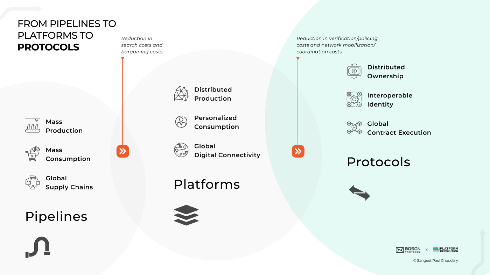
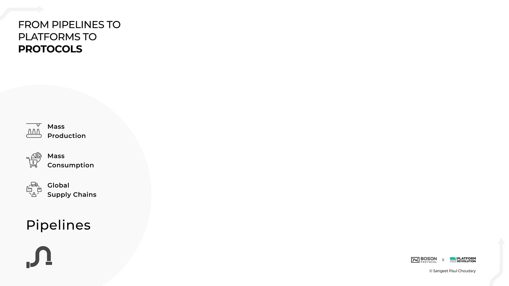
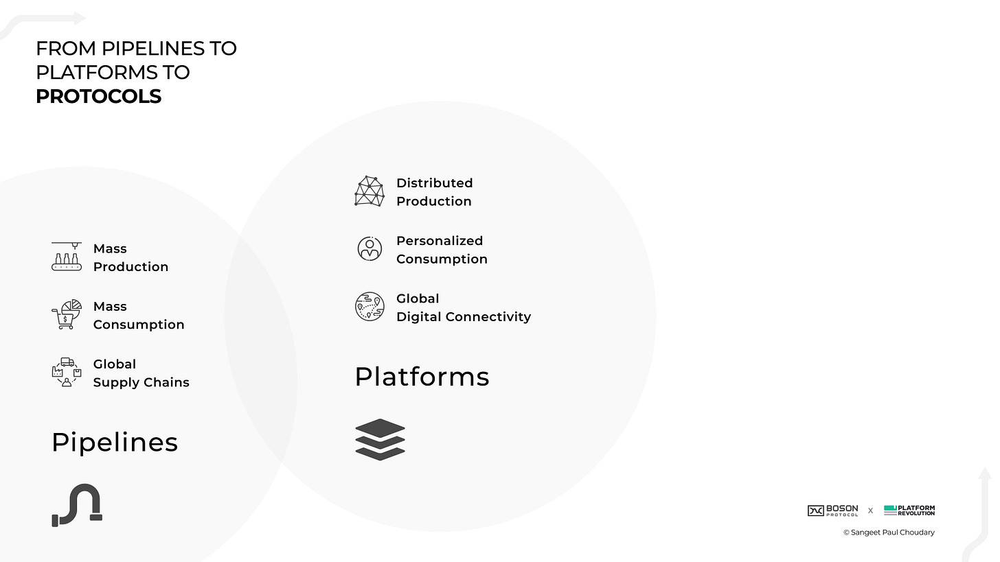
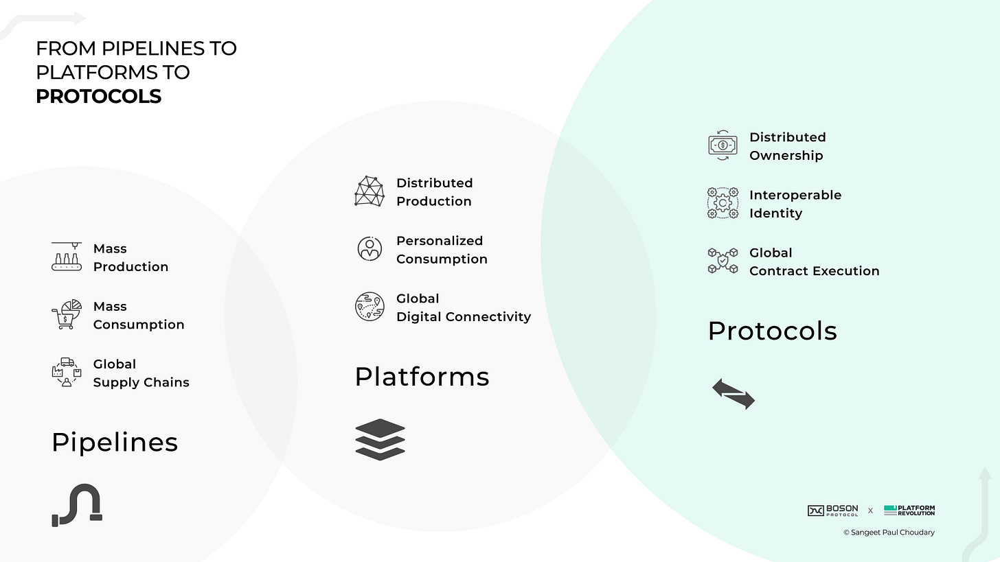
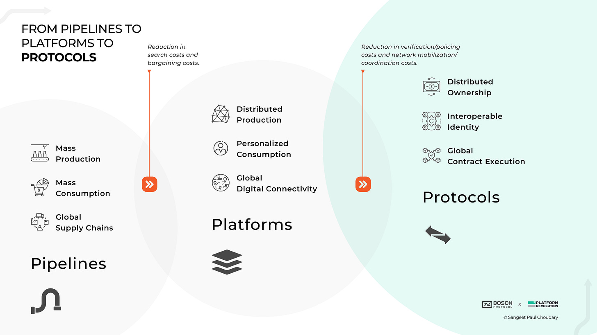

> **摘要**: 本文探讨了从传统的管道模式到平台模式，再到即将到来的协议模式的转变。这一过程不仅改变了价值创造的方式，也重新定义了市场，强调了市场力量的重要性。作者指出，此次转型不仅是去中心化的趋势，而是价值创造和市场的根本重新设计。通过对比历史、技术和市场力量之间的关系，文章阐明了平台如何利用规模效应创造价值，并通过区块链协议提升产权、降低交易成本、解锁消费者身份等方面，进一步推动商业模式的变革。尽管新型协议将不能替代所有平台，但在去中心化、交易执行和市场交互中，它们将扮演越来越重要的角色。
> 
>  **要点总结**:
>  1. 技术进步导致价值创造从管道模式转向平台模式，再向协议模式演变。
>  2. 平台通过聚合分散市场，利用规模效应降低成本，增强市场力量和价值创造。
>  3. 协议（结合代币）改善生产回报，并为生产者提供产权保护，增强其市场能力。
>  4. 协议解锁消费者身份，降低平台带来的锁定风险，促进跨平台参与。
>  5. 新的市场经济将在协议实施中显现，未来将见证协议与平台共存、双向作用。

---

From the compass to the printing press, steam engine to electric lightbulb, economic history shows that whenever technology disrupts the market forces of production and consumption, value creation will change in step. The level to which individual players benefit from these technological gains is then dictated by the degree of market power they wield.  
从指南针到印刷机，从蒸汽机到电灯泡，经济史表明，每当技术颠覆生产和消费的市场力量时，价值创造就会相应改变。个人玩家从这些技术进步中受益的程度，随后由他们所拥有的市场力量程度所决定。

Over the past decade, [my work](https://www.platformthinkinglabs.com/) has focused on [the shift from pipelines to platforms](https://hbr.org/2016/04/pipelines-platforms-and-the-new-rules-of-strategy) as a [transformative shift](https://www.wired.com/insights/2013/10/why-business-models-fail-pipes-vs-platforms/) in value creation that shaped the first two decades of the twenty-first century. I believe that the shift from pipelines to platforms, now widely accepted, will shift further with the emergence of protocols as the foundational technology of Web3.  
过去十年，我的工作重点在于从管道到平台的转变，这是塑造 21 世纪前二十年价值创造的一个转型性变化。我相信，随着作为 Web3 基础技术的协议的出现，从管道到平台的转变，现在已被广泛接受，将会进一步发展。

This, I believe, is the real shift of our time - a fundamental redesign in value creation and markets, not just a shift towards decentralisation or read/write/own, as many of the Web1 to Web2 to Web3 proponents often claim.  
这，我相信，是我们这个时代的真正转变——价值创造和市场的基本重新设计，而不仅仅是向去中心化或读写拥有权转变，正如许多 Web1 到 Web2 再到 Web3 的支持者经常声称的那样。

This article explains why this transition matters and is increasingly inevitable.  
这篇文章解释了为什么这次转型很重要，并且越来越不可避免。

But first…  首先…

Value creation in the industrial era was dominated by pipelines. Pipelines are the traditional industrial business model, characterised by a linear, unidirectional flow of value from producer to consumer, where value is created by the producer and shipped out to the customer, who then pays for the value. And it was the technology of the industrial era that shaped the pipeline model of value creation throughout much of the 20th Century. First, **technologies enabling mass production** — assembly lines optimized through factory automation, backed by large-scale, organisation management — allowed us to aggregate production at scale. Together, these gave us the tools of mass production and gave birth to large corporations, particularly during the post-World-War geopolitical shift towards globalisation.  
工业时代的价值创造主要由管道模式主导。管道模式是传统的工业商业模式，其特点是价值从生产者到消费者的线性、单向流动，价值由生产者创造并运送给客户，客户随后为价值付费。正是工业时代的科技塑造了 20 世纪大部分时间内的价值创造管道模式。首先，实现大规模生产的科技——通过工厂自动化优化的装配线，以及大规模的组织管理——使我们能够实现规模化的生产聚集。这些共同为我们提供了大规模生产的工具，并催生了大型企业，尤其是在战后地缘政治向全球化转变的时期。

On the consumption side, **the rise of mass media** — from newspapers to radio and then television — provided the means for influencing consumption at scale, like never before. The rise of cities and suburban populations provided the market conditions for mass consumption to meet mass production through retail, forcing prices down and improving choice and convenience.  
在消费端，大众媒体的兴起——从报纸到广播，再到电视——为大规模影响消费提供了手段，这是前所未有的。城市和郊区的兴起为大规模消费提供了市场条件，通过零售满足大规模生产，迫使价格下降，并提高选择和便利性。

Finally, **the shift to globalization and international trade**, spurred further by standardization technologies, particularly container shipping, led to the creation of global supply chains, connecting mass production with mass consumption globally.  
最终，全球化与国际贸易的转变，特别是标准化技术，尤其是集装箱运输的推动，导致了全球供应链的创建，将全球范围内的大规模生产和消费连接起来。

By perfecting the technologies of mass production, mass consumption, and global connectivity, the industrial era perfected its ability to scale value creation through the pipeline model and benefit from supply-side economies of scale.  
通过完善大规模生产、大规模消费和全球连接的技术，工业时代通过管道模型实现了价值创造的规模化，并从供给侧规模经济中获益。

Throughout history, technological shifts and market forces have worked together to drive new paradigms for value creation. With the rise of the internet and of digital technologies, this combination of technological changes and market forces drove the shift from pipelines to platforms.  
自古以来，技术变革和市场力量共同推动价值创造新模式的形成。随着互联网和数字技术的兴起，这种技术变革与市场力量的结合推动了从管道到平台的转变。

First, **the tools of production could now be distributed**, rather than centralised. Consider the news industry as an example. To create and distribute news at scale, you had to be a large newspaper company. But then the internet decentralised the tools of publishing and distribution, so that anybody with access to wiki or web authoring tools could produce and disseminate news.  
首先，生产工具现在可以分散，而不是集中。以新闻行业为例。要大规模创建和分发新闻，你必须是一家大型报纸公司。但随后互联网使出版和分发工具去中心化，使得任何拥有维基或网页创作工具的人都可以制作和传播新闻。

Second, the capture of data at scale — for instance, through social technologies and subsequently through connected devices — combined with improvements in machine learning and artificial intelligence drove **the rise of personalized consumption.**  
其次，通过社交技术和随后通过连接设备大规模捕获数据——结合机器学习和人工智能的进步——推动了个性化消费的兴起。

As markets shifted from mass production and mass consumption to distributed production and personalized consumption, the internet provided a **global connectivity infrastructure** to connect the two. Mobile-based connectivity and cloud computing enabled the creation of a new alternative for global value exchange. Cloud hosting connected distributed production to personalized consumption through a global network. Together, these three technologies drove the rise of platforms as the dominant model of value creation. Platforms connected producers and consumers with each other allowing them to create an exchange value and facilitating these interactions at scale. By adding more and more producers to these platforms, there was more choice for consumers, enabling these platforms to benefit from demand-side economies of scale.  
随着市场从大规模生产和消费转向分布式生产和个性化消费，互联网提供了全球连接基础设施，将两者连接起来。基于移动的连接和云计算使得全球价值交换的新替代方案得以创造。云托管通过全球网络将分布式生产与个性化消费连接起来。这三项技术共同推动了平台成为价值创造的主导模式。平台将生产者和消费者连接起来，使他们能够创造交换价值，并促进大规模的互动。通过将这些平台上的生产者越来越多地添加进去，消费者有了更多的选择，使这些平台能够从需求侧规模经济中受益。

Platforms rearchitected value creation away from ‘mass production connected to mass consumption’ to ‘distributed production connected to personalised consumption’. By aggregating fragmented markets, platforms reduced search costs — the costs incurred in counterparty discovery. By standardizing transactions at scale, platforms reduced bargaining costs — the costs incurred in negotiating the terms of exchange. And by acting as central intermediaries with market-wide data capture and visibility, platforms reduced verification and policing costs — the costs incurred in imputing trust to transactions by verifying and policing those transactions.  
平台重新架构了价值创造，从“与大众消费相连接的大规模生产”转变为“与个性化消费相连接的分布式生产”。通过聚合分散的市场，平台降低了搜索成本——在交易对手发现过程中产生的成本。通过大规模标准化交易，平台降低了议价成本——在协商交换条款过程中产生的成本。并且作为具有市场范围数据捕获和可见性的中心中介，平台降低了验证和监管成本——在通过验证和监管交易来赋予交易信任过程中产生的成本。

In achieving the above, platforms created massive value while also gaining inordinate market power. Demand-side economies of scale — manifested through network effects and learning effects — coalesced entire markets around a few dominant platforms.  
在实现上述目标的过程中，平台创造了巨大的价值，同时也获得了过度的市场力量。需求侧规模经济——通过网络效应和学习效应体现——将整个市场凝聚在少数几个主导平台周围。

We’re just warming up before we dive into the implications of this shift.  
我们只是在深入探讨这一转变的影响之前热身。

If you’re loving this so far, do consider sharing it further:  
如果您到目前为止都很喜欢，那么考虑进一步分享它吧：

[Share  分享](https://platforms.substack.com/p/pipelines-to-platforms-to-protocols?utm_source=substack&utm_medium=email&utm_content=share&action=share)

Protocols — more specifically, permissionless blockchain protocols — provide a new organizing and governance mechanism to organize actors in an ecosystem. Unlike platforms, protocols do not provide end-to-end market infrastructure nor do they internalize transaction policing and verification. Since protocols do not themselves provision market infrastructure or internalize transaction policing and verification, they need to set up the economic incentives for other ecosystem actors to provision these services. They achieve this by issuing tokens to reward desirable actions in the ecosystem. As the value of market activity in the ecosystem increases, the value of the token — tied to protocol usage — increases as well. As an example, Boson Protocol leverages [commitment tokens](https://medium.com/bosonprotocol/nfts-with-superpowers-545dc1aec3a0) to secure commitment of buyers and sellers to a transaction, thereby externalizing verification of the certainty of the transaction.  
协议——更具体地说，无需许可的区块链协议——为组织生态系统中的参与者提供了一种新的组织和治理机制。与平台不同，协议既不提供端到端的市场基础设施，也不内部化交易监控和验证。由于协议本身不提供市场基础设施或内部化交易监控和验证，它们需要为其他生态系统参与者提供经济激励以提供这些服务。它们通过发行代币来奖励生态系统中的期望行为来实现这一点。随着生态系统市场活动的价值增加，与协议使用相关的代币价值也随之增加。例如，Boson Protocol 利用承诺代币来确保买卖双方对交易的承诺，从而将交易确定性的验证外部化。

Just as there was a fundamental shift in value configuration from pipeline to platforms, so production, consumption, and markets are poised to transform again with the shift from platforms to protocols. Protocols have often been dismissed by Web3 skeptics, as hacker tools that will only impact a small community. Instead, protocols — in combination with tokens — look increasingly likely to power the next generation of market economics.  
正如从管道到平台的价值配置发生了根本性的转变，生产和消费以及市场也正准备随着从平台到协议的转变而再次转型。Web3 的怀疑者常常将协议视为只会影响小众群体的黑客工具。相反，结合代币，协议越来越有可能成为下一代市场经济的动力。

First, **protocols (in combination with tokens) change the incentives and returns on production**. The platform economy has often been criticized for skewing rewards away from external producers, who commit resources to the platform and incur risks, and centralizing rewards with the central platform organization. Token rewards provide an alternate incentive mechanism where ecosystem producers are incentivized for desirable actions that grow market activity. These tokens, in turn, grow in value as overall market activity increases, enabling external producers to benefit from returns.  
首先，协议（结合代币）改变了生产和回报的激励措施。平台经济常常受到批评，因为它将奖励偏离了投入资源到平台并承担风险的外部生产者，并将奖励集中在中央平台组织。代币奖励提供了一种替代的激励机制，其中生态系统生产者因采取促进市场活动增长的有利行动而获得激励。这些代币随着整体市场活动的增加而增值，使外部生产者能够从回报中受益。

In addition to improving returns on production, protocols — particularly, through non-fungible tokens (NFTs) — also empower producers by establishing, transfering, and enforcing property rights over the assets they produce. Well-structured token incentives combined with the verifiability of asset ownership skew rewards of production back to the producer.  
除了提高生产回报外，协议——尤其是通过非同质化代币（NFTs）——还通过建立、转让和执行他们生产的资产的所有权来赋予生产者权力。结构良好的代币激励措施与资产所有权的可验证性相结合，将生产回报的奖励重新倾斜回生产者。

On the consumption side, **protocols disentangle consumers from the lock-in enforced by platforms**. Platforms drove market efficiencies by leveraging data to reduce search costs and verification costs. This involved an inherent trade-off as market participants — particularly consumers — needed to surrender their data to the platform to benefit from these market efficiencies. This surrender of data and attendant lock-in increased the risks of privacy invasion, loss of agency through over-dependance, and unilateral censorship as centralized platforms could change their policies at will.  
在消费端，协议解除了消费者受平台强制锁定的束缚。平台通过利用数据来降低搜索成本和验证成本，从而推动了市场效率。这涉及一个固有的权衡，因为市场参与者——尤其是消费者——需要向平台提交他们的数据以从这些市场效率中受益。这种数据提交和随之而来的锁定增加了隐私侵犯、过度依赖导致的权力丧失以及单方面审查的风险，因为中心化平台可以随意更改其政策。

Blockchain protocols **reduce transaction verification costs without absorbing these costs as intermediaries** and, instead, allowing market actors to verify transactions and enforce contracts, while preserving data privacy. Since identity and data no longer need to be locked-in to a platform to verify and impute trust to transactions, consumer identity now becomes interoperable and consumers can participate across multiple platforms and protocols, while retaining custodianship over their identity.  
区块链协议降低了交易验证成本，同时不将这些成本吸收为中介，而是允许市场参与者验证交易和执行合同，同时保护数据隐私。由于身份和数据不再需要锁定在平台上以验证和赋予交易信任，消费者的身份现在变得可互操作，消费者可以在多个平台和协议中参与，同时保留对其身份的控制权。

In [my work as an advisor to Boson Protocol](https://medium.com/bosonprotocol/understanding-the-incentives-for-web3-ca15ec6b30f7), for instance, I’ve advocated an approach of [unbundling market infrastructure from governanc](https://platforms.substack.com/p/unbundling-the-unbundlers-the-end)e, which allows buyers to manage their identity and interoperate across different buy-side applications when interfacing with the protocol. This again reduces lock-in for the buyer.  
在我的工作作为 Boson 协议顾问的例子中，我提倡将市场基础设施从治理中解耦的方法，这允许买家在协议交互时管理自己的身份并在不同的买方应用之间进行互操作。这再次减少了买家的锁定。

Protocols bring decentralised ownership, giving creators greater control over what they’re creating. Alongside distributed production and market access on your own terms, you will now have the property rights to leverage as you choose. Production can be scaled up even further, especially in markets where ownership of intellectual property is valuable to the creator.  
协议带来去中心化所有权，赋予创作者对其所创造内容的更大控制权。在您自己的条件下进行分布式生产和市场接入的同时，您现在将拥有可按需利用的财产权。生产规模甚至可以进一步扩大，尤其是在知识产权对创作者来说有价值的市场上。

With protocols, property rights go back to the creator and identity goes back to the consumer. But much like pipelines needed standards in global supply chains and platforms needed a global compute infrastructure, protocols require a new operating infrastructure to manage decentralized transaction execution at scale. **Global contract execution** therefore becomes very important. The rise of blockchain and distributed ledgers provides a shared view of the history of transactions: who owns what and when. Smart contracts give a shared infrastructure for executing these at scale. Again, technology brings changes in production and consumption together, creating a new mechanism for managing market activity.  
协议下，财产权回归创作者，身份权回归消费者。但正如全球供应链需要标准，平台需要全球计算基础设施一样，协议需要一个新的运营基础设施来管理大规模的去中心化交易执行。因此，全球合同执行变得非常重要。区块链和分布式账本的出现提供了交易历史的共享视图：谁拥有什么以及何时拥有。智能合约提供了一个共享的基础设施来大规模执行这些操作。再次，技术将生产和消费的变化结合起来，创造了一种管理市场活动的新机制。

While it’s now undisputed that there was a significant shift from pipelines to platforms, I believe we are now in the early innings of a similar shift from platforms to protocols. Much like the arrival of platforms didn’t signal the end of pipelines, the emergence of protocols will not end the era of platforms. Instead, pipelines, platforms, and protocols, will co-exist as different mechanisms to organize and configure value in the economy. Some parts of the economy will be best managed through platforms, while other use cases will lend themselves to decentralized protocol-based management.  
尽管现在普遍认为从管道到平台发生了重大转变，但我相信我们现在正处于从平台到协议的类似转变的早期阶段。就像平台的到来并没有预示管道的终结一样，协议的出现也不会结束平台的时代。相反，管道、平台和协议将作为组织和管理经济中价值的不同机制共存。经济的一些部分将最好通过平台来管理，而其他用例则更适合基于去中心化协议的管理。

In the last two years, we have seen a number of tipping points that will herald the arrival of protocols. Two factors, in particular, the need for interoperability and the attractiveness of new reward sharing mechanisms, will be key determiners of the speed of this shift. Decentralised finance and the rise of tokens now provide the financial machinery for new reward sharing mechanisms. Similarly, the need for greater interoperability in the design of virtual worlds is another factor that could spur the adoption of protocols.  
在过去的两年里，我们见证了许多转折点，预示着协议的到来。特别是两个因素，即互操作性的需求和新的奖励共享机制的吸引力，将成为这一转变速度的关键决定因素。去中心化金融和代币的兴起现在为新的奖励共享机制提供了金融工具。同样，虚拟世界设计中对更高互操作性的需求也是可能推动协议采用的因素之一。

We will undoubtedly see the major platforms, with their advantage of scale, leverage this new set of technologies in a way that best reinforces their current economics. Facebook (now Meta), after experimenting with Libra, is now investing heavily in protocols more broadly. **It would be naive to assume that protocols themselves will also not attract new modes of value capture and control.**  
我们无疑会看到主要平台，凭借其规模优势，将以最能加强其现有经济模式的方式利用这一系列新技术。Facebook（现 Meta）在尝试了 Libra 之后，现在正大力投资更广泛的协议。认为协议本身不会吸引新的价值获取和控制模式，那将是幼稚的。

We’re still in the early innings of a massive shift. One thing remains certain — the new value will be created, configured, and captured differently from the old.  
我们仍处于一场巨大变革的初期阶段。有一点是确定的——新的价值将不同于以往，以不同的方式被创造、配置和捕捉。

A lot’s been written about the technology of Web3. Relatively little is understood about the business models of Web3. Watch this space - lots more coming this year on how Web3 will really change business.  
关于 Web3 的技术已经有很多讨论。相对而言，对 Web3 的商业模式了解较少。关注这个领域——今年将有更多关于 Web3 如何真正改变商业的内容出现。

And if you’re working on a Web3 project that’s bringing this shift to life, let’s connect and discuss further. Just hit [Reply](https://platforms.substack.com/p/).  
如果您正在从事一个将这一转变付诸实践的 Web3 项目，让我们联系并进一步讨论。只需点击回复。

Protocols and tokens will reconfigure value creation and redefine business models. Share this further - we’re just getting started.

[Share](https://platforms.substack.com/p/pipelines-to-platforms-to-protocols?utm_source=substack&utm_medium=email&utm_content=share&action=share)