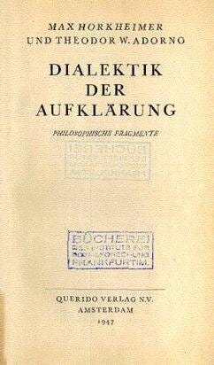

> **摘要**:
>  《启蒙辩证法》主张人类历史是退步而非进步的，现代性的自豪感和对外部世界的控制能力被认为是这一退步的根源。书中没有结构化的论证，而是呈现了多个哲学观点，试图系统化其理论基础。历史被划分为四个时代：魔法时代、神话时代、形而上学时代和实证主义时代。作者认为，这四个时代体现了人类对未知的恐惧和对知识控制的追求。作者还提供了三种解读方式：历史是循环的、矛盾的和乐观的，最终归结为现代社会在面临权力和善的选择时，总趋向于权力，虽然这种选择的结果不是绝对的。相较于善性，人类的权力正在以代价来实现，造成了对自身的疏远与异化。
> 
>  **要点总结**:
>  1. 《启蒙辩证法》认为人类历史是退步的，根源在于现代性与对外部世界的控制能力。
>  2. 历史分为魔法、神话、形而上学和实证主义四个时代，每个时代反映了知识扩展与对未知的恐惧。
>  3. 提出三种解读历史的方式：历史循环、矛盾及乐观，希望揭示选择权力或善的本质。
>  4. 权力的进步是以善的退步为代价，人类在此过程中愈发疏远自身和现实。
>  5. 现代社会的选择偏向于权力，而非自由和善，造成了人类对自身的异化与恐惧。

---

*The Dialectic of Enlightenment* is worth reading because and not despite the seeming absurdity of its central claim: the history of humanity is one of regress rather than progress. Furthermore, the culprit for this regress is the pride of modernity: our increased ability to control and manipulate the external world. While the conclusions of the text may be too pessimistic and extreme, the main critiques within it of mathematics, science, abstraction and knowledge in general are nonetheless relevant.  
《启蒙辩证法》值得一读，不仅因为其核心主张看似荒谬：人类的历史是退步而非进步的历史。此外，这一退步的罪魁祸首是现代性的骄傲：我们控制和操纵外部世界的能力日益增强。尽管文本的结论可能过于悲观和极端，但其中对数学、科学、抽象以及一般知识的主要批判仍然具有现实意义。

This book, notoriously difficult to parse, has no semblance of structure or systematicity. Instead, it presents chunks of different philosophical arguments (the book was originally titled *Philosophical Fragments*) that are all equidistant from the central thrust of the argument. This form was chosen because of the shared belief that society, as it was, was too dysfunctional, inconsistent, and chaotic for any consistent and structured truth to be presented. This summary is, therefore, an attempt to systematize the theoretical foundations of the Dialectic as found in its first chapter. I will present a philosophy of history as well as three different but compatible ways to interpret it.  
这本书以难以解析著称，毫无结构或系统性可言。相反，它呈现了不同哲学论点的片段（原书名为《哲学片段》），这些片段与论证的核心要旨等距。选择这种形式是因为作者们共同认为，当时的社会过于功能失调、前后不一且混乱无序，无法呈现任何一致且结构化的真理。因此，本摘要试图系统化《辩证法》第一章中所发现的理论基础。我将提出一种历史哲学，以及三种不同但兼容的解读方式。

The Dialectic’s philosophy of history is split into four distinct eras defined by a progression in thought. The magical era interacts with discrete entities through imitation. The mythical era interacts with elements controlled by gods who reveal their mechanisms in myth. The metaphysical era deals directly with concepts such as being, suffering, and love. Currently, the positivist era interacts with the world through the abstractions of mathematics and logic. This progression is motivated by a fear of the unknown and uncontrollable. As a reflex, we’ve expanded the reach of our knowledge and its ability to predict and control reality by making our thinking more abstract, total, utilitarian, unifying, and calculative. The final progression of this development, mathematics and logic, claim to know or at least be able to know the full extent of reality.  
辩证法的历史哲学被划分为四个不同的时代，每个时代由思想的进步所定义。魔法时代通过模仿与离散实体互动。神话时代与由神控制的元素互动，这些神在神话中揭示了它们的机制。形而上学时代直接处理诸如存在、痛苦和爱等概念。目前，实证主义时代通过数学和逻辑的抽象与世界互动。这种进步是由对未知和不可控的恐惧所驱动的。作为一种反射，我们通过使我们的思维更加抽象、全面、功利、统一和计算化，扩展了我们的知识范围及其预测和控制现实的能力。这一发展的最终阶段，数学和逻辑，声称知道或至少能够知道现实的全部范围。

The first interpretation is that this history is circular. Myth is no different from positivism because it is rooted from an urge to explain and control. Positivism is no different from myth because it renders the world fated before the rigid laws of mathematics and rejects the authority of concepts. The second interpretation is that this history is ambivalent. Humanity has progressed in its ability to dominate the external world by an increasing domination of itself. This is the unspoken price of discipline. The very abstractedness which makes our thinking so powerful is also what estranges us from ourselves, society, and nature. The last interpretation is an optimistic one: the potential to actualize true freedom has increased even if our freedom has become increasingly restricted.  
第一种解释认为这段历史是循环的。神话与实证主义并无不同，因为它源于解释和控制的冲动。实证主义与神话无异，因为它使世界屈从于数学的严格法则之下，并拒绝概念的权威。第二种解释是这段历史具有矛盾性。人类通过不断增强对自身的支配，提升了对外部世界的控制能力。这是纪律不言而喻的代价。正是这种抽象性，使我们的思维如此强大，同时也使我们与自身、社会和自然疏离。最后一种解释是乐观的：即使我们的自由日益受限，实现真正自由的潜力却增加了。

In the 1940s, Adorno and Horkheimer were writing in and responding to a time overrun by, what they perceived to be, totalitarianism. Surprisingly they equate the three systems of power — the Soviet Union controlled by the communist party, Germany controlled by the Nazis, and America controlled by economic monopolies and culture that is heavily influenced by capital — as equally totalitarian and undesirable systems. In *the Dialectic of Enlightenment, “*what \[they\] had set out to do was nothing less than to explain why humanity, instead of entering a truly human state, is sinking into a new kind of barbarism*”*.  
在 20 世纪 40 年代，阿多诺和霍克海默写作并回应了一个被他们视为极权主义泛滥的时代。令人惊讶的是，他们将三种权力体系——共产党控制的苏联、纳粹控制的德国以及受资本严重影响的经济垄断和文化主导的美国——等同为同样极权且不可取的体系。在《启蒙辩证法》中，“\[他们\]所着手做的，无非是解释为何人类非但没有进入真正的人性状态，反而陷入了一种新的野蛮状态”。

In *the Dialectic of Enlightenment,* Enlightenment does not refer to the specific 18th-century intellectual movement but what could be “understood in the widest sense as the advance of thought”. That is to say, the historical development of our conceptual schemas through which we view and interact with the world. The goal of Enlightenment was always to “\[liberate\] human beings from fear and \[install\] them as masters”. Bacon expressed the hopes for Enlightenment well when he envisioned a patriarchal future where humans, having conquered mythical superstition and in perfect control of knowledge, establish themselves as autonomous masters of the natural world:  
在《启蒙辩证法》中，启蒙并非特指 18 世纪的思想运动，而是“在最广泛意义上理解为思想的进步”。也就是说，是我们看待和与世界互动的概念框架的历史发展。启蒙的目标始终是“将人类从恐惧中解放出来，并确立他们为主宰者”。培根很好地表达了启蒙的希望，他设想了一个家长式的未来，在那里，人类征服了神话般的迷信，完美掌控知识，确立自己为自然界的自主主宰者：

> *Therefore, no doubt, the sovereignty of man lieth hid in knowledge; wherein many things are reserved, which kings with their treasure cannot buy, nor with their force command; their spials and intelligencers can give no news of them, their seamen and discoverers cannot sail where they grow: now we govern nature in opinions, but we are thrall unto her in necessity: but if we would be led by her in invention, we should command her by action.  
> 因此，毫无疑问，人类的统治权深藏于知识之中；其中许多事物被保留，是国王们用其财富无法购买，用其武力无法命令的；他们的间谍和情报人员无法提供这些事物的消息，他们的水手和探险家也无法航行到这些事物生长的地方：如今我们在观念中统治自然，但在必然性上我们却是她的奴隶；但如果我们愿意在发明中受她引导，我们就能在行动中命令她。*

However, the belief that “the mind, conquering superstition, is to rule over disenchanted nature” proved naïve, as the now “wholly enlightened earth is radiant with triumphant calamity”. Indeed, in each of the four historical eras — magic, myth, metaphysics, positivism — we gained more control of nature through acquiring more knowledge by advancing our thought, through Enlightenment. But we became stewards of knowledge at the price of adapting ourselves and society as to introduce new forces, no less pernicious and totalitarian, which now threaten our autonomy.  
然而，“心灵征服迷信，将统治被祛魅的自然”这一信念被证明是幼稚的，因为如今“完全启蒙的地球闪耀着胜利的灾难”。确实，在魔法、神话、形而上学、实证主义这四个历史时代的每一个中，我们通过启蒙推进思想，获取更多知识，从而获得了对自然的更多控制。但我们成为知识的守护者，是以适应自身和社会为代价的，这引入了新的力量，这些力量同样有害且极权，如今正威胁着我们的自主性。

The philosophy of history presented has four distinct eras. Each era is defined by its dominant mode of thinking and the knowledge that it produces. The primary concern of this mental activity “is not ‘satisfaction, which men call truth,’ but ‘operation,’ the effective procedure”. The purpose of knowledge is neither truth nor satisfaction but rather production: helping man manipulate the external world according to his needs. History begins with magical thinking whose defining characteristic is that it sees difference within the world. It sees the world as constituted by a set of related, interacting but ontologically distinct entities. The objects manipulated by magic were specific: “The rites of the shaman were directed at the wind, the rain, the snake outside or the demon inside the sick person, not at materials or specimens”. This changes drastically in positivism where the object in science is a mere manifestation of a more fundamental matter: “the unity of nature, which subdues the abundance of qualities”.  
所呈现的历史哲学包含四个不同的时代。每个时代由其主导的思维模式及其产生的知识所定义。这种思维活动的主要关注点“不是‘人们称之为真理的满足’，而是‘操作’，即有效的程序”。知识的目的既非真理也非满足，而是生产：帮助人类根据其需求操控外部世界。历史始于魔法思维，其定义特征是它看到了世界内部的差异。它将世界视为由一系列相互关联、相互作用但在本体论上截然不同的实体构成。魔法操控的对象是具体的：“萨满的仪式针对的是风、雨、外部的蛇或病人体内的恶魔，而非材料或样本。”这在实证主义中发生了巨大变化，科学中的对象仅仅是更基本物质的表现：“自然界的统一性，它压制了性质的多样性”。

Because of this assumed difference, magic influences the world through imitation. This imitation is explicit when, for example, a shaman imitates a demon to ward it off or a hunter imitates the bear to scare it away. But imitation is not limited between subject and object but also among objects themselves. Imitation between objects is representation, the idea that certain objects have a special kinship and connection. “What is done to the spear, the hair, the name of the enemy, is also to befall his person; the sacrificial animal is slain in place of the god”. This changes drastically in positivism where “representation gives way to universal fungibility. An atom is smashed not as a representative but as a specimen of matter, and the rabbit suffering the torment of the laboratory is seen not as a representative but, mistakenly, as a mere exemplar”. Science sees no real differences and treats objects within the world as commutable.  
由于这种假定的差异，魔法通过模仿来影响世界。这种模仿在例如萨满模仿恶魔以驱赶它或猎人模仿熊以吓跑它时是显性的。但模仿不仅限于主体与客体之间，也存在于客体自身之间。客体之间的模仿是表征，即某些物体具有特殊的亲缘关系和联系的观点。“对敌人的矛、头发、名字所做的，也将降临到他本人身上；祭牲被宰杀以代替神”。这在实证主义中发生了巨大变化，其中“表征让位于普遍的替代性。一个原子被击碎不是作为代表而是作为物质的样本，实验室中遭受折磨的兔子被视为不是代表，而是错误地被视为仅仅是一个范例”。科学看不到真正的差异，并将世界中的物体视为可互换的。

The magical age, the era least touched by Enlightenment, already contains within it the seeds for its burgeoning: fear. “Humans believe themselves free of fear when there is no longer anything unknown. This has determined the path of demythologization, of Enlightenment”. Since this age is also the age where we have the least amount of knowledge of the world, it is also the age where there is the most amount of unknowns and where this fear of the unknown is most pertinent. This fear and the corresponding reactive instinct to assuage it by knowing more about the world, by subjugating as much as the world underneath the rule of thought as possible is the sole driving force of this philosophy of history.  
魔法时代，这个受启蒙影响最少的时代，其内部已孕育了自身蓬勃发展的种子：恐惧。“当不再有任何未知之物时，人类便自认为摆脱了恐惧。这决定了祛魅与启蒙的道路。”由于这个时代也是我们对世界知之甚少的时代，因此它也是未知最多、对未知的恐惧最为显著的时代。这种恐惧，以及通过更多地了解世界、尽可能将世界置于思想统治之下来缓解恐惧的相应反应本能，构成了这一历史哲学的唯一驱动力。

In the magical era, the reflex to this instinct is mana — an ineffable substance containing ambivalent powers of genesis and destruction, light and dark, etc. Mana was thought to exist behind certain sites and not others, delimiting the sacred from the profane. Mana is not a solution to this fear, that is to say, it did not expand the reach of our knowledge nor provide new means of manipulating the world and thus is not part of the Enlightenment. It is a reflex to this fear. Mana and the other common metaphysical belief of animism was an admission of ignorance, a submission to the unknown, not an attempt to conquer it. They acknowledge and submit to this unknown by equating the nonliving — the calculable and masterable — with the living — the unpredictable and untamable — while positivism attempts to conquer this unknown by equating the living with the nonliving. This reflex of mana which “springs from human fear” is still significant because it represents the first attempt of “the doubling of nature into appearance and essence, effect and force”. This doubling is the predecessor of abstraction, of the urge to look beyond distinct objects to find a common substance, which is paramount to the development of Enlightenment.  
在魔法时代，对这种本能的反应是魔力——一种难以言喻的物质，蕴含着创生与毁灭、光明与黑暗等矛盾力量。人们认为魔力存在于某些特定地点而非其他地方，从而划分了神圣与世俗。魔力并非对这种恐惧的解决之道，也就是说，它既未扩展我们的知识范围，也未提供操控世界的新手段，因此不属于启蒙运动的一部分。它是对这种恐惧的一种反应。魔力及另一种常见的形而上学信仰——万物有灵论，是对无知的承认，是对未知的屈服，而非试图征服它。它们通过将无生命之物——可计算与可掌控的——等同于有生命之物——不可预测与难以驯服的——来承认并屈服于这种未知，而实证主义则试图通过将有生命之物等同于无生命之物来征服这种未知。这种“源于人类恐惧”的魔力反应之所以仍然重要，是因为它代表了“将自然双重化为表象与本质、效果与力量”的首次尝试。 这种倍增是抽象的前身，是超越个别对象寻找共同本质的冲动，这对启蒙运动的发展至关重要。

If the magical era was the starting point of history and Mana but a meager reflex to fear, then the mythical era represents the beginning of the Enlightenment and its dominant mode of thinking, myth, the first solution to fear. Myth is Enlightenment because it advanced the sphere of knowledge, limited the realm of the unknown, and thus provided new ways to manipulate reality. Myth, like science, “sought to report, to name, to tell of origins — but therefore also to narrate, record, explain”. It is founded upon a desire to explain the world, to reduce it, to make it more manageable and tamable by thought. The manipulation of the external world became more unified and centralized: “The local spirits and demons had been replaced by heaven and its hierarchy, the incantatory practices of the magician by the carefully graduated sacrifice and the labor of enslaved men mediated by command”. This represented an advancement in two ways. First, more of reality was made intelligible and known, albeit through the unpredictable tempers of deities. Second, reality was controllable through the centralized mediator of worship instead of interacting directly with each independent object. This hierarchical view of knowledge was made possible as the social world itself shifted from an egalitarian nomadism to a hierarchical society with fixed property. Material reality progresses symbiotically with knowledge: the former inspiring new structures for the latter, while the latter accelerates the development of the former.  
如果魔法时代是历史与魔力的起点，而魔力不过是对恐惧的微弱反射，那么神话时代则代表了启蒙及其主导思维模式——神话的开端，作为恐惧的第一种解决方案。神话即启蒙，因为它拓展了知识的领域，限定了未知的疆界，从而提供了操控现实的新途径。神话，如同科学，“旨在报告、命名、讲述起源——因而也叙述、记录、解释”。它基于一种解释世界、简化世界、使其更易于思想驾驭与驯服的渴望。外部世界的操控变得更加统一与集中：“地方神灵与恶魔被天堂及其等级体系所取代，巫师的咒语实践被精心分级的祭祀与受命劳作的奴隶所中介”。这体现在两个方面的进步上：首先，更多的现实变得可理解与已知，尽管是通过神祇难以捉摸的情绪；其次，现实通过崇拜这一集中化的中介变得可控，而非直接与每个独立对象互动。 这种知识的等级观念之所以成为可能，是因为社会世界本身从平等的游牧主义转向了具有固定财产的等级社会。物质现实与知识共生共进：前者激发后者的新结构，而后者则加速前者的发展。

Just as how the shift from nomadism to fixed property engendered the mythical age, an even more accelerated form of commerce and production brought about the metaphysical age and its dominant mode of thinking — concepts. The most representative of concepts, the Platonic forms with their claim to universal validity and hierarchical structure, originated “in the marketplace of Athens; they reflected with the same fidelity the laws of physics, the equality of freeborn citizens, and the inferiority of women, children, and slaves” (Adorno 16). The metaphysical age is where philosophy came to be. Concepts span a wide range of domains, from the metaphysical — being, form, substance — to the humanistic — joy, suffering, love — to the social — norms, signs, values. They are an even more direct, universal, and predictable method of interpreting and controlling the world. “Greeks from the Nile, were converted by these cosmologies into Hylozoic principles and elements, the whole ambiguous profusion of mythical demons was   
正如从游牧生活向固定财产的转变催生了神话时代，一种更为加速的商贸与生产形式则带来了形而上学时代及其主导的思维方式——概念。最具代表性的概念，即柏拉图的形式论，以其普遍有效性和等级结构的宣称，起源于“雅典的市场；它们同样忠实地反映了物理法则、自由公民的平等以及妇女、儿童和奴隶的低下地位”（阿多诺 16）。形而上学时代是哲学诞生的地方。概念涵盖了广泛的领域，从形而上的——存在、形式、实体——到人文的——喜悦、痛苦、爱——再到社会的——规范、符号、价值。它们是一种更为直接、普遍且可预测的解释和控制世界的方法。“来自尼罗河的希腊人，被这些宇宙论转化为物活论的原则与元素，整个神话中恶魔的模糊繁复被……”*intellectualized* to become the pure form of ontological entities. Even the patriarchal gods of Olympus were finally assimilated by the philosophical logos as the Platonic Forms”. No longer is reality mediated by these unpredictable deities; it can be understood through conceptual understanding. Concepts are an advancement in thought over myth as myth was to magic.  
成为本体论实体的纯粹形式。甚至奥林匹斯山的父权神最终也被哲学逻各斯同化为柏拉图式的形式。现实不再由这些不可预测的神祇所中介；它可以通过概念理解来把握。概念是思想相对于神话的进步，正如神话相对于魔法的进步。

The final step in this philosophy of history is the age of positivism and its mode of thinking: science. This era only accepts the verifiable data of experience and the conclusions drawn out of it through logic and mathematics as legitimate knowledge. It rejects any a priori speculation of metaphysics and “suppressed the universal categories’ claims to truth as superstition … From now on matter was finally to be controlled without the illusion of immanent powers or hidden properties”. Not only was a priori speculation renounced but any subjective interpretations were rejected. Things could only be grasped objectively in “their abstract spatial-temporal relationships” and not subjectively “as mediated conceptual moments which are only fulfilled by revealing their social, historical, and human meaning — this whole aspiration of knowledge is abandoned”. In fact, all humanistic thinking about “quality, activity and suffering, being and existence” were denounced, “science could manage without such categories”. With the expulsion of a priori speculation, subjective accounts, and humanistic thinking, concepts themselves were effectively killed off by positivism: “Enlightenment finally devoured not only symbols but also their successors, universal concepts, and left nothing of metaphysics behind”. Of course, the appearance of positivism was made possible by an accelerated a new form of production relations. “The deductive form of science mirrors hierarchy and compulsion … The entire logical order, with its chains of inference and dependence, the superordination and coordination of concepts, is founded on the corresponding conditions in social reality, that is, on the division of labor”.  
历史哲学的最后一步是实证主义时代及其思维方式：科学。这个时代只接受经验可验证的数据以及通过逻辑和数学从中得出的结论作为合法知识。它拒绝任何形而上学的先验推测，并“压制了普遍范畴对真理的主张，将其视为迷信……从今以后，物质最终将在没有内在力量或隐藏属性的幻觉下被控制”。不仅先验推测被摒弃，任何主观解释也被拒绝。事物只能客观地把握“它们抽象的时空关系”，而不能主观地“作为中介的概念时刻，这些时刻只有通过揭示其社会、历史和人文意义才能实现——这一整个知识追求被放弃了”。事实上，所有关于“质量、活动与苦难、存在与生存”的人文思考都被谴责，“科学可以不需要这些范畴”。 随着先验的推测、主观的叙述以及人文主义思想被驱逐，概念本身实际上已被实证主义扼杀：“启蒙最终不仅吞噬了符号，也吞噬了它们的继承者——普遍概念，未留下任何形而上学的痕迹。”当然，实证主义的出现得益于一种加速的新型生产关系的形成。“科学的演绎形式反映了等级制度和强制……整个逻辑秩序，连同其推理和依赖的链条、概念的上位与协调，都建立在社会现实中相应的条件之上，即劳动分工之上。”

The arrow to which thought advances in this philosophy of history has the following characteristics. Thought becomes more calculating to help it exert more control over the world: “For Enlightenment, anything which does not conform to the standard of calculability and utility must be viewed with suspicion”. Thought becomes more unifying as to find a higher leverage point to encompass and influence the world. “For the Enlightenment, only what can be encompassed by unity has the status of an existent or an event; its ideal is the system from which everything and anything follows” (Adorno 3). Thought becomes more utilitarian, reducing the world into what can be of use for it. “Enlightenment stands in the same relationship to things as the dictator to human beings. He knows them to the extent that he can manipulate them”. Thought becomes more abstract such that similarities can be found between more disparate objects, such that a wider variety of objects can be subjected to calculation. “Bourgeois society is ruled by equivalence. It makes dissimilar things comparable by reducing them to abstract quantities”. The thinking subject becomes more distant to the objects which he controls to allow for abstraction: “The distance of subject from object, the presupposition of abstraction, is founded on the distance from things which the ruler attains by means of the ruled”.  
在这种历史哲学中，思想前进的箭头具有以下特征。思想变得更加计算化，以帮助其更有效地控制世界：“对于启蒙而言，任何不符合可计算性和实用性标准的事物都必须受到怀疑。”思想变得更加统一，以找到一个更高的杠杆点来涵盖和影响世界。“对于启蒙来说，只有能够被统一涵盖的事物才具有存在或事件的地位；其理想是那个从中可以推导出一切和任何事物的体系”（阿多诺 3）。思想变得更加功利化，将世界简化为对其有用的东西。“启蒙与事物的关系，就像独裁者与人类的关系。他了解他们，仅在于他能够操纵他们。”思想变得更加抽象，以便在更多不同的对象之间找到相似之处，从而使更多种类的对象能够被计算。“资产阶级社会由等价原则统治。它通过将不同的事物简化为抽象的数量，使它们变得可比。” 思考的主体与他所控制的对象变得更加疏远，以便进行抽象：“主体与客体的距离，即抽象的前提，建立在统治者通过被统治者达到的对事物的疏远之上”。

These trends changed our thinking in general, and language in particular, by emphasizing signs over images. Signs are abstract representations which reference objects through meaning, while images are imitative representations which reference objects through their formal likeness. Language began as having both of these characteristics; “in them sign and image coincided. As the hieroglyphs attest, the word originally also had a pictorial function”. But, through a division of labor, science took upon the role of sign while art took upon the role of image. The primacy of the former over the latter in our society merely exposes what we already observed in the move away from mimesis in the mythical era: “Nature is no longer to be influenced by likeness but mastered through work” bolstered by abstract thinking. Under the light of the aforementioned direction to which thought advances, it is clear why sign won over image. If, to gain power, thought needs to calculate, unify, utilize, abstract, and distance itself from the object, then it cannot afford to splinter into increasingly specific imitative images. Only by distancing itself from objects and unifying their common elements through the abstraction of signs can it calculate and utilize them effectively.  
这些趋势总体上改变了我们的思维方式，特别是在语言方面，通过强调符号而非图像。符号是通过意义来指代对象的抽象表现，而图像则是通过形式上的相似性来指代对象的模仿性表现。语言最初兼具这两种特征；“在它们之中，符号与图像是重合的。正如象形文字所证明的，词语最初也具有图像功能”。然而，随着分工的发展，科学承担了符号的角色，而艺术则承担了图像的角色。在我们社会中，前者对后者的主导地位仅仅揭示了我们在神话时代远离模仿时所观察到的现象：“自然不再通过相似性来影响，而是通过工作来掌控”，这一过程得到了抽象思维的支持。在上述思想发展方向的光照下，符号为何战胜了图像便显而易见。如果为了获得力量，思想需要计算、统一、利用、抽象并与对象保持距离，那么它就不能分裂成越来越具体的模仿性图像。 只有通过远离对象并通过符号的抽象统一它们的共同元素，才能有效地计算和利用它们。

It is unsurprising then that thought as sign pushed to the abstracted extreme — math and logic — are the epistemic arbiters of positivism. “It offered Enlightenment thinkers a schema for making the world calculable”. Finally, thought found a tool which any and every phenomenon could be reduced into and calculated by. For the first time, it had a grasp on the entirety of reality.  
因此，思想作为符号被推向抽象极致的数学和逻辑，成为实证主义的认知仲裁者，这一点并不令人惊讶。“它为启蒙思想家提供了一个使世界可计算的框架。”最终，思想找到了一种工具，任何现象都可以被简化为并通过其进行计算。这是它首次能够把握整个现实。

But this grasp is a suffocating one. “Enlightenment is totalitarian as only a system can be”. Enlightenment is totalitarian because it gets to choose what counts as valid knowledge. “Its untruth does not lie in the analytical method, the reduction to elements, the decomposition through reflection, as its Romantic enemies had maintained from the first, but in its assumption that the trial is prejudged. When in mathematics the unknown becomes the unknown quantity in an equation, it is made into something long-familiar before any value has been assigned. Nature, before and after quantum theory, is what can be registered mathematically; even what cannot be assimilated, the insoluble and irrational, is fenced in by mathematical theorems”. We are forced to interpret the world through math, logic, and data filtered through the existing concepts of the world which positivism alone allows to be discussed. But of course, mathematics has no resources of which to critique and better these concepts. Mathematics may be able to forecast or even increase GDP, but it has no method to criticize having GDP as the primary metric to be optimized. Because positivism does not permit any concepts other than the existing ones through which data is interpreted, math and logic must contend themselves with merely making more efficient the existing systems, “to speculate about intelligible worlds is no longer merely forbidden but senseless prattle”.  
但这种把握是令人窒息的。“启蒙是极权主义的，正如只有系统才能做到的那样。”启蒙之所以是极权主义的，是因为它有权决定什么才算有效的知识。“它的不真实之处不在于分析方法、还原为元素、通过反思进行分解——这些从一开始就遭到其浪漫主义敌人的坚持——而在于它假定审判已有定论。在数学中，当未知数成为方程中的未知量时，它就被变成了某种早已熟悉的东西，在任何值被赋予之前。在量子理论前后，自然都是可以用数学记录的东西；即使是无法同化的、不可溶解的和非理性的东西，也被数学定理所围困。”我们被迫通过数学、逻辑和经过现有世界概念过滤的数据来解释世界，而这些概念只有实证主义才允许讨论。但当然，数学没有资源来批判和改进这些概念。数学或许能够预测甚至增加 GDP，但它没有方法来批评将 GDP 作为主要优化指标的做法。 由于实证主义不允许使用现有概念以外的任何概念来解释数据，数学和逻辑必须满足于仅仅使现有系统更高效，“推测可理解的世界不再仅仅是被禁止的，而是无意义的空谈”。

Another issue is that since all of math and logic operates under laws, “thought is reified as an autonomous, automatic process,” and the thinking subject becomes a mere vessel, a substratum for such thought. By removing any humanistic element from thinking, positivism also removed any agency in man.  
另一个问题是，由于所有的数学和逻辑都在法则下运作，“思想被物化为一个自主的、自动的过程”，而思考的主体则变成了一个单纯的容器，是这种思想的基质。通过从思考中去除任何人文元素，实证主义也剥夺了人的任何能动性。

The corollary to this fatalism of man is the determinism of the world under the grasp of positivism, for the same reason that the world seems to operate under similarly immutable laws. “Nature itself is idealized on the model of the new mathematics. In modern terms, it becomes a mathematical manifold”.  
这种对人类宿命论的推论，是在实证主义掌控下的世界决定论，因为同样的原因，世界似乎也在遵循着类似的不可变法则运行。“自然本身被按照新数学的模式理想化了。用现代术语来说，它变成了一个数学流形”。

The total grasp of mathematics limits thought to only be able to think about the immediate: “mathematical formalism, whose medium, number, is the most abstract form of the immediate, arrests thought at mere immediacy. The actual is validated, knowledge confines itself to repeating it, thought makes itself mere tautology. The more completely the machinery of thought subjugates existence, the more blindly it is satisfied with reproducing it”. Through these three ways just discussed — denunciation of new concepts, fatalism of man, and determinism of the world — thought confines the modern man to perpetuating what already exists as if it were inevitable.  
对数学的全面掌握将思想限制为只能思考眼前的事物：“数学形式主义，其媒介——数字，是眼前事物最抽象的形式，将思想禁锢在单纯的直接性中。现实被确证，知识局限于重复现实，思想沦为纯粹的重复。思想机器越是彻底地征服存在，它就越是盲目地满足于复制存在。”通过刚刚讨论的这三种方式——对新概念的谴责、人的宿命论和世界的决定论——思想将现代人禁锢在延续现有事物的状态中，仿佛这是不可避免的。

This philosophy of history starts with an urge to be liberated from a fear of the unknown through broadening the scope of knowledge. It ends with an, at least perceived, total conquest of this unknown by subjugating all of reality under thought. This reality, however, is completely determined with, as we will soon explore, an equally frightening cause for fear of its own.  
这种历史哲学始于一种通过拓宽知识范围来摆脱对未知恐惧的冲动。它最终以至少是感知上的、通过将全部现实置于思想之下而彻底征服这种未知告终。然而，正如我们即将探讨的那样，这一现实完全由其自身同样令人恐惧的原因所决定。

The first of three ways to interpret this philosophy of history is that it is circular, namely, it began where it started. The authors themselves claim that this essay “can be broadly summed up in two theses: Myth is already Enlightenment, and Enlightenment reverts to mythology”.  
解读这一历史哲学的三种方式中的第一种是它是循环的，即它始于起点。作者们自己声称，这篇文章“可以大致概括为两个论点：神话已经是启蒙，而启蒙又回归神话”。

The first half of this sentence, that myth contains the defining characteristics of Enlightenment, is easier to understand for the task of both is to expand our understanding and control of the world to relieve fear. “Myth sought to report, to name, to tell of origins — but therefore also to narrate, record, explain” just as Enlightenment is, first and foremost, and advancement in thought in the direction that would enable us to better explain, and therefore control, phenomena.  
这句话的前半部分，即神话包含了启蒙运动的定义特征，对于理解两者都旨在扩展我们对世界的理解和控制以减轻恐惧的任务来说更容易理解。“神话试图报告、命名、讲述起源——但因此也叙述、记录、解释”，正如启蒙运动首先是思想上的进步，朝着使我们能够更好地解释并因此控制现象的方向发展。

The second half of this sentence, that Enlightenment contains the defining characteristics of myth, is true in two ways. First, both myth and Enlightenment are exempt from the criticism of concepts. This is a defining characteristic of myth: “Myth was always obscure and luminous at once. It has always been distinguished by its familiarity and its exemption from the work of concepts”. One can offer the most rigorous conceptual critique of the reality of a myth without damaging the faith of its most fervent adherents. What sustains myth isn’t primarily its conceptual plausibility and whether it can stand up to the test of falsification, thus, in a sense, it is exempt from the critique of concepts for it operates in an orthogonal epistemic plane. Enlightenment, at least expressed in its most recent form of positivism, is also exempt from conceptual thinking. “Mythology itself set in motion the endless process of Enlightenment by which, with ineluctable necessity, every definite theoretical view is subjected to the annihilating criticism that it is only a belief, until even the concepts of mind, truth, and, indeed, Enlightenment itself have been reduced to animistic magic”. That is to say, within the movement of Enlightenment there always existed an element of self-critique of not only specific thoughts but the type of thinking at hand. Specifically, every system is being criticized that it is still not close enough to the actual, that it still cannot map out and control the entirety of reality, “that it is only a belief”. This force of self-criticism is what gave birth to concepts in the metaphysical era that critiqued the unreality of the myths of the previous era. But, in the move to positivism where mathematics and logic took reign, these concepts themselves were being attacked as still far too removed from reality. Thus, both Enlightenment thinking at its infancy, as mythology, and at its maturity, as positivism, are exempted from conceptual criticism. We must imagine that a fervent believer of the myth of intelligent creation will dismiss the concept of evolution as blasphemous just as a positivist economist would dismiss the concept of alienation as ungrounded and subjective.  
这句话的后半部分，即启蒙包含神话的定义性特征，在两个方面上是正确的。首先，神话和启蒙都免于概念的批评。这是神话的一个定义性特征：“神话总是既晦涩又明亮。它总是以其熟悉性和免于概念工作的特性而著称”。人们可以对神话的现实进行最严格的概念批判，而不会损害其最狂热信徒的信仰。维持神话的主要不是其概念上的合理性以及它是否能经受住证伪的考验，因此，在某种意义上，它免于概念的批判，因为它在一个正交的认识论平面上运作。启蒙，至少以其最近形式的实证主义表达，也免于概念思维。“神话本身启动了启蒙的无尽过程，在这个过程中，每一种确定的理论观点都不可避免地受到毁灭性的批评，认为它只是一种信仰，直到心灵、真理甚至启蒙本身的概念都被还原为万物有灵的魔法”。 也就是说，在启蒙运动的进程中，始终存在着一种自我批判的元素，不仅针对特定的思想，还针对当时所持有的思维方式。具体而言，每个体系都受到批评，认为它仍不够贴近实际，仍无法描绘和控制现实的全部，“它仅仅是一种信仰”。这种自我批判的力量催生了形而上学时代的概念，这些概念批判了前一时代神话的非现实性。然而，在数学和逻辑占据主导地位的实证主义转向中，这些概念本身也被攻击为过于脱离现实。因此，无论是作为神话的启蒙思想初期，还是作为实证主义的成熟期，都免于概念上的批评。我们必须想象，一个狂热信仰智能创造神话的信徒会像实证主义经济学家将异化概念视为无根据和主观的一样，将进化概念斥为亵渎。

The other defining characteristic of myth which Enlightenment, in its mature positivist form, takes on is fatedness and determinacy. A common theme in myth is “The principle of the fated necessity which caused the downfall of the mythical hero, and finally evolved as the logical conclusion from the oracular utterance”. This idea that a prediction in the realm of thought is inescapable and eventually actualized in the realm of reality, ”refined to the cogency of formal logic, \[is precisely what underlies\] every rationalistic system of \[current\] Western Philosophy”. Positivism carries with it fatedness in ways we have already described: it prevents any chance of breaking away from the status quo by only permitting familiar concepts; it makes thought autonomous and objectified and thereby removes the agency of the subject; it makes the world seem as if it did operate under a set of predictable laws. “Enlightenment thereby regresses to the mythology it has never been able to escape. For mythology had reflected in its forms the essence of the existing order — cyclical motion, fate, domination of the world as truth — and had renounced hope. In the terseness of the mythical image, as in the clarity of the scientific formula, the eternity of the actual is confirmed and mere existence is pronounced as the meaning it obstructs”. The danger of this determinism is that we completely lose any and all agency and are reduced to automatons. I can no longer control or even relate to my own subject experience but must understand my experience through the tools of abstraction: e.g. I may feel confined to the statistics of the abstracted race, gender, and economic groups that I am a part of and believe that there is nothing in my power I can do to transcend these outcomes. Abstraction is fate in a modernized form: “Abstraction, the instrument of Enlightenment, stands in the same relationship to its objects as fate, whose concept it eradicates: as liquidation. Under the leveling rule of abstraction, which makes everything in nature repeatable, and of industry, for which abstraction prepared the way, the liberated finally themselves become the “herd”, which Hegel identified as the outcome of Enlightenment”. This is indeed a circular progression of history: “Through the mediation of the total society, which encompasses all relationships and impulses, human beings are being turned back into precisely what the developmental law of society, the principle of the self, had opposed: mere examples of the species, identical to one another through isolation within the compulsively controlled collectivity”.  
启蒙运动在其成熟的实证主义形式中，所采纳的另一个神话定义性特征是命运与确定性。神话中一个常见的主题是“导致神话英雄陨落的命运必然性原则，最终演变为神谕话语的逻辑结论”。这一观念，即思想领域中的预言不可避免且最终在现实领域得以实现，“精炼至形式逻辑的严密性，\[正是当前\]西方哲学每一理性主义体系的\[基础\]”。实证主义携带着我们已描述过的命运性：它通过仅允许熟悉概念，阻止了任何打破现状的可能性；它使思想自主化、客体化，从而剥夺了主体的能动性；它使世界看似在一套可预测的法则下运作。“启蒙因此退回到它从未能逃脱的神话之中。因为神话在其形式中反映了现存秩序的本质——循环运动、命运、作为真理的世界统治——并放弃了希望。” 在神话形象的简洁中，如同在科学公式的清晰中，现实的永恒性得到了确认，而单纯的存在被宣称为它所阻碍的意义。这种决定论的危险在于，我们完全失去了任何和所有的能动性，被简化为自动机器。我无法再控制甚至无法与自己的主体经验相联系，而必须通过抽象的工具来理解我的经验：例如，我可能感到自己被限制在我所属的抽象种族、性别和经济群体的统计数据中，并相信我没有能力超越这些结果。抽象是现代化形式的命运：“抽象，启蒙的工具，与其对象的关系如同命运，其概念它根除了：如同清算。在抽象的均一化规则下，它使自然界的一切变得可重复，而在为抽象铺平道路的工业中，最终解放者自己变成了‘群氓’，黑格尔将其视为启蒙的结果。” 这确实是历史的循环进程：“通过包含所有关系和冲动的整体社会的中介，人类正被转变成社会发展的法则、自我原则所反对的东西：仅仅是物种的例证，通过在被强制控制的集体中的孤立而彼此相同。”

Of course, to say that history is circular is not to say that nothing has changed whatsoever but merely that some significant elements have been repeated. A second and compatible interpretation of this philosophy of history is that it is ambivalent: it represents both progress and regress, increase and decrease. This reading makes an appearance early on in the preface:  
当然，说历史是循环的，并不是说没有任何变化，而只是说一些重要元素被重复了。对历史哲学的第二种且与之相容的解释是，它是矛盾的：既代表进步又代表退步，既代表增加又代表减少。这种解读在序言中早有体现：

> *The enslavement to nature of people today cannot be separated from social progress. The increase in economic productivity which creates the conditions for a more just world also affords the technical apparatus and the social groups controlling it a disproportionate advantage over the rest of the population. The individual is entirely nullified in face of the economic powers. These powers are taking society’s domination over nature to unimagined heights. While individuals as such are vanishing before the apparatus they serve, they are provided for by that apparatus and better than ever before.  
> 当今人类对自然的奴役与社会进步密不可分。经济生产力的提高为创造一个更加公正的世界创造了条件，同时也使技术设备及其控制者——社会群体——相对于其他人口获得了不成比例的优势。面对经济力量，个体完全被抹杀。这些力量正将社会对自然的支配推向前所未有的高度。尽管个体在他们所服务的机器面前逐渐消失，但他们却得到了机器的供养，且比以往任何时候都更好。*

I will attempt to explain what exactly increases and what decreases by synthesizing two terms from the text: power and goodness. Enlightenment marks an increase in power and a decrease in goodness.  
我将尝试通过综合文本中的两个术语——权力和善良——来解释什么确切地增加，什么减少。启蒙标志着权力的增加和善良的减少。

By power, I mean the ability for any system, a gene, a biological organism, a group, a name, an idea, to exist. At any temporal slice of the universe, any system that “exists well” — that is to say, there are numerous copies of it — must *ipso facto* be powerful. Certainly, this does not mean it will continue to be powerful nor does this explain why it is powerful, but any system which exists abundantly at a certain time is, in the way I have defined it, powerful. Power is the Darwinian currency, it is orthogonal to normativity and alone accounts for the degree to which any and every system exists.  
所谓权力，我指的是任何系统——基因、生物有机体、群体、名称、理念——得以存在的能力。在宇宙的任一时刻切片中，任何“存在良好”的系统——即其存在众多副本——必然 ipso facto（因此）具有权力。当然，这并不意味着它将持续拥有权力，也不解释其为何拥有权力，但按照我的定义，任何在特定时间大量存在的系统，都是有权力的。权力是达尔文主义的货币，它与规范性正交，并单独决定了任何及每个系统存在的程度。

To exist and continuously exist, to remain powerful, one must both self-preserve — protect the integrity of the existing system — and self-propagate — replicate and multiply the existing system. The self-preserving imperative is fundamental to *the Dialectic of Enlightenment*. Adorno and Horkheimer identified that “Spinoza’s proposition: ‘the endeavor of preserving oneself is the first and only basis of virtue, contains the true maxim of all Western civilization”. Similarly, the self-propagating imperative is implicit in their discussion of representation, for what is representation but to manifest the self through an intermediary that is an extension of the self: “Just as the capacity to be represented is the measure of power, the mightiest person being the one who can be represented in the most functions, so it is also the vehicle of both progress and regression”. I believe that the ability to preserve and propagate is actually what we refer to when we speak of power even colloquially. Intuitively, we think of power as control, but I believe it is the specific type of control which helps a system be fruitful and multiply.  
为了存在并持续存在，保持强大，一个系统必须自我保存——保护现有系统的完整性——并自我繁衍——复制和扩展现有系统。自我保存的迫切性是启蒙辩证法的基础。阿多诺和霍克海默指出：“斯宾诺莎的命题：‘自我保存的努力是美德的首要且唯一的基础，包含了所有西方文明的真正准则。’”同样，自我繁衍的迫切性隐含在他们关于表象的讨论中，因为表象无非是通过作为自我延伸的中介来展现自我：“正如被表象的能力是权力的衡量标准，最强大的人是能在最多功能中被表象的人，因此它也是进步和退步的工具。”我相信，当我们通俗地谈论权力时，实际上指的是保存和繁衍的能力。直觉上，我们认为权力是控制，但我相信它是一种特定的控制类型，帮助系统繁荣和繁衍。

Different systems preserve and propagate through different mechanisms. Humankind propagates through sexual reproduction; an idea propagates through transmission. Oftentimes these mechanisms are at odds with one another, just as a virus might propagate at the expense of its host. Furthermore, what counts as preservation and propagation changes depending on how we define a system, what we think the identity conditions of a system are. For example, when analyzing the power of capitalism, one might consider current China a preservation of capitalism because it permits private property while another who defines capitalism with more stringent conditions may not consider it as such. Power is therefore not an objective metric but is dependent upon both the systems we choose and what we think the identity conditions for these systems are.  
不同的系统通过不同的机制进行保存和传播。人类通过有性繁殖传播；思想通过传递传播。这些机制常常相互冲突，就像病毒可能以宿主的代价传播一样。此外，保存和传播的定义取决于我们如何定义一个系统，以及我们认为系统的身份条件是什么。例如，在分析资本主义的力量时，有人可能认为当前的中国是资本主义的保存，因为它允许私有财产，而另一个以更严格条件定义资本主义的人可能不这么认为。因此，力量不是一个客观的度量标准，而是取决于我们选择的系统以及我们认为这些系统的身份条件是什么。

We must now ask what are the systems that have increased in power in Enlightenment. The most obvious answer is that both the individual human whose identity is their physical body as well as humanity whose identity is the biological constituents that makes us human have become more powerful. That is to say, both the individual and humanity as a whole have become better in ensuring the protection, survival, and propagation of the physical parts of what make us human. This is identical to the domination over nature which constantly threatened our physical survival detailed in this essay. But this is also quite a sweeping, bland, uninteresting, and, given the regression of the mental parts of humanity as we will soon discuss, misleading picture. The more specific and accurate answer is that the schematized individual and the dominated whole have become more powerful.  
我们现在必须追问，启蒙运动中哪些系统的力量得到了增强。最显而易见的答案是，无论是将自身身份等同于肉体存在的个体，还是以构成人类本质的生物要素为身份标识的人类整体，其力量都得到了提升。这意味着，个体与人类整体在保障、维系及繁衍那些使我们成为人类的物质组成部分方面，都变得更为出色。这与本文详述的对自然界的征服——它曾持续威胁我们的物质生存——如出一辙。然而，这一描述过于笼统、平淡无奇，且鉴于我们即将讨论的人类精神层面的衰退，它还具有误导性。更为具体且准确的回答是，被模式化的个体与被支配的整体变得更为强大。

A schematized individual is one who satisfies a specific schema of industrial society. “Their criterion is self-preservation, successful or unsuccessful adaptation to the objectivity of their function and the schemata assigned to it”. The schematized worker is productive and obedient, the schematized capitalist is profit-seeking, a schematized house-wife is dependent and non-ambitious, the schematized successful person has multiple houses, cars, and luxury goods, etc. Each schema contributes to the operation of capitalism in some fundamental way. A schematized individual’s identity condition is that they fit one of these specific schemas. For a schematized individual to cease existing, the human need not perish. To fail to meet any schemas is enough. Conversely, this system propagates through conversion when, for example, if a hippie decides to be a hedge fund manager. To say that the schematized individual has become more powerful is to say that, just as hawks who multiply rapidly on an island of doves, there are more schematized individuals in society and less genuine individualism. Why might this system be powerful? One answer would be that since schematized individuals contribute to the operation of capitalism, they are aligned with the powers at be and have more resources to advertise their lifestyle.  
一个被模式化的个体是满足工业社会特定模式的人。“他们的标准是自我保存，成功或失败地适应其功能的客观性及分配给它的模式。”被模式化的工人是生产性和顺从的，被模式化的资本家是追求利润的，被模式化的家庭主妇是依赖且无野心的，被模式化的成功人士拥有多处房产、汽车和奢侈品等。每种模式都以某种基本方式促进资本主义的运作。被模式化个体的身份条件是他们符合这些特定模式之一。对于一个被模式化的个体来说，要停止存在，人类不必消亡。未能满足任何模式就足够了。相反，这个系统通过转化传播，例如，当一个嬉皮士决定成为对冲基金经理时。说被模式化的个体变得更强大，就是说，正如在鸽子岛上迅速繁殖的鹰一样，社会中有更多的被模式化个体，而真正的个人主义更少。为什么这个系统可能很强大？ 一个答案可能是，由于被模式化的个体对资本主义的运作有所贡献，他们与当权者保持一致，并拥有更多资源来宣传他们的生活方式。

A dominated whole is any group of individuals who have chosen to discipline and subjugate themselves, their inner psyche, as not to be disciplined and subjugated by nature. They dominate themselves to dominate nature: “Power confers increased cohesion and strength on the social whole in which it is established. The division of labor, through which power manifests itself socially, serves the self-preservation of the *dominated whole*”. Why might this system be powerful? One answer would be that because they are the most effective stewards of nature, they have the most resources to protect themselves, thus ensuring self-preservation. The system self-propagates either through the allure of its material wealth as was the case with China’s reform and opening or through force as was the case when America forced the free market on Japan through military might.  
一个被支配的整体是指任何一群选择自我约束和征服的个体，他们通过约束和征服自己的内心，以避免被自然所约束和征服。他们通过自我支配来支配自然：“权力增强了其所在社会整体的凝聚力和力量。通过劳动分工，权力在社会中得以体现，服务于被支配整体的自我保存。”为什么这个系统可能强大？一个答案是，由于他们是最有效的自然管理者，他们拥有最多的资源来保护自己，从而确保自我保存。该系统通过其物质财富的吸引力自我传播，如中国改革开放的情况，或通过武力传播，如美国通过军事力量将自由市场强加于日本的情况。

“The realization of \[these dominated wholes implies that their\] rationality is thereby multiplied over again”. There is a third and more appropriate subject for an increase in power: the “rationality” of the dominated whole, power itself. That is to say, power is becoming more and more prevalent in people’s minds. An increasing amount of decisions are made based on power, self-preservation and control, instead of goodness, what would be good for them and society. This is true in two senses. First, the Enlightenment subordinates “life in its entirety to the requirements of its preservation” and makes it seem as if control of nature was the sole telos of life. “The control of internal and external nature has been made the absolute purpose of life”. Second, an increasing number of decisions in our life, due to the oppressive nature of the dominated whole on the schematized individual, is a genuine choice “between survival and doom” and thus of power and self-preservation. Of course, we aren’t constantly threatened with literal death. The idea would be that enlightened society has become so ruthless and competitive such that we are constantly presented with decisions where only a small subset of the options would enable us to preserve the identity which enabled us to make this decision in the first place.  
“\[这些被支配的整体实现意味着它们的\]理性因此再次倍增。”对于权力的增长，存在第三个且更为恰当的主题：被支配整体的“理性”，即权力本身。也就是说，权力在人们的思想中变得越来越普遍。越来越多的决策基于权力、自我保存和控制，而非基于善、对他们和社会有益的事物。这在两种意义上成立。首先，启蒙运动将“生命的全部置于其保存的要求之下”，并使得对自然的控制似乎成为生命的唯一目的。“对内外自然的控制已成为生命的绝对目的。”其次，由于被支配整体对模式化个体的压迫性，我们生活中越来越多的决策成为“生存与毁灭”之间的真正选择，因而关乎权力与自我保存。当然，我们并非时刻面临字面意义上的死亡威胁。 这个想法是，开明的社会已经变得如此无情和竞争激烈，以至于我们不断面临决策，其中只有一小部分选项能够让我们保持最初做出这个决定时所依赖的身份。

An example would be if a CEO were presented with the option to either maximize profit at the expense of the environment or to protect the environment, underperform, and be ousted by the board. When we consider their identity to be a human being, either option would enable them to self-preserve. But as CEO, and this identity is not arbitrary because it was what enabled them to make this decision in the first place, the only option that would enable them to self-preserve is the former. This is not to say that there is no genuine choice left, they may very well choose the latter at the expense of losing the ability to make future choices. But, over the long run, the only CEOs left are the ones who chose and consistently choose the former. Of course, this is an extremely simplified and constructed scenario and certainly not all options to self-preserve see such a drastic divergence between self and group interest. But it does show that Enlightened society is fated in some way. It is so efficient as to not tolerate any slight hinderance such that for most decisions, only a few choices are self-preserving. From a societal perspective, the hand is forced in the sense that only those who choose these self-preserving options are left to make future decisions. Enlightenment brought about a decrease in the set of self-preserving choices because it made societies more competitive internally. More people are competing for your position so the margin of your error, as well as the set of plausible choices, decrease.  
一个例子是，如果一位 CEO 面临的选择是：要么以牺牲环境为代价最大化利润，要么保护环境、表现不佳并被董事会罢免。当我们将其身份视为人类时，任一选择都能让他们自我保全。但作为 CEO——这一身份并非随意赋予，因为它正是他们最初能做出这一决策的前提——唯一能让他们自我保全的选择是前者。这并非意味着没有真正的选择余地，他们完全可能选择后者，尽管这会以失去未来选择能力为代价。但从长远来看，留下的 CEO 只会是那些选择并持续选择前者的人。当然，这是一个极度简化且构建的场景，并非所有自我保全的选项都会导致个人与群体利益如此剧烈的分歧。但它确实表明，启蒙社会在某种程度上是命中注定的。它如此高效，以至于不容忍任何微小的阻碍，以至于在大多数决策中，只有少数选择能够实现自我保全。 从社会角度来看，手是被迫的，因为只有那些选择这些自我保护选项的人才能留下来做出未来的决定。启蒙运动导致了自我保护选择集的减少，因为它使社会内部竞争更加激烈。更多的人在争夺你的位置，因此你的错误余地以及合理选择的范围都缩小了。

Enlightenment seeks to escape fate but traps itself in fate: “Under the compulsion of power, human labor has always led away from myth and, under power, has always fallen back under its spell”. That is to say, under the compulsion of power — the primal urge to self-preserve from the physical threat of nature — human labor leads us to conquer the determinism and fatedness from the uncontrollable forces of nature we find in myth. But through the mechanisms of power we have just discussed, humanity falls back under the spell of fatedness from societal instead of natural forces.  
启蒙试图逃脱命运，却将自己困于命运之中：“在权力的驱使下，人类的劳动总是远离神话，而在权力的作用下，又总是重新陷入其魔咒。”也就是说，在权力的驱使下——即从自然界的物理威胁中自我保存的原始冲动——人类的劳动引导我们征服神话中来自不可控自然力量的宿命论与命运。但通过我们刚刚讨论的权力机制，人类再次陷入来自社会而非自然力量的命运魔咒之中。

“Adaptation to the power of progress furthers the progress of power, constantly renewing the degenerations which prove successful progress, not failed progress, to be its own antithesis. The curse of irresistible progress is irresistible regression”. Each individual’s adaptation to meet the power of progress — the standards as set by the schemas — in the aggregate lead to the progress of power. That is to say, power becomes more prolific as the sole arbiter of decisions. The more everyone tries to meet these standards, the more competitive society will be and the more decisions will have to be made out of self-preservation. And it is precisely this progress of power, that comes with regress. To this and to the concept of goodness we now turn.  
“适应进步的力量推动了力量的进步，不断更新那些证明成功进步而非失败进步是其自身对立面的退化。不可抗拒的进步之诅咒，便是不可抗拒的退步。”每个个体为适应进步的力量——即由模式设定的标准——在总体上导致了力量的进步。也就是说，作为决策的唯一仲裁者，力量变得更加多产。每个人越是努力达到这些标准，社会竞争就越激烈，出于自我保护而必须做出的决策也就越多。而正是这种伴随着退步的力量进步，我们现在转向这一点以及善的概念。

By goodness, I mean the actuality of any and all positive states of well-being and the prevention of any and all negative ones. Goodness is invoked whenever the authors use terms such as “freedom”, “satisfaction”. “pleasure”, “happiness”. In like manner, the regression of Goodness encompasses “alienation”, “estrangement”, “suffering”, and “fear”. The subject of goodness is the only subject capable of experiencing it: conscious sentient beings. Specifically, in *the Dialectic of Enlightenment,* Enlightenment is a regression in the goodness of humans in two significant ways.  
所谓善，我指的是任何及所有积极幸福状态的实际存在，以及任何及所有消极状态的预防。每当作者使用诸如“自由”、“满足”、“愉悦”、“幸福”等术语时，善便被唤起。同样，善的退化涵盖了“异化”、“疏离”、“痛苦”和“恐惧”。善的主体是唯一能够体验它的主体：有意识的感知生命。具体而言，在《启蒙辩证法》中，启蒙在人类善的方面以两种重要方式发生了退化。

First and foremost, Enlightenment is a form of regress in goodness, or stagnation at best, because it does not liberate us from the fear we sought to escape from. In the magical era, when our grasp of the world through thought was the weakest, we experienced a fear of the unknown that we thought would be alleviated by increasing our sphere of knowledge. And yet “today, when Bacon’s utopia, in which “we should command nature in action,” has been fulfilled on a telluric scale, the essence of the compulsion which he ascribed to unmastered nature is becoming apparent. It was power itself”. In positivism, where everything is known or at least knowable, this fear did not subside and proved itself to be not a fear of the unknown but the uncontrollable. We made this mistaken attribution because this new fear encompasses the old fear: what is unknown is   
首先，启蒙本质上是一种善的倒退，或至多是停滞不前，因为它并未将我们从试图逃避的恐惧中解放出来。在魔法时代，当我们通过思维对世界的理解最为薄弱时，我们体验到了对未知的恐惧，我们以为通过扩大知识领域可以缓解这种恐惧。然而，“今天，当培根的乌托邦——‘我们应在行动中支配自然’——在地球范围内得以实现时，他所归因于未征服自然的强迫性本质正变得显而易见。那就是权力本身。”在实证主义中，尽管一切已知或至少可知，这种恐惧并未消退，反而证明了自己并非对未知的恐惧，而是对不可控的恐惧。我们之所以做出这种错误的归因，是因为这种新的恐惧包含了旧的恐惧：未知之物即是*ipso facto* uncontrollable. Not only is this fear preserved, but it is also in some sense worse because it has become total. “In the enlightened world, mythology has permeated the sphere of the profane”. That is to say, mythology, specifically that of the magical era, confines fear to a limited arena: that of Mana, that of the sacred. “It fixes the transcendence of the unknown in relation to the known, permanently linking horror to holiness”. The world is thus divided into the unknown, uncontrollable, and sacred sphere of Mana and the known sphere of the profane which could be influenced through mimesis. But as positivism made the entire world known and profane but also deterministic, every part of reality seemed “eternally immune to intervention” and thus fear-inducing. It must be added that it is not simply our conceptual schemas which make us seem powerless against the world, although that is a large contributor, but the actually deterministic way in which production relations are organized. Our current fear is of the same quality but all the more total because there is no place to hide. Before positivism, fatalism was reserved for the unknown realm that was clearly delineated from a known realm where man had agency. But “the fatalism by which incomprehensible death was sanctioned in primeval times has now passed over into utterly comprehensible life. The noonday panic fear in which nature suddenly appeared to humans as an all-encompassing power has found its counterpart in the panic which is ready to break out at any moment today: human beings expect the world, which is without issue, to be set ablaze by a universal power which they themselves are and over which they are powerless”. Ironically, the attempt of the self to preserve autonomy and prevent an overpowering external force from rendering it a mere object actualized this very possibility.  
不可控的。这种恐惧不仅被保留下来，而且在某种意义上更加严重，因为它已经变得全面。“在启蒙的世界中，神话已经渗透到了世俗的领域。”也就是说，神话，特别是魔法时代的神话，将恐惧限制在一个有限的领域：即玛纳（Mana）的领域，神圣的领域。“它将未知的超越性固定在已知的关系中，永久地将恐怖与神圣联系在一起。”因此，世界被划分为未知的、不可控的、神圣的玛纳领域和可以通过模仿影响的已知的世俗领域。但随着实证主义使整个世界变得已知、世俗且具有确定性，现实的每一部分似乎都“永远无法干预”，从而引发恐惧。必须补充的是，不仅仅是我们的概念框架使我们显得对世界无能为力，尽管这是一个重要因素，而是生产关系的实际组织方式具有确定性。我们当前的恐惧具有相同的性质，但更加全面，因为无处可藏。 在实证主义之前，宿命论被保留给一个与已知领域截然分开的未知领域，在已知领域中人类拥有能动性。然而，“原始时代那种因无法理解的死亡而得到认可的宿命论，如今已转移到了完全可理解的生活之中。正午时分，当自然突然以无所不包的力量出现在人类面前时，那种恐慌如今已找到了其对应物：人类预期这个无解的世界会被一种普遍的力量点燃，而这力量正是他们自身，却又无力掌控。”讽刺的是，自我试图保持自主性并防止外部强力将其降格为纯粹客体的努力，反而实现了这种可能性。

Furthermore, not only did our urge for domination actualize our greatest fears but we also paid for it by being alienated from reality. In this second way, Enlightenment also represents a regression of goodness. “Not only is domination paid for with the estrangement of human beings from the dominated objects, but the relationships of human beings, including the relationship of individuals to themselves, have themselves been bewitched by the objectification of mind”.  
此外，我们不仅因对支配的渴望而实现了最大的恐惧，还因与现实疏离而付出了代价。在这第二种方式中，启蒙也代表了善的退化。“人类不仅因与受支配对象的疏离而付出了支配的代价，而且人与人之间的关系，包括个体与自身的关系，也因心灵的物化而受到了迷惑。”

First, we are estranged from all dominated objects (human beings and ourselves included) because the price we paid for unification and abstraction is distance. We can no longer relate to the immediate and the visceral and are forced to interact with reality through a lens of abstraction at a distance. Experience becomes mediated. The price we pay for utility is calculation. We can no longer relate to any object in-and-of-itself and must judge value based off of what it can provide. Experience becomes polluted by means-ends thinking: every moment is incomplete for we cannot value it without knowing what it will provide in the future. Adding fuel to the fire, the external world of dominated objects is also exerting incredible power over us, as mentioned in our discussion of fear.  
首先，我们与所有被支配的对象（包括人类和我们自己）疏远，因为我们为统一和抽象付出的代价是距离。我们无法再与直接和本能的事物建立联系，被迫通过抽象的镜头在远处与现实互动。体验变得中介化。我们为实用性付出的代价是计算。我们无法再与任何对象本身建立联系，必须根据它能提供什么来判断价值。体验被手段-目的思维所污染：每一刻都是不完整的，因为我们无法在不了解它未来会提供什么的情况下评估其价值。火上浇油的是，正如我们在讨论恐惧时提到的，被支配对象的外部世界也在对我们施加难以置信的力量。

Second, we are estranged from all humans (ourselves included) because the price we pay for calculation is the removal of agency. Only that which is non-living, that which has no agency and operates by laws alone is a valid object for calculation. “Animism had endowed things with souls; industrialism makes souls into things”. And subjectivity whatsoever is “itself seemingly abolished and replaced by the operations of the automatic mechanisms of order, which therefore run all the more smoothly … \[Positivism\] eliminated the last intervening agency between individual action and the social norm”. Instead, whatever subjectivity and individualism may appear is only an illusion, resulting from “the countless agencies of mass production and its culture \[which\] impress standardized behavior on the individual as the only natural, decent, and rational one. Individuals define themselves now only as things, statistical elements, successes or failures”.  
其次，我们与所有人类（包括我们自己）疏远，因为我们为计算所付出的代价是能动性的丧失。只有无生命、无能动性且仅按规律运行的事物才是有效的计算对象。“万物有灵论赋予事物以灵魂；工业主义则将灵魂转化为事物”。而任何主观性“似乎本身被废除，并被秩序自动机制的运作所取代，因此这些机制运行得更加顺畅……\[实证主义\]消除了个人行为与社会规范之间最后的干预中介”。相反，任何可能出现的主观性和个人主义都只是幻觉，源于“大规模生产及其文化的无数机构将标准化行为强加于个人，作为唯一自然、得体且理性的行为。如今，个人仅将自己定义为事物、统计元素、成功或失败”。

On top of these two ways of estrangement, for the self is both an object and a human, we further estrange the self by numbing our own senses. The unspoken price of discipline is self-mutilation. “Humanity had to inflict terrible injuries on itself before the self — the identical, purpose-directed, masculine character of human beings — was created, and something of this process is repeated in every childhood”. To develop into calculable, economic machines, we have had to suppress our random but legitimate human urges, to learn not to listen to ourselves. The more productive and complex the task, the more one needs to do this: “The more complex and sensitive the social, economic, and scientific mechanism, to the operation of which the system of production has long since attuned the body, the more impoverished are the experiences of which the body is capable”.  
除了这两种疏离方式——因为自我既是客体又是人——我们还通过麻木自己的感官进一步疏离自我。纪律的无声代价是自我摧残。“人类在自我——即人类同一性、目的导向、男性化的特征——被创造出来之前，不得不对自己施加可怕的伤害，而这一过程的某些部分在每个童年时期都会重演。”为了发展成为可计算的经济机器，我们不得不压制自己随机但合理的人类冲动，学会不去倾听自己。任务越具生产性和复杂性，就越需要这样做：“社会、经济和科学机制越复杂、越敏感，生产系统早已使身体适应其运作，身体所能体验的经验就越贫乏。”

We have arrived at our conclusion: Enlightenment, much like a parasite, is the progress of power at the expense of its hosts who experience a regress in goodness. This is a very pessimistic conclusion because this progress of power is meaningless if not downright undesirable if what exists and is being multiplied is a being who lacks goodness. Man started off unalienated but fragile in the magical era and his wish of preservation and propagation was fulfilled. But what propagated, the identity that carried over, was simply the physical parts of man while his mental sphere became tormented with alienation.  
我们得出了结论：启蒙，就像寄生虫一样，是以其宿主在善性上的退步为代价的权力进步。这是一个非常悲观的结论，因为如果存在并不断繁衍的是一个缺乏善性的存在，那么这种权力的进步就是毫无意义的，甚至是不受欢迎的。人类在魔法时代开始时是未异化但脆弱的，他保存和繁衍的愿望得到了满足。但繁衍的、延续下来的身份仅仅是人类的肉体部分，而他的精神领域却因异化而备受折磨。

In the final analysis, “the essence of Enlightenment is the choice between alternatives, and the inescapability of this choice is that of power. Human beings have always had to choose between their subjugation to nature and its subjugation to the self”. Throughout this entire process of Enlightenment, individual humans were always presented with two options at every juncture: remain powerless and preserve goodness or become powerful at the expense of goodness. We can either be dominated by reality or be estranged from reality and dominate it. This choice is the essence of Enlightenment, and its outcome is inescapable not because we can never choose the former. There is always a genuine choice for an individual. Its outcome is inescapable because power, over the long run, is inescapable. The individuals who choose the latter will simply be able to replicate their choice better either through force or advertisement. The latter group “reproduces” better (ie. is more powerful) than the former. Society is fated to trend more and more towards power regardless of what the individual chooses. “The inescapability of this choice is \[the inescapability\] of power”.  
归根结底，“启蒙的本质在于在多种可能性之间做出选择，而这种选择的不可避免性正是权力的不可避免性。人类始终不得不在屈服于自然与让自然屈服于自我之间做出抉择。”在整个启蒙过程中，个体在每个关键时刻都面临两个选项：保持无力而维护善良，或牺牲善良以获取力量。我们可以被现实所支配，也可以疏离现实并支配它。这一选择构成了启蒙的核心，其结果之所以不可避免，并非因为我们永远无法选择前者。个体始终拥有真实的选择权。其结果的不可避免性在于，长远来看，权力本身是无法逃避的。选择后者的个体，无论是通过武力还是宣传，都能更有效地复制他们的选择。后者“再生产”得更好（即更强大）于前者。无论个体如何选择，社会注定会越来越趋向于权力。“这一选择的不可避免性即是权力的不可避免性”。

Bacon’s dream was actualized albeit in an ironic manner. Knowledge indeed was out of the control of kings but also everyone else. Humanity was made into a mere vessel that serviced the propagation of knowledge. “Bacon, dreamed of the many things “which kings with their treasure cannot buy, nor with their force command, \[of which\] their spials and intelligencers can give no news.” Just as he wished, those things have been given to the bourgeois, the enlightened heirs of the kings. In multiplying violence through the mediation of the market, the bourgeois economy has also multiplied its things and its forces to the point where not merely kings or even the bourgeoisie are sufficient to administrate them: all human beings are needed”.  
培根的梦想以一种讽刺的方式实现了。知识确实不再受国王控制，但也不受任何人控制。人类被变成了仅仅服务于知识传播的容器。“培根梦想着许多‘国王用其财富无法购买，用其武力无法命令，\[他们的\]间谍和情报人员也无法得知’的事物。”正如他所愿，这些事物已被赋予了资产阶级，即国王的开明继承者。通过市场的调解，资产阶级经济不仅倍增了暴力，还倍增了其事物和力量，以至于不仅国王甚至资产阶级都不足以管理它们：需要全人类的参与。

I will now list out a set of theses on power and goodness in the general to better understand the dynamics of these forces:  
我现在将列出一系列关于权力与善的普遍性论点，以更好地理解这些力量的动态：

1. Just as cities will not find peace until philosophers become kings or kings philosophers, humanity will not flourish until the good become powerful or the powerful good. The truth of this thesis is tautological: humanity will flourish if and only if there exists an abundant number (power) of individuals who flourish (goodness). It is not enough to achieve the good, but the way in which one is good must continuously spread and replicate that goodness. The powerful but not good is evil, the good but not powerful is impotent.  
正如城市在哲学家成为国王或国王成为哲学家之前不会找到和平，人类在善良者变得强大或强大者变得善良之前也不会繁荣。这一论点的真实性是同义反复的：人类繁荣当且仅当存在大量（力量）繁荣（善良）的个体。仅仅实现善良是不够的，一个人善良的方式必须不断传播和复制这种善良。强大而不善良是邪恶，善良而不强大是无能。
2. There can be a convergence between the powerful and the good. Some systems are powerful because they are good. One could argue that democracy has spread simply because constituents within non-democratic systems desire the goodness they see democratic citizens enjoy. Some systems are good because they are powerful. Bitcoin is stable and secure because there are so many decentralized nodes that run the protocol. Adorno and Horkheimer paint an incredibly pessimistic view of history by arguing that the powerful can never be good because to be powerful one must interact with the world in an estranged, calculative, and soulless manner.  
强大与善良之间可能存在融合。有些系统之所以强大，是因为它们本身是好的。有人可能会说，民主之所以传播开来，仅仅是因为非民主体系内的成员渴望获得他们所见民主公民享有的美好。另一些系统则因其强大而显得美好。比特币之所以稳定且安全，是因为有众多去中心化的节点在运行该协议。阿多诺和霍克海默描绘了一幅极其悲观的历史图景，他们认为强大者永远无法善良，因为要变得强大，就必须以一种疏离、算计且无灵魂的方式与世界互动。
3. There can be a divergence between power and the good. The canonical example is the repeated prisoner’s dilemma experiment where we start with 1000 random algorithms that play repeated prisoner’s dilemma with another randomly matched algorithm in the pool. The winner within the duel replicates itself in the loser. That is to say, there are now two copies of the winning algorithm and zero copies of the losing algorithm. This process is repeated ad infinitum. The most “good” scenario, as measured by the aggregate payouts algorithms would receive, is if all 1000 algorithms only played cooperate. But such a system which is the most “good” will easily be overrun by one lone algorithm that chose to consistently defect, beat whatever algorithm it was playing against, and replicate itself repeatedly. This is the archetypal tension between power and goodness.  
权力与善之间可能存在分歧。典型的例子是重复囚徒困境实验，我们从 1000 个随机算法开始，这些算法与池中随机匹配的另一个算法进行重复囚徒困境博弈。在每场对决中，获胜的算法会在失败者中复制自己。也就是说，现在有两个获胜算法的副本，而没有失败算法的副本。这个过程无限重复。从算法将获得的总收益来衡量，最“善”的情景是所有 1000 个算法都只选择合作。但这样一个最“善”的系统很容易被一个始终选择背叛的单独算法所颠覆，该算法击败与之对战的任何算法，并不断复制自己。这就是权力与善之间的典型张力。
4. Power is a function of the good. That is to say, power is the aggregate result of each individual pursuing their own goodness function.  
权力是善的函数。也就是说，权力是每个个体追求自身善函数的总和结果。
5. In living systems, power explains what exists and why while goodness explains what these existents are striving towards.  
在生命系统中，权力解释了存在什么及其原因，而善则解释了这些存在者所追求的目标。
6. One ought never to pursue power for its own sake but only so much as to sustain the good.  
人不应为权力本身而追逐权力，而应仅以维持善为目的。

Lastly, there is one positive interpretation of this philosophy of history that is offered. Enlightenment is a process of increase in the potential for the fulfillment of true freedom. That is to say, each step of the way, there is an increased potential for a state in which we neither dominate ourselves and others nor are we dominated by nature to be actualized.  
最后，关于这种历史哲学，有一种积极的解释被提出。启蒙是一个增加实现真正自由潜力的过程。也就是说，在每一步中，都有更大的潜力去实现一种状态，在这种状态下，我们既不支配自己和他人，也不被自然所支配。

First, this potential lies in our increased capacities for material control that would free us from the domination by nature. We simply have more effective ways of manipulating the external world even if we do not currently utilize it properly: “Poverty … is growing beyond measure, together with the capacity permanently to abolish poverty”.  
首先，这种潜力在于我们增强了对物质世界的控制能力，这将使我们摆脱自然的支配。即使我们目前未能妥善利用，我们确实拥有更有效的方式来操控外部世界：“贫困……正以无法估量的速度增长，与此同时，永久消除贫困的能力也在增长”。

Second, this potential lies in our growing realization that the fatedness of society is reinforced by our particular social conditions and can, therefore, be altered. To put it in terms we have already developed, the necessity of making decisions based on power is not an objective natural fact but a social fact due to the rules our society operates upon. And this should be expected, given our definition of power. What is powerful depends highly on the larger system. Just as a tiger thrives in the jungle but meets its end in the ocean, the estrangement, competitiveness, and calculation that is selected for in our current economic system might not be in a radically different one. The realization of the socially reinforced nature of power and domination is the prerequisite to escape it.  
其次，这种潜力在于我们日益认识到，社会的命运是由我们特定的社会条件所强化的，因此是可以改变的。用我们已经发展起来的术语来说，基于权力做出决策的必要性并非客观的自然事实，而是由于我们社会运作规则所导致的社会事实。鉴于我们对权力的定义，这应该是可以预见的。什么是强大的，在很大程度上取决于更大的系统。正如老虎在丛林中茁壮成长却在海洋中走向终结一样，在我们当前经济体系中被选择的疏离、竞争和算计，在一个截然不同的体系中可能并不存在。认识到权力和支配的社会强化性质，是摆脱它的先决条件。

Enlightenment accelerates this realization simply by making its conclusions more and more obvious. “Today, with the transformation of the world into industry, the perspective of the universal, the social realization of thought is so full open to view that thought is repudiated by the rulers themselves as mere ideology”. As the entire world is transformed into human-controlled industry, it becomes increasingly clear that domination increasingly comes from society rather than nature. It is socially realized. Leaders can no longer explain “their own atrocities as necessary consequences of logical regularities, in resolute contrast to earlier bourgeois apologetics”, because the role of humanity in domination is becoming evident. Instead, they advertise their plans with the much less determined, much more agent, but no less “mythological lies about ‘mission’ and ‘fate’ … The rulers themselves do not believe in objective necessity, even if they sometimes call their machinations by that name. They posture as engineers of world history”.  
启蒙通过使其结论越来越明显来加速这一认识。“今天，随着世界向工业的转变，普遍性的视角，即思想的社会实现，如此清晰地展现在眼前，以至于思想被统治者本身斥为纯粹的意识形态。”随着整个世界转变为人类控制的工业，越来越明显的是，支配越来越来自社会而非自然。这是社会实现的。领导者们不能再将“他们自己的暴行解释为逻辑规律的必然结果，与早期资产阶级的辩护形成鲜明对比”，因为人类在支配中的角色正变得显而易见。相反，他们以不那么坚定、更具代理性但同样“神话般的谎言”来宣传他们的计划，关于“使命”和“命运”……统治者们自己并不相信客观必然性，即使他们有时用这个名字来称呼他们的阴谋。他们摆出世界历史工程师的姿态。

That is not to say this domination is sustained by the minority whose removal would actualize freedom. We all contribute to the sustenance of the current system by the conceptual frameworks and schemas we operate under. “What is done to all by the few always takes the form of the subduing of individuals by the many: the oppression of society always bears the features of oppression by a collective … It is the concrete conditions of work in society which enforce conformism — not the conscious influences which additionally render the oppressed stupid and deflect them from the truth”. In other words, it is the summation of all our individual decisions that render society’s oppressive reason necessary. But “that reason’s necessity is illusion, no less than the freedom of the industrialists, which reveals its ultimately compulsive nature in their inescapable struggles and pacts”.  
这并不是说这种统治是由少数人维持的，他们的移除将实现自由。我们所有人都通过我们所操作的概念框架和模式为当前体系的维持做出了贡献。“少数人对所有人所做的事总是以多数人对个人的压制形式出现：社会的压迫总是带有集体压迫的特征……是社会中的具体工作条件强制了顺从——而不是那些有意识的影响，这些影响进一步使被压迫者变得愚蠢并使他们偏离真相。”换句话说，正是我们所有个人决策的总和使得社会的压迫性理性成为必要。但“那种理性的必要性是幻觉，与工业家的自由无异，后者在他们不可避免的斗争和协议中揭示了其最终的强迫性本质”。

What prevents this illusion from dissipating and our freedom from actualizing is “the suspension of the concept” as discussed in the transition from the metaphysical to the positivist era. “By sacrificing thought, which in its reified form as mathematics, machinery, organization, avenges itself on a humanity forgetful of it, Enlightenment forfeited its own realization”. Theory was confined to the narrow “oblivion in which society allows thought to ossify” namely: mathematics, logic, and science. Any discussion of alienation or suffering is rejected as unscientific, thinking is now solely confined to advancing the status quo. It is the rejection of conceptual thinking in the positivist era that has induced a blindness which sustains the illusion. “The fault lies in a social context which induces blindness. The mythical scientific respect of peoples for the given reality, which they themselves constantly create, finally becomes itself a positive fact, a fortress before which even the revolutionary imagination feels shamed as utopianism, and degenerates to a compliant trust in the objective tendency of history”.  
阻止这种幻象消散和我们的自由实现的，是从形而上学时代向实证主义时代过渡中所讨论的“概念的悬置”。“通过牺牲思想——它以其物化的形式，如数学、机械、组织，向遗忘它的人类复仇——启蒙放弃了自身的实现。”理论被局限于社会允许思想僵化的狭隘“遗忘”之中，即：数学、逻辑和科学。任何关于异化或痛苦的讨论都被斥为不科学，思考现在仅限于推进现状。正是实证主义时代对概念思维的拒绝，导致了维持幻象的盲目性。“过错在于引发盲目的社会背景。人们对既定现实的神话般的科学尊重——他们自己不断创造的现实——最终本身变成了一个积极的事实，一座堡垒，甚至革命的想象力在其面前也感到羞愧，视其为乌托邦主义，并退化为对历史客观趋势的顺从信任。”

In the final analysis, “humanity may be unable to interrupt its flight away from necessity and into progress and civilization without forfeiting knowledge itself, at least it no longer mistakes the ramparts it has constructed against necessity, the institutions and practices of domination which have always rebounded against society from the subjugation of nature, for guarantors of the coming freedom”. This recognition, that we are not free and actually less free, is a progress in the potential for freedom. But its actualization would require the return of the concept. “The fulfillment of that prospect depends on the concept. For not only does the concept, as science, distance human beings from nature, but, as the self-reflection of thought — which, in the form of science, remains fettered to the blind economic tendency — it enables the distance which perpetuates injustice to be measured”.  
归根结底，“人类或许无法在不丧失知识本身的情况下，中断其从必然性飞向进步与文明的进程，至少它不再将那些为抵御必然性而构筑的壁垒——那些从对自然的征服中反弹回社会的统治制度与实践——误认为即将到来的自由的保障。”认识到我们并不自由，实际上更不自由，这是自由潜力的一种进步。但要将这种潜力变为现实，则需要概念的回归。“这一前景的实现依赖于概念。因为概念不仅作为科学使人类与自然疏远，而且作为思想的自我反思——以科学的形式，仍被束缚于盲目的经济趋势之中——它使得延续不公的距离得以被衡量。”