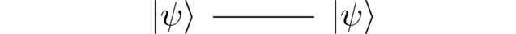
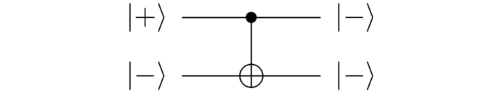

> **摘要**:
>  本文探讨了人类与外星智能接触时，外星文明是否会拥有计算机的可能性，并通过阿兰·图灵的计算理论阐释计算机的起源和未来发展。文章提到，图灵通过对戴维·希尔伯特提出的数学问题的研究，定义了计算机的基本概念，提出了图灵机的概念，这为现代计算机科学奠定了基础。接着，本文讨论了量子计算机的基本原理，强调量子计算机在处理复杂的量子系统模拟方面的潜力，并指明主流计算机在模拟量子系统方面的局限性。通过量子逻辑门和量子比特的讨论，阐释了量子计算的基本操作方式与原理，提出了量子计算机有可能在未来催生新技术和新产业。最后，文章强调了量子计算的长远发展或将改变人类对物质及其控制的理解，开启可编程物质的新纪元。
> 
>  **要点总结**:
>  1. 外星文明可能独立发现计算机，因为计算机是智慧文明思考的必然结果。
>  2. 阿兰·图灵提出的图灵机概念为现代计算机科学奠定了基础。
>  3. 量子计算机在模拟量子系统方面具有显著优势，是解决经典计算机无法高效处理的复杂计算任务的关键。
>  4. 量子计算机的核心操作基于量子比特和量子逻辑门，能够执行丰富的计算任务。
>  5. 未来的量子计算技术可能在化学、材料科学和更广泛的领域催生新兴产业，改变人类对物质的理解与控制。

---

If humanity ever makes contact with alien intelligences, will those aliens possess computers? In science fiction, alien computers are commonplace. If that's correct, it means there is some way aliens can discover computers independently of humans. After all, we’d be very surprised if aliens had independently invented Coca-Cola or Pokémon or the Harry Potter books. If aliens have computers, it’s because computers are the answer to a question that naturally occurs to both human and alien civilizations.

Here on Earth, the principal originator of computers was the English mathematician Alan Turing. In his paper, published in 1936Alan M. Turing, [On Computable Numbers, with an Application to the Entscheidungsproblem](https://quantum.country/assets/Turing1936.pdf) (1936)., Turing wasn’t trying to invent a clever gadget or to create an industry. Rather, he was attacking a problem about the nature of mathematics posed by the German mathematician David Hilbert in 1928. That sounds abstruse, but it’s worth understanding the gist of Hilbert and Turing’s thinking, since it illuminates where computers come from, and what computers will become in the future.

Through his career, Hilbert was interested in the ultimate limits of mathematical knowledge: what can humans know about mathematics, in principle, and what (if any) parts of mathematics are forever unknowable by humans? Roughly speaking, Hilbert’s 1928 problem asked whether there exists a general algorithm a mathematician can follow which would let them figure out whether any given mathematical statement is provable. Hilbert’s hoped-for algorithm would be a little like the paper-and-pencil algorithm for multiplying two numbers. Except instead of starting with two numbers, you’d start with a mathematical conjecture, and after going through the steps of the algorithm you’d know whether that conjecture was provable. The algorithm might be too time-consuming to use in practice, but if such an algorithm existed, then there would be a sense in which mathematics was knowable, at least in principle.

In 1928, the notion of an algorithm was pretty vague. Up to that point, algorithms were often carried out by human beings using paper and pencil, as in the multiplication algorithm just mentioned, or the long-division algorithm. Attacking Hilbert’s problem forced Turing to make precise exactly what was meant by an algorithm. To do this, Turing described what we now call a *Turing machine*: a single, universal programmable computing device that Turing argued could perform any algorithm whatsoever.

Today we’re used to the idea that computers can be programmed to do many different things. In Turing’s day, however, the idea of a universal programmable computer was remarkable. Turing was arguing that a single, fixed device could imitate *any* algorithmic process whatsoever, provided the right program was supplied. It was an amazing leap of imagination, and the foundation of modern computing.

In order to argue that his machine could imitate any algorithmic process, Turing considered what operations a human mathematician could perform when carrying out an algorithm. For each such operation, he had to argue that his machine could always do the same thing. His argument is too long to reproduce in full here, but it’s fun and instructive to see the style of Turing’s reasoning:

> Computing is normally done by writing certain symbols on paper. We may suppose this paper is divided into squares like a child’s arithmetic book. In elementary arithmetic the two-dimensional character of the paper is sometimes used. But such a use is always avoidable, and I think that it will be agreed that the two-dimensional character of paper is no essential of computation. I assume then that the computation is carried out on one-dimensional paper, i.e. on a tape divided into squares. … The behavior of the computer \[Turing is referring to the person performing an algorithm, not the machine!\] at any moment is determined by the symbols which he is observing, and his “state of mind” at that moment. We may suppose that there is a bound 
> $$
> B
> $$
>  to the number of symbols or squares which the computer can observe at one moment. If he wishes to observe more, he must use successive observations. We will also suppose that the number of states of mind which need be taken into account is finite.

Obviously, this was an informal and heuristic argument! Invoking a child’s arithmetic book, or someone’s mental state is not the stuff of a rigorous, bulletproof argument. But Turing’s argument was convincing enough that later mathematicians and scientists have for the most part been willing to accept it. Turing’s machine became the gold standard: an algorithm was what we could perform on a Turing machine. And since that time, computing has blossomed into an industry, and billions of computers based on Turing’s model have been sold.

Still, there’s something discomforting about Turing’s analysis. Might he have missed something in his informal reasoning about what an algorithm is? In 1985, the English physicist David Deutsch suggested a deeper approach to the problem of defining what is meant by an algorithmDavid Deutsch, “Quantum theory, the Church-Turing principle and the universal quantum computer” (1985).. Deutsch pointed out that every algorithm is carried out by a physical system, whether it be a mathematician with paper-and-pencil, a mechanical system such as an abacus, or a modern computer. Deutsch then considered the following question (I've slightly rephrased to make it easier to read):

> **Is there a (single) universal computing device which can efficiently simulate *any* other physical system?**

If there was such a device, you could use it to perform any algorithm whatsoever, because algorithms have to be performed on some kind of physical system. And so the device would be a truly universal computer. What’s more, Deutsch pointed out, you wouldn’t need to rely on informal, heuristic arguments to justify your notion of algorithm, as Turing had done. You could use the laws of physics to prove your device was universal.

So let’s come back to our opening question: will aliens have computers? Deutsch’s question above is a simple, fundamental question about the nature of the universe. It’s the kind of question which alien counterparts to Deutsch could plausibly come to ponder. And the alien civilizations of which they are a part would then be led inexorably to invent computers.

In this sense, computers aren’t just human inventions. They are a fundamental feature of the universe, the answer to a simple and profound question about how the universe works. And they have likely been discovered over and over again by many alien intelligences.

There’s a wrinkle in this story. Deutsch is a physicist with a background in quantum mechanics. And in trying to answer his question, Deutsch observed that ordinary, everyday computers based on Turing’s model have a lot of trouble simulating quantum mechanical systemsResearchers such as Yu Manin and Richard Feynman had previously observed this, and as a result had speculated about computers based on quantum mechanics.. In particular, they seem to be extraordinarily slow and inefficient at doing such simulations. To answer his question affirmatively, Deutsch was forced to invent a new type of computing system, a *quantum computer*. Those quantum computers can do everything conventional computers can do, but are also capable of efficiently simulating quantum-mechanical processes. And so they are arguably a more natural computing model than conventional computers. If we ever meet aliens, my bet is that they’ll use quantum computers (or, perhaps, will have quantum computing brains). After all, it’s likely that aliens will be far more technologically advanced than current human civilization. And so they’ll use the computers natural for any technologically advanced society.

This essay explains how quantum computers work. It’s not a survey essay, or a popularization based on hand-wavy analogies. We’re going to dig down deep so you understand the details of quantum computing. Along the way, we’ll also learn the basic principles of quantum mechanics, since those are required to understand quantum computation.

Learning this material is challenging. Quantum computing and quantum mechanics are famously “hard” subjects, often presented as mysterious and forbidding. If this were a conventional essay, chances are that you’d rapidly forget the material. But the essay is also an experiment in the essay form. As I’ll explain in detail below *the essay incorporates new user interface ideas to help you remember what you read*. That may sound surprising, but uses a well-validated idea from cognitive science known as spaced-repetition testing. More detail on how it works below. The upshot is that anyone who is curious and determined can understand quantum computing deeply and for the long term.

That said, you need some mathematical background to understand the essay. I’ll assume you’re comfortable with complex numbers and with linear algebra – vectors, matrices, and so on. I’ll also assume you’re comfortable with the logic gates used in conventional computers – gates such as AND, OR, NOT, and so on.

If you don’t have that mathematical background, you’ll need to acquire it. How you do that depends on your prior experience and learning preferences – there’s no one-size-fits-all approach, you’ll need to figure it out for yourself. But two resources you may find helpful are: (1) [3Blue1Brown’s series](https://www.youtube.com/playlist?list=PLZHQObOWTQDPD3MizzM2xVFitgF8hE_ab) of YouTube videos on linear algebra; and (2) the more in-depth [linear algebra lectures by Gil Strang](https://ocw.mit.edu/courses/18-06sc-linear-algebra-fall-2011/). Try them out, and if you find them helpful, keep going. If not, explore other resources.

It may seem tempting to try to avoid this mathematics. If you look around the web, there are many flashy introductions to quantum computing that avoid mathematics. There are, for instance, many rather slick videos on YouTube. They can be fun to watch, and the better ones give you some analogies to help make sense of quantum computing. But there’s a hollowness to them. Bluntly, if they don’t explain the actual underlying mathematical model, then you could spend years watching and rewatching such videos, and you’d never really get it. It’s like hanging out with a group of basketball players and listening to them talk about basketball. You might enjoy it, and feel as though you’re learning about basketball. But unless you actually spend a lot of time playing, you’re never going to learn to play basketball. To understand quantum computing, you absolutely must become fluent in the mathematical model.

## Part I: The state of a qubit

As you know, in ordinary, everyday computers the fundamental unit of information is the bit. It’s a familiar but astonishing fact that all the things those computers do can be broken down into patterns of 
$$
0
$$
s and 
$$
1
$$
s, and simple manipulations of 
$$
0
$$
s and 
$$
1
$$
s. For me, I feel this most strongly when playing video games. I’ll be enjoying playing a game, when I’ll suddenly be hit by a realization of the astounding complexity behind the imaginary world visible on my screen:

[Source](https://play0ad.com/media/screenshots/nggallery/page/1)Copyright Wildfire Games, used under a [Creative Commons Attribution-Share Alike 3.0 license](https://trac.wildfiregames.com/browser/ps/trunk/LICENSE.txt)..

Underlying every such image is millions of pixels, described by tens of millions of bits. When I move the game controller, I am effectively conducting an orchestra, tens of millions strong, organized through many layers of intermediary ideas, in such a way as to create enjoyment and occasionally sheer delight.

I’ve described a bit as an abstract entity, whose state is 
$$
0
$$
 or 
$$
1
$$
. But in the real world, not the world of mathematics, we must find some way of storing our bits in a physical system. That can be done in many different ways. In your computer’s memory chips, bits are most likely stored as tiny electric charges on nanometer-scale capacitors (i.e., little reservoirs of charge), just above the surface of the chip. Old-fashioned hard disks take a different approach, using tiny magnets to store bits. Furthermore, different types of memory use different types of capacitor; different types of hard disk use different approaches to magnetization.

For the most part you don’t notice these differences when you use your computer. Computer designers work very, very hard to make the details of the physical instantiation of the bits invisible not just to the user, but also (often) invisible even to programmers. Many programmers never think about whether a bit is stored in fast on-microprocessor cache memory, in the dynamic RAM chips, or in some type of virtual memory (say, on a hard disk). There are exceptions – programmers working on high-performance programs sometimes do think about these things, to make their programs as fast as possible. But for many programmers it doesn’t much matter how bits are stored. Rather, they can think of the bit in purely abstract terms, as having a state which is either 
$$
0
$$
 or 
$$
1
$$
.

In a manner similar to the way conventional computers are made up of bits, quantum computers are made up of *quantum bits*, or *qubits*. Just like a bit, a qubit has a *state*. But whereas the state of a bit is a number (
$$
0
$$
 or 
$$
1
$$
), the state of a qubit is a *vector*. More specifically, *the state of a qubit is a vector in a two-dimensional vector space. This vector space is known as state space.* For instance, here’s a possible state for a qubit:

$$
\left[ \begin{array}{c} 1 \\ 0 \end{array} \right]
$$

That perhaps sounds strange! What does it mean that the state of a qubit is a two-dimensional vector? We’re going to unpack the answer slowly and gradually. You won’t have a single epiphany where you think “ahah, that’s what a qubit is!” Rather, you’ll gradually build up many details in your understanding, until you get to the point where you’re comfortable working with qubits, with quantum computations, and more generally with quantum mechanics.

One way qubits are similar to bits: we’ve said absolutely nothing about what the qubit actually *is*, physically. Maybe the state of the qubit is being stored somehow on an electron, or a photon, or an atom. Or maybe it’s being stored in something stranger, perhaps inside some exotic particle or state of matter, even further removed from our everyday experience.

For our purposes in this essay none of this matters, no more than you should worry about what type of capacitor is storing the bits inside your computer’s RAM. What you should take away is that: (a) qubits have a state; (b) much like a bit, that state is an abstract mathematical object; but (c) whereas a bit’s abstract state is a number, 
$$
0
$$
 or 
$$
1
$$
, the state of a qubit is a 
$$
2
$$
\-dimensional vector; (d) we call the 
$$
2
$$
\-dimensional vector space where states live state space.

Alright, let’s review what we’ve learnt. Please indulge me by answering the questions just below. It’ll only take a few seconds – for each question, think about what you believe the answer to be, click to reveal the actual answer, and then mark whether you remembered or not. If you can recall, that’s great. If not, that’s also fine, just note the correct answer, and continue.

## A medium which makes memory a choice

Perhaps you correctly recalled the answers to all three questions just now. Even if so, will you remember the answers in a week? In a year? Human memory is fallible. If your memory is like mine, you *might* vaguely remember the answers in a week: “what’s the state of a qubit, oh yes, it’s a vector!” But the chances you’ll remember in a month or a year are low. And if you forget such things, you won’t have any durable understanding of quantum computing.

How can we ensure you don’t remember these answers for just a few minutes or a few hours, but well into the future, perhaps even permanently?

One way is for you to be supremely virtuous, to keep coming back and re-reviewing the material until it’s firmly locked in your memory. If you are such a virtuous person, congratulations! But for the other 99 percent of us that’s not likely. What can we do?

For more than a century, cognitive scientists have studied human memory. And they’ve figured out some simple strategies that ensure you’ll remember something permanently. The single most important idea is to *re-test you on your knowledge, with expanding time intervals between tests.*

As an example, consider the question above: “How many dimensions does the state space of a qubit have?” If you got it right, you’d ideally be tested again in a few weeks. And if you got it right again, you’d be tested again a few months after that. And so on, a gradually expanding schedule. If you get the question wrong on one of those tests, the schedule would contract, so you can relearn the answer.

It turns out that such an expanding schedule is the optimal way to retain information. Each time you’re re-tested your brain consolidates the answer a little better into long-term memory, until eventually it’s permanent.

Spaced-repetition testing is a simple idea, but has profound consequences. First, it doesn’t take much overall time. Because of the expanding test schedule, it typically only takes a few minutes of total review time to memorize the answer to a question for years or decades. I won’t go through the math showing that, but you can see it [worked out elsewhere](http://augmentingcognition.com/ltm.html#Anki_analysis).

Second, spaced-repetition testing gives you a guarantee you will remember the answer to the question. For the most part our memories work in a haphazard manner. We read or hear something interesting, and hope we remember it in future. Spaced-repetition testing makes memory into a choice.

This sounds great, but also like you’ll need to be very disciplined in re-testing yourself. Fortunately, the computer can handle all the scheduling for you. And so this essay isn’t just a conventional essay, it’s also a new medium, a *mnemonic medium* which integrates spaced-repetition testing. *The medium itself makes memory a choice.*

This comes at some cost: you’re committing to future review. But consider what that buys you. This essay will likely take you an hour or two to read. In a conventional essay, you’d forget most of what you learned over the next few weeks, perhaps retaining a handful of ideas. But with spaced-repetition testing built into the medium, a small additional commitment of time means you will remember all the core material of the essay. Doing this won’t be difficult, it will be easier than the initial read. Furthermore, you’ll be able to read other material which builds on these ideas; it will open up an entire world.

This spaced-repetition approach is why the questions only require a few seconds to read and answer. They’re not complex exercises, in the style of a textbook. Rather, the questions have a different point: the promise each question makes is that you will remember the answer forever. It’s to permanently change your thinking.

So, I invite you to set up an account by signing in below. If you do so, your review schedule for each question in the essay will be tracked, and you’ll receive periodic reminders containing a link which takes you to an online review session. That review session isn’t this full essay – rather, it looks just like the question set you answered above, but contains instead *all* the questions which are due, so you can quickly run through them. The time commitment will usually be a few minutes per session – a little more early on, when questions need frequent re-testing, but rapidly dropping off. You can study on your phone while grabbing coffee, or standing in line, or going for a walk, or in transit. The return for that small time commitment is greatly improved fluency in basic quantum computing and quantum mechanics. And that understanding will be internalized, a part of who you are, retained for years instead of days.

To keep this promise, we’re tracking your review schedule for each question, and sending you occasional reminders to check in, and to run through the questions which are due. You can review on your phone while grabbing coffee, or standing in line, or going for a walk, or on transit. The return for that commitment is greatly improved fluency in basic quantum computing and quantum mechanics. And that understanding will be internalized, a part of who you are, retained for years instead of weeks.

Please sign in so we can save your progress and let you know the best times to review.

Thank you! Your progress will be saved as you read.

Having extolled the virtues of spaced-repetition testing, let’s try another question:

This question is similar to an earlier question: “How many dimensions does the state space of a qubit have?” It may seem inefficient to have such similar questions, but it helps build fluency with the material when you have the “same” information encoded into memory in multiple ways, triggering off different associations. And so many of the questions below have this nature, elaborating ideas in multiple ways.

## Connecting qubits to bits: the computational basis states

Let’s get back to understanding qubits. I’ve described what the state of a qubit is, but given no hint about how (or whether) that’s connected to the state of a classical bit. (Henceforth we’ll use the phrase “classical bit” instead of “conventional bit”, after “classical physics”). In fact, there are two special quantum states which correspond to the 
$$
0
$$
 and 
$$
1
$$
 states of a classical bit. The quantum state corresponding to 
$$
0
$$
 is usually denoted 
$$
|0\rangle
$$
. That’s a fancy notation for the following vector:

$$
|0\rangle := \left[ \begin{array}{c} 1 \\ 0 \end{array} \right].
$$

This special state 
$$
|0\rangle
$$
 is called a *computational basis state*.

It’s tempting to see the 
$$
|0\rangle
$$
 notation and wonder what all the separate pieces mean – what, for instance, does the 
$$
|
$$
 mean; what does the 
$$
\rangle
$$
 mean; and so on?

In fact, it’s best to regard 
$$
|0\rangle
$$
 as a single symbol, standing for a single mathematical object – that vector we just saw above, 
$$
\left[ \begin{array}{c} 1 \\ 0 \end{array} \right]
$$
. The 
$$
|
$$
 and 
$$
\rangle
$$
 don’t really have separate meanings except to signify this is a quantum state. In this, 
$$
|0\rangle
$$
 is much like the symbol 
$$
0
$$
: both stand for a single mathematical entity. And, as we’ll gradually come to see, a quantum computer can manipulate 
$$
|0\rangle
$$
 in ways very similar to how a conventional computer can manipulate 
$$
0
$$
.

This notation with 
$$
|
$$
 and 
$$
\rangle
$$
 is called the *ket* notation, and things like 
$$
|0\rangle
$$
 are called *kets*. But don’t be thrown off by the unfamiliar terminology – a ket is just a vector, and when we say something is a ket, all we mean is that it’s a vector.

That said, the term ket is most often used in connection with notations like 
$$
|0\rangle
$$
. That is, we wouldn’t usually refer to 
$$
\left[ \begin{array}{c} 1 \\ 0 \end{array} \right]
$$
 as a ket; we’d call it a vector, instead. If you’re a fan of really sharp definitions and strict consistency, this may seem vague and wishy-washy, but in practice doesn’t cause confusion. It’s just a convention to be aware of!

Alright, so 
$$
|0\rangle
$$
 is a computational basis state for a qubit, and plays much the same role as 
$$
0
$$
 does for a classical bit. It won’t surprise you to learn that there is another computational basis state, denoted 
$$
|1\rangle
$$
, which plays the same role as 
$$
1
$$
 does for a bit. Like 
$$
|0\rangle
$$
, 
$$
|1\rangle
$$
 is just a notation for a two-dimensional vector, in this case:

$$
|1\rangle := \left[ \begin{array}{c} 0 \\ 1 \end{array} \right].
$$

Again, we’ll gradually come to see that 
$$
|1\rangle
$$
 has all the properties we expect of the 
$$
1
$$
 state of a classical bit.

Time for a few more questions. A reminder that these have a different purpose to conventional textbook exercises. Textbook exercises are about setting you challenges; the point of the questions below is instead to help you commit the answer to long-term memory.

## How to use (or not use!) the questions

> Mathematics is a process of staring hard enough with enough perseverance at the fog of muddle and confusion to eventually break through to improved clarity. I’m happy when I can admit, at least to myself, that my thinking is muddled, and I try to overcome the embarrassment that I might reveal ignorance or confusion. Over the years, this has helped me develop clarity in some things, but I remain muddled in many others.
> 
> — William Thurston,  
> Fields-medal winning mathematician

How should you think about it when you get one of these embedded questions wrong? Often in life testing means being judged, and being judged can be uncomfortable. If you don’t know the answer to a question you may feel like you’ve failed.

But the purpose of these questions has nothing to do with external judgment. Rather, they have two quite different purposes. One purpose is, as explained earlier, to help strengthen your memory, so your new knowledge is consolidated in your long-term memory. The second purpose is to help you diagnose what you do and don’t know, and to help you fill the gaps as rapidly as possible.

In this view, getting a question wrong is useful information. It pinpoints exactly what you need to understand, and puts the onus on you to figure it out. Honestly, the appropriate response to getting a question wrong is probably to throw your hands up in the air and shout “wonderful!”, since it’s at those points of what may appear to be “failure” that your learning rate will be at its highest.

With that said, it’s a common canard in education that “it doesn’t matter if you get something right or wrong, so long as you’re learning”. Unfortunately, that statement is often bullshit. If getting something right or wrong is used to determine your grade, or to influence other people’s opinion of you, then it damn well does matter.

For that reason, I suggest keeping your results private. They are for you alone, and their purpose should be solely to help you learn as rapidly as possible. If they’re not helping you – if they’re making you feel bad, for instance, or being used to judge you – then stop doing the questions.

You’ve probably noticed the questions are self-assessed. If you want to mark yourself “correct” sometimes, even when you’re not, go for it! What impact do you think that will have on your learning? Do you enjoy the slightly transgressive feeling? I must admit that I do. Don’t be embarrassed, if so: this is supposed to be, above all else, fun. Or try marking yourself wrong when you’re correct, or skipping the questions entirely. What impact do these actions have on your learning? The point is to figure out how to engage with the questions to learn as rapidly as possible. And that means experimenting playfully with how you engage, to find what works for you.

## How to approach this essay?

This essay is an unusual form. It’s certainly not a product in the conventional startup sense; it’s a research project, an experiment in developing a new and improved form of reading. A conventional product would aim to draw you in, and form a regular, long-term habit. There’d be tens (or hundreds) of millions of words of content for you to read, and lots of people on social media excitedly pointing you toward that content. You’d engage every day, learning more and more and more.

That’s not what’s going on here. “Quantum Computing for the Very Curious” is, instead, like a video game or book or movie, a single one-off project for you to work through. So you commit to it for a while, and then the experience is over. (Also, like a video game, book, or movie, sequels are planned!)

With that said, it’s different from those forms too. Many people consume games, books, and movies as binge activities, hungrily devouring them until complete. “Quantum Computing for the Very Curious” is, by contrast, intentionally an experience spread out over time. Yes, you probably binge at first, working your way quickly through the text over a couple of hours. But then you return occasionally for brief review sessions, prompted by our notifications. That form of spaced testing is the best way for you to remember what you read. Still, while it might be optimal from the point of view of memory formation, it means not using some of the techniques that games, books, and movies use to keep you interested. Nonetheless, I hope you’ll be willing to trust the team at “Quantum Computing for the Very Curious”, and to participate in the experiment.

How can you get the most out of reading in this new mnemonic medium? The ideal is to do an initial read, followed by a few short review sessions over the coming weeks (prompted by our notifications) to help you internalize the ideas. Then (optionally) a followup read, where you can more deeply understand the material. And finally, some sessions of followup review to ensure you remember for the long term:

As you work through this process, we’ll track your overall progress toward completion (meaning: most questions reliably committed to memory), and each time you review we’ll show you that progress.

This is a larger commitment than traditional reading. But for a small factor in effort, you will understand the material far more deeply, and remember it for more than 10x as long. What’s more, while the reading process above looks complex, you’ll be cued at each step by reminders that will help the review process become a habit. Trust the reminders, and this will all happen as a matter of course.

You may find the essay particularly helpful if you’re taking an introductory class on quantum computing. If that’s your situation, I advise you to read the entire essay immediately at the beginning of semester (or even before), answering all the questions as you go. Then continue to follow the procedure described just above, taking a few minutes to complete each review session, prompted by the reminders you’ll be sent. This will make it far easier to understand the rest of the course you’re taking, and help you get much more out of it.

## General states of a qubit

The computational basis states 
$$
|0\rangle
$$
 and 
$$
|1\rangle
$$
 are just two possible states for a qubit. Many more states are possible, and those extra states endow qubits with capabilities not available to ordinary classical bits. In general, remember, a quantum state is a two-dimensional vector. Here’s an example, with a graphical illustration emphasizing the vector nature of the state:

In this example, the state 
$$
0.6|0\rangle+0.8|1\rangle
$$
 is just 
$$
0.6
$$
 times the 
$$
|0\rangle
$$
 vector, plus 
$$
0.8
$$
 times the 
$$
|1\rangle
$$
 vector. In the usual vector notation that means the state is:

$$
0.6|0\rangle + 0.8 |1\rangle = 0.6 \left[ \begin{array}{c} 1 \\ 0 \end{array} \right] + 0.8 \left[ \begin{array}{c} 0 \\ 1 \end{array} \right] = \left[ \begin{array}{c} 0.6 \\ 0.8 \end{array} \right].
$$

I’ve been talking about quantum states as two-dimensional vectors. What I didn’t yet mention is that in general they’re *complex vectors*, that is, they can have complex numbers as entries. Of course, the example just shown has real entries, as do the computational basis states. But for a general quantum state the entries can be complex numbers. So, for instance, another quantum state is the vector

$$
\frac{1+i}{2} |0\rangle + \frac{i}{\sqrt{2}} |1\rangle,
$$

which can be written in the conventional component vector representation as

$$
\left[ \begin{array}{c} \frac{1+i}{2} \\ \frac{i}{\sqrt{2}} \end{array} \right].
$$

Because quantum states are in general vectors with complex entries, the illustration above shouldn’t be taken too literally – the plane is a real vector space, not a complex vector space. Still, visualizing it as a plane is sometimes a handy way of thinking.

I’ve said what a quantum state is, as a mathematical object: it’s a two-dimensional vector in a complex vector space. But why is that true? What does it mean, physically, that it’s a vector? Why a complex vector space, and how should we think about the complex numbers? And what’s a quantum state good for, anyway?

These are good questions. But they do take some time to answer. For context consider that the discovery of quantum mechanics wasn’t a single event, but occurred over 25 years of work, from 1900 to 1925. Many Nobel prizes were won for milestones along the way. That includes Albert Einstein’s Nobel Prize, won primarily for work related to quantum mechanics (not relativity, as people sometimes assume).

When some of the brightest people in the world struggle for 25 years to develop a theory, it’s not an obvious theory! In fact, the idea of describing a simple quantum system using a complex vector in two dimensions summarizes much of what was learned over that 25 years. In that sense, it’s quite a simple and beautiful statement. But it’s not an obvious statement, and it’s not unreasonable that it might take a few hours to understand. That’s better than taking 25 years to understand!

As part of that journey toward understanding, let’s get familiar with some more nomenclature commonly used for quantum states.

One of the most common terms is *superposition*. People will say a state like 
$$
0.6|0\rangle+0.8|1\rangle
$$
 is a *superposition* of 
$$
|0\rangle
$$
 and 
$$
|1\rangle
$$
. All they mean is that the state is a linear combination of 
$$
|0\rangle
$$
 and 
$$
|1\rangle
$$
. You may wonder why they don’t just say “linear combination” (and sometimes they do), but the reason is pretty much the same reason English-speakers say “hello” while Spanish-speakers say “hola” – the two terms come out of different cultures and different histories.

Another common term is *amplitude*. An amplitude is the coefficient for a particular state in superposition. For instance, in the state 
$$
0.6|0\rangle+0.8|1\rangle
$$
 the amplitude for 
$$
|0\rangle
$$
 is 
$$
0.6
$$
, and the amplitude for 
$$
|1\rangle
$$
 is 
$$
0.8
$$
.

We’ve learnt that a quantum state is a two-dimensional complex vector. Actually, it can’t be just any old vector, a fact you might have guessed from the very particular amplitudes in some of the examples above. There’s a constraint. The constraint is this: *the sums of the squares of the amplitudes must be equal to 
$$
1
$$
*.

So, for example, for the state 
$$
0.6 |0\rangle+0.8 |1\rangle
$$
 the sum of the squares of the amplitudes is 
$$
0.6^2+0.8^2
$$
, which is 
$$
0.36+0.64 = 1
$$
, as we desired.

For a more general quantum state, the amplitudes can be complex numbers, let’s denote them by 
$$
\alpha
$$
 and 
$$
\beta
$$
 so the state is 
$$
\alpha|0\rangle+\beta|1\rangle
$$
. The constraint is now that the sum of the squares of the amplitudes is 
$$
1
$$
, i.e., 
$$
|\alpha|^2+|\beta|^2 = 1
$$
.

This is called the *normalization constraint*.

It’s called that because if you think of 
$$
|0\rangle
$$
 and 
$$
|1\rangle
$$
 as orthonormal vectors, as I drew them earlier,

then the normalization constraint is the requirement that the length of the state is equal to 
$$
1
$$
. So it’s a unit vector, or a *normalized* vector, and that’s why this is called a normalization constraint.

Summing up all these ideas in one sentence: *the quantum state of a qubit is a vector of unit length in a two-dimensional complex vector space known as state space.*

We’ve gone through a few refinements of this sentence but that sentence is the final version – there’s no missing parts, or further refinement necessary! That’s what the quantum state of a qubit is. Of course, we will explore the definition further, deepening our understanding, but it will always come back to that basic fact.

One common gotcha in thinking about qubits is to look at the 
$$
|0\rangle
$$
 state and think it must be the zero vector in the vector space, often denoted 
$$
0
$$
. But that’s not right at all. The zero vector is at the origin, 
$$
0 = \left[ \begin{array}{c} 0 \\ 0 \end{array} \right]
$$
, while the 
$$
|0\rangle
$$
 vector is quite different, 
$$
|0\rangle = \left[ \begin{array}{c} 1 \\ 0 \end{array} \right] \neq 0
$$
. It’s just an unfortunate notational accident that 
$$
|0\rangle
$$
 looks as though it should be the 
$$
0
$$
 vector. Fortunately, in practice this distinction is easy to get used to, and doesn’t cause confusion. But it’s worth noting.

## What does the quantum state mean? Why is it a vector in a complex vector space?

> My own conclusion is that today there is no interpretation of quantum mechanics that does not have serious flaws. This view is not universally shared. Indeed, many physicists are satisfied with their own interpretation of quantum mechanics. But different physicists are satisfied with different interpretations.
> 
> — Steven Weinberg,  
> Nobel Laureate in Physics

Let’s come back to the question of what the quantum state means, and why it’s a vector in a complex vector space.

In the case of classical bits, it’s pretty easy to think about the state. You can think of the 
$$
0
$$
 or 
$$
1
$$
 states of a bit as corresponding to two very different (but stable) states of a physical system. For instance, a 
$$
0
$$
 or 
$$
1
$$
 can be indicated by the presence or absence of a hole at some location in a punch card. And so a single punch card can be used to store hundreds or thousands of bits:

Source: [Gwern](https://commons.wikimedia.org/wiki/File:Blue-punch-card-front.png) (2006).

Most ways of storing classical bits are variations on this idea. For instance, the dynamic random access memory (RAM) inside your computer is based on the idea of having two tiny metal plates separated by a miniscule gap. Electric charge is stored on those plates, setting up an electric field between them. The 
$$
0
$$
 and 
$$
1
$$
 states of the bit correspond to two different configurations of charge on the plates. In practice, real dynamic RAM systems use slightly more elaborate ideas, but that’s the heart of it. This is harder to think about than punch cards – most of us don’t have so much experience thinking about moving electric charges around metal plates. But it’s still pretty concrete.

So, how should we think about quantum states? The 
$$
|0\rangle
$$
 and 
$$
|1\rangle
$$
 states often aren’t difficult to think about, since they often correspond to very concrete physical states of the world, much like classical bits. Indeed, in some proposals they may correspond to different charge configurations, similar to dynamic RAM. Or perhaps a photon being in one of two different locations in space – again, a pretty simple, concrete notion, even if photons aren’t that familiar. There are also many more exotic proposals for the 
$$
|0\rangle
$$
 and 
$$
|1\rangle
$$
 states. But by and large you can think of the computational basis states as representing a physical system in one of two well-defined configurations.

Of course, qubits have states which aren’t computational basis states, states like 
$$
0.6|0\rangle+0.8|1\rangle
$$
. How should we think about such superposition states? At least in popular media accounts, a very common description is that a state like 
$$
0.6|0\rangle + 0.8|1\rangle
$$
 is *“simultaneously”* in the 
$$
|0\rangle
$$
 state and the 
$$
|1\rangle
$$
 state.

I must confess, I don’t understand what people mean by this. As far as I can tell, what they’re trying to do is explain the quantum state in terms of classical concepts they’re already familiar with. But I can’t make much sense of it – saying 
$$
0.6|0\rangle + 0.8|1\rangle
$$
 is *simultaneously* in the 
$$
|0\rangle
$$
 state and the 
$$
|1\rangle
$$
 state seems like word salad, and makes about as much sense to me as Lewis Carroll’s nonsense poem *Jabberwocky*:

> ’Twas brillig, and the slithy toves  
>      Did gyre and gimble in the wabe:  
> All mimsy were the borogoves,  
>     And the mome raths outgrabe.  
> …

Of course, lacking any other interpretation it’s tempting to try to impose our classical prejudices on the quantum state. Or, even if you reject that, to get hung up worrying about what a quantum state is. But the trouble is that there is enormous disagreement amongst physicists themselves about how to think about the quantum state. Indeed, many active researchers are trying to understand what the correct way of thinking about the quantum state is, exploring multiple approaches in great depth. So we’re going to defer worrying too much about this until later.

To understand why we’re deferring, suppose someone gives you a Rubik’s cube (or some other challenging puzzle or game) for the first time, all scrambled up. You start to theorize about the best ways of solving it, how to understand it, and so on. But you never actually play around with it, getting familiar with how it behaves.

Often the best way to understand something is to first use it, to get comfortable, to play a lot, and to do lots of informal experiments. As you build familiarity you understand why things are the way they are. At that point, you can go back and better understand the meaning of the basics.

Well, we can think of quantum computing and quantum mechanics as an especially complicated type of puzzle! So the strategy we’re taking is to start with the mathematics of quantum computing – we’ll keep getting familiar with qubits and the quantum state, and developing the consequences. Doing that is how we’ll build up intuition, and will give us the chops needed to come back and think harder about the meaning of the quantum state.

## Part II: Introducing quantum logic gates

In Part I we learned about the state of a qubit. But in order to quantum compute, it’s not enough just to understand quantum states. We need to be able to do things with them! We do that using *quantum logic gates*.

A quantum logic gate is simply a way of manipulating quantum information, that is, the quantum state of a qubit or a collection of qubits. They’re analogous to the classical logic gates used in ordinary, everyday computers – gates such as the AND, OR, and NOT gates. And, much like classical gates’ role in conventional computers, quantum gates are the basic building blocks of quantum computation. They’re also a convenient way of describing many other quantum information processing tasks, such as quantum teleportation.

In Part II of this essay we’ll discuss several types of quantum logic gate. As we’ll see, the gates we discuss are sufficient to do any quantum computation. In particular, much as any classical computation can be built up using AND, OR, and NOT gates, the quantum gates we describe over the next few sections suffice to do any quantum computation.

Many of the quantum gates we’ll learn about are based on familiar classical logic gates. But a few are different. Those differences appear innocuous, almost trivial. But in those differences lies the power of quantum computation, and the possibility for quantum computers to be vastly superior to classical computers.

Part II is, frankly, a bit of a slog. Learning quantum gates is like learning basic vocabulary in a new language: there’s no getting round spending a fair bit of time working on it. Still, the spaced-repetition testing should make this basic memory work much easier than is ordinarily the case. And it will prepare you well for some of the more conceptual issues discussed in Part III, where we return to high-level questions about the ultimate nature of computation, and what quantum computers are good for.

## The quantum NOT gate

Let’s take a look at our very first quantum logic gate, the *quantum NOT gate*. As you can no doubt surmise, the quantum NOT gate is a generalization of the classical NOT gate. On the computational basis states the quantum NOT gate does just what you’d expect, mimicking the classical NOT gate. That is, it takes the 
$$
|0\rangle
$$
 state to 
$$
|1\rangle
$$
, and vice versa:

$$
NOT|0\rangle = |1\rangle
$$

$$
NOT|1\rangle = |0\rangle
$$

But the computational basis states aren’t the only states possible for a qubit. What happens when we apply the NOT gate to a general superposition state, that is, 
$$
\alpha|0\rangle+\beta|1\rangle
$$
? In fact, it does pretty much the simplest possible thing: it acts linearly on the quantum state, interchanging the role of 
$$
|0\rangle
$$
 and 
$$
|1\rangle
$$
:

$$
NOT (\alpha|0\rangle +\beta|1\rangle) = \alpha|1\rangle+\beta |0\rangle.
$$

I’ve been using the notation NOT for the quantum NOT gate. But for historical reasons people working on quantum computing usually use a different notation, the notation 
$$
X
$$
. And so the above may be rewritten:

$$
X (\alpha|0\rangle +\beta|1\rangle) = \alpha|1\rangle+\beta |0\rangle.
$$

I’ll use the terms 
$$
X
$$
 gate and NOT gate interchangeably.

Historically, the notation 
$$
X
$$
 traces its origin to 1927, when the physicist Wolfgang Pauli introduced an operation 
$$
s_x
$$
 (often written 
$$
\sigma_x
$$
 in textbooks today) to help describe rotations of certain objects around the 
$$
x
$$
 spatial axis. This operation later became of interest to people working on quantum computing. But by that point the 
$$
s
$$
 (and the connection to rotation) was irrelevant, and so 
$$
s_x
$$
 just became 
$$
X
$$
.

What we’ve seen so far are very algebraic ways of writing down the way the 
$$
X
$$
 gate works. There’s an alternate representation, the *quantum circuit* representation. In a quantum circuit we depict an 
$$
X
$$
 gate as follows:

The line from left to right is what’s called a *quantum wire*. A quantum wire represents a single qubit. The term “wire” and the way it’s drawn looks like the qubit is moving through space. But it's often helpful to instead think of left-to-right as representing the passage of time. So the initial segment of wire is just the passage of time, with nothing happening to the qubit. Then the 
$$
X
$$
 gate is applied. And then the quantum wire continues, leaving the desired output.

Sometimes we’ll put the input and output states explicitly in the quantum circuit, so we have something like:

So that’s the quantum circuit representation of the 
$$
X
$$
 gate. It is, in fact, our first quantum computation. A simple computation, involving just a single qubit and a single gate, but a genuine quantum computation nonetheless!

There’s a third representation for the 
$$
X
$$
 gate that’s worth knowing about, a representation as a 
$$
2 \times 2
$$
 matrix:

$$
X = \left[ \begin{array}{cc} 0 & 1 \\ 1 & 0 \end{array} \right].
$$

To understand in what sense this is a representation of the NOT gate, recall that 
$$
\alpha|0\rangle + \beta|1\rangle
$$
 is just the vector 
$$
\left[ \begin{array}{c} \alpha \\ \beta \end{array} \right]
$$
. And so we have:

$$
\begin{aligned} \left[ \begin{array}{cc} 0 & 1 \\ 1 & 0 \end{array} \right] (\alpha|0\rangle + \beta|1\rangle) & = \left[ \begin{array}{cc} 0 & 1 \\ 1 & 0 \end{array} \right] \left[ \begin{array}{c} \alpha \\ \beta \end{array} \right] \\ & = \left[ \begin{array}{c} \beta \\ \alpha \end{array} \right] \\ & = \alpha|1\rangle+\beta|0\rangle \\ & = X (\alpha|0\rangle + \beta|1\rangle). \end{aligned}
$$

This tells us that 
$$
X
$$
 and 
$$
\left[ \begin{array}{cc} 0 & 1 \\ 1 & 0 \end{array} \right]
$$
 act in exactly the same way on all vectors, and thus are the same operation. In fact, as we’ll see later, it turns out that all quantum gates can be thought of as matrices, with the matrix entries specifying the exact details of the gate.

By the way, regarding the 
$$
X
$$
 gate as a matrix clarifies what may have been a confusing point earlier. I wrote the 
$$
X
$$
 gate as having the action 
$$
X|0\rangle = |1\rangle
$$
, 
$$
X|1\rangle = |0\rangle
$$
. Implicitly – I never quite said this, though it’s true – the 
$$
X
$$
 gate is a mathematical function, taking input states to output states. But when we write functions we usually use parentheses, so why didn’t I write 
$$
X(|0\rangle)
$$
 and similarly for 
$$
|1\rangle
$$
? The reason is that for linear functions, i.e., matrices, it’s conventional to omit parentheses and just write 
$$
X|0\rangle
$$
 – function application *is* just matrix multiplication.

## Quantum wires: why the simplest quantum circuit is often also the hardest to implement

We’ve now seen a simple quantum circuit and quantum logic gate. But it’s not quite the simplest possible quantum circuit. The simplest possible quantum circuit does nothing at all. That is, it’s a single quantum wire:

This circuit is just a single qubit being preserved in time. To be more explicit, if some arbitrary quantum state 
$$
|\psi\rangle
$$
 is input to the circuit, then the exact same state 
$$
|\psi\rangle
$$
 is output (it’s common practice to use the Greek letter 
$$
\psi
$$
 to denote an arbitrary quantum state):

Mathematically, this circuit is trivial. But physically it’s far from trivial. In many physical systems, the quantum wire is actually one of the hardest quantum computations to implement!

The reason is that quantum states are often incredibly fragile. If your qubit is being stored in some tiny system – perhaps a single photon or a single atom – then it’s very, very easy to disturb that state. It really doesn’t take much to upset an atom or a photon. And so while quantum wires are mathematically trivial, they can be one of the hardest elements to build in real systems.

That said, there are some systems where quantum wires are easy to implement. If you store your qubit in a neutrino then the state will actually be pretty well preserved. The reason is that neutrinos barely interact with other forms of matter at all – a neutrino can easily pass through a mile of lead without being disturbed. But while it’s intriguing that neutrinos are so stable, it doesn’t mean they make good qubits. The trouble is that since there’s no easy way of using ordinary matter to interact with them, we can’t manipulate their quantum state in a controlled fashion, and so can’t implement a quantum gate.

There’s a tension here that applies to many proposals to do quantum information processing, not just neutrinos. If we want to store the quantum state, then it’s helpful if our qubits only interact very weakly with other systems, so those systems don’t disrupt them. But if the qubits only interact weakly with other systems then that also makes it hard to manipulate the qubits. Thus, systems which make good quantum wires are often hard to build quantum gates for. Much of the art of designing quantum computers is about finding ways to navigate this tension. Often, that means trying to design systems which interact weakly most of the time, but some of the time can be caused to interact strongly, and so serve as part of a quantum gate.

You’ll note that some of the questions above have a different flavor to the questions earlier in the essay. Early questions had cut-and-dried answers. The answer to the question “What’s the standard notation for the quantum NOT gate?” is just: “
$$
X
$$
”. But some of the questions above have less well-specified answers. They’re a little fluffy.

This fluffiness may cause you difficulties as you decide how to respond. Your answer to the question “Why is it that systems which make good quantum wires are often hard to build quantum gates for?” may not quite match the answer given. If this is the case, don’t worry. You should mark yourself correct if you’re confident you’ve understood the point, even in terms different from my phrasing. And mark yourself incorrect if the point still needs reinforcement.

## A multi-gate quantum circuit

Let’s take a look at a simple multiple-gate quantum circuit. It’s just a circuit with two 
$$
X
$$
 gates in a row:

It’s worth pausing for a moment, and trying to guess what this circuit does to the input state. It’s worth doing this even if you usually find this kind of guessing frustrating. Even when you get stuck, building up strategies for dealing with stuckness is part of learning any difficult subject. So take a minute or so now.

We’ll try two different ways of figuring out what’s going on. Here’s one approach, based on applying 
$$
X
$$
 twice to an arbitrary input state, 
$$
\alpha|0\rangle+\beta|1\rangle
$$
. It’s simple algebra, using the fact 
$$
X
$$
 interchanges the 
$$
|0\rangle
$$
 and 
$$
|1\rangle
$$
 states:

$$
\begin{aligned} X(X(\alpha|0\rangle+\beta|1\rangle)) & = X(\alpha|1\rangle + \beta|0\rangle) \\ & = \alpha|0\rangle + \beta|1\rangle \end{aligned}
$$

So the net effect is to recover the original quantum state, no matter what that state was. In other words, this circuit is equivalent to a quantum wire:

A second way of seeing this is based on the matrix representation we found earlier for the 
$$
X
$$
 gate. Observe that if the input is some arbitrary quantum state 
$$
|\psi\rangle
$$
, then after the first gate the state is 
$$
X|\psi\rangle
$$
, and after the second gate the state is 
$$
X X |\psi\rangle
$$
. Then we observe that the product 
$$
X X
$$
 is

$$
\begin{aligned} XX & = \left[ \begin{array}{cc} 0 & 1 \\ 1 & 0 \end{array} \right] \left[ \begin{array}{cc} 0 & 1 \\ 1 & 0 \end{array} \right] \\ & = \left[ \begin{array}{cc} 1 & 0 \\ 0 & 1 \end{array} \right]. \end{aligned}
$$

That is, 
$$
XX
$$
 is the identity operation, and so the output 
$$
XX|\psi\rangle
$$
 is just the original input 
$$
|\psi\rangle
$$
. In other words, two 
$$
X
$$
 gates is the same as a quantum wire. And so we’ve arrived at the same conclusion in a different way, using matrix multiplication. Doing such matrix multiplications is a pretty common way of analyzing quantum circuits.

## The Hadamard gate

We’ve seen our first quantum gate, the NOT or 
$$
X
$$
 gate. Of course, the 
$$
X
$$
 didn’t appear to do all that much beyond what is possible with a classical NOT gate. In this section I introduce a gate that clearly involves quantum effects, the *Hadamard* gate.

As with the 
$$
X
$$
 gate, we’ll start by explaining how the Hadamard gate acts on computational basis states. Denoting the gate by 
$$
H
$$
, here’s what it does:

$$
H|0\rangle = \frac{|0\rangle +|1\rangle}{\sqrt 2}
$$

$$
H|1\rangle = \frac{|0\rangle -|1\rangle}{\sqrt 2}
$$

Of course, 
$$
|0\rangle
$$
 and 
$$
|1\rangle
$$
 aren’t the only quantum states. How does the Hadamard gate act on more general quantum states?

It won’t surprise you to learn that it acts linearly, as did the quantum NOT gate. In particular, the Hadamard gate takes a superposition 
$$
\alpha|0\rangle + \beta|1\rangle
$$
 to the corresponding superposition of outputs:

$$
H(\alpha|0\rangle + \beta|1\rangle) = \alpha \left( \frac{|0\rangle+|1\rangle}{\sqrt 2} \right) + \beta \left( \frac{|0\rangle-|1\rangle}{\sqrt 2} \right).
$$

That’s a mess. We can make it less of a mess by combining the 
$$
|0\rangle
$$
 terms together, and also the 
$$
|1\rangle
$$
 terms together:

$$
H(\alpha|0\rangle + \beta|1\rangle) = \frac{\alpha+\beta}{\sqrt 2} |0\rangle + \frac{\alpha-\beta}{\sqrt 2}|1\rangle.
$$

That’s better, but still not pretty! Fortunately, we mostly won’t be dealing with such complex expressions. The only reason I’ve done it here is to be really explicit. Instead of dealing with such explicit expressions, we’ll mostly work with the 
$$
H
$$
 gate in its circuit and matrix representations (see below). Those let us focus at a more enlightening level of abstraction, rather than messing around with coefficients.

Indeed, much work on quantum computing is about attempting to develop ways of moving from low levels of abstraction to higher, more conceptual levels. Up to now most of our work has been at a very low level, seeming more an exercise in linear algebra than a discussion of a new model of computing. That perhaps seems strange. After all, if you were explaining classical computers to someone, you wouldn’t start in the weeds, with AND and NOT gates and the like. You’d start with a well-designed high-level programming language, and then bounce back and forth between different layers of abstraction. Modern computers aren’t just about logic gates – they’re at least as much about beautiful higher-level ideas: say, lazy evaluation, or higher-order functions, or homoiconicity, and so on.

I wish I could start with high-level abstractions for quantum computers. However, we’re still in the early days of quantum computing, and for the most part humanity hasn’t yet discovered such high-level abstractions. People are still scratching around, trying to find good ideas.

That’s an exciting situation: it means almost all the big breakthroughs are ahead. There’s a sense in which we still understand very little about quantum computing. That might sound surprising: after all, there are [great big fat textbooks on the subject](https://www.amazon.com/Quantum-Computation-Information-10th-Anniversary/dp/1107002176/ref=sr_1_2?s=books&ie=UTF8&qid=1541350337&sr=1-2). But you could have written a great big fat textbook about the ENIAC computer in the late 1940s. It was, after all, a very complex system. That textbook would have looked intimidating, but it wouldn’t have been the final word in computing. For the most part the way we understand quantum computing today is at an ENIAC-like level, looking at the nuts-and-bolts of qubits and logic gates and linear algebra, and wondering what the higher-level understanding may be. The situation can be thought of as much like programming language design before the breakthroughs that led to languages such as Lisp and Haskell and Prolog and Smalltalk. That makes it a remarkable creative opportunity, a challenge for the decades and centuries ahead.

Speaking of nuts-and-bolts, let’s get back to the Hadamard gate. Here’s the circuit representation for the Hadamard gate. It looks just like the 
$$
X
$$
 gate in the circuit representation, except we change the gate label to 
$$
H
$$
:

Just like the 
$$
X
$$
 gate, 
$$
H
$$
 has a matrix representation:

$$
H = \frac{1}{\sqrt 2} \left[ \begin{array}{cc} 1 & 1 \\ 1 & -1 \end{array} \right].
$$

To see that this matrix representation is correct, let’s check the action of the matrix on the 
$$
|0\rangle
$$
 and the 
$$
|1\rangle
$$
 states. Here we check for the 
$$
|0\rangle
$$
 state:

$$
\begin{aligned} \frac{1}{\sqrt 2} \left[ \begin{array}{cc} 1 & 1 \\ 1 & -1 \end{array} \right] |0\rangle & = \frac{1}{\sqrt 2} \left[ \begin{array}{cc} 1 & 1 \\ 1 & -1 \end{array} \right] \left[ \begin{array}{c} 1 \\ 0 \end{array} \right] \\ & = \frac{1}{\sqrt 2} \left[ \begin{array}{c} 1 \\ 1 \end{array} \right] \\ & = \frac{|0\rangle+|1\rangle}{\sqrt 2}. \end{aligned}
$$

That is, this matrix acts the same way as the Hadamard gate on the 
$$
|0\rangle
$$
 state. Now let’s check on the 
$$
|1\rangle
$$
 state:

$$
\begin{aligned} \frac{1}{\sqrt 2} \left[ \begin{array}{cc} 1 & 1 \\ 1 & -1 \end{array} \right] |1\rangle & = \frac{1}{\sqrt 2} \left[ \begin{array}{cc} 1 & 1 \\ 1 & -1 \end{array} \right] \left[ \begin{array}{c} 0 \\ 1 \end{array} \right] \\ & = \frac{1}{\sqrt 2} \left[ \begin{array}{c} 1 \\ -1 \end{array} \right] \\ & = \frac{|0\rangle-|1\rangle}{\sqrt 2}. \end{aligned}
$$

So the matrix acts the same way as the Hadamard gate on both the 
$$
|0\rangle
$$
 and 
$$
|1\rangle
$$
 states. By the linearity of matrix multiplication it follows that the matrix acts the same way as the Hadamard on all input states, and so they are the same operation.

What makes the Hadamard gate interesting as a quantum gate? What can we use it to do?

We don’t (quite) have enough background to give precise answers to these questions yet. But there is an analogy which gives insight.

Imagine you are living in North Africa, thousands of years in the past, and decide for some reason that you want to get over to the Iberian peninsula. If you don’t yet have boats or some other reliable method of moving across large bodies of water, you need to go all the way across Africa, past the Arabian peninsula, up and around through Europe, back to the Iberian peninsula:

Original photo source: Reto Stöckli, [NASA Earth Observatory](https://visibleearth.nasa.gov/view.php?id=73884) (2004).

Suppose, however, that you invent a new device, the boat, which expands the range of locations you can traverse. Then you can take a much more direct route over to the Iberian peninsula, greatly cutting down the time required:

What the Hadamard and similar gates do is expand the range of operations that it’s possible for a computer to perform. That expansion makes it possible for the computer to take shortcuts, as the computer “moves” in a way that’s not possible in a conventional classical computer. And, we hope, that may enable us to solve some computational problems faster.

Another helpful analogy is to the game of chess. Imagine you’re playing chess and the rules are changed in your favor, enabling your rook an expanded range of moves. That extra flexibility might enable you to achieve checkmate much faster because you can get to new positions much more quickly.

A similar thing is going on with the Hadamard gate. By expanding the range of states we can access (or, more precisely, the range of dynamical operations we can generate) beyond what’s possible on a classical computer, it becomes possible to take shortcuts in our computation.

We’ll see explicit examples in subsequent essays.

To get more familiar with the Hadamard gate, let’s analyze a simple circuit:

What’s this circuit do?

Before we compute, it’s worth pausing for a second to try guessing the result. The point of guessing isn’t to get it right – rather, it’s to challenge yourself to start coming up with heuristic mental models for thinking about what’s going on in quantum circuits. Those mental models likely won’t be very good at first, but that’s okay – if you keep doing this, they’ll get better.

Here’s one heuristic you can use to think about this circuit: you can think of 
$$
H
$$
 as sort of mixing the 
$$
|0\rangle
$$
 and 
$$
|1\rangle
$$
 states together. So if you apply 
$$
H
$$
 twice to 
$$
|0\rangle
$$
, perhaps it would thoroughly mix the 
$$
|0\rangle
$$
 and 
$$
|1\rangle
$$
 up together. What sort of state do you think would result, according to this heuristic? Do you believe the result? Why or why not? Can you think of other heuristics that might help you guess an answer?

Alright, let’s compute what actually happens. After we apply the first Hadamard to 
$$
|0\rangle
$$
 we get

$$
\frac{|0\rangle+|1\rangle}{\sqrt{2}}.
$$

Then we apply a second Hadamard gate. This takes the 
$$
|0\rangle
$$
 term above to 
$$
\frac{|0\rangle+|1\rangle}{\sqrt 2}
$$
 and the 
$$
|1\rangle
$$
 term to 
$$
\frac{|0\rangle-|1\rangle}{\sqrt 2}
$$
, so the output is:

$$
\frac{1}{\sqrt 2} \left( \frac{|0\rangle+|1\rangle}{\sqrt 2} + \frac{|0\rangle-|1\rangle}{\sqrt 2} \right).
$$

If you look at the expression above, you’ll notice that the 
$$
|1\rangle
$$
 terms cancel each other out, so you’re just left with the 
$$
|0\rangle
$$
 terms. Collecting them up, we’re left with the 
$$
|0\rangle
$$
 state, same as we started with:

$$
\frac{1}{\sqrt 2} \left(\frac{|0\rangle}{\sqrt 2}+ \frac{|0\rangle}{\sqrt 2} \right) = |0\rangle.
$$

In a similar fashion, after we run the 
$$
|1\rangle
$$
 state through the first Hadamard gate, we get:

$$
\frac{|0\rangle-|1\rangle}{\sqrt{2}}.
$$

Then we apply a second Hadamard gate to get:

$$
\frac{1}{\sqrt 2} \left( \frac{|0\rangle+|1\rangle}{\sqrt 2} - \frac{|0\rangle-|1\rangle}{\sqrt 2} \right).
$$

This time it’s the 
$$
|0\rangle
$$
 terms which cancel out, and the 
$$
|1\rangle
$$
 terms reinforce. When we collect up these terms, we see that the output is just the 
$$
|1\rangle
$$
 state, same as we started with. And so both the 
$$
|0\rangle
$$
 and 
$$
|1\rangle
$$
 states are left unchanged by this quantum circuit, and the net effect of the circuit is exactly the same as a quantum wire:

There’s an alternate way of seeing this, which I’ll sketch out without working through in detail. It’s to note that if we input an arbitrary quantum state 
$$
|\psi\rangle
$$
 to the circuit, then the output must be 
$$
H H |\psi\rangle
$$
, i.e., the result of applying two 
$$
H
$$
 matrices to 
$$
|\psi\rangle
$$
. But if you just compute the matrix product 
$$
H H
$$
 it turns out to be the 
$$
2 \times 2
$$
 identity matrix, 
$$
H H = I
$$
. And so the output from the circuit must be the same as the input, 
$$
HH|\psi\rangle = I |\psi\rangle = |\psi\rangle
$$
, just as from a quantum wire.

Of course, this result violates our intuitive guess, which was that two Hadamards would thoroughly mix up the 
$$
|0\rangle
$$
 and the 
$$
|1\rangle
$$
. It’s interesting to ponder what went wrong with our intuition, say by looking through the calculation for 
$$
H
$$
 acting twice on 
$$
|0\rangle
$$
. You see that after the second gate the 
$$
|1\rangle
$$
 terms exactly cancel one another out, while the 
$$
|0\rangle
$$
 terms reinforce one another.

This seems innocuous, almost like a mathematical accident. Still, I draw your attention to it because this type of cancellation or reinforcement is crucial in many algorithms for quantum computers. Without getting into details, the rough way many such algorithms work is to first use Hadamard gates to “spread out” in quantum states like 
$$
\frac{|0\rangle+|1\rangle}{\sqrt 2}
$$
 (or many-qubit analogs), i.e., in superpositions of multiple computational basis states. At the end of the algorithm they use clever patterns of cancellation and reinforcement to bring things back together again into one (or possibly a few, in the many-qubit case) computational basis state, containing the desired answer. That’s a somewhat vague and perhaps tantalizing description, but the point to take away is that the kind of cancellation-or-reinforcement we saw above is actually crucial in many quantum computations.

I’ll now pose a few simple exercises related to the Hadamard gate. Unlike the spaced-repetition questions, the point of the exercises below isn’t as an aid to memory, and so you won’t see these exercises repeatedly. Rather, they’re here because (should you choose to work through them) they will help you better understand the material of the essay. But they’ll only incidentally help with memorization. We’ll follow them with some spaced-repetition questions. Note that even if you don't work through the exercises, it's worth at least reading through them, since some of the results will be tested in the spaced-repetition questions.

**Exercise:** Verify that 
$$
HH = I
$$
, where 
$$
I
$$
 is the 
$$
2 \times 2
$$
 identity matrix, 
$$
I = \left[ \begin{array}{cc} 1 & 0 \\ 0 & 1 \end{array} \right]
$$
.

**Exercise:** Suppose that instead of 
$$
H
$$
 we’d defined a matrix 
$$
J
$$
 by:

$$
J := \frac{1}{\sqrt 2} \left[ \begin{array}{cc} 1 & 1 \\ 1 & 1 \end{array} \right]
$$

At first, it might seem that 
$$
J
$$
 would make an interesting quantum gate, along lines similar to 
$$
H
$$
. For instance, 
$$
J|0\rangle = \frac{|0\rangle+|1\rangle}{\sqrt 2}
$$
, and 
$$
J|1\rangle = \frac{|0\rangle+|1\rangle}{\sqrt 2}
$$
. These are both good, normalized quantum states. But what happens if we apply 
$$
J
$$
 to the quantum state 
$$
\frac{|0\rangle-|1\rangle}{\sqrt 2}
$$
? Why does this make 
$$
J
$$
 unsuitable for use as a quantum gate?

**Exercise:** Consider the quantum circuit:

Explain why the output from this circuit is 
$$
XH|\psi\rangle
$$
, not 
$$
HX|\psi\rangle
$$
, as you might naively assume if you wrote down gates in the order they occur in the circuit. This is a common gotcha to be aware of – it occurs because quantum gates compose left-to-right in the circuit representation, while matrix multiplications compose right-to-left.

## Measuring a qubit

Suppose a (hypothetical!) quantum physicist named Alice prepares a qubit in her laboratory, in a quantum state 
$$
\alpha|0\rangle+\beta|1\rangle
$$
. Then she gives her qubit to another quantum physicist, Bob, but doesn’t tell him the values of 
$$
\alpha
$$
 and 
$$
\beta
$$
. Is there some way Bob can figure out 
$$
\alpha
$$
 and 
$$
\beta
$$
? That is, is there some experiment Bob can do to figure out the identity of the quantum state?

The surprising answer to this question turns out to be *NO!* There is, in fact, no way to figure out 
$$
\alpha
$$
 and 
$$
\beta
$$
 if they start out unknown. To put it a slightly different way, the quantum state of any system – whether it be a qubit or a some other system – is not directly observable.

I say this is surprising, because it’s very different from our usual everyday way of thinking about how the world works. If there’s something wrong with your car, a mechanic can use diagnostic tools to learn about the internal state of the engine. The better the diagnostic tools, the more they can learn. Of course, there may be parts of the engine that would be impractical to access – maybe they’d have to break a part, or use a microscope, for instance. But you’d probably be rather suspicious if the mechanic told you the laws of physics prohibited them from figuring out the internal state of the engine.

Similarly, when you first start learning about quantum circuits, it seems like we should be able to observe the amplitudes of a quantum state whenever we like. But that turns out to be prohibited by the laws of physics. Those amplitudes are better thought of as a kind of hidden information.

So, what can we figure out from the quantum state? Rather than somehow measuring 
$$
\alpha
$$
 and 
$$
\beta
$$
, there are other ways of getting useful information out of a qubit. Let me describe an especially important process called *measurement in the computational basis*. This is a fundamental primitive in quantum computing: it’s the way we typically extract information from our quantum computers. I’ll explain now how it works for a single qubit, and later generalize to multi-qubit systems.

Suppose a qubit is in the state 
$$
\alpha|0\rangle+\beta|1\rangle
$$
. When you measure this qubit in the computational basis it gives you a classical bit of information: it gives you the outcome 
$$
0
$$
 with probability 
$$
|\alpha|^2
$$
, and the outcome 
$$
1
$$
 with probability 
$$
|\beta|^2
$$
.

To think a little more concretely about this process, suppose your qubit is instantiated in some physical system. Perhaps it’s being stored in the state of an atom somehow. It doesn’t matter exactly what, but you have this qubit in your laboratory. And you have some measurement apparatus, probably something large and complicated, maybe involving lasers and microprocessors and a screen for readout of the measurement result. And this measurement apparatus interacts in some way with your qubit.

After the measurement interaction, your measurement apparatus registers an outcome. For instance, it might be that you get the outcome 
$$
0
$$
. Or maybe instead you get the outcome 
$$
1
$$
. The crucial fact is that the outcome is ordinary classical information – the stuff you already know how to think about – which you can then use to do other things, and to control other processes.

So the way a quantum computation works is that we manipulate a quantum state using a series of quantum gates, and then at the end of the computation (typically) we do a measurement to read out the result of the computation. If our quantum computer is just a single qubit, then that result will be a single classical bit. If, as is more usually the case, it’s multiple qubits, then the measurement result will be multiple classical bits.

A fundamental fact about this measurement process is that it disturbs the state of the quantum system. In particular, it doesn’t just leave the quantum state alone. After the measurement, if you get the outcome 
$$
0
$$
 then the state of the qubit afterwards (the “posterior state”) is the computational basis state 
$$
|0\rangle
$$
. On the other hand, if you get the outcome 
$$
1
$$
 then the posterior state of the qubit is the computational basis state 
$$
|1\rangle
$$
.

Summing all this up: if we measure a qubit with state 
$$
\alpha |0\rangle+\beta|1\rangle
$$
 in the computational basis, then the outcome is a classical bit: either 
$$
0
$$
, with probability 
$$
|\alpha|^2
$$
, or 
$$
1
$$
, with probability 
$$
|\beta|^2
$$
. The corresponding state of the qubit after the measurement is 
$$
|0\rangle
$$
 or 
$$
|1\rangle
$$
.

A key point to note is that after the measurement, no matter what the outcome, 
$$
\alpha
$$
 and 
$$
\beta
$$
 are gone. No matter whether the posterior state is 
$$
|0\rangle
$$
 or 
$$
|1\rangle
$$
, there is no trace of 
$$
\alpha
$$
 or 
$$
\beta
$$
. And so you can’t get any more information about them. In that sense, 
$$
\alpha
$$
 and 
$$
\beta
$$
 are a kind of hidden information – the measurement doesn’t tell you what they were.

One reason this is important is because it means you can’t store an infinite amount of classical information in a qubit. After all, 
$$
\alpha
$$
 is a complex number, and you could imagine storing lots of classical bits in the binary expansion of the real component of 
$$
\alpha
$$
. If there was some experimental way you could measure the value of 
$$
\alpha
$$
 exactly, then you could extract that classical information. But without a way of measuring 
$$
\alpha
$$
 that’s not possible.

I’ve been talking about measurement in the computational basis. In fact, there are other types of measurement you can do in quantum systems. But there’s a sense in which computational basis measurements turn out to be fundamental. The reason is that by combining computational basis measurements with quantum gates like the Hadamard and NOT (and other) gates, it’s possible to simulate arbitrary quantum measurements. So this is all you absolutely need to know about measurement, from an in-principle point of view.

It’s useful to have a way of denoting measurements in the quantum circuit model. Here’s a simple example:

It’s a single-qubit quantum circuit, with input the state 
$$
|\psi\rangle
$$
. A NOT gate is applied, followed by a Hadamard gate. The circuit finishes with a measurement in the computational basis, denoted by the slightly elongated semi-circle. The 
$$
m
$$
 is a classical bit denoting the measurement result – either 
$$
0
$$
 or 
$$
1
$$
 – and we use the double wire to indicate the classical bit 
$$
m
$$
 going off and being used to do something else.

Of course, I said above that after measurement the qubit is in either the 
$$
|0\rangle
$$
 or the 
$$
|1\rangle
$$
 state. You might think we’d draw a corresponding quantum wire coming out the other side of the measurement. But often in quantum circuits the qubit is discarded after measurement, and that’s assumed by this notation.

One final comment on measurement is that it’s connected to the normalization condition for quantum states that we discussed earlier. Suppose we have the quantum state:

$$
\alpha|0\rangle+\beta|1\rangle
$$

Then the probability of the two possible measurement outcomes, 
$$
0
$$
 and 
$$
1
$$
, must sum to 
$$
1
$$
, and so we have:

$$
|\alpha|^2+|\beta|^2 = 1.
$$

This is exactly the normalization condition for quantum states – i.e., the quantum state must have length 
$$
1
$$
. The origin of that constraint is really just the fact that measurement probabilities must add up to 
$$
1
$$
.

**Exercise:** Suppose we’ve been given either the state 
$$
\frac{|0\rangle+|1\rangle}{\sqrt 2}
$$
 or the state 
$$
\frac{|0\rangle-|1\rangle}{\sqrt 2}
$$
, but not told which state we’ve been given. We’d like to figure out which state we’ve been given. If we just do a computational basis measurement, then for both states we get outcome 
$$
0
$$
 with probability 
$$
\frac 12
$$
, and outcome 
$$
1
$$
 with probability 
$$
\frac 12
$$
. So we can’t distinguish the states directly using a computational basis measurement. But suppose instead we put the state into the following circuit:

Show that if the state 
$$
\frac{|0\rangle+|1\rangle}{\sqrt 2}
$$
 is input then the output is 
$$
m = 0
$$
 with probability 
$$
1
$$
, while if the state 
$$
\frac{|0\rangle-|1\rangle}{\sqrt 2}
$$
 is input then the output is 
$$
m = 1
$$
 with probability 
$$
1
$$
. Thus while these two states are indistinguishable if just measured in the computational basis, they can be distinguished with the help of a simple quantum circuit.

## General single-qubit gates

So far we’ve learned about two quantum gates, the NOT and the Hadamard gate, and also about the measurement process that can be used to extract classical information from our quantum circuits. In this section, I return to quantum gates, and take a look at the most general single-qubit gate. To do that it helps to recall the matrix representations of the NOT and Hadamard gates:

$$
\begin{aligned} X = \left[ \begin{array}{cc} 0 & 1 \\ 1 & 0 \end{array} \right]; \,\,\,\, H = \frac{1}{\sqrt 2} \left[ \begin{array}{cc} 1 & 1 \\ 1 & -1 \end{array} \right] \end{aligned}
$$

If the input to these gates is the quantum state 
$$
|\psi\rangle
$$
, then the output is 
$$
X|\psi\rangle
$$
 and 
$$
H|\psi\rangle
$$
 respectively.

A general single-qubit gate works similarly. In particular, a general single-qubit gate can be represented as a 
$$
2 \times 2
$$
 unitary matrix, 
$$
U
$$
. (If you’re rusty, I’ll remind you what it means for a matrix to be unitary in a moment, and you can just think of it as a matrix for now.) If the input to the gate is the state 
$$
|\psi\rangle
$$
 then the output from the gate is 
$$
U|\psi\rangle
$$
. And so the NOT and Hadamard gates correspond to the special cases where 
$$
U = X
$$
 and 
$$
U = H
$$
, respectively.

What does it mean for a matrix 
$$
U
$$
 to be unitary? It’s easiest to answer this question algebraically, where it simply means that 
$$
U^\dagger U = I
$$
, that is, the adjoint of 
$$
U
$$
, denoted 
$$
U^\dagger
$$
, times 
$$
U
$$
, is equal to the identity matrix. That adjoint is, recall, the complex transpose of 
$$
U
$$
:

$$
U^\dagger := (U^T)^*.
$$

So for a 
$$
2 \times 2
$$
 matrix, the adjoint operation is just:

$$
\left[ \begin{array}{cc} a & b \\ c & d \end{array} \right]^\dagger = \left[ \begin{array}{cc} a^* & c^* \\ b^* & d^* \end{array} \right].
$$

(Note that the 
$$
\dagger
$$
 is also sometimes called the *dagger operation*, or *Hermitian conjugation*, or just the *conjugation* operation. We’ll use all three terms on occasion.)

There are a few basic questions you might ask: why are single-qubit gates described by unitary matrices? And how can we get an intuitive feel for what it means for a matrix to be unitary, anyway? While the equation 
$$
U^\dagger U = I
$$
 is easy to check algebraically, we’d like some intuition for what that equation means.

Another natural question is whether the NOT gate and the Hadamard gate are unitary? Of course, we’ll see that they are – I wouldn’t have described them as quantum gates if not – but we should go to the trouble of checking.

Yet another good question is whether there are useful examples of single-qubit gates that aren’t the NOT or Hadamard gates? The equation 
$$
U^\dagger U = I
$$
 is all very well, but it’d be nice to have more concrete examples than just an abstract equation.

We’ll answer all these questions over the next few sections.

Let’s start by checking the unitarity of the Hadamard gate. We start by computing the adjoint of 
$$
H
$$
:

$$
H^\dagger = \left( \left( \frac{1}{\sqrt 2} \left[ \begin{array}{cc} 1 & 1 \\ 1 & -1 \end{array} \right]\right)^T\right)^*.
$$

Note that taking the transpose doesn’t change the matrix, since it is already symmetric. And taking the complex conjugate doesn’t change anything, since all the entries are real. So we have 
$$
H^\dagger = H
$$
, and thus 
$$
H^\dagger H = HH
$$
. But we saw earlier in the essay that 
$$
HH = I
$$
. So 
$$
H
$$
 is, indeed, unitary.

**Exercise:** Show that 
$$
X
$$
 is unitary.

**Exercise:** Show that the identity matrix 
$$
I
$$
 is unitary.

**Exercise:** Can you find an example of a 
$$
2 \times 2
$$
 matrix that is unitary, and is not 
$$
I
$$
, 
$$
X
$$
, or 
$$
H
$$
?

For flavor, let’s give a few more examples of single-qubit quantum gates. Earlier in the essay, I mentioned that the NOT gate 
$$
X
$$
 was introduced by the physicist Wolfgang Pauli in the early days of quantum mechanics. He introduced two other matrices, 
$$
Y
$$
 and 
$$
Z
$$
, which are also useful quantum gates. The three gates, 
$$
X, Y
$$
, and 
$$
Z
$$
 are known collectively as the *Pauli matrices*. The 
$$
Y
$$
 and 
$$
Z
$$
 gates will be useful extra tools in our toolkit of quantum gates; in terms of the earlier analogy they expand the repertoire of moves we have available to us. They’re crucial, for example, in protocols such as quantum teleportation and quantum error correction.

The 
$$
Y
$$
 gate is similar to the 
$$
X
$$
 gate, but instead of 
$$
1
$$
s on the off-diagonal, it has 
$$
i
$$
 and 
$$
-i
$$
, so it takes 
$$
|0\rangle
$$
 to 
$$
i|1\rangle
$$
 and 
$$
|1\rangle
$$
 to 
$$
-i|0\rangle
$$
:

$$
Y := \left[ \begin{array}{cc} 0 & -i \\ i & 0 \end{array} \right].
$$

The 
$$
Z
$$
 gate leaves 
$$
|0\rangle
$$
 unchanged, and takes 
$$
|1\rangle
$$
 to 
$$
-|1\rangle
$$
:

$$
Z := \left[ \begin{array}{cc} 1 & 0 \\ 0 & -1 \end{array} \right].
$$

**Exercise:** Show that the 
$$
Y
$$
 and 
$$
Z
$$
 matrices are unitary, and so legitimate quantum gates.

Another good example of a quantum gate is a rotation, the kind of matrix you’ve most likely been seeing since high school. It’s just the ordinary rotation of the 
$$
2
$$
\-dimensional plane by an angle 
$$
\theta
$$
:

$$
\left[ \begin{array}{cc} \cos(\theta) & -\sin(\theta) \\ \sin(\theta) & \cos(\theta) \end{array} \right].
$$

You can easily check that this is a unitary matrix, and so it’s valid quantum gate. And sometimes it’s a very useful quantum gate!

That mostly wraps up our little library of single-qubit gates. In the next couple of sections we’ll build up some intuition about what unitarity means, but we won’t add any extra elements to our quantum computing model. In fact, at this point we know almost everything needed for quantum computation. There are just two extra elements needed: extending our description of single qubits to multiple qubits, and describing a simple two-qubit quantum gate. We’ll get to those things shortly – not surprisingly, they look much like what we’ve already seen.

I am, by the way, somewhat uncomfortable with some of the questions just asked. My personal experience is that spaced-repetition learning works well when learning facts I have a lot of context for, and care a lot about. It’s a rare person who finds the detailed entries in a unitary matrix fascinating! That’s not to say they aren’t – actually, they *are*, but you need a lot more context than I’ve provided to see why (for instance) that 
$$
-i
$$
 in the 
$$
Y
$$
 is just so darn interesting.

With that said, this essay is genuinely an experiment, and the questions above are included in that spirit. Maybe it will turn out that readers can use spaced-repetition to learn the entries of unitary matrices. And maybe they cannot. No matter which that’ll be a valuable thing to learn about the world, and to inform future experiments with spaced-repetition learning.

## What does it mean for a matrix to be unitary?

Can we get an intuition for what it means for a matrix to be unitary? It turns out that unitary matrices *preserve the length of their inputs*. In other words, if we take any vector 
$$
|\psi\rangle
$$
 and compute the length 
$$
\| U|\psi\rangle \|
$$
 it’s always equal to the length 
$$
\||\psi\rangle\|
$$
 of the original vector. In this, they’re much like rotations or reflections in ordinary (real) space, which also don’t change lengths. In a sense, the unitary matrices are a complex generalization of real rotations and reflections.

Up to now we’ve been dealing mostly with vectors which are states of qubits, i.e., normalized 2-dimensional vectors. But in fact the statement of the last paragraph is true for 
$$
d \times d
$$
 unitary matrices, too, i.e., 
$$
\|U|\psi\rangle\| = \||\psi\rangle\|
$$
 is true for any vector 
$$
|\psi\rangle
$$
 in 
$$
d
$$
 dimensions.

The proof is actually pretty simple – mostly, we just compute 
$$
\|U|\psi\rangle \|
$$
 and use a little algebra to check that it’s equal to the length 
$$
\||\psi\rangle\|
$$
. But before we get to the proof, observe that this result is good news for quantum gates. The reason is that in a quantum gate the input state will be normalized (have length 
$$
1
$$
), since that’s a requirement for a quantum state. And we’d expect the corresponding output state to also be normalized, otherwise it wouldn’t be a legitimate quantum state. Fortunately, the length-preserving property of unitary matrices ensures the output state is properly normalized.

Recall also the larger story this is part of: not only are gates unitary, to ensure that states remain normalized; also, quantum states are normalized, since measurement probabilities must sum to 
$$
1
$$
. It all fits together.

In fact it turns out that unitary matrices are the *only* matrices which preserve length in this way. And so a good way of thinking about unitary matrices is that they’re exactly the class of matrices which preserve length. That’s the geometric interpretation (and intuitive meaning) of the algebraic condition 
$$
U^\dagger U = I
$$
.

Let’s prove now that unitary matrices really are length-preserving.

The proof is straightforward. The main thing is to compute 
$$
\|U|\psi\rangle\|
$$
. Actually, it’s a little easier to compute the square of the length, 
$$
\|U|\psi\rangle\|^2
$$
. This is just the sum of the squares of the absolute values of the components of the vector 
$$
U|\psi\rangle
$$
:

$$
\|U|\psi\rangle\|^2 = \sum_j (U\psi)_j^* (U\psi)_j
$$

Note that I’ve used 
$$
(U\psi)_j
$$
 to denote the 
$$
j
$$
th component of 
$$
U|\psi\rangle
$$
, dropping the full ket notation, and just using 
$$
\psi
$$
 alone. To proceed, we’ll expand the equation above out, and look for opportunities to apply the unitarity of 
$$
U
$$
. In particular, the component 
$$
(U\psi)_j
$$
 is given by 
$$
\sum_l U_{jl} \psi_l
$$
 and similarly for the complex conjugate term. So we can rewrite the above equation as:

$$
\|U|\psi\rangle\|^2 = \sum_{jkl} U_{jk}^*\psi_k^* U_{jl}\psi_l
$$

To make use of the unitarity of 
$$
U
$$
 we’ll move the 
$$
U
$$
 terms together, and rewrite in terms of 
$$
U^\dagger
$$
. This gives

$$
\|U|\psi\rangle\|^2 = \sum_{jkl} U_{kj}^\dagger U_{jl} \psi_k^* \psi_l,
$$

where we interchanged the 
$$
jk
$$
 indices on the first 
$$
U
$$
 in order to rewrite it in terms of 
$$
U^\dagger
$$
. The only place the 
$$
j
$$
 index appears anywhere in this equation is in the 
$$
U_{kj}^\dagger U_{jl}
$$
 term. We can therefore perform the sum over 
$$
j
$$
 and those terms become 
$$
(U^\dagger U)_{kl}
$$
, which is just the 
$$
kl
$$
th term in the identity matrix, since 
$$
U^\dagger U = I
$$
. So the above equation becomes:

$$
\|U|\psi\rangle\|^2 = \sum_{kl} \delta_{kl} \psi_k^* \psi_l.
$$

When we sum, the only time 
$$
\delta_{kl}
$$
 is not equal to zero is when 
$$
k=l
$$
, in which case it’s 
$$
1
$$
. And so we can get rid of one of the summation indices, and the equation simplifies to:

$$
\|U|\psi\rangle\|^2 = \sum_{k} \psi_k^* \psi_k.
$$

The right-hand side is, of course, equal to the norm of 
$$
|\psi\rangle
$$
 squared. And so we’ve shown 
$$
\|U|\psi\rangle\|^2 = \||\psi\rangle\|^2
$$
, and therefore 
$$
\|U|\psi\rangle\| = \||\psi\rangle\|
$$
. That completes the proof that unitary matrices are length-preserving. **QED**

In fact, as I mentioned earlier, it’s also possible to prove that unitary matrices are the only matrices which preserve lengths in this way. Let me state that a little more precisely:

**Theorem:** Let 
$$
M
$$
 be a matrix. Then 
$$
\|M|\psi\rangle \| = \||\psi\rangle\|
$$
 for all vectors 
$$
|\psi\rangle
$$
 if and only if 
$$
M
$$
 is unitary.

We’ve proved one half of this already; we’ll prove the other half in the next section. This theorem answers many of our questions from earlier: we see why quantum gates must be unitary, since they’re the only matrices which preserve normalization. Of course, it doesn’t completely answer the question, since it doesn’t tell us why quantum gates should be matrices (i.e., linear operations) in the first place. That fact we’re simply going to accept. In fact, it is possible to develop deeper levels of understanding of why that is true, but in this essay we’ll be satisfied with the partial explanation that unitary matrices are length-preserving.

## Why are unitaries the only matrices which preserve length?

Alright, let’s prove the missing part from the last section: let’s show that unitaries are the only matrices which preserve length.

The proof is a little messy. But it turns out to be a good way to get familiar with a few extra pieces of standard quantum mechanical terminology and notation. I’ll be frank: while these pieces of terminology are extremely useful in quantum computing, we don’t strictly need them elsewhere in this essay (though we will in later essays). If you want to skip the section, or skim it, that’s okay – this is the best section of the essay to skip. But at some point you should come back and work through the material. And there is, in any case, a certain beauty to the proof.

We’ve been dealing with 2-dimensional vectors up to now, but what I’m about to say applies no matter how many dimensions we’re working in. So suppose we have a vector 
$$
|\psi\rangle
$$
 which can be written in component form as:

$$
|\psi\rangle = \left[ \begin{array}{c} a \\ b \\ \vdots \\ z \end{array} \right].
$$

We’re going to define a new object, also labeled with a 
$$
\psi
$$
, but now with a bracket in the other direction:

$$
\langle \psi| := [a^* b^* \dots z^*].
$$

That is, 
$$
\langle\psi|
$$
 is a row vector, whose entries are the same as 
$$
|\psi\rangle
$$
, but complex conjugated. The vector 
$$
|\psi\rangle
$$
 was called a ket, and (you’re going to groan) 
$$
\langle \psi|
$$
 is called a *bra*, making this the *bra-ket*, or *bracket* notation. Yes, theoretical physicists make dad jokes, too. These names were given by the theoretical physicist Paul Dirac in 1939, and it’s often called the Dirac bra-ket notation, or sometimes just the Dirac notation.

A key fact about the bra 
$$
\langle \psi|
$$
 is that it’s related to the ket 
$$
|\psi\rangle
$$
 by the dagger operation:

$$
|\psi\rangle^\dagger = \langle \psi|.
$$

It’s easy to see why this identity is true. Take the vector

$$
|\psi\rangle = \left[ \begin{array}{c} a \\ b \\ \vdots \\ z \end{array} \right],
$$

and apply the dagger operation, which means taking the transpose, turning it into a row vector with entries 
$$
a, b, \ldots, z
$$
, and then take the complex conjugate, giving us 
$$
[a^* b^* \ldots z^*]
$$
, which is just the definition of 
$$
\langle \psi|
$$
.

In a similar way we see that 
$$
\langle \psi|^\dagger = |\psi\rangle
$$
.

Another useful identity expresses the length of 
$$
|\psi\rangle
$$
 in terms of the Dirac notation:

$$
\||\psi\rangle\|^2 = \langle \psi| |\psi\rangle.
$$

That is, the length squared is just equal to the product of the row vector 
$$
\langle \psi|
$$
 with the column vector 
$$
|\psi\rangle
$$
. To prove it just notice that the right-hand side is

$$
[a^* b^* \ldots ] \left[ \begin{array}{c} a \\ b \\ \vdots \end{array} \right] = |a|^2 + |b|^2 + \ldots
$$

And that, of course, is 
$$
\||\psi\rangle\|^2
$$
, just as we wanted.

Physicists using the Dirac notation don’t usually write 
$$
\langle \psi| |\psi\rangle
$$
. They simplify it slightly, omitting one of the vertical bars 
$$
|
$$
 in the middle, and just write it as:

$$
\langle \psi| \psi \rangle.
$$

It’s only a slight simplification, but this omission of the extra bar turns out to make life considerably easier, and is well worth it. I’ve shown it above just for the special case of 
$$
\langle \psi| \psi \rangle
$$
 but the same omission of a vertical bar is done often in other contexts. In practice, it rarely causes confusion, although of course you do need to get used to it.

Another useful identity is that if 
$$
M
$$
 is a matrix and 
$$
|\psi\rangle
$$
 is a ket, then

$$
(M|\psi\rangle)^\dagger = \langle \psi|M^\dagger.
$$

If you think of 
$$
\langle \psi|
$$
 as the dagger of 
$$
|\psi\rangle
$$
, then what this equation means is that taking the dagger of the product 
$$
M|\psi\rangle
$$
 is the same as taking the product of the dagger of 
$$
M
$$
 with the dagger 
$$
|\psi\rangle
$$
, but reversing the order. This is a useful little mnemonic for remembering the above identity.

The identity is easy to prove. As a challenge to yourself you might want to stop right now and take a shot at proving it. Here’s the details if you get stuck.

**Proof:** The way to prove the identity is to apply the definitions. We’re going to look at the 
$$
j
$$
th component of the left-hand side, 
$$
(M|\psi\rangle)^\dagger_j
$$
, and we’ll show it’s equal to the 
$$
j
$$
th component of the right-hand side. By definition, the 
$$
j
$$
th row component 
$$
(M|\psi\rangle)^\dagger_j
$$
 is equal to the complex conjugate of the 
$$
j
$$
th column component of 
$$
M|\psi\rangle
$$
, i.e., 
$$
(M|\psi\rangle)^*_j
$$
. That column component is 
$$
\sum_k M_{jk}^* \psi_k^*
$$
. We can move the 
$$
\psi
$$
 terms to the left, and swap the indices on the 
$$
M
$$
 term to convert the 
$$
*
$$
 to a dagger, giving 
$$
\sum_k \psi_k^* M_{kj}^\dagger
$$
. That’s just the 
$$
j
$$
th component of the row vector 
$$
\langle \psi|M^\dagger
$$
, as we set out to show. **QED**

With all these ideas in mind, here’s an exercise for you to work through, putting several of these ideas together:

**Exercise:** Show that for any matrix 
$$
M
$$
 and vector 
$$
|\psi\rangle
$$
, the following identity holds, expressing the length of 
$$
M|\psi\rangle
$$
:

$$
\|M|\psi\rangle\|^2 = \langle\psi|M^\dagger M |\psi\rangle.
$$

You may be wondering why we care about all these identities? Of course, really I’m just frontloading them – they’re all identities we’re going to find useful in a moment in the proof. So in some sense they are a bit *ad hoc* in motivation. But an underlying theme is that they’re about relating lengths to matrix operations. And it’s not so surprising that’s of interest – we’re going to assume we have a length-preserving operation. It’s very convenient to be able to relate that property to familiar operations about matrix multiplication. That’s the essential source of the interest in the above identities.

Alright, we’ve been working through some heavy, detailed material. We’ve got just a little more background to get through, but it’s easier going. I’m going to introduce a unit vector, denoted 
$$
|e_j\rangle
$$
, meaning the vector with a 
$$
1
$$
 in the 
$$
j
$$
th component, and 
$$
0
$$
s everywhere else. So, for instance, for a qubit:

$$
\begin{aligned} |e_0\rangle & = \left[ \begin{array}{c} 1 \\ 0 \end{array} \right] \\ |e_1\rangle & = \left[ \begin{array}{c} 0 \\ 1 \end{array} \right] \end{aligned}
$$

From elementary linear algebra, if 
$$
M
$$
 is a matrix, then 
$$
M|e_k\rangle
$$
 is just the 
$$
k
$$
th column of 
$$
M
$$
. (If you don’t recall that from elementary linear algebra, I encourage you to stop and figure out why it’s true.) And from that you can deduce easily that 
$$
\langle e_j|M|e_k\rangle
$$
 is the 
$$
jk
$$
th entry of 
$$
M
$$
.

**Exercise:** If you’re not familiar with the proof, show that 
$$
M|e_k\rangle
$$
 is the 
$$
k
$$
th column of the matrix 
$$
M
$$
, and that 
$$
\langle e_j|M|e_k\rangle
$$
 is the 
$$
jk
$$
th entry of 
$$
M
$$
.

Alright, that’s more than enough notational background! Let’s get to the main event. In particular, let’s recall the statement of the theorem we want to complete the proof of. Also recall that we proved the reverse implication in the last section, so we just need to prove the forward implication:

**Theorem:** Let 
$$
M
$$
 be a matrix. Then 
$$
\|M|\psi\rangle \| = \| |\psi\rangle\|
$$
 for all vectors 
$$
|\psi\rangle
$$
 if and only if 
$$
M
$$
 is unitary.

**Proof:** We’ll assume 
$$
M
$$
 is length-preserving, and analyze the matrix 
$$
M^\dagger M
$$
. Our goal is to show that this is the identity matrix, and thus 
$$
M
$$
 is unitary. To do this, we’re going to start by analyzing the diagonal elements 
$$
(M^\dagger M)_{jj}
$$
, and show that they’re all equal to 
$$
1
$$
. Then we’ll turn our attention to the off-diagonal elements and show that they’re all equal to 
$$
0
$$
.

To understand the diagonal elements, we know from earlier that: 
$$
(M^\dagger M)_{jj} = \langle e_j|M^\dagger M|e_j\rangle = \|M|e_j\rangle\|^2
$$
. But since 
$$
M
$$
 is length-preserving, the latter is just 
$$
\||e_j\rangle\|^2
$$
, which is 
$$
1
$$
. And so we conclude that all the diagonal elements are, indeed, 
$$
1
$$
.

What about the off-diagonal elements, i.e., 
$$
(M^\dagger M)_{jk}
$$
 where 
$$
j \neq k
$$
? Can we show that these are all equal to 
$$
0
$$
? Well, what we’d like to do is somehow to relate 
$$
(M^\dagger M)_{jk}
$$
 to the length of some vector 
$$
M|\psi\rangle
$$
, and then use the length-preserving property. One idea is to try using 
$$
|\psi\rangle = |e_j\rangle + |e_k\rangle
$$
, since that involves both the 
$$
j
$$
th and 
$$
k
$$
th directions. From the length-preserving property we have:

$$
\|M|\psi\rangle\|^2 = \| |\psi\rangle\|^2 = 1^2+1^2 = 2.
$$

We also have:

$$
\begin{aligned} \|M|\psi\rangle\|^2 & = \langle \psi| M^\dagger M |\psi\rangle \\ & = \langle e_j|M^\dagger M|e_j\rangle + \langle e_j|M^\dagger M|e_k\rangle \\ & \hphantom{ == } + \langle e_k|M^\dagger M|e_j\rangle + \langle e_k|M^\dagger M |e_k\rangle \\ & = 1 + \langle e_j|M^\dagger M|e_k\rangle + \langle e_k|M^\dagger M|e_j\rangle + 1 \end{aligned}
$$

Comparing the last two sets of equations, we have:

$$
\langle e_j|M^\dagger M|e_k\rangle + \langle e_k|M^\dagger M|e_j\rangle = 0.
$$

This is close to what we want, but isn’t quite right. It tells us that 
$$
(M^\dagger M)_{jk} + (M^\dagger M)_{kj} = 0
$$
. Can we do better? It’s tempting to go back and fiddle around and try to find some way of eliminating one or the other of those terms. But there’s no direct way to do it – at least, no direct way that I know of.

But what if we’d done something slightly different, and instead of using 
$$
|\psi\rangle = |e_j\rangle+|e_k\rangle
$$
 we’d used 
$$
|\psi\rangle = |e_j\rangle+i|e_k\rangle
$$
? It seems pretty plausible that following the same line of reasoning we’d get an equation involving 
$$
(M^\dagger M)_{jk}
$$
 and 
$$
(M^\dagger M)_{kj}
$$
 again. I won’t explicitly go through the steps – you can do that yourself – but if you do go through them you end up with the equation:

$$
(M^\dagger M)_{jk} - (M^\dagger M)_{kj} = 0.
$$

This is great! We can add it to the earlier equation to deduce that 
$$
(M^\dagger M)_{jk} = 0
$$
 whenever 
$$
j \neq k
$$
, and so we conclude that 
$$
M^\dagger M = I
$$
, i.e., 
$$
M
$$
 is unitary. **QED**

## The controlled-NOT gate

We’ve developed most of the ideas needed to do universal quantum computing. We understand qubits, quantum states, and have a repertoire of quantum gates. However, all our gates involve just a single qubit. To compute, we need some way for qubits to interact with one another. That is, we need quantum gates which involve two (or more) qubits.

An example of such a gate is the controlled-NOT (or CNOT) gate. In the quantum circuit language we have two wires, representing two qubits, and the following notation to represent the CNOT gate:

The wire with the small, filled dot on it (the top wire, in this example) is called the *control* qubit, for reasons which will become clear in a moment. And the wire with the larger, unfilled circle on it is called the *target* qubit.

Up to now I haven’t said what the possible states of a two-qubit system are, but you can probably guess. We now have four computational basis states, corresponding to the four possible states of a two-bit system: 
$$
|00\rangle, |01\rangle, |10\rangle
$$
, and 
$$
|11\rangle
$$
. And, for a two-qubit system, not only can we have those four states, we can also have superpositions (i.e., linear combinations) of them:

$$
\alpha|00\rangle+\beta|01\rangle+\gamma |10\rangle+\delta|11\rangle
$$

Here, the amplitudes 
$$
\alpha, \beta, \gamma, \delta
$$
 are just complex numbers, and the sum of the squares of the absolute values is 
$$
1
$$
, i.e, 
$$
|\alpha|^2+|\beta|^2+|\gamma|^2+|\delta|^2 = 1
$$
. This is the same kind of normalization condition as we had for a single qubit.

Now, the CNOT gate is, much like the quantum NOT gate, inspired directly by a classical gate. What it does is very simple. If the control qubit is set to 
$$
1
$$
, as in the states 
$$
|10\rangle
$$
 and 
$$
|11\rangle
$$
, then it flips (i.e., NOTs) the target qubit. And otherwise it does nothing. Writing out the action on all four computational basis states we have:

$$
\begin{aligned} |00\rangle & \rightarrow & |00\rangle \\ |01\rangle & \rightarrow & |01\rangle \\ |10\rangle & \rightarrow & |11\rangle \\ |11\rangle & \rightarrow & |10\rangle \end{aligned}
$$

If you’re familiar with classical programming languages, then you can think of the CNOT as a very simple kind of `if-then` statement: `if` the control qubit is set, `then` NOT the target qubit. But while simple, it can be used as a building block to build up other, more complex kinds of conditional behavior.

There’s a way of summing up all four of the equations above in a single equation. Suppose 
$$
x
$$
 and 
$$
y
$$
 are classical bits, i.e., 
$$
0
$$
 or 
$$
1
$$
. Then we can rewrite the equations above in a single equation as:

$$
\begin{aligned} |x, y\rangle & \rightarrow & |x, y\oplus x\rangle. \end{aligned}
$$

Note the commas inserted to make this easier to read – this is pretty common in working with multi-qubit states.

The above equation makes clear that the CNOT leaves the control qubit 
$$
x
$$
 alone, but flips the target qubit 
$$
y
$$
 if 
$$
x
$$
 is set to 
$$
1
$$
. Note that 
$$
\oplus
$$
 is addition modulo 
$$
2
$$
, where 
$$
1 \oplus 1 = 0
$$
, as we would expect from the fact that the CNOT takes 
$$
|11\rangle
$$
 to 
$$
|10\rangle
$$
.

That’s all there is to the CNOT. It’s really a very simple idea and quantum gate. Note that it of course acts linearly on superpositions of computational basis states, as we expect for a quantum gate. So:

$$
\begin{aligned} & \hphantom{ \rightarrow } \alpha|00\rangle+\beta|01\rangle+\gamma |10\rangle+\delta|11\rangle \\ & \rightarrow \alpha|00\rangle+\beta|01\rangle+\gamma |11\rangle+\delta|10\rangle \end{aligned}
$$

And, though I won’t explicitly carry out the verification, the CNOT is unitary, and thus preserves the length of quantum states, as we expect.

Of course, the CNOT doesn’t just appear in two-qubit computations. It also appears in computations involving more qubits. Let’s suppose we have three qubits, for instance, and computational basis states such as 
$$
|000\rangle, |001\rangle
$$
, and so on. Here’s a CNOT with the second qubit as the control qubit and the third qubit as the target:

What goes on? Well, we can write out what happens on an arbitrary computational basis state, 
$$
|x, y, z\rangle
$$
, where 
$$
x, y
$$
 and 
$$
z
$$
 are all classical bits. Of course, the first bit 
$$
x
$$
 isn’t changed at all, since it’s not involved in the CNOT. The second bit 
$$
y
$$
 is the control bit, and so isn’t changed. But the third bit 
$$
z
$$
 is flipped if the control bit 
$$
y
$$
 is set to 
$$
1
$$
. And so we can write the action of the CNOT as:

$$
|x,y,z\rangle \rightarrow |x,y, z\oplus y\rangle
$$

I’ve described the CNOT as a “classical” gate, but it can be combined with single-qubit gates to do non-classical things. Let me give you an explicit example. It’s another two-qubit computation. It starts with the 
$$
|00\rangle
$$
 computational basis state, we apply a Hadamard gate to the first qubit, and then do a CNOT:

Recall that for a single qubit the Hadamard gate takes 
$$
|0\rangle
$$
 to an equal superposition 
$$
(|0\rangle+|1\rangle)/\sqrt{2}
$$
. For these two qubits it doesn’t affect the second qubit at all, and so it takes 
$$
|00\rangle
$$
 to 
$$
(|00\rangle+|10\rangle)/\sqrt{2}
$$
.

Next we apply the CNOT gate. This leaves the 
$$
|00\rangle
$$
 state unchanged, since the control bit is 
$$
0
$$
. And it takes 
$$
|10\rangle
$$
 to 
$$
|11\rangle
$$
, since the control bit is 
$$
1
$$
. And so the output from the circuit is:

$$
\frac{|00\rangle+|11\rangle}{\sqrt 2}.
$$

This output state is a highly non-classical state – it’s actually a type of state called an *entangled state*. There’s no obvious interpretation of this state as a classical state, unlike say a computational basis state such as 
$$
|00\rangle
$$
. In fact, entangled states can be used to do all sorts of interesting information processing tasks, including quantum teleportation and fast quantum algorithms.

A point I glossed over above, but worth mentioning: in the circuit I drew 
$$
|0\rangle
$$
 and 
$$
|0\rangle
$$
 separately as input qubits. It’s conventional to do that kind of thing to denote a combined input of 
$$
|00\rangle
$$
. More generally, people use 
$$
|0\rangle|0\rangle
$$
 interchangeably with 
$$
|00\rangle
$$
, 
$$
|0\rangle|1\rangle
$$
 interchangeably with 
$$
|01\rangle
$$
, and so on. Going back and forth takes a bit of getting used to, but everything works pretty much as you expect, and you just need a little practice before it seems quite natural.

More generally, if we have single-qubit states 
$$
\alpha|0\rangle+\beta|1\rangle
$$
 and 
$$
\gamma|0\rangle+\delta|1\rangle
$$
, then the combined state when the two qubits are put together is just:

$$
\begin{aligned} & \hphantom{ = } (\alpha|0\rangle+\beta|1\rangle)(\gamma|0\rangle+\delta|1\rangle) \\ & = \alpha\gamma|00\rangle+\alpha\delta |01\rangle+ \beta\gamma |10\rangle+ \beta\delta |11\rangle. \end{aligned}
$$

I said that the CNOT leaves the control qubit alone, and modifies the target qubit. That’s true in the computational basis. In fact, it’s actually possible for the target qubit to affect the control qubit. It’s worth taking a minute or two to at least understand (and, if you’re feeling energetic, attempting to solve) the following exercise:

**Exercise:** Can you find single-qubit states 
$$
|a\rangle
$$
 and 
$$
|b\rangle
$$
 so that applying a CNOT to the combined state 
$$
|ab\rangle
$$
 changes the first qubit, i.e., the control qubit?

Let me give you an example which solves the above exercise. Suppose we introduce single-qubit states 
$$
|+\rangle
$$
 and 
$$
|-\rangle
$$
, defined by:

$$
\begin{aligned} |+\rangle & := \frac{|0\rangle+|1\rangle}{\sqrt 2} \\ |-\rangle & := \frac{|0\rangle-|1\rangle}{\sqrt 2} \end{aligned}
$$

A mnemonic for this notation is that these are both equal superpositions of 
$$
|0\rangle
$$
 and 
$$
|1\rangle
$$
, but the “+” or “-” corresponds to the sign of the amplitude for the 
$$
|1\rangle
$$
 state. The following circuit identity holds:

That is, if we put 
$$
|+-\rangle
$$
 in, then 
$$
|--\rangle
$$
 comes out, i.e., the target qubit isn’t changed, but the control qubit is! The proof is just to follow the definitions and the algebra through. It’s honestly not terribly enlightening to follow the algebra through at this point – it’s a lot easier once certain other facts are known to you. But, again, if you’re feeling enthusiastic it’s a good exercise to work through to become familiar with how things work.

It’s worth taking some caution from this example. It means that intuitions coming from the computational basis can sometimes be incomplete or misleading. The CNOT isn’t simply doing something to the target, conditional on the control. It’s also doing something to the control, conditional on the target.

**Exercise:** Show that the inverse of the CNOT gate is just the CNOT gate.

## Part III: Universal quantum computing

> In natural science, Nature has given us a world and we’re just to discover its laws. In computers, we can stuff laws into it and create a world.
> 
> — Alan Kay

Let’s return to the question we began with: is there a single computing device that can efficiently simulate *any* other physical system? At the moment, the best candidate humanity has for such a computing device is a quantum computer. As you’ve probably guessed, you make such a device by combining all the elements we’ve been discussing. In Part III of this essay we’ll discuss what a quantum computer is, why they’re useful, and whether they can be used to efficiently simulate any other physical system.

## The quantum computing model

> The theory of computation has traditionally been studied almost entirely in the abstract, as a topic in pure mathematics. This is to miss the point of it. Computers are physical objects, and computations are physical processes. What computers can or cannot compute is determined by the laws of physics alone, and not by pure mathematics.
> 
> — David Deutsch

In a general quantum computation, you start out with many qubits – I’ll draw four here, but in general it might be many more (or less). You apply quantum gates of various kinds, in particular, single-qubit gates and CNOT gates. And at the end of the circuit you read out the result by measuring in the computational basis. Here’s what it all looks like:

I haven’t labeled the single-qubit gates explicitly, but they might be various things – Hadamard gates, NOT gates, rotations, and perhaps others. Note also that while the computation starts in the computational basis state 
$$
|0000\rangle
$$
, you can also start in some other computational basis state. I’ve just chosen 
$$
|0000\rangle
$$
 for definiteness.

We can summarize the three steps in a quantum computation as follows:

1. Start in a computational basis state.
2. Apply a sequence of CNOT and single-qubit gates.
3. To obtain the result, measure in the computational basis. The probability of any result, say 
$$
00\ldots 0
$$
, is just the square of the absolute value of the corresponding amplitude.

That’s all a general quantum computation is! If you understand this model, you know what a quantum computer is. It's pretty simple, really – enough so that I've sometimes heard people say “Is that all there is to it?” But while the model is simple, it contains remarkable depths, and exploring it could occupy many lifetimes.

In practice, people sometimes introduce other ideas into the way they describe quantum computations. If you’re a programmer, you can think of this as like the way programming language designers introduce higher-level abstractions to help people design different kinds of programs. In principle, those abstractions can always be reduced down to the level of AND and NOT gates. And if you understand that level – AND and NOT, or the type of quantum circuit shown above – then you have a foundation for building an understanding of the other ideas.

That may leave you wondering: does that mean you *also* need to master all the higher-level abstractions? The answer is no!

There are several reasons for this. One reason is that, as we discussed earlier, humanity doesn’t yet know what the higher-level abstractions are. We’re still trying to figure them out. A second reason is that it seems likely that the list of higher-level abstractions is inexhaustible. My guess – and it’s just a guess – is that we will continue to discover beautiful new abstractions *forever*, in both classical and quantum computing.

A related idea is that there are models of quantum computation different to the quantum circuit model. Some are merely small variations on the model I’ve described. For instance, instead of only using CNOT gates, we might allow any two-qubit unitary gate to be used in the circuit. Or perhaps instead of using qubits, we might use some other type of basic quantum system – say, the *qutrit*, which has three computational basis states, 
$$
|0\rangle, |1\rangle
$$
, and 
$$
|2\rangle
$$
. It probably won’t surprise you that the resulting models of computation are essentially equivalent to the quantum circuit model I’ve described. By this, I mean they can simulate the quantum circuit model (and vice versa) using roughly comparable numbers of gates and other physical resources.

There are also much more exotic variations, ideas such as measurement-based quantum computation, topological quantum computation, and others. I won’t describe these in any detail here, but suffice to say that they appear superficially very different to the circuit model. Nonetheless, they’re all mathematically equivalent to one another, including to the quantum circuit model. Thus a quantum computation in any of those models can be translated into an equivalent in the quantum circuit model, with only a small overhead in the cost of computation. And vice versa.

You may wonder why people bother thinking about other models, if they’re mathematically equivalent to the quantum circuit model. The reason is that just because two models are mathematically equivalent doesn’t mean they’re psychologically equivalent. Different models of computation stimulate different ways of thinking, and give rise to different ideas. And so it’s valuable to have other equivalent models.

**Exercise:** We saw earlier that composition of quantum gates corresponds to matrix multiplication (in reverse order). Show that the product of two unitary matrices 
$$
U
$$
 and 
$$
V
$$
 is also unitary. As a consequence, the net effect of any quantum circuit (before measurement) is to effect a unitary operation on the state space of the system.

Let me conclude this section with a brief comment about a particular class of quantum gates. These are gates which are multiples of the identity matrix, 
$$
I
$$
:

$$
\begin{aligned} \left[ \begin{array}{cc} e^{i\theta} & 0 \\ 0 & e^{i\theta} \end{array} \right] = e^{i\theta} \left[ \begin{array}{cc} 1 & 0 \\ 0 & 1 \end{array} \right] = e^{i \theta} I. \end{aligned}
$$

When 
$$
\theta
$$
 is a real number this is a unitary matrix, and so a valid quantum gate. The effect of the gate is simply to multiply the state of the quantum computer by 
$$
e^{i\theta}
$$
. The number 
$$
e^{i\theta}
$$
 is called a *global phase factor*. But even though the gate is valid, we rarely explicitly put such gates into quantum circuits. The reason is that such global phase factors have no impact on the results of the computation. To see why, imagine a quantum circuit which includes many such quantum gates, possibly for different values, 
$$
\theta_1, \theta_2, \ldots
$$
. No matter where in the circuit the gates occur, the net effect is to multiply the state output from the circuit by an overall factor of 
$$
e^{i \theta_1 + i\theta_2 + \ldots}
$$
. This doesn’t change the squared amplitudes of the computational basis states, and so has no impact on the measurement probabilities at the end of the computation. We could have left the gates out and it would make no difference.

Quantum computing people tend to be rather blase about such global phase factors. They’ll do things like not bother to distinguish between unitary gates such as 
$$
X
$$
 and 
$$
-X
$$
, saying these gates are “the same up to a global phase factor”. They simply mean the 
$$
-X
$$
 gate is the same as doing the 
$$
X
$$
 gate, followed by the 
$$
-I
$$
 gate. Since the latter gate makes no difference to the output from the computation, it can safely be omitted. We’ll see examples in the next essay, about the quantum search algorithm, where at a couple of places it makes sense to multiply the quantum state by a global phase factor of 
$$
-1
$$
.

## What are quantum computers good for?

Now we know what a quantum computer is, what are they good for? Earlier, I suggested quantum computers expand the range of operations available when computing. This is similar to the way boats expand the range of ways we can traverse space, so instead of having to get from point A to point B by land,

we can take a shortcut greatly cutting down the time required:

In order for the analogous story to hold for quantum computers, they need to be at least as capable as classical computers. Fortunately, it’s possible to convert any classical circuit into a quantum circuit. This requires some care. The obvious thing to do is to imagine that your classical circuit is expressed in terms of some standard universal set – say, the AND and NOT gates – and then to convert those gates into equivalent quantum gates.

This is easy to do with the NOT gate – we just turn it into an 
$$
X
$$
 gate. But what’s not so easy is the AND gate. You might wonder if there’s some quantum gate which takes two bits 
$$
x
$$
 and 
$$
y
$$
 as input, in the computational basis, 
$$
|x,y\rangle
$$
, and then outputs a single qubit 
$$
|x \wedge y\rangle
$$
, where 
$$
x \wedge y
$$
 is just the logical AND of the bits 
$$
x
$$
 and 
$$
y
$$
.

Unfortunately, that “quantum gate” makes no sense at all! Not only is it not unitary, it’s not even close: a unitary gate with two qubits as input necessarily has two qubits as output. The “gate” I described has just a single qubit as output, so there’s no way it can be unitary.

You might wonder if instead there’s some way we can find a two-qubit quantum gate which has 
$$
x \wedge y
$$
 as one output, and something else as the other output. I won’t prove it, but it turns out that this is impossible. The proof actually isn’t all that hard – it’s a fun exercise to think through, if you want a challenge – but is more of a digression than I want to get into here.

That’s all rather disappointing. But there is a solution. It’s to use a three-qubit quantum gate called the *Toffoli gate*. The Toffoli gate is much like the CNOT gate, but instead of having a single control qubit, it has two control qubits, 
$$
x
$$
 and 
$$
y
$$
, and a single target qubit, 
$$
z
$$
. If both controls qubits are set, then the target is flipped. Otherwise, the target is left alone:

If the target starts out as 
$$
z = 0
$$
, then you can see that the target output is just 
$$
x \wedge y
$$
, and so the Toffoli gate can be used to simulate a classical AND gate. So if we have any classical circuit of AND and NOT gates then there’s a corresponding quantum circuit involving the same number of 
$$
X
$$
 and Toffoli gates which computes the same function.

**Exercise:** What’s a quantum circuit that can compute the NAND gate? Recall that the NAND of two bits 
$$
x
$$
 and 
$$
y
$$
 is just the NOT of 
$$
x \wedge y
$$
.

**Exercise:** Can you find a way of implementing a NAND gate using just a single Toffoli gate and no other quantum gates? Note that your answer here may be the same as your answer to the previous exercise, if you answered that exercise using just a single Toffoli gate and no other quantum gates.

A wrinkle in all this is that the Toffoli gate isn’t in our standard set of basic quantum gates. However, it’s possible to build the Toffoli gate up out of CNOT and single-qubit unitary gates. One way of doing the breakdown is shown below:

There are various slick ways of “explaining” why this circuit works, but I’ll let you in on a secret: much of the earliest work on this was done by pure brute force, people simply trying lots and lots of different ways of implementing the Toffoli gate (sometimes, using a computer to assist in doing the search). Frankly, I wouldn’t worry too much about why this circuit works, just take it for granted that it does. You can look it up if you ever need to, or dig down into why. Needing to know the circuit details actually isn’t all that common, so I wouldn’t suggest memorizing it – not until you have a good reason.

**Exercise:** Show that the inverse of the Toffoli gate is just the Toffoli gate.

## No, really, what are quantum computers good for?

It’s comforting that we can always simulate a classical circuit – it means quantum computers aren’t slower than classical computers – but doesn’t answer the question of the last section: what problems are quantum computers good for? Can we find shortcuts that make them systematically faster than classical computers? It turns out there’s no general way known to do that. But there are some interesting classes of computation where quantum computers outperform classical.

Over the long term, I believe the most important use of quantum computers will be simulating other quantum systems. That may sound esoteric – why would anyone apart from a quantum physicist care about simulating quantum systems? But *everybody* in the future will (or, at least, will care about the consequences). The world is made up of quantum systems. Pharmaceutical companies employ thousands of chemists who synthesize molecules and characterize their properties. This is currently a very slow and painstaking process. In an ideal world they’d get the same information thousands or millions of times faster, by doing highly accurate computer simulations. And they’d get much more useful information, answering questions chemists can’t possibly hope to answer today. Unfortunately, classical computers are terrible at simulating quantum systems.

The reason classical computers are bad at simulating quantum systems isn’t difficult to understand. Suppose we have a molecule containing 
$$
n
$$
 atoms – for a small molecule, 
$$
n
$$
 may be 
$$
1
$$
\-
$$
10
$$
, for a complex molecule it may be hundreds or thousands or even more. And suppose we think of each atom as a qubit (not true, but go with it): to describe the system we’d need 
$$
2^n
$$
 different amplitudes, one amplitude for each 
$$
n
$$
\-bit computational basis state, e.g., 
$$
|010011\ldots\rangle
$$
.

Of course, atoms aren’t qubits. They’re more complicated, and we need more amplitudes to describe them. Without getting into details, the rough scaling for an 
$$
n
$$
\-atom molecule is that we need 
$$
k^n
$$
 amplitudes, where 
$$
k \geq 2
$$
. The value of 
$$
k
$$
 depends upon context – which aspects of the atom’s behavior are important. For generic quantum simulations 
$$
k
$$
 may be in the hundreds or more.

That’s a *lot* of amplitudes! Even for comparatively simple atoms and small values of 
$$
n
$$
, it means the number of amplitudes will be in the trillions. And it rises very rapidly, doubling or more for each extra atom. If 
$$
k=100
$$
, then even 
$$
n = 10
$$
 atoms will require 100 million trillion amplitudes. That’s a lot of amplitudes for a pretty simple molecule.

The result is that simulating such systems is incredibly hard. Just storing the amplitudes requires mindboggling amounts of computer memory. Simulating how they change in time is even more challenging, involving immensely complicated updates to all the amplitudes.

Physicists and chemists have found some clever tricks for simplifying the situation. But even with those tricks simulating quantum systems on classical computers seems to be impractical, except for tiny molecules, or in special situations. The reason most educated people today don’t know simulating quantum systems is important is because classical computers are so bad at it that it’s never been practical to do. We’ve been living too early in history to understand how incredibly important quantum simulation really is.

That’s going to change over the coming century. Many of these problems will become vastly easier when we have scalable quantum computers, since quantum computers turn out to be fantastically well suited to simulating quantum systems. Instead of each extra simulated atom requiring a doubling (or more) in classical computer memory, a quantum computer will need just a small (and constant) number of extra qubits. One way of thinking of this is as a loose quantum corollary to Moore’s law:

> **The quantum corollary to Moore’s law:** Assuming both quantum and classical computers double in capacity every few years, the size of the quantum system we can simulate scales linearly with time on the best available classical computers, and exponentially with time on the best available quantum computers.

In the long run, quantum computers will win, and win easily.

The punchline is that it’s reasonable to suspect that if we could simulate quantum systems easily, we could greatly speed up drug discovery, and the discovery of other new types of materials.

I will risk the ire of my (understandably) hype-averse colleagues and say bluntly what I believe the likely impact of quantum simulation will be: there’s at least a 50 percent chance quantum simulation will result in one or more multi-trillion dollar industries. And there’s at least a 30 percent chance it will completely change human civilization. The catch: I don’t mean in 5 years, or 10 years, or even 20 years. I’m talking more over 100 years. And I could be wrong.

What makes me suspect this may be so important?

For most of history we humans understood almost nothing about what matter is. That’s changed over the past century or so, as we’ve built an amazingly detailed understanding of matter. But while that understanding has grown, our ability to control matter has lagged. Essentially, we’ve relied on what nature accidentally provided for us. We’ve gotten somewhat better at doing things like synthesizing new chemical elements and new molecules, but our control is still very primitive.

We’re now in the early days of a transition where we go from having almost no control of matter to having almost complete control of matter. Matter will become programmable; it will be designable. This will be as big a transition in our understanding of matter as the move from mechanical computing devices to modern computers was for computing. What qualitatively new forms of matter will we create? I don’t know, but the ability to use quantum computers to simulate quantum systems will be an essential part of this burgeoning design science.

Alright, enough speculation.

Let me also briefly mention the sober-minded conventional answer given to the question “what are quantum computers good for?” That answer is to list various algorithmic problems that we have some evidence can be solved faster on a quantum computer than on a classical computer.

The most famous example is Peter Shor’s beautiful quantum factoring algorithm. To find the prime factors of an 
$$
n
$$
\-bit integer seems to be a very difficult problem on a classical computer. The best existing algorithms are incredibly computationally expensive, with a cost that rises exponentially with 
$$
n
$$
. Even numbers with just a few hundred digits aren’t currently feasible to factor on classical computers. By contrast, Shor’s quantum factoring algorithm would make factoring into a comparatively easy task, if large-scale quantum computers can be built.

Factoring perhaps doesn’t seem like a very interesting application. But it turns out that the ability to factor lets you break some of the most widely-used encryption schemes, used by services such as Gmail and Amazon to keep your communications private. This ability to break encryption has made the world’s intelligence agencies very interested in factoring, and they’ve poured enormous sums of money into quantum computing research since the mid-1990s. Indeed, there’s a good (as yet unwritten) history book to be written about how the rise of quantum computing was caused by the interest of the world’s intelligence agencies in accessing humanity’s private thoughts.

There’s been surprisingly little public reflection about this on the part of the quantum computing community. I occasionally meet quantum computing researchers who complain in private about what they perceive as privacy violations by governments, and the dangers of surveillance states. But then some of those same people will take money to help those governments in their plans for surveillance, usually with some transparently self-serving justification about how they’re not *really* helping. One exception to this lack of public reflection is a brief discussion in Ronald de Wolf’s thoughtful essay [The Potential Impact of Quantum Computers on Society](https://arxiv.org/abs/1712.05380) (2017).

## Are quantum computers really universal devices?

> The eternal mystery of the world is its comprehensibility… The fact that it is comprehensible is a miracle.
> 
> — Albert Einstein

At the beginning of this essay I asked whether there is any single universal computing device that can efficiently simulate any other physical system? We’ve learned that classical computers seem to have a lot of trouble efficiently simulating quantum systems.

What about quantum computers? While they can certainly simulate many quantum systems, does that mean they can be used to efficiently simulate *any* physical system?

This question is an open problem! We don’t yet know the answer.

Part of the trouble in answering the question is that humanity hasn’t yet discovered the final fundamental laws of physics. Modern physics is based on two astonishingly effective theories: Einstein’s general theory of relativity, which describes how gravitation works; and the standard model of particle physics, which explains how pretty much everything else (electromagnetism, the strong and weak nuclear forces) work.

Trouble is, we don’t yet have a good theory of quantum gravity which combines general relativity and the standard model. Without such a theory of quantum gravity we’re not able to answer the question of whether quantum computers can efficiently simulate any other physical system. Perhaps some future class of quantum gravitating computers, more powerful even than quantum computers, will be needed to simulate quantum gravity.

Let’s ask a slightly less ambitious question, which is whether we can use quantum computers to efficiently simulate general relativity and the standard model?

The standard model is an example of a particular type of quantum mechanical theory called a quantum field theory. John Preskill and his collaborators have written a series of papersFor a review of progress see: John Preskill, [Simulating quantum field theory with a quantum computer](https://arxiv.org/abs/1811.10085) (2018). explaining how to use quantum computers to efficiently simulate quantum field theories. Those papers don’t yet simulate the full standard model, but they do make considerable progress. It remains an exciting open problem, albeit a problem where much encouraging progress has been made.

In the case of general relativity, as far as I know the problem remains open. Indeed, even stating what the problem means is not trivial. General relativity supports the existence of closed timelike curves, which can be used in some sense to send information back in time. This has interesting consequences for computation: there’s a way in which the computer can know the results of future computations. Unsurprisingly, this changes what is possible! Another complication is that when you talk about an “efficient simulation” in computation you mean the time and space overhead isn’t too large. But in general relativity even the basic units of space and time aren’t so clear. It’s hard to say what efficiency means. Finally, near singularities time and space get distorted in strange ways, again making it challenging to say exactly what it means to do an efficient computation.

There is, by the way, significant issue that I've been sweeping under the rug, and which may be bugging you: as I've explained it, a quantum computer isn't a *single* computing device at all, since there are many possible quantum circuits. This is okay, though, since there's a model known as the universal quantum Turing machine, which is a single computing device, and which can simulate any quantum circuit. So you should understand the discussion above as being implicitly about the universal quantum Turing machine. I won't explain the details of the universal quantum Turing machine in this essay, since in practice the quantum circuit model is far more commonly used. But if you're interested in the details, I recommend this [paper by Bernstein and Vazirani](https://epubs.siam.org/doi/abs/10.1137/S0097539796300921).

The existence of universal computers is easy to take for granted. But there’s no *a priori* logical reason there should be a single machine that can efficiently simulate every other physical system. It’s like being able to use your car also as a surfboard, a supermarket trolley, and a rainforestIn fact, there’s a sense in which this is possible, within limits: if you could rearrange protons, neutrons, and electrons arbitrarily well, you could turn a car into a surfboard, a supermarket trolley, or a (small) part of a rainforest. So matter does have intriguing universality properties. This is also remarkable, of course.. Yet the evidence so far suggests our universe does allow such universal machines. It’s a good problem – and, so far as I know, largely unexplored – to think about sets of laws of physics in which such a universal machine is not possible. That might sound pointless – why imagine other possible universes? Yet exploring such radical counterfactuals is often an excellent strategy for better understanding our own universe.

So there’s a very strange loop here. It’s that the laws of physics determine what kind of computations can be done. And yet the kind of computations which can be done seem to be powerful enough to describe the laws of physics. And that description can then be used to (efficiently!) simulate any physical system:

The top part of the loop is almost tautological. The bottom half of the loop is extraordinary. There’s no *a priori* reason the laws of physics should enable the existence of machines which can simulate physical systems. You might argue on anthropic grounds – we humans are here in the universe, and doing physics pretty successfully, so conditioned on that, it must be true. But that’s not a very satisfactory explanation of why. It remains a mystery. Einstein was right: the fact that the world is comprehensible at all is a miracle.

## Final Reflections

We’ve worked through all the basics of the quantum computing model, but we haven’t yet used it in a full-on application – the sort of application which make people excited about quantum computing. But there will soon be available two considerably shorter(!) followup essays, explaining the quantum search algorithm and quantum teleportation. Someone who understands all three essays will have a good understanding of elementary quantum computing.

And what of the experimental mnemonic medium we’ve developed in this essay? Mastering new subjects requires internalizing the basic terminology and ideas of the subject. The mnemonic medium should radically speed up this memory step, converting it from a challenging obstruction into a routine step. Frankly, I believe it would accelerate human progress if all the deepest ideas of our civilization were available in a form like this. Perhaps some day.

With that said, memory is only part of what it means to understand. Is it possible to build powerful environments which enable deeper forms of understanding? That enable people to take action in new ways, to grow their sense of agency and of ability to contribute? This requires many things beyond memory: the ability to problem solve and to problem find; to connect with opportunities that genuinely matter, and to find pathways for meaningful contribution. We, the team at “Quantum Computing for the Very Curious”, believe there are many powerful and under-exploited patterns available to achieve these goals. In future projects we will explore and develop these patterns. Some of this exploration will continue to be done in the context of quantum computing. But we also hope to launch projects discussing some of humanity’s other great challenges, including optimistic, detailed visions of problems such as space travel, climate change, longevity, and the development of new forms of matter.

Thanks for reading this far. In a few days, you’ll receive a notification containing a link to your first review session. In that review session you’ll be retested on the material you’ve learned, helping you further commit it to memory. It should only take a few minutes. In subsequent days you’ll receive more notifications linking you to re-review, gradually working toward genuine long-term memory of all the core material in the essay.

Thanks for reading this far. If you’d like to remember the core ideas of this essay durably, please sign in below to set up an account. We’ll track your review schedule and send you occasional reminders containing links that will take you to the review experience.

Please sign in so we can save your progress and let you know the best times to review.

Thank you! Your progress will be saved as you read.