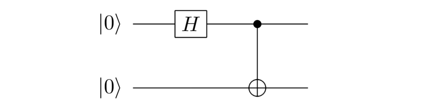
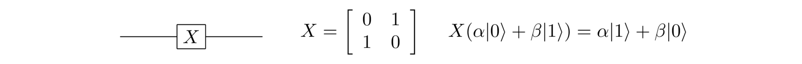
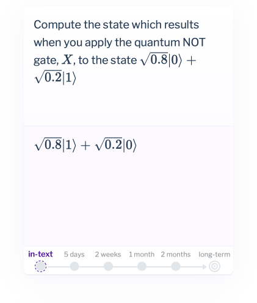
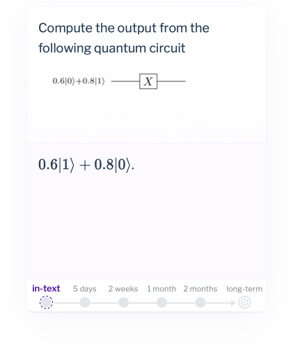
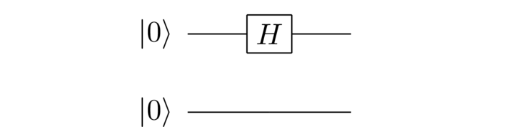
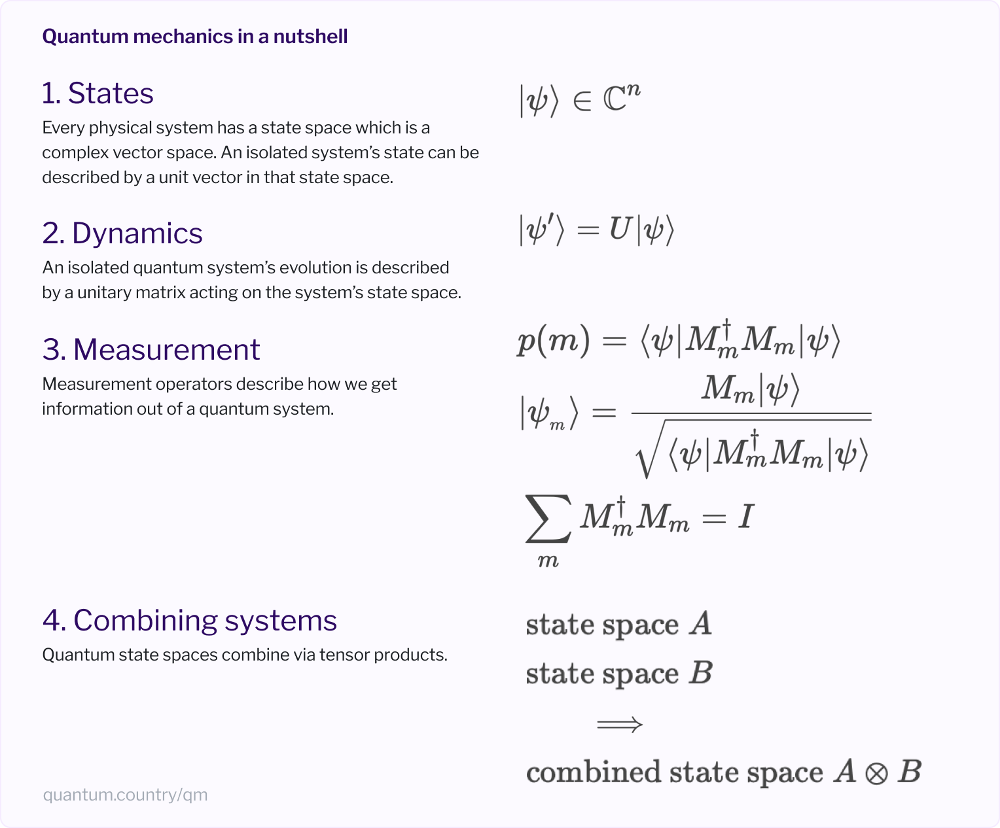
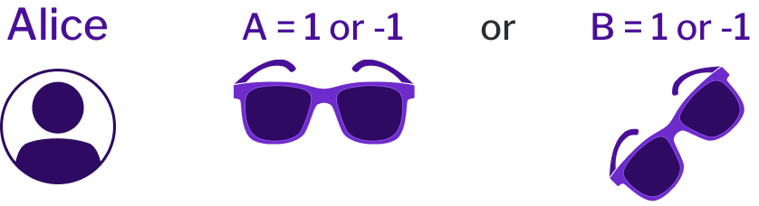
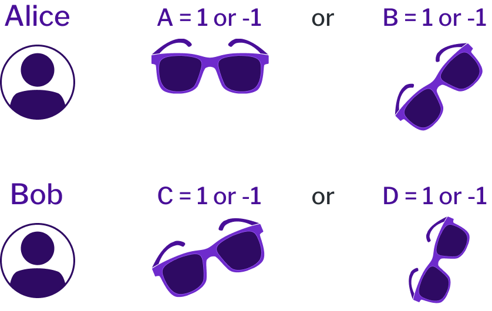

> **摘要**:
>  本文深入探讨了量子力学的四个基本公设，借助于数学框架描述宇宙及其内部事物的方式，揭示了量子计算中状态和动力学的复杂性。文章指出，量子力学并不难以学习，但其内涵却让许多物理学家感到困惑，尤其是在测量问题和量子态的意义方面。通过展示量子态、演化和测量之间的关系，作者利用“记忆介质”来改善学习效果，帮助读者掌握量子力学的核心概念。尤其是，文章也讨论了贝尔不等式及其在量子物理中的重要性，展示了量子力学如何揭示世界的本质，并指出当前科学界尚未对量子力学的完整解释达成共识。
> 
>  **要点总结**:
>  1. 量子力学是一套公设，提供理解物理系统的数学框架。
>  2. 量子态与其变化的动态依赖于单元向量及幺正矩阵，反映了物理变化。
>  3. 测量过程通过一系列测量算子定义，但量子态本身并不可直接观察。
>  4. 贝尔不等式的实验结果表明，量子力学不符合局域现实主义，亟需重新思考现实的本质。
>  5. 尽管量子力学在预测实验结果上极为成功，但其内在的测量问题和量子态的解释仍待深入理解与探讨。

---

> *Quantum mechanics: real black magic calculus.*
> 
> — Albert Einstein, writing to a colleague in 1925

In fairy tales, a wizard will say the magic words of a spell, or inscribe a set of magic symbols, and the world will change. Fireballs shoot from their hands; the hero is revived from an endless slumber; a couple falls in love. We smile when we hear such stories. They seem quaint but implausible. Common sense tells us that merely speaking certain words, or inscribing certain symbols, cannot cause such changes in the world. And yet our scientific theories are not so different. By speaking the words or inscribing the symbols of such a theory, we can greatly deepen our understanding of the world. That new understanding then enables us to change the world in ways that formerly seemed impossible, even inconceivable. Consider quantum mechanics, one of our deepest theories. It has helped us create lasers, semiconductor chips, and magnetic resonance imaging. One day it will likely help us create quantum computers, perhaps even quantum intelligences. Quantum mechanics is magic that actually works.

In this essay, we explain quantum mechanics in detail. We will describe all the principles of quantum mechanics in depth, nothing held back. It's not a handy-wavy treatment, of the kind often found in articles written for a general audience. While such articles can be entertaining, trying to learn quantum mechanics by reading them is like learning to play basketball by merely watching basketball being played. This essay will get you out on the mathematical court of quantum mechanics. Of course, you won't learn to slam dunk, at least not yet. But the essay will ground you in an understanding of the fundamentals of quantum mechanics, which you can later build upon and extend.

To read the essay, you must first understand the quantum circuit model of quantum computation. If you're not familiar with quantum circuits, you can learn about them from our earlier essay, [Quantum Computing for the Very Curious](https://quantum.country/qcvc). You may wish to pause to read that essay now, if you haven't already. Once you've understood that material you shouldn't need any other prerequisites. Indeed, when you learned quantum computing, you learned in passing almost all of quantum mechanics. In [Part I](https://quantum.country/#postulates) of this essay we distill those past ideas, collecting them up into the package known as quantum mechanics.

Although quantum mechanics is not so difficult to learn, it's a theory which has disturbed many people. Here's a few classic quotes on this puzzlement:

> *I think I can safely say that nobody understands quantum mechanics … Do not keep saying to yourself, if you can possibly avoid it, “But how can it be like that?” because you will get “down the drain”, into a blind alley from which nobody has yet escaped. Nobody knows how it can be like that.* – Richard Feynman
> 
> *I have thought a hundred times as much about the quantum problems as I have about general relativity theory.* – Albert Einstein
> 
> *If quantum mechanics hasn't profoundly shocked you, you haven't understood it yet.* – Niels Bohr

If quantum mechanics is not so difficult to learn, why has it so disturbed many great physicists? What do they mean when they say they don't understand it, or are shocked by it? How can a scientific theory be both beautiful and disturbing? In [Part II](https://quantum.country/#trouble-with-qm) of this essay we'll explore these questions. As we'll see, despite its simplicity quantum mechanics raises striking conceptual problems, problems which are among the most exciting open problems in science today.

The essay is presented in an unusual form. It's an example of what we call a *mnemonic essay*, written in the *mnemonic medium*. That means it incorporates new user interface elements intended to make it almost effortless for you to remember and apply the ideas in the essay. The motivator is that most people (ourselves included) quickly forget much of what we read in books and articles. The mnemonic medium takes advantage of what cognitive scientists know about how humans learn, creating an interface which ensures you'll remember the ideas and how to apply them near permanently. More on how that works below.

## Part I: The postulates of quantum mechanics

So, what is quantum mechanics? It's fun to wax poetic about it being magic that actually works, or to quote eminent scientists saying no-one really understands it. But while fun, those statements give no direct enlightenment. What is quantum mechanics, really?

Quantum mechanics is simply this: it's a set of four postulates that provide a mathematical framework for describing the universe and everything in it. These postulates reflect ideas you've already seen in the quantum circuit model: how to describe a quantum state; how to describe the dynamics of a quantum system; and so on. But rather than talk abstractly, it's better to just see the first postulate:

## The first postulate: state space

> **Postulate 1:** Associated to any physical system is a complex vector space known as the *state space* of the system. If the system is isolated, then the system is completely described by its *state vector*, which is a unit vector in the system's state space.

This may seem densely written, but you already know most of it. In particular, we've been working extensively with qubits, and we've seen this postulate in action. For a qubit the state space is, as you know, a two-dimensional complex vector space. The state is a unit vector in that state space (i.e., has length 
$$
1
$$
). And the condition that the state vector is a unit vector expresses the idea that the probabilities for the outcomes of a computational basis measurement add up to 
$$
1
$$
.

It's not just qubits that have a state space. The first postulate of quantum mechanics tells us that *every* physical system has a state space. An atom has a state space; a human being has a state space; even the universe as a whole has a state space. Admittedly, the first postulate doesn't tell us what the state space is, for any given physical system. That needs to be figured out on a case-by-case basis. Different types of atoms have different state spaces; a human being has a different (and much more complicated) state space; the universe has a more complicated state space still.

As an example, suppose you're interested in what happens when you shine light on an atom. To give a quantum mechanical description, you'd need a state space to describe atoms and the electromagnetic field (i.e., light). *A priori* it's not obvious what that state space should be. How many dimensions should the state space have? How do particular physical configurations of atoms and light correspond to states in that state space? By itself, quantum mechanics doesn't answer these questions. It merely does the subtle-but-important job of instructing you to look for answers to these questions. Fortunately, there is a theory, known as quantum electrodynamics (often shortened to QED), which describes how atoms and light interact. Among other things, QED tells us which states and state spaces to use to give quantum descriptions of atoms and light.

In a similar way, suppose we're trying to describe particles like quarks or the Higgs boson. Just as with the atoms-and-light example, quantum mechanics tells us we need figure out the right state spaces and state vectors. But it doesn't tell us what those are. In this case, the additional theory needed is the standard model of particle physics. Like QED, the standard model sits on top of basic quantum mechanics, fleshing it out, telling us things which aren't in the four postulates of quantum mechanics.

More generally, quantum mechanics alone isn't a fully specified physical theory. Rather, it's a framework to use to construct physical theories (like QED). It's helpful to think of quantum mechanics as analogous to an operating system for a computer. On its own, the operating system doesn't do all the user needs. Rather, it's a framework that accomplishes important housekeeping functions, creating a file system, a graphical display and interface, and so on. But users need another layer of application software on top of those basic functions. That application layer is analogous to physical theories like QED and the standard model. The application layer runs within the framework provided by the operating system, but isn't itself part of the operating systemThis analogy was popularized in Scott Aaronson's book “Quantum Computing Since Democritus”; MN believes Scott first heard it in a [talk](https://www.fields.utoronto.ca/av/audio/00-01/quantum_computing/nielsen1.mp3) MN gave at the Fields Institute in Toronto in 2001. This wouldn't warrant mention, except when MN uses the analogy, people often respond “oh yes, that's Scott Aaronson's way of thinking about quantum mechanics”. MN doesn't recall where he first heard it, or if the description is original..

In this essay, we won't get deeply into QED or the standard model or the other theories physicists have developed to describe particular physical systems. Rather, our focus is on quantum mechanics itself – the four postulates. For examples, we'll mostly draw on the quantum circuit model, which makes simple and reasonable assumptions about state spaces and state vectors. This model is already an extremely rich arena for studying quantum mechanics. If you wish, you can learn later about QED, the standard model, and so on.

Of course, this means there is still much more to learn, beyond the scope of this essay. Each physical system requires learning its own particular set of recipes for state spaces and state vectors. You already know some such recipes: if we say “let's consider a 3-qubit system”, then we know the state space is just the 8-dimensional complex vector space spanned by the computational basis states 
$$
|0\rangle|0\rangle|0\rangle
$$
, 
$$
|0\rangle|0\rangle|1\rangle, \ldots
$$
. By contrast, you probably don't know the recipe QED gives telling us how to construct the state space for a couple of hydrogen atoms interacting with the electromagnetic fieldA little more strictly speaking, QED tells us how charged elementary particles like electrons interact with the electromagnetic field. After QED was invented, atomic physicists and quantum opticians figured out how to use it to describe atoms and electromagnetic fields. And so the recipe you'd use would likely come from atomic physics or quantum optics.. While that recipe is different than in the three-qubit example, it's really much the same kind of thing. You learn the rules of the recipe, and then you can figure out the state spaces and quantum states.

Where do the recipes for things like the state space of an atom (or the electromagnetic field) come from? The unglamorous answer is that figuring those things out for the first time was incredibly hard. As in: Nobel prize hard, or even multiple Nobel prize hard. People made lots of guesses, tried lots of different things, trying to figure out states and state spaces (and all the other things), constructed lots of bad theories, and lots of good-but-not-good-enough theories along the way. And, eventually, they came up with some great recipes. Most of the time today we can use one of those recipes off-the-shelf. You go pick up a book about atomic physics, say, and it'll just tell you: use such-and-such a state space, and away you go. But in the background is thousands of instances of trial-and-error by often-frustrated physicists.

A point we've glossed over is the use of the term *isolated* in the first postulate. In particular, the first postulate tells us that *every* physical system has a state space, but inserts the qualifier *isolated* when saying which physical systems have a state vector. By isolated we mean a system that's not interacting with any other system. Of course, most physical systems aren't isolated. An atom will interact with its surroundings (for instance, it may be hit by a photon, or perhaps be affected by the charge of a nearby electron). A human being isn't an isolated physical system either – we're constantly being bombarded by light, cosmic rays, and all sorts of other things.

In general such non-isolated systems don't have their own quantum state! In fact, we saw an example in the [earlier essay](https://quantum.country/qcvc). Suppose we use the following quantum circuit:

The output is the state:

$$
\frac{|00\rangle+|11\rangle}{\sqrt 2}.
$$

A good question to ask is: what is the state of the first qubit? But as discussed in the [earlier essay](https://quantum.country/qcvc#entanglement), this is an entangled state of the two qubits, and there is no sensible way to assign a quantum state to the first qubitIn more advanced treatments you'll learn about an idea called the reduced density matrix, which can be used to describe part of an entangled quantum system. This is a useful mathematical tool derived from the four postulates we describe, but is not an essentially new idea. It's worth being aware of as a calculational convenience to learn about in the future, but discussing it is beyond our immediate scope..

Now, you might be bothered by this. Doesn't the circuit above start with the first qubit “in” the state 
$$
|0\rangle
$$
? How does that square with the idea that a non-isolated system doesn't have a state? This is a good question, one we'll see how to address later, in the discussion of the fourth postulate.

Okay, that's the first postulate covered! Hopefully, you found it pretty easy. Perhaps you're wondering if that's all there is to it? Or perhaps some element of the postulate is bothering you because you feel we haven't unpacked it sufficiently and played it out.

It's fine if that's where you're at. Deeply understanding the consequences of the postulates is a lifetime's work. It is not, for instance, obvious from the postulates that phenomena such as quantum teleportation and quantum search are already implicit inside them. You have to work hard to see that! Indeed, if you believe the universe is quantum mechanical – as we do – then everything around you is implicit in the postulates: the colors of the rainbow; the shape of a mountain; the touch of the wind. And so in learning the postulates you are learning the starting rules of an extraordinarily complex game. But unlike an ordinary game, the stakes are not winning or losing; rather, they are about how the universe actually is.

This essay is an example of what we call a mnemonic essay. That means it incorporates new interface elements intended to make it almost effortless for you to remember and apply the content of the essay, over the long term. The idea is this: throughout the essay we occasionally pause to ask a few simple questions, testing you on the material just explained. In the weeks ahead we'll re-test you in followup review sessions. By carefully expanding the testing schedule, we can ensure you consolidate the answers into your long-term memory, while minimizing the review time required. The review sessions take no more than a few minutes per session, and we'll notify you when you need to review. The benefit is that instead of remembering how quantum mechanics works for a few hours or days, you'll remember for years. It'll become a much more deeply internalized part of your thinking. This long-term internalization is particularly valuable for the core ideas of quantum mechanics, which are at the foundation of many other subjects.

Of course, you can just read this as a conventional essay. But we hope you’ll try out the mnemonic medium. To do so please sign up below. This will enable us to track the best review schedule for each question, and to remind you to sign in for occasional short review sessions. And if you’d like to learn more about how the mnemonic medium works, please see [A medium which makes memory a choice](https://quantum.country/qcvc#a-medium-which-makes-memory-a-choice), [How to approach this \[earlier\] essay?](https://quantum.country/qcvc#how-to-approach-this-essay), and [How to use (or not use!) the questions](https://quantum.country/qcvc#how-to-use-or-not-use).

Please sign in so we can save your progress and let you know the best times to review.

Thank you! Your progress will be saved as you read.

To give you a more concrete flavor of how the mnemonic medium works, let's look at three questions reviewing part of what you've just learned. Please indulge us by answering these questions – it'll take just a few seconds. For each question, think about what you believe the answer to be, click to reveal the actual answer, and then mark whether you remembered or not. If you can recall, that's great. But if not, that's fine, just mentally note the correct answer, and continue.

## The second postulate: unitary dynamics

The first postulate of quantum mechanics told us how we describe states. What about how states change, that is, the dynamics of a quantum system? That's where the second postulate comes in. In the [earlier essay](https://quantum.country/qcvc) we saw that quantum gates are described by unitary matrices acting on the state space of a quantum system. The second postulate tells us that something very similar is true for any isolated quantum system:

> **Postulate 2:** The evolution of an isolated quantum system is described by a unitary matrix acting on the state space of the system. That is, the state 
> $$
> |\psi\rangle
> $$
>  of the system at a time 
> $$
> t_1
> $$
>  is related to the state 
> $$
> |\psi'\rangle
> $$
>  at a later time 
> $$
> t_2
> $$
>  by a unitary matrix, 
> $$
> U
> $$
> : 
> $$
> |\psi'\rangle = U |\psi\rangle
> $$
> . That matrix 
> $$
> U
> $$
>  may depend on the times 
> $$
> t_1
> $$
>  and 
> $$
> t_2
> $$
> , but does not depend on the states 
> $$
> |\psi\rangle
> $$
>  and 
> $$
> |\psi'\rangle
> $$
> .

Our quantum gates demonstrate this postulate in action. So, for instance, the Pauli 
$$
X
$$
 gate, also known as the quantum NOT gate, is an example. Here it is shown in the quantum circuit and matrix representations, as well as the explicit action on states:

So too is the Hadamard gate, 
$$
H
$$
:

And so on, through the controlled-NOT gate, the Toffoli gate, and all the other quantum gates we met earlier.

Why is it unitary matrices which appear in the second postulate? If you try writing a few matrices down on paper, you quickly find that most matrices aren't unitary, or even close to it. Why can't we have a general matrix in the second postulate? One partial explanation, discussed in [depth](https://quantum.country/qcvc#why-unitaries-only-matrices-preserve-length) in the earlier essay, is that unitary matrices are the only matrices which preserve length. If we want the quantum state to remain normalized, then unitary matrices are the only matrices which do the trick, since any other matrix will result in the norm changing. That normalization is in turn connected to the requirement that the probabilities of measurement outcomes sum to one. In this sense, the postulates of quantum mechanics form a tightly interconnected web, with requirements like unitarity from one postulate reflecting requirements elsewhere, like normalization of the state vector, or probabilities summing to one.

How to figure out which unitary transformation is needed to describe any particular physical situation? As you might guess from our discussion of the first postulate, the second postulate is silent on this question. It needs to be figured out case by case. Theories like QED and the standard model supply additional rules specifying the exact (unitary) dynamics of the systems they describe. It's as before: quantum mechanics is a framework, not a complete physical theory in its own right. But being told that the correct way to describe dynamics is using unitary transformations on state space is already an incredibly prescriptive statement. And, as before, the quantum circuit model is a useful source of examples, and working with it is a good way to build intuition.

More broadly: although quantum mechanics reached its final form in the 1920s, physicists spent much of the remainder of the twentieth century figuring out what unitary dynamics, state spaces, and quantum states are needed to describe this or that system. You can't just solve this problem once: optical physicists had to do it for light, atomic physicists for atoms, particle physicists have been doing it for the entire pantheon of particles described in the standard model of particle physics. Still, although there's much more to learn about the application of these two postulates, already they give us a remarkably constraining framework for thinking about what the world *is* and how it can *change*.

Let's pause and run through some more questions:

If you've read earlier essays in this series, you may recall that we described the mnemonic medium as making it almost effortless to remember the essay contents. We believed this would make it much easier to deeply understand the material. To figure out how well or poorly the medium was working, we interviewed many users. Many of the conversations started out encouragingly: “Yeah, I can remember the content for a long time. And it's weird and fun that it's almost effortless”. So far, so good. But when we dig into how well people understand the material, a pretty common line is: “Before using the mnemonic medium, I didn't think memory was all that important to understanding. I've changed my mind about that: it helps much more than I thought. But it's not a panaceaOf course, this isn't a real quote, just a synthesis. No-one actually said “panacea”! either. For instance, I'm not sure I really understand the Hadamard gate. Yeah, I know quite a bit about the gate, and it's remarkable to remember all that. But I'm not sure I could *use* it in another context. And I'm not sure I could explain it to someone else. It somehow falls short of a full understanding.”

They're right that memory is only part of understanding. Understanding also involves many other skills, among them the ability to use what you've learned in new contexts. And so in this essay we're extending the mnemonic medium to include questions where we ask you to apply what you've learned. Here's an example question:

At first glance that looks much like earlier cards. But in important ways it's different. When you do review sessions in the future you *won't* see that particular question again. Instead, you'll see variation questions that are similar, but not quite the same. We'll cheat a bit now, and show you two variants that you'll see in future review sessions. We won't ask you to work these out here – in fact, it's probably best if you actively refrain from thinking too hard about these questions! Just take a look, and notice that they're asking you to solve the same kind of very simple problem as in the question above:

So this is different to the earlier cards, in that we're not asking you to remember the answer to the question. Rather, we're asking you to work out an answer to the question, which is very different. That is, we're asking you to use the understanding that you've gained. Furthermore, it's not just these three variations: you'll be asked a whole sequence of variations.

Our hope and expectation is that this will enable you to gradually internalize not just declarative knowledge, but also procedural knowledge. In this way, you'll learn to reliably transfer your understanding to new contexts.

If you're familiar with conventional spaced repetition flashcard software, then you know that this kind of process knowledge isn't something it's designed to support. Such systems are certainly not designed for multiple variations on a question, testing the ability to fluently apply understanding in new contexts. This is a small design change, but we believe it greatly expands the type of learning the mnemonic medium supports, and will result in a qualitative jump in what you get from the medium.

Over the longer term, there are umpteen ways the medium could be greatly improved, or radically changed. We think of these experiments as part of developing an answer to the question: what's an ideal, very high-growth personal environment? Of course, we're a long way from having developed such an environment! When we talk with people about the mnemonic medium, they sometimes described it as an educational experiment. This is a limited ambition, as education is commonly conceived. Imagine taking a month of public speaking lessons in school. Now compare that to a situation where you've been asked to present onstage at a major Apple product launch, and will have a team of people from Apple helping you practice for a month. Which do you think would be a higher growth environment? This is a fanciful example, but illustrates the point: there's tremendous scope to develop extraordinarily high-growth environments. This medium is one (tiny) experiment in exploring that scope, and we hope to develop many more such ideas in the future. But for now we'll explore the limits of the current medium.

Alright, let's get back to quantum stuff. Here's a couple more examples:

To reiterate, in future review sessions you'll be asked small variations on the questions above. You can't simply memorize the answers, since you won't be shown the questions again. Rather, you must work them out.

You may notice that in the second of the above questions there was an explanation available. You aren't being tested on these explanations, they're just intended to help out if you get stuck. In particular, it doesn't matter if you use the same approach as described in the explanation – anything which gives the correct answer is good.

Let's return to the details of the second postulate. You probably noticed that, like the first postulate, it contained a caveat about describing the dynamics of *isolated* systems using unitary matrices. Of course, in nature most physical systems aren't isolated or even near-isolated. Suppose, for instance, you're trying to build a quantum computer, using atoms to store the states of your qubits. For instance, we could use two different orbital shells for an electron to correspond to the 
$$
|0\rangle
$$
 and 
$$
|1\rangle
$$
 states. And suppose you effect a quantum gate by briefly shining laser light on the atom, causing the electron to move between the shells.

Such an atom is not isolated: it's interacting strongly with the laser. But it turns out the dynamics of the atom are still closely described by a unitary transformation, even when laser light is being shone on it. This isn't obvious; it requires detailed investigation. But the upshot is that while the second postulate only directly applies to isolated systems, surprisingly often it's possible to describe the dynamics of non-isolated systems by unitary dynamics. Indeed, when we said above that quantum gates are examples of the second postulate, that's not quite right. Usually, quantum gates involve non-isolated systems. But with careful design they implement unitary operations anyway.

Let's also work through a few questions where you're asked to apply what you've learned. For these questions we'll return to the first postulate, since we didn't have any questions in that style in our earlier discussion, and it's useful being able to apply those ideas.

We presented the second postulate in the form most often used in quantum circuit contexts, with discrete gates being applied to cause discrete changes in the quantum state. We'll now briefly show you an alternate form, in which the evolution of the quantum state varies smoothly in continuous time, with the change described by a differential equation. We're not going to use this much, and so you don't need to understand all the details in depth – this is just so you get the gist. Here's the equation controlling the time rate of change of the quantum state:

$$
i \frac{d|\psi\rangle}{dt} = H |\psi\rangle.
$$

This equation is known as the *Schroedinger equation*. The matrix 
$$
H
$$
 is a (fixed) hermitian matrix known as the *Hamiltonian* of the system. (This is *not* the same as the Hadamard gate, it's merely an unfortunate notational coincidence). You can think of the Hamiltonian 
$$
H
$$
 as telling the quantum state how to change. The Schroedinger equation thus provides a continuous-time description of the dynamics of the quantum state, whereas the second postulate was focused on a discrete time description.

By solving the Schroedinger equation we can relate the state of the system at time 
$$
t_2
$$
 to the state at time 
$$
t_1
$$
. The solution is:

$$
|\psi_{t_2}\rangle = e^{-iH(t_2-t_1)} |\psi_{t_1}\rangle.
$$

Of course, while it's easy enough to write down the matrix exponential, it is often quite a bit of work to compute in practice!

Traditional treatments of quantum mechanics spend a lot of time discussing Hamiltonians used to describe different physical systems, and figuring out (often rather tediously) the value of the matrix exponential. These are important and worthy technical problems, but not necessary for understanding the fundamentals of quantum mechanics. Still, it's worth noting that the above solution is consistent with the second postulate: in particular, it can be shown that 
$$
e^{-iH(t_2-t_1)}
$$
 is a unitary matrix. Indeed, if you're wondering about questions like “where does that factor 
$$
i
$$
 come from in the Schroedinger equation” or “why is the Hamiltonian 
$$
H
$$
 required to be Hermitian”, they turn out to be required to get unitary evolution. So it all hangs together nicely. In fact, there's also an informal argument which lets you turn the second postulate around and (with a few extra assumptions) derive the Schroedinger equation. We won't get into details here, but it seems worth being aware this is possible.

What is worth taking away from this discussion is a few basics: the term Hamiltonian, what the Schroedinger equation does, qualitatively, and a broad feel for how the Schroedinger equation relates to the second postulate. We won't ask you to remember the details of the Schroedinger equation – those really need to be unpacked in more depth, and with some detailed examples. On the other hand, it is valuable to know what the Schroedinger equation does: it describes the time rate of change of the quantum state of an isolated physical system. The questions below are somewhat outside the main scope of this essay. But they're included here so that if in later reading you come across terms like “Hamiltonian”, you'll have a basic understanding to build upon.

## The third postulate: measurement

The third postulate is the strangest of the postulates of quantum mechanics. To explain its content, it helps to recap from [Quantum Computing for the Very Curious](https://quantum.country/qcvc):

> Suppose a (hypothetical!) quantum physicist named Alice prepares a qubit in her laboratory, in a quantum state 
> $$
> \alpha|0\rangle+\beta|1\rangle
> $$
> . Then she gives her qubit to another quantum physicist, Bob, but doesn’t tell him the values of 
> $$
> \alpha
> $$
>  and 
> $$
> \beta
> $$
> . Is there some way Bob can figure out 
> $$
> \alpha
> $$
>  and 
> $$
> \beta
> $$
> ? That is, is there some experiment Bob can do to figure out the identity of the quantum state?
> 
> The surprising answer to this question turns out to be NO! There is, in fact, no way to figure out 
> $$
> \alpha
> $$
>  and 
> $$
> \beta
> $$
>  if they start out unknown. To put it a slightly different way, the quantum state of any system – whether it be a qubit or a some other system – is not directly observable.
> 
> \[We\] say this is surprising, because it's very different from our usual everyday way of thinking about how the world works. If there’s something wrong with your car, a mechanic can use diagnostic tools to learn about the internal state of the engine. The better the diagnostic tools, the more they can learn. Of course, there may be parts of the engine that would be impractical to access – maybe they’d have to break a part, or use a microscope, for instance. But you’d probably be rather suspicious if the mechanic told you the laws of physics prohibited them from figuring out the internal state of the engine.

In the earlier essay we described *measurement in the computational basis*. That process governs how you get information out of a quantum computer. Recall the simplest version, measuring just a single qubit in the computational basis. In that process, if you measure a qubit in the state 
$$
\alpha|0\rangle+\beta|1\rangle
$$
 then you get the outcome 
$$
0
$$
 with probability 
$$
|\alpha|^2
$$
 and the outcome 
$$
1
$$
 with probability 
$$
|\beta|^2
$$
. The posterior state in the two cases is 
$$
|0\rangle
$$
 and 
$$
|1\rangle
$$
, respectively.

The third postulate generalizes this idea of measurement:

> **Postulate 3:** Quantum measurements are described by a collection 
> $$
> \{ M_m \}
> $$
>  of *measurement operators*The term “operator” is often used essentially interchangeably with “matrix” in elementary linear algebra. The two terms mean somewhat different things in infinite-dimensional spaces, but in our finite-dimensional context can be interchanged. The term measurement operator seems more common than measurement matrix, and so we go with that.. Each 
> $$
> M_m
> $$
>  is a matrix acting on the state space of the system being measured. The index 
> $$
> m
> $$
>  takes values corresponding to the measurement outcomes that may occur in the experiment. If the state of the quantum system is 
> $$
> |\psi\rangle
> $$
>  immediately before the measurement then the probability that result 
> $$
> m
> $$
>  occurs is given by 
> $$
> p(m) = \langle \psi| M_m^\dagger M_m |\psi\rangle,
> $$
>  and the state of the system after the measurement, often called the *posterior state*, is 
> $$
> \frac{M_m|\psi\rangle}{\sqrt{\langle \psi|M_m^\dagger M_m |\psi\rangle}}.
> $$
>  (It's worth noting that: (a) the denominator is just the square root of the probability 
> $$
> p(m)
> $$
> ; and (b) this is a properly normalized quantum state.) The measurement operators satisfy the *completeness relation*The postulate we've stated is a generalization of the statement given in some quantum mechanics textbooks, based on what are often called projective measurements. The two statements are, however, equivalent, when combined with the other postulates. We've chosen the present formulation as it's mathematically simpler and more powerful than the presentation in terms of projective measurements. We believe that presentation should be deprecated from quantum mechanics texts. , 
> $$
> \sum_m M_m^\dagger M_m = I.
> $$

There's a lot going on in this postulate. But again it mostly expresses ideas we've already seen, albeit disguised. We'll give a concrete example in a moment, but first want to address the meaning of the completeness relation. It simply expresses the idea that probabilities sum to 
$$
1
$$
. We can see this by pre-multiplying the completeness relation by 
$$
\langle \psi|
$$
 and post-multiplying by 
$$
|\psi\rangle
$$
. Comparing with the equation for the probability 
$$
p(m)
$$
 we see this gives

$$
\sum_m p(m) = \sum_m \langle \psi|M_m^\dagger M_m|\psi\rangle = \langle \psi| I |\psi\rangle = \langle \psi|\psi\rangle = 1,
$$

where we assumed 
$$
|\psi\rangle
$$
 is a quantum state, and thus normalized to have length 
$$
1
$$
.

To understand the meaning of the third postulate, it helps to work through the particular case of measuring a single qubit in the computational basis. In that case, the measurement operators are 
$$
M_0 = |0\rangle \langle 0|
$$
 and 
$$
M_1 = |1\rangle \langle 1|
$$
. It's easiest to apply the third postulate if we write out explicit amplitudes for the quantum state, 
$$
|\psi\rangle = \alpha|0\rangle + \beta|1\rangle
$$
. According to the third postulate, the probability for result 
$$
0
$$
 is:

$$
\begin{aligned} p(0) & = \langle \psi| M_0^\dagger M_0 |\psi\rangle \\ & = \langle \psi|0\rangle \langle 0| 0\rangle \langle 0| \psi\rangle. \end{aligned}
$$

Of course, 
$$
|0\rangle
$$
 is normalized and so 
$$
\langle 0|0\rangle = 1
$$
, and this becomes:

$$
\begin{aligned} p(0) & = \langle \psi|0\rangle \langle 0| \psi\rangle = |\langle 0|\psi\rangle|^2. \end{aligned}
$$

But 
$$
\langle 0|\psi\rangle = \alpha
$$
, and so this tells us the probability of measurement outcome 
$$
0
$$
 is 
$$
p(0) = |\alpha|^2
$$
, just as we expected. The exact same calculation, but with 
$$
0
$$
s replaced by 
$$
1
$$
s, shows us that 
$$
p(1) = |\beta|^2
$$
, also as expected.

What about the posterior states? Let's consider the case of measurement result 
$$
m = 0
$$
. In that case the third postulate tells us the posterior state is

$$
\frac{|0\rangle \langle 0|\psi\rangle}{\sqrt{p(0)}}.
$$

We've already seen 
$$
p(0) = |\alpha|^2
$$
. And, of course, 
$$
\langle 0|\psi\rangle = \alpha
$$
. And so the posterior state is:

$$
\frac{\alpha}{|\alpha|} |0\rangle.
$$

This is a peculiar looking state! The pre-factor 
$$
\alpha/|\alpha|
$$
 appears complicated, but it's just a global phase factor. Back in [Quantum Computing for the Very Curious](https://quantum.country/qcvc) we observed that such global phase factors never affect measurement probabilities, and as a result it's conventional to regard quantum states which differ only by a global phase factor as identical. And so the state above can be regarded as equivalent to the quantum state 
$$
|0\rangle
$$
, just as we expected for a measurement in the computational basis. In a similar fashion, we can show that the posterior state if the measurement result was 
$$
1
$$
 is 
$$
|1\rangle
$$
 (again, up to a global phase factor, which we ignore).

The argument for ignoring global phase factors in [Quantum Computing for the Very Curious](https://quantum.country/qcvc) was hand wavy. In fact, the postulates can be used to make the argument watertight. Suppose we have two quantum states related by a global phase factor, 
$$
|\psi'\rangle = e^{i\theta}|\psi\rangle
$$
. Then the measurement probabilities for the two states are always identical:

$$
p'(m) = \langle \psi'| M_m^{\dagger} M_m |\psi'\rangle = \langle \psi|M_m^\dagger M_m |\psi\rangle = p(m).
$$

And, although we won't show it explicitly, the global phase factor also propagates unchanged through both unitary dynamics and posterior state calculations. And so such a phase factor makes no difference at all to anything observable. In fact, people sometimes re-state the postulates using a different formulation which entirely eliminates such global phase factors. The reason we haven't done this is that it significantly complicates the presentation. It's easier and also more conventional to just use the informal argument we've made.

Incidentally, you may wonder what happens in the third postulate when the denominator 
$$
\sqrt{\langle \psi|M_m^\dagger M_m|\psi\rangle}
$$
 in the posterior state vanishes. Wouldn't that make the posterior state undefined? Fortunately, that can only happen if the probability of the measurement outcome is zero. That also means the measurement outcome will never occur, so we don't need to worry about it.

We've gone through a lot of work just to analyze a single quantum measurement! The good news is that we rarely need to go through such work. Instead, you build up a library of common patterns for measurement operators. Indeed, in quantum computing you'll mainly be interested in measurements in the computational basis. And there are a few other common measurements as well, some of which we'll talk about later in the essay. In practice, you only rarely need to do calculations like those above.

Let's run through a few questions testing your memory of the third postulate. These may be more challenging than earlier questions, and you may find it helpful to first return to the statement of the third postulate, and check that you understand it. This is the most detailed part of the essay – if you can get past it, you're over the main hump.

Let's also work through a couple of cards giving you practice computing the outcomes of measurements in the computational basis:

Let's introduce a new type of measurement, one we haven't seen in any earlier essays. It's a single-qubit measurement, but not a measurement in the computational basis. Recall the equal superposition states:

$$
|+\rangle = \frac{|0\rangle+|1\rangle}{\sqrt 2}; \,\,\,\,\,\, |-\rangle = \frac{|0\rangle-|1\rangle}{\sqrt 2}.
$$

The measurement we'll now define is what people call “measuring in the 
$$
|+\rangle, |-\rangle
$$
 basis”. In particular, we define measurement operators 
$$
M_+ = |+\rangle\langle +|
$$
 and 
$$
M_- = |-\rangle \langle -|
$$
. We won't work through the details of the calculation, but if you wish you can check the completeness relation 
$$
M_+^\dagger M_+ + M_-^\dagger M_- = I
$$
. Making this check is just a little matrix calculation. What we're going to focus on is understanding the measurement probabilities and posterior states.

It's tempting – in fact, it's a good idea! – to begin by expanding the state being measured as 
$$
|\psi\rangle = \alpha |0\rangle+\beta |1\rangle
$$
. If you do this, you can push through and figure out the measurement probabilities and posterior states. But there's a trick you can use to simplify matters. It's worth pausing a moment, and seeing if you can think of what that trick might be. Any ideas?

The trick is this: it's to observe that we could equally well have expanded 
$$
|\psi\rangle
$$
 in terms of the 
$$
|+\rangle
$$
 and 
$$
|-\rangle
$$
 states, as 
$$
|\psi\rangle = \gamma|+\rangle + \delta|-\rangle
$$
. We can certainly do this, since 
$$
|+\rangle
$$
 and 
$$
|-\rangle
$$
 are linearly independent (in fact, orthonormal) states in a two-dimensional vector space. Can you now guess what the measurement probabilities and posterior states are, by analogy with measurement in the computational basis?

We'll work through the explicit calculation in a moment, but it's worth stating the result up front: the probability of the 
$$
+
$$
 outcome is 
$$
|\gamma|^2
$$
, with posterior state 
$$
|+\rangle
$$
, and the probability of the 
$$
-
$$
 outcome is 
$$
|\delta|^2
$$
, with posterior state 
$$
|-\rangle
$$
. This is much like the computational basis measurement, and the calculation showing it is much like the calculation earlier for the computational basis measurement. In particular, for the 
$$
+
$$
 measurement we have:

$$
p(+) = \langle \psi| M_+^\dagger M_+ |\psi\rangle = (\gamma^* \langle +|+\delta^*\langle -|) |+\rangle \langle +|+\rangle \langle +|(\gamma |+\rangle+\delta|-\rangle).
$$

Of course, 
$$
\langle +|+\rangle = 1
$$
. And, in case you've forgotten, a quick calculation shows 
$$
\langle +|-\rangle = 0
$$
, i.e., the 
$$
|+\rangle
$$
 and 
$$
|-\rangle
$$
 states are orthogonal. So the above becomes:

$$
\begin{aligned} p(+) & = (\gamma^* \langle +|+\delta^*\langle -|) |+\rangle\langle +| (\gamma |+\rangle+\delta |-\rangle) \\ & = |\gamma|^2. \end{aligned}
$$

A similar but simpler calculation shows 
$$
M_+ |\psi\rangle = \gamma|+\rangle
$$
, and so the corresponding posterior state is 
$$
\gamma/|\gamma| |+\rangle
$$
, which up to a global phase factor is the 
$$
|+\rangle
$$
 state. Similar calculations show that the probability of a 
$$
-
$$
 outcome is 
$$
|\delta|^2
$$
, with posterior state 
$$
|-\rangle
$$
 (up to a global phase). In practice we just say the posterior states are 
$$
|+\rangle
$$
 and 
$$
|-\rangle
$$
, respectively.

What would have happened if instead we'd stuck with 
$$
|\psi\rangle = \alpha|0\rangle+\beta|1\rangle
$$
? The calculation would have been a little more complicated, but of course we would have gotten the same result in the end, albeit expressed in terms of 
$$
\alpha
$$
 and 
$$
\beta
$$
 instead of 
$$
\gamma
$$
 and 
$$
\delta
$$
.

We've been asking you to guess or intuit many results. If you successfully guessed the answers that may have been fun, but if not it may have been frustrating. If you'll allow us to generalize, people who've been raised in a culture that values “quick” and “smart” sometimes feel bad if they can't solve this kind of problem. This is unfortunate. Much of getting good at mathematics or physics is how you respond to this kind of stuckness. Superb mathematicians get stuck in similar ways, sometimes on things which later may seem headslappingly obvious. But they develop lots of heuristics for trying new things, even when stuck; and for keeping morale up. Developing that ability to continue when stuck is a crucial part of learning to do mathematics or physics.

There's an alternate way of looking at the third postulate where it appears almost to be a generalization of the second postulate. Suppose we were to do a measurement with just a single measurement outcome. That sounds peculiar – if a measuring device always showed the same answer you'd think it was broken – but it at least makes logical sense. According to the third postulate such a measurement would be described by a single measurement operator, which we can just call 
$$
M
$$
 (no label needed, since the outcome is always the same).

In this situation the completeness relation becomes 
$$
M^\dagger M = I
$$
. That's just the condition that 
$$
M
$$
 be unitary. And, of course, the probability of the outcome would be 
$$
\langle \psi|M^\dagger M |\psi\rangle = \langle \psi|I|\psi\rangle = 1
$$
, so that outcome would occur with probability 
$$
1
$$
, i.e., all the time. This is as we'd expect, given that there is only one possible outcome! So the second postulate appears to be a special case of the third postulate where there is just a single outcome.

We say “appears”. It's not quite as simple as that. After all, the third postulate is talking about a system which is being measured, presumably by interacting with some measuring device, while the second postulate is talking about the dynamics of isolated physical systems. So the two postulates are talking about quite distinct physical situations. To say the second postulate is a special case of the third it's not enough for the mathematics to check out: you need a unified and conceptually sensible physical picture too. Still, you can imagine trying to reformulate the postulates so that the second and third postulates are unified aspects of a single postulate. It's fun to try to find conceptual unifications making that work. We don't do it here, but you may enjoy pondering how to do it.

## The fourth postulate: composite systems

We're almost done! The fourth postulate is the final postulate of quantum mechanics. It's also the easiest to understand. Remember that the first postulate told us that quantum systems have state spaces. Suppose we take two quantum systems, 
$$
A
$$
 and 
$$
B
$$
. What's the state space of the combined system containing both 
$$
A
$$
 and 
$$
B
$$
? The fourth postulate tells us the answer to this question. It involves the use of an idea from linear algebra known as the *tensor product*, which we haven't explicitly met before. We'll discuss the tensor product more below; for now, let's see the postulate.

> **Postulate 4:** The state space of a composite physical system is the tensor product of the state spaces of the component physical systems. Moreover, if we have systems numbered 
> $$
> 1
> $$
>  through 
> $$
> n
> $$
> , and system number 
> $$
> j
> $$
>  is prepared in the state 
> $$
> |\psi_j\rangle
> $$
> , then the joint state of the total system is just the tensor product of the individual states, 
> $$
> |\psi_1\rangle \otimes |\psi_2\rangle \otimes \ldots \otimes |\psi_n\rangle
> $$
> .

We've already met many examples of this postulate, when we worked with many-qubit systems in the earlier essays. For instance, we dealt with two-qubit states like:

$$
\frac{|00\rangle+|11\rangle}{\sqrt 2}.
$$

If you read the [quantum search essay](https://quantum.country/search), then in that essay we dealt with 
$$
n
$$
\-qubit systems. So, implicitly we've already worked quite a bit with the tensor product. Sometimes people will write states like 
$$
|00\rangle
$$
 as 
$$
|0\rangle \otimes |0\rangle
$$
, and speak of “the tensor product of 
$$
|0\rangle
$$
 and 
$$
|0\rangle
$$
”. (The symbol 
$$
\otimes
$$
 is known as the tensor product symbol.) In fact, 
$$
|00\rangle, |0\rangle|0\rangle
$$
 and 
$$
|0\rangle \otimes |0\rangle
$$
 are all just different notations for exactly the same thing. This proliferation of notations can seem a little confusing at first, but it's worth remembering that 
$$
|00\rangle = |0\rangle|0\rangle = |0\rangle \otimes |0\rangle
$$
.

There is, of course, a formal definition for the tensor product of two vector spaces. We thought about including that formal definition here, but decided against it. If you're bothered, you might pause for a moment to consider how comfortable you feel with the natural numbers 
$$
1, 2, 3, \ldots
$$
. Chances are you didn't begin your acquaintance with the natural numbers with a rigorous definition. Rather, you probably used the numbers for years before ever seeing a definition (if you ever saw such a definition). In the same way: we believe you learn more about the tensor product by working through things like quantum circuits, the quantum search algorithm, and quantum teleportation than by working through a formal definition.

There are a couple of additional elements left implicit in the fourth postulate – physicists sometimes regard these elements as so obvious as to not merit mentioning. We'd like to mention them here. They're best illustrated concretely. Suppose we apply a quantum gate like the Hadamard gate 
$$
H
$$
 to the first qubit in a quantum circuit:

Usually, we think of the Hadamard gate as a 
$$
2 \times 2
$$
 unitary matrix,

$$
H = \frac{1}{\sqrt 2} \left[ \begin{array}{cc} 1 & 1 \\ 1 & -1 \end{array} \right].
$$

But in the context of a two-qubit circuit like that shown above, the gate must somehow be acting on the entire four-dimensional state space. Mathematically, we define the *tensor product* operation 
$$
H \otimes I
$$
. This does what you'd guess: it acts on tensor product states 
$$
|\psi\rangle \otimes |\phi\rangle
$$
 by letting 
$$
H
$$
 act on the 
$$
|\psi\rangle
$$
 piece, and the 
$$
2 \times 2
$$
 identity 
$$
I
$$
 act on 
$$
|\phi\rangle
$$
. Writing this all out very explicitly, it just means that the Hadamard gate acts on the two-qubit system exactly as we expect:

$$
(H \otimes I)(|\psi\rangle \otimes |\phi\rangle) = (H|\psi\rangle \otimes |\phi\rangle).
$$

Similar ideas apply more generally. For instance, if the Hadamard gate had acted on the second qubit instead, the operation on the entire state space would have been 
$$
I \otimes H
$$
, and we're sure you can figure out how that would be defined!

Much more generally still, when we apply unitary matrices or measurement operators to a system which is part of a larger quantum system, we extend the relevant unitary matrices and measurement operators by tensoring with the identity matrix acting on the state space for the rest of the system. It's worth knowing that this is implicitly (and sometimes explicitly) what's going on.

## Quantum mechanics in a nutshell

You've now seen quantum mechanics in its entirety! Let's briefly sum up what it does and does not do.

It does a few things: it tells us what a quantum state is, it tells us where quantum states live (state space), it tells us how they change, both when the system is isolated (unitary dynamics) and when it's measured (measurement operators). And it tells us how the state space of a composite physical system relates to the component systems. The exact details – what state, what state space, what unitary dynamics or measurement operators – need to be figured out case by case. That's additional to the core content of quantum mechanics. Here's that core content in a single diagram:

All the mathematical ideas are simple. But they're not *a priori* obvious. Still, once the framework has been discovered, it's easy to use. If you're confident you understand all the elements of that diagram, then you're confident you understand quantum mechanics.

In a similar vein, it's possible to summarize in just a few lines the [quantum computing model](https://quantum.country/qcvc#the-quantum-computing-model), [the quantum search algorithm](https://quantum.country/search#summary-of-the-quantum-search-algorithm), and [quantum teleportation](https://quantum.country/teleportation#teleportation_summary). If you understand all those summaries, then you've got a good mastery of the core of quantum computing, quantum mechanics, and two deep applications of those subjects. It's worth examining the summaries, and asking yourself where you're comfortable – pausing to appreciate your achievement – and also to identify spots where you're uncomfortable, and to think about how you might improve your understanding, perhaps through re-reading.

We'll conclude Part I with a few questions that integrate what we've covered. In Part II we finish off *Quantum Country* by discussing what makes quantum mechanics such a strange theory, and some major open scientific challenges it reveals.

## Part II: Why are so many physicists so upset about quantum mechanics?

If quantum mechanics is just four easily-understood postulates, then why did Richard Feynman say “nobody understands quantum mechanics”? What was Einstein referring to when he said he'd thought “a hundred times” as much about the quantum problems as about general relativity? What had them so upset?

On the one hand, no matter what Feynman says, tens of thousands of people genuinely understand quantum mechanics. They understand it well enough to use it to design and build new devices – for instance, quantum mechanics played a crucial role in developing the first transistor, and nowadays is a working tool for anyone thinking seriously about semiconductors. Or consider the tens of thousands of people who understand quantum search and quantum teleportation. All these people certainly understand quantum mechanics.

On the other hand, Feynman wasn't a yo-yo. When people say no-one understands quantum mechanics, they're using “understand” in an unconventional but meaningful sense. In particular, there are a few fundamental puzzles about the meaning of the theory that have never been entirely resolved, despite decades of thought. In Part II of this essay, we explain one of these puzzles in detail, the Bell inequality. And we'll briefly survey some of the other puzzles about quantum mechanics, and consider what would be entailed by a deeper understanding of the theory.

## The Bell inequality

> *Bell's theorem is the most profound discovery of science.*
> 
> — Henry Stapp

> *Do you really believe that the moon isn’t there when nobody looks?*
> 
> — Albert Einstein

Suppose someone flips a coin, letting it land on their arm, but covers it up before you have a chance to see it. You will, naturally, model the state of the coin as being either heads or tails. And while that state is not immediately accessible to you (at least, not until they move their hand), you certainly assume that the coin has an objective state which could in principle be measured.

This all sounds rather trite. But it's actually not obvious that the same thing is true in quantum mechanics. Suppose you have a qubit in some state, and perform a measurement in the computational basis, with outcome 
$$
0
$$
 or 
$$
1
$$
. What is being revealed by such a measurement? Is it revealing some objective, independent property of the qubit, a property that existed inside the qubit prior to the measurement? Or is it doing something else? In fact, does the qubit have any objective, independent properties at all?

These may seem like amusing philosophical questions, good for late-night conversation, but not of much importance. But in a remarkable 1964 paper, the physicist John Bell sharpened the questions up a very great deal. Indeed, it's not going too far to say Bell's results show a need to completely revise our thinking about what reality is.

In this section, we explain Bell's result. In fact, we'll explain a slightly stronger result, usually attributed to a 1969 paper of John Clauser, Michael Horne, Abner Shimony, and Richard Holt (CHSH)John Bell, [On the Einstein Podolsky Rosen Paradox](https://quantum.country/assets4/Bell1964.pdf) (1964), and John Clauser, Michael Horne, Abner Shimony, and Richard Holt, [Proposed Experiment to Test Local Hidden-Variable Theories](https://quantum.country/assets4/Clauser1969.pdf) (1969).. This result is sometimes called the CHSH inequality, but we'll call it the Bell inequality (even though it's not quite the same as Bell's), since Bell had the core underlying insight.

To explain the Bell inequality, we first have to get ourselves out of the headspace of quantum mechanics. Nothing we say through the remainder of this section will have anything directly to do with quantum mechanics. There will be no qubits, no state vectors, no unitary dynamics, and certainly no measurement operators. Instead, we're going to consider a real-world experimental setup, and we'll think about what happens in that setup from (more or less) first principlesThe material that follows in this section is adapted from MN's essay [Why the world needs quantum mechanics](http://michaelnielsen.org/blog/why-the-world-needs-quantum-mechanics/) (2008)..

In particular, we're going to think about light, and about photons, the elementary particles making up light. Photons have many physical properties – things like position, color, and so on. One property that may be a little less familiar to you is something called *polarization*. We say “less familiar”, but chances are you've at least met polarization, though you may not have realized it. If you take a pair of sunglasses, and hold them up toward the surface of the ocean or a pool on a sunny day, you'll notice that different amounts of light come through, depending on which angle you hold the sunglasses at. What this means is that depending on the angle, different numbers of photons are coming throughNot all sunglasses are polarizing in this way. But many are. You can check whether your sunglasses are polarizing by holding them up toward pretty much any surface that reflects glare. The ocean or a pool on a sunny day work well. If the surface appearance changes as you rotate the sunglasses, they're polarizing; if not, they're not..

Imagine, for example, that you hold the sunglasses horizontally:

The photons that make it through the sunglasses have what is called *horizontal polarization*. Not all photons coming toward the sunglasses have this polarization, which is why not all the photons make it through.

There are other physical properties that can be measured in a similar way. For example, imagine holding the sunglasses at 45 degrees to horizontal:

The photons that make it through the sunglasses have a polarization at 45 degrees to horizontal. You may wonder: is there any relationship between a photon having a horizontal polarization and having polarization at 45 degrees (or some other angle) to horizontal? The answer is that there is a relationship, but it's a little complicated to get into now: we'll come back to it.

Physicists routinely measure photon polarization in their laboratories. They don't use sunglasses; they use polarization-sensitive photodetectors instead. Despite that intimidating sounding name, these are essentially just like sunglasses, but have a more convenient shape and size for laboratory use, are more accurate, less fashionable, and far more expensive.

We'll now describe an experiment involving photon polarization that physicists can do in their laboratories. We'll build up the description of the experiment piece by piece. Along the way there's a few details that may seem *ad hoc* – some angles of polarization measurement, and things like that. Don't worry too much about those *ad hoc* details, just try to get the basic picture straight.

Let's begin by imagining an experimentalist named Alice. Alice is measuring a single photon to determine whether or not it has horizontal polarization. Alice will record 
$$
A = 1
$$
 when it has horizontal polarization, and 
$$
A = -1
$$
 when it does not.

Of course, Alice might have decided to measure a different polarization, say at an angle of 45 degrees to the horizontal. Alice will record 
$$
B = 1
$$
 when it has a polarization at 45 degrees to the horizontal, and 
$$
B = -1
$$
 when it does not. Here's a diagram summarizing the different things we want you to imagine Alice doing. By the way, we haven't put the photon she's measuring into the diagram, but you should imagine it coming into the screen, toward the sunglasses:

Now, remember what we were saying earlier – about our everyday assumption that objects have objective, intrinsic properties that can be measured. By analogy, you'd expect that a photon intrinsically “knows” whether it has a horizontal polarization or not. And it should also know whether it has a polarization at 45 degrees to horizontal or not.

It turns out the world doesn't work that way! What we'll now explain is that there are fundamental physical properties that don't have an independent existence like this. In particular, we'll see that prior to Alice measuring the 
$$
A
$$
 or 
$$
B
$$
 polarization, the photon itself actually doesn't know what the value for 
$$
A
$$
 or 
$$
B
$$
 is going to be. This is utterly unlike our everyday experience. It's as though a coin doesn't decide whether to be heads or tails until we've measured it. Or, in terms of the epigraph with which we began this section, that the moon isn't really there when nobody looks.

(That last paragraph may have sounded like gobbledygook. If it didn't give you pause, you should reread it. It's difficult to understand because it's really a declaration of non-understanding, a declaration that the world is radically different from our ordinary, intuitive understanding.)

To see why this is the case, we'll first proceed on the assumption that our everyday view of the world is correct. That is, we'll assume photons really do know whether they have horizontal polarization or not, i.e., they have intrinsic values 
$$
A = 1
$$
 or 
$$
A = -1
$$
, and also 
$$
B = 1
$$
 or 
$$
B = -1
$$
. We'll find that this assumption leads us to a conclusion that is contradicted by real experiments. The only way this could be the case was if our original assumption was in fact wrong, i.e., photons don't have intrinsic properties in this way.

This strategy may sound complicated, but it's a common approach to everyday reasoning. Imagine your Uncle has shown you how to bake a cake. You decide to bake it on your own, but realize partway through that you've forgotten whether he said to put one or two cups of flour into the cake. You decide to proceed on the assumption that it was one cup of flour. Unfortunately, the cake falls and is a disaster; you conclude that your original assumption was wrong, and the recipe must have called for two cups. In a similar way, if we proceed on the assumption that photons do have intrinsic, objective values for 
$$
A
$$
 and 
$$
B
$$
, but then arrive at a conclusion which is contradicted by experiment, we'll know our original assumptions must have been wrong.

Alright, let's finish describing the experiment. In addition to Alice, the experiment involves another experimentalist, Bob, and a third person, Eve, who prepares two photons and then sends one to Alice and one to Bob. When the photon gets to Alice, she measures either the 
$$
A
$$
 or the 
$$
B
$$
 polarization, as described above. She makes the choice of which polarization to measure at random (e.g., by flipping a coin), for reasons which we'll understand later. When the photon gets to Bob, he decides at random to measure either a polarization 
$$
C
$$
 at 22.5 degrees to horizontal, or 
$$
D
$$
, at 
$$
67.5
$$
 degrees to horizontal. Here's a picture summarizing most of what's going on, although it leaves out Eve:

To make this all more concrete, let's think about what might happen in a typical instance of the experiment. Over on Alice's side, she decides to measure the 
$$
B
$$
 polarization of her photon, and gets the result 
$$
1
$$
, i.e., the photon is polarized at 
$$
45
$$
 degrees to horizontal. Over on Bob's side, he decides to measure the 
$$
C
$$
 polarization of his photon, and gets the result 
$$
-1
$$
, i.e., the photon does not have polarization at 
$$
22.5
$$
 degrees to horizontal.

You might imagine Alice, Bob, and Eve doing this experiment many times. If they did, then you could conveniently represent the sequence of runs of the experiment in a table:

| A | B | C | D |
| --- | --- | --- | --- |
| 1 |  |  | 1 |
| \-1 |  | \-1 |  |
|  | 1 | 1 |  |
| \-1 |  |  | 1 |

Each row of the table shows the results from a single run of the experiment, so this table shows a case where the experiment was done four times. Looking at the first row of the table, we see that in the first run of the experiment Alice chose to measure 
$$
A
$$
, and got the result 
$$
1
$$
, while Bob chose to measure 
$$
D
$$
, and also got the result 
$$
1
$$
. Running further down the table we can see for each experimental run which polarization directions Alice and Bob chose, and what result they got.

Now that we've understood the basic experimental setup, let's move onto the analysis leading to the Bell inequality. Remember, we're starting from the assumption that both photons in the experiment have independently existing and well-defined values for 
$$
A
$$
, 
$$
B
$$
, 
$$
C
$$
, and 
$$
D
$$
. Two of these four values are revealed in any given instance of the experiment, depending on what Alice and Bob choose to measure. However, because all four quantities have (by assumption) an independent existence, we can consider quantities which involve all four, like the quantity 
$$
Q
$$
 defined by the equation:

$$
Q := AC + BC + BD – AD.
$$

(To be really explicit, quantities like 
$$
AC
$$
 mean 
$$
A \times C
$$
, i.e., we're omitting the multiplication sign.)

Although 
$$
Q
$$
's definition appears to have come from out of the blue, it's at least easy to calculate for any given set of values for 
$$
A
$$
, 
$$
B
$$
, 
$$
C
$$
, and 
$$
D
$$
. For example, when 
$$
A = 1
$$
, 
$$
B = -1
$$
, 
$$
C = 1
$$
, and 
$$
D = 1
$$
, we get:

$$
Q = 1 \times 1 + (-1) \times 1 + (-1) \times 1 - 1 \times 1 = -2.
$$

In fact, it turns out that no matter what value 
$$
A
$$
, 
$$
B
$$
, 
$$
C
$$
, and 
$$
D
$$
 have, the value of 
$$
Q
$$
 is always equal to either 
$$
2
$$
 or 
$$
-2
$$
. Perhaps the easiest way to see this is simply to run through all 
$$
16
$$
 sets of possible values for 
$$
A
$$
, 
$$
B
$$
, 
$$
C
$$
, and 
$$
D
$$
, and verify that 
$$
Q
$$
 is indeed always either 
$$
2
$$
 or 
$$
-2
$$
. Of course, it's a little tedious to run through all 
$$
16
$$
 cases, and we don't think there's much point in writing them all out here (though you may wish to run through the cases).

A slicker way of seeing 
$$
Q
$$
 is always 
$$
2
$$
 or 
$$
-2
$$
 is to rewrite 
$$
Q = (A+B)C + (B-A)D
$$
. We can then split our analysis up into two cases. In the first case 
$$
A = B
$$
, causing the 
$$
(B-A)
$$
 terms in 
$$
Q
$$
 to vanish, leaving just the 
$$
(A+B)C
$$
 term. A bit of thought and experimentation should convince you this is either 
$$
2
$$
 or 
$$
-2
$$
. In the second case, 
$$
A = -B
$$
, causing the 
$$
(A+B)
$$
 terms in 
$$
Q
$$
 to vanish, and leaving just the 
$$
(B-A)D
$$
 term. Again, a bit of thought should convince you this is either 
$$
2
$$
 or 
$$
-2
$$
.

Now, when Alice and Bob actually do an experiment, Alice chooses to measure just one of 
$$
A
$$
 or 
$$
B
$$
, and Bob chooses to measure just one of 
$$
C
$$
 or 
$$
D
$$
. This means they have no way of measuring 
$$
Q
$$
 directly, although on any given run they can determine one of the four terms that make up 
$$
Q
$$
, that is, they can always determine one of 
$$
AC
$$
, 
$$
BC
$$
, 
$$
BD
$$
, or 
$$
-AD
$$
.

But if they repeat the experiment many times, Alice and Bob can estimate average values for each of the four quantities, 
$$
AC
$$
, 
$$
BC
$$
, 
$$
BD
$$
, and 
$$
-AD
$$
. Because the sum of these four quantities is always 
$$
2
$$
 or 
$$
-2
$$
, as we've seen, the sum of their averages over multiple runs of the experiment can not possibly be more than 
$$
2
$$
:

$$
\text{Avg}(AC)+\text{Avg}(BC)+\text{Avg}(BD)-\text{Avg}(AD) \leq 2.
$$

This result is the Bell inequality (sometimes also called the Clauser-Horne-Shimony-Holt or CHSH inequality).

You might wonder why we need averages in the Bell inequality. Why can't Alice measure both 
$$
A
$$
 and 
$$
B
$$
, and Bob measure both 
$$
C
$$
 and 
$$
D
$$
, so they can determine 
$$
Q
$$
 directly?

To understand this, remember that the idea we're exploring is the idea that the photon has an actual intrinsic value for 
$$
A
$$
, and an actual intrinsic value for 
$$
B
$$
, each of which is merely revealed by the measurement. A single photon is quite delicate, and if Alice measured both 
$$
A
$$
 and 
$$
B
$$
, there's a good chance the measurement of 
$$
A
$$
 would interfere with the measurement of 
$$
B
$$
, and vice versa, and so mess up the measurement of 
$$
Q
$$
. To keep things clean we force Alice to choose which one she wants to measure in any given run of the experiment, and stick to it. Similarly for Bob and choosing between 
$$
C
$$
 and 
$$
D
$$
. That's why we have to work with averages over many experiments.

If you're a bit more paranoid, you might wonder if maybe Alice's measurement could interfere with what Bob sees. This may seem unlikely, but it's at least plausible. But Einstein's relativity tells us that no influence can travel faster than the speed of light. If Alice and Bob do their measurements near-simultaneously and very quickly, nothing Alice does can possibly affect what Bob sees.

As a result, if Alice and Bob do the experiment many times, they can estimate the averages 
$$
\text{Avg}(AC)
$$
, 
$$
\text{Avg}(BC)
$$
, and so on, and check that the Bell inequality does, in fact, hold.

In the early 1980s, Alain Aspect did a series of experiments to determine whether the Bell inequality holds in nature. And Aspect found that if Eve prepares the two photons in just the right way, then what Alice and Bob see after many runs of the experiment isAspect and his collaborators published a series of papers on the subject in 1981 and 1982. We will simply link to the final paper: Alain Aspect, Jean Dalibard, and Gerard Roger, [Experimental Test of Bell's Inequalities Using Time-Varying Analyzers](https://quantum.country/assets4/Aspect1982.pdf) (1982). Note that the paper considers a slight variation on the Bell inequality we have considered here. In particular, it considers a quantity 
$$
S
$$
 which is related to our 
$$
Q
$$
 by 
$$
Q = 2+4S
$$
, and the Bell inequality and its violations are rewritten in terms of 
$$
S
$$
.:

$$
\text{Avg}(AC)+\text{Avg}(BC)+\text{Avg}(BD)-\text{Avg}(AD) \approx 2.4.
$$

That is, Aspect and collaborators found that the Bell inequality fails to hold in the real world! And since it doesn't hold in the real world, there must be some assumption we made in deriving the Bell inequality that fails to be true in the real world.

Perhaps most obviously, our argument for the Bell inequality relies on a two-part set of assumptions often known as *local realism*. The first part is the idea that the universe is local, that is, influences can't propagate instantaneously. And second, as we've mentioned *ad nauseum*, the idea that the universe is realistic, meaning that properties of physical systems like polarization have an intrinsic, independent existence, an existence which is merely revealed by the results of measurement.

Physicists thus often summarize the experimental violation of the Bell inequality as proving that the universe cannot be locally realistic.

This is an astonishing conclusion! In our opinion, the Aspect 1981/1982 experiments are crucial experiments in the history of science. They show the universe violates human intuition about reality in some extraordinarily strong sense.

Indeed, if you accept locality – as most physicists do – then the violation of the Bell inequalities by nature forces you to give up the idea of an independent, objective reality.

Of course, people have torn apart every piece of both the experiments where the Bell inequality is violated, and also every implicit assumption underlying the proof. Every assumption is fair game: you can go as deep as you like, ultimately asking questions about whether you accept ideas like the independence of different runs of the experiment, or whether it is possible for Alice and Bob to truly choose which polarization to measure.

That said, the conventional (though not universal) wisdom among physicists who have studied the Bell inequality is that: (a) the Bell inequality is violated in nature; and (b) this forces you to abandon realism. Although there are ways of escaping these conclusions, most people feel the proposed cures are worse than the disease. We don't want to go all New Age woo on you, but it's only a slight exaggeration to say the moral is that reality isn't real; it's not reality which needs an update, it's our notion of what is real.

It's an unfortunate fact that Einstein died in 1955, 9 years before Bell obtained the Bell inequalities, and 27 years before the Aspect experiment. So we don't know what he would have thought about all this. The physicist David Mermin has a nice account of asking a colleague

> how he thought Einstein would have reacted to Bell's theorem. He said that Einstein would have gone home and thought about it hard for several weeks that he couldn't guess what he would then have said, except that it would have been extremely interesting. He was sure that Einstein would have been very bothered by Bell's theorem.

To conclude, it's worth re-emphasizing that the Bell inequality *does not* directly involve quantum mechanics in any way – it's quite a common confusion that it's a result of quantum mechanics. Nothing could be further from the truth! The Bell inequality is, rather, a consequence of adopting a local realistic view of the world. But since that view has been rebutted by nature, we are forced to seek an alternate way of understanding the world, a way radically different from our conventional way of thinking. As we'll see in the next section, one solution is to use quantum mechanics.

## Using quantum mechanics to describe Bell inequality violations

In this section, we develop an example where quantum mechanics violates the Bell inequality. This implies that quantum mechanics is *not* a locally realistic theory, and also means that it has some chance of describing experimental results like the Aspect experiment. To develop this example, we're going to use our familiar language of qubits, computational basis measurements, and so on, instead of photons and polarization. It can all be mapped back onto the photon experiments, but explaining that mapping up front is more trouble than it's worth, given the experience we already have with qubits.

To do all this, we need to compute the average values associated to certain quantum measurements. There are quite a few details, so we'll just sketch the calculation. It's fine to follow along in more or less detail, to your own taste: you can drill down into details if you wish, or you can simply read quickly and focus on the conclusions, if that's your preference. The questions at the end of the section will thus be more conceptual in nature, and not about the details of the calculation.

As background, it helps to first explain a mathematical trick which makes it easier to compute the average outcome from a quantum measurement. As a concrete example, suppose we consider a measurement on a single qubit with two possible outcomes, 
$$
+1
$$
 and 
$$
-1
$$
. The 
$$
+1
$$
 outcome will be associated to a measurement operator 
$$
M_1 = |0\rangle \langle 0|
$$
, while the 
$$
-1
$$
 outcome has measurement operator 
$$
M_{-1} = |1\rangle \langle 1|
$$
. Imagine you prepare a state 
$$
|\psi\rangle
$$
 repeatedly, and perform this measurement over and over. What is the average outcome?

By definition, the average is just 
$$
p(1)*1+p(-1)*(-1)
$$
. More generally, if we have a set of measurement operators 
$$
\{M_m\}
$$
 then the average outcome is

$$
\sum_m p(m) m = \sum_m \langle \psi| M_m^\dagger M_m |\psi\rangle m,
$$

where the term on the left is just the definition of the average, and the term on the right comes from the third postulate. But we can take the sum inside and we see that the average is just 
$$
\langle \psi| M | \psi\rangle
$$
 where

$$
M := \sum_m m M_m^\dagger M_m.
$$

$$
M
$$
 is known as the *observable* corresponding to the measurement 
$$
\{ M_m \}
$$
. This observable is a single, fixed operator which depends only on the measurement outcomes 
$$
m
$$
 and measurement operators 
$$
M_m
$$
. Yet if you know the observable then it is often easy to compute the average measurement outcome: it's just 
$$
\langle \psi| M |\psi\rangle
$$
. Indeed, this is so convenient that it's often written in an abbreviated form as 
$$
\langle M \rangle := \langle \psi| M |\psi\rangle
$$
. And so people often use 
$$
\langle M \rangle
$$
 as the notation for an average in quantum mechanics.

Let's come back to the example mentioned above, with measurement operators 
$$
M_1 = |0\rangle \langle 0|
$$
, and 
$$
M_{-1} = |1\rangle \langle 1|
$$
. The corresponding observable is then:

$$
\begin{aligned} M & = |0\rangle\langle 0|0\rangle \langle 0| -|1\rangle\langle 1|1\rangle\langle 1| \\ & = |0\rangle \langle 0| -|1\rangle \langle 1|. \end{aligned}
$$

Rewriting in matrix form, this is:

$$
M = \left[ \begin{array}{cc} 1 & 0 \\ 0 & -1 \end{array} \right].
$$

This is just the Pauli 
$$
Z
$$
 matrix. And so if we want to compute the average value from such a measurement, it's just 
$$
\langle \psi|Z|\psi\rangle
$$
.

More generally, we can tip this process upside down, using an observable to define a quantum measurement. In particular, suppose 
$$
M
$$
 is a Hermitian matrix acting on the quantum system's state space. Then a result known as the spectral theorem from linear algebraA somewhat peculiar but enlightening account may be found [here](http://cognitivemedium.com/srs-mathematics). Unfortunately, the treatment on Wikipedia buries many of the key ideas in a mass of detail. guarantees that 
$$
M
$$
 can be decomposed as:

$$
M = \sum_{\lambda} \lambda |\lambda\rangle \langle \lambda|,
$$

where the sum is over all eigenvalues 
$$
\lambda
$$
 and corresponding (normalized) eigenvectors 
$$
|\lambda\rangle
$$
 of 
$$
M
$$
. We can then define a quantum measurement with measurement operators 
$$
M_\lambda = |\lambda\rangle \langle \lambda|
$$
. The completeness relation is easily checked to be true, and so this is a valid quantum measurement. What's more, you can check that 
$$
M
$$
 is the observable corresponding to those choices.

This perhaps seems rather abstract and indirect. It's done because sometimes it's easier to specify a quantum measurement simply by specifying the observable. This can be particularly convenient when we're most interested in the average outcome from a measurement, as in the case of the Bell inequality. Indeed, in the case of the Bell inequality violations, the four observables we'll choose will correspond to:

$$
\begin{aligned} A & = Z \\ B & = \frac{X+Z}{\sqrt 2} \\ C & = X \\ D & = \frac{X-Z}{\sqrt 2} \end{aligned}
$$

It's simple to check that all these are Hermitian matrices, with eigenvalues 
$$
+1
$$
 and 
$$
-1
$$
, and so define corresponding quantum measurements. You can, if you like, explicitly work out the corresponding eigenvectors and measurement operators. Doing so is likely good for your quantum mechanical soul (or at least your quantum mechanical work ethic)If you do so you'll discover that the 
$$
X
$$
 observable corresponds to measuring in the 
$$
|+\rangle, |-\rangle
$$
 basis, as we discussed earlier.. But there's also a sense in which it's good practice to leave those things undetermined. After all, we're only going to be computing averages: we don't need to explicitly know the individual measurement operators!

To get a Bell inequality violation in quantum mechanics, we're going to imagine that our two experimental parties, Alice and Bob, are sharing a two-qubit state. In fact, it's an entangled state we met both in [Quantum computing for the very curious](https://quantum.country/qcvc) and (if you read it) [How quantum teleportation works](https://quantum.country/teleportation):

$$
|\psi\rangle = \frac{|00\rangle+|11\rangle}{\sqrt 2}.
$$

To reiterate, we suppose the quantum measurements Alice and Bob do correspond to the observables defined above:

$$
\begin{aligned} A & = Z \\ B & = \frac{X+Z}{\sqrt 2} \\ C & = X \\ D & = \frac{X-Z}{\sqrt 2} \end{aligned}
$$

To check whether the Bell inequalities hold or are violated, we want to compute:

$$
\text{Avg}(AB)+\text{Avg}(CB)+\text{Avg}(CD)-\text{Avg}(AD).
$$

With our choices for 
$$
A, B, C, D
$$
 this average can be shown to beWe're skipping over some plausible-but-need-to-be-checked steps here. In particular, we need to show that if Alice does the measurement corresponding to the observable 
$$
A
$$
, then immediately afterward Bob does the measurement corresponding to the measurement 
$$
B
$$
, the average of the product of the measurement results will just be 
$$
\langle \psi| A \otimes B |\psi\rangle
$$
. Proving this is a good exercise.:

$$
\langle Z \otimes \frac{X+Z}{\sqrt 2} \rangle + \langle X \otimes \frac{X+Z}{\sqrt 2} \rangle + \langle X \otimes \frac{X-Z}{\sqrt 2} \rangle - \langle Z \otimes \frac{X-Z}{\sqrt 2} \rangle.
$$

To figure this out, let's start with the first term:

$$
\begin{aligned} \langle Z \otimes \frac{X+Z}{\sqrt 2} \rangle & = \frac{\langle \psi| Z \otimes X |\psi\rangle+\langle \psi|Z \otimes Z|\psi\rangle}{\sqrt 2}. \end{aligned}
$$

We can see that determining the averages is going to involve many computations that look like 
$$
\langle \psi| \cdot \otimes \cdot |\psi\rangle
$$
, where the missing bits are Pauli operators. This is tedious to compute, but not especially difficult. If you are fluent with the Pauli operators it can be done pretty quickly. If you're less fluent, you can treat it as an exercise in becoming more fluent (the Pauli matrices are excellent things to become fluent with, but you should stop before you get bored).

Let's compute a few such terms. We'll start with 
$$
\langle \psi|Z \otimes X |\psi\rangle
$$
. Substituting in 
$$
|\psi\rangle = \frac{|00\rangle+|11\rangle}{\sqrt 2}
$$
 this becomes:

$$
\begin{aligned} \langle Z \otimes X \rangle & = \frac{(\langle 00|+\langle 11|)(Z \otimes X) (|00\rangle+|11\rangle)}{2}. \end{aligned}
$$

But 
$$
(Z \otimes X)|00\rangle = |01\rangle
$$
, since the 
$$
Z
$$
 leaves the 
$$
|0\rangle
$$
 state alone, and 
$$
X
$$
 flips 
$$
|0\rangle
$$
 to 
$$
|1\rangle
$$
. Similarly, 
$$
(Z\otimes X) |11\rangle = -|10\rangle
$$
. And so:

$$
\begin{aligned} \langle Z \otimes X \rangle & = \frac{(\langle 00|+\langle 11|)(|01\rangle-|10\rangle)}{2}. \end{aligned}
$$

Of course, all the inner products vanish, and so 
$$
\langle Z \otimes X \rangle = 0
$$
.

What about 
$$
\langle Z \otimes Z \rangle
$$
? The calculation is very similar. Going through it with a little less explanation we obtain:

$$
\begin{aligned} \langle Z \otimes Z \rangle & = \frac{(\langle 00|+\langle 11|) (Z \otimes Z) (|00\rangle+|11\rangle)}{2} \\ & = \frac{(\langle 00|+\langle 11|)(|00\rangle+|11\rangle)}{2} \\ & = \frac{2}{2} \\ & = 1. \end{aligned}
$$

So we see 
$$
\langle Z \otimes Z \rangle = 1
$$
, and as a result 
$$
\langle A \otimes B \rangle = \frac{1}{\sqrt 2}
$$
.

All the remaining terms on the left-hand side of the Bell inequality can be computed very similarly. We won't explicitly work through them here. When you do, you learn that 
$$
\text{Avg}(CB) = \frac{1}{\sqrt 2}
$$
, 
$$
\text{Avg}(CD) = \frac{1}{\sqrt 2}
$$
, and 
$$
\text{Avg}(AD) = -\frac{1}{\sqrt 2}
$$
. And so:

$$
\begin{aligned} \text{Avg}(AB)+\text{Avg}(CB)+\text{Avg}(BD)-\text{Avg}(AD) & = \frac{1}{\sqrt 2}+\frac{1}{\sqrt 2}+\frac{1}{\sqrt 2}-\frac{-1}{\sqrt 2} \\ & = \frac{4}{\sqrt 2} \\ & = 2\sqrt{2}\\ & \approx 2.8. \end{aligned}
$$

In other words, just as we claimed, quantum mechanics violates the Bell inequality! And thus quantum mechanics is not a locally realistic theory.

This is all for qubits. In fact, in quantum optics a photon's polarization is modeled essentially as a qubit, with horizontal polarization corresponding to the 
$$
|0\rangle
$$
 state, the 
$$
45
$$
 degree polarization to the 
$$
\frac{|0\rangle+|1\rangle}{\sqrt 2}
$$
 state, and so on. We won't go through the detailed correspondence, but our quantum mechanical calculation above really does correspond to a calculation about a photon polarization experiment.

You may recall that the Aspect experiment gave a value for the sum of averages of 
$$
2.4
$$
, not 
$$
2.8
$$
. The reason is that the photodetectors in the Aspect experiment aren't perfectly efficient, and so don't capture all photons involved; the Aspect paper claims a quantum calculation with all the detector efficiencies accounted for gives a prediction just a little higher than the 
$$
2.4
$$
 observed, well within experimental errorUnfortunately, the paper is unclear on these points, mostly making claims without much detailed explanation or calculation; our comments are based on what seems a reasonable read, and deserve further checking.. More recent experiments have used much better photodetectors, and more closely approximate the 
$$
2.8
$$
 value. And so, not only does the Bell inequality and Aspect experiment lead us to reject the intuitive local realistic view of the world, it also confirms the predictions of quantum mechanics.

Why care about the Bell inequality, and its violation by quantum mechanics? Sure, it's weird. It's the kind of thing which provokes a “Whoah!” response. But astonishment aside, there's lots of weird things in the world. So what?

One reason to care is that fundamental physics is still incomplete. For instance, there's still no accepted, well-developed quantum theory of gravity. In fact, general relativity – our best current theory of gravity – is a local realistic theory: the Bell inequality *isn't* violated in general relativity. So in order to develop a full quantum theory of gravitation, among many other challenges we'd need to reproduce the existing (local realistic) predictions where general relativity has been well tested, while also reproducing the (not always local realistic) predictions of quantum mechanics where that has been well tested. Doing both is not trivial!

Another way of looking at this is that Bell inequality violations tell you there's not going to be any way to get a quantum theory of gravity that is locally realistic. This straight away rules out many possible extensions of general relativity. Indeed, over the past decade much work on quantum gravity has focused on understanding the role entangled states play in quantum gravityA fun overview is this [popular essay](https://www.quantamagazine.org/wormhole-entanglement-and-the-firewall-paradox-20150424/).. This focus is natural, in the light of Bell inequality violations.

How would you ever have come up with the Bell inequality and with the quantity 
$$
Q
$$
? In our presentation, it appeared out of nowhere. As did the particular experimental construction – all those polarization angles(!) – violating the Bell inequality.

Of course, the Bell inequality didn't come out of nowhere. It was motivated by the desire to find a sharp criterion separating the local realistic view of the world from the quantum mechanical view of the world. It's instructive to think about possible variations and simplifications.

For instance, in the Bell inequality we've described it's important that Alice and Bob each make a choice of what to measure. This gives rise to four possible combinations of measurement. What would happen if Alice and Bob each make a fixed measurement, say 
$$
A
$$
 and 
$$
B
$$
? Is it possible to find some Bell-like inequality satisfied by the product 
$$
AB
$$
, but violated by a prediction of quantum mechanics?

If you try this, you quickly discover it's surprisingly difficult. And so you might decide to allow Bob two choices of possible measurement, say 
$$
B
$$
 or 
$$
C
$$
, and perhaps consider a quantity like 
$$
AB+AC
$$
, and whether there's a Bell-like inequality which can be violated by quantum mechanics. We actually don't know the answer here – it's fun to think about, and to try playing with examples.

Indeed, professional physicists have done quite a bit of work in this vein – trying to simplify and better understand different variations of the Bell inequalities. Of course, it's quite time-intensive: you need to try lots of things, and mostly it's hard to see how they might work. But it's good fun, and good for deepening your understanding of both quantum mechanics and the Bell inequality. Indeed, you're not so very far from the research frontier here. Of course, physicists have pushed on from the early Bell inequalities and the Aspect experiment. But there's certainly still more to discover.

## Why then are so many physicists so upset about quantum mechanics?

The Bell inequality is just one of many phenomena that bother people about quantum mechanics. We'll now briefly describe a couple more, to give you a flavor for why people are bothered. If you'd like more depth a good introduction is Asher Peres's superb book “Quantum Theory: Concepts and Methods”. The book is now somewhat dated (it's from 1995), but still provides a clear account of many foundational issues, and is good preparation for understanding more recent work.

**Why are there two types of dynamics?** One oddity of quantum mechanics is that it has two different ways of describing the way states change: unitary dynamics, and the dynamics associated to measurement. This gives rise to a striking set of puzzles. Suppose we have a quantum system – let's call it 
$$
Q
$$
 – that's being measured. The measuring device is, of course, itself a quantum system. It seems therefore that it should be possible to find some larger quantum system which is isolated and that includes both 
$$
Q
$$
 and the measuring device. According to the second postulate, that larger system is undergoing unitary evolution.

What this means is that quantum mechanics now offers two seemingly different ways of describing the evolution of the system being measured: either through measurement operators and probabilities, as in the third postulate. Or in a completely deterministic way, under the unitary evolution of the larger system.

Having two different ways of describing the same situation prompts many questions: Can we guarantee the two descriptions are always consistent with one another? Is it possible to derive one description from the other? How can probabilities arise out of what seems like a deterministic description of the larger system? In particular, doesn't it seem strange that the quantum state for the combined system is evolving in a purely deterministic fashion, while the quantum state for the measured system changes at random? Shouldn't there be some way for us to derive the measurement probabilities from the deterministic evolution of the state of the combined system? In short: how can we reconcile these two points of view?

These are good questions. Together, these and other related questions are often known as the *measurement problem* in quantum mechanics. Many resolutions of the measurement problem have been published by individual physicists. Unfortunately, the physics community as a whole has not agreed upon a complete resolution. We've heard variations on: “this has all been solved by Bohr; by von Neumann; by Everett; by Bohm; *etc*”. Unfortunately, for all the dozens or hundreds of resolutions which have been published there are also standard counterarguments. Indeed, a fun idea for a (very large!) project is to gather up the entire argument tree, containing all the strongest arguments and counterarguments, and cruxes of disagreement.

**What does the quantum state mean? The interpretation of quantum mechanics:** We've learned much about what you can do with quantum states, but never quite said what a quantum state *means*. We've been using it as a calculational device, a sort of ghost which helps us predict the probability distribution for results of measurements, and which can be used to solve problems like rapidly searching a large search space. But how should we think about the state? What does it mean? This is the problem of *interpretation* of the quantum state, and, more generally, of quantum mechanics.

As with the measurement problem, it's not difficult to find physicists who will confidently tell you how to correctly interpret the quantum state. Often they will follow up by telling you how their interpretation resolves the measurement problem, throws light on the violation of the Bell inequality, and how it will clean your living room as well. Again, the trouble is: there's a lot of disagreement between experts, standard arguments and counterarguments.

With all that said, many people have thought long and well about the meaning of the quantum state. As a starting point, we recommend reading [Hugh Everett](https://quantum.country/assets4/Everett.pdf) and [David Deutsch](https://www.amazon.com/Fabric-Reality-Parallel-Universes-Implications/dp/014027541X) on the many-worlds interpretation of quantum mechanics; [Chris Fuchs](https://arxiv.org/abs/quant-ph/0205039) on the idea that the quantum state is a state of knowledge; [David Bohm](https://quantum.country/assets4/Bohm1952.pdf) on the idea that it's a sort of pilot wave, guiding particles in the system; and [Rob Spekkens's](http://www.rwspekkens.com/) broad, thoughtful work on what quantum mechanics means. Going further back in time, there is also much earlier work, some of it by physicists such as Einstein and Bohr who were deeply involved in creating quantum mechanics. A taste may be found in the [excellent collection](https://www.amazon.com/Quantum-Theory-Measurement-Princeton-Physics-ebook/dp/B081KZ5386/) of papers curated by Wheeler and Zurek. Many of these papers are accessible and extremely stimulating, dealing with fundamental questions about the nature of reality. Finally, although it's not exactly an interpretation of the quantum state, we like Richard Feynman's [paper](https://quantum.country/assets4/Feynman.pdf) recasting quantum mechanics in terms of (sometimes negative!) probability distributions, rather than quantum states.

This is just a tiny sample of the many ideas out there. Be aware that many of these people disagree (or disagreed, while alive) strongly with one another. But in controversy there is opportunity, and perhaps exploring that melange of ideas will even get you working on the problem yourself.

Why do any of these questions matter? After all, with our existing understanding of quantum mechanics we can develop ideas like quantum search and quantum teleportation. And, although we haven't gone through the details, it can also be used to make predictions about superconductors and lasers and semiconductors and so on. None of these is directly affected by concerns about the quantum measurement problem, about the meaning of the quantum state, or whether the world is locally realistic.

This returns us to the question from the introduction: what does it mean to understand quantum mechanics? If the purpose of a scientific theory is merely to predict the results of experiments, then quantum mechanics is doing an outstanding job. Not just in a practical sense, as with lasers and superconductors, but also with predicting unexpected phenomena like the violation of the Bell inequality, or quantum teleportation and quantum search. Put another way: in some very practical sense you have *already* understood this Real Black Magic calculus. You know how to work the symbols, you can make astonishing predictions about the world. You really do understand quantum mechanics.

But while that's true, we demand more of our scientific theories. Consider Darwin's theory of evolution by natural selection. It's an astonishingly powerful theory, and explained much about the world that had hitherto been incomprehensible. But, as formulated by Darwin, it was not yet complete. It did not provide a detailed understanding of how variation arose in a population, and thus provided a limited understanding of selection. Genetics and successor ideas – from molecular biology to our still-nascent ideas about morphogenesis – have helped address many questions that Darwin left open.

In a similar way, while quantum mechanics is an astonishingly successful theory, it still leaves open fundamental questions such as the measurement problem and the interpretation of the quantum state. One day we'll know how to convincingly address those questions, and improve upon our existing understanding of quantum mechanics, in much the same way as modern biology has improved upon Darwin. Furthermore, it may be that solving such problems will help resolve problems such as the search for a quantum theory of gravity.

**Concluding thought:** This essay concludes a series of four essays. It's worth pausing to consider what the complete series gives you: not only an understanding of all the basic principles of quantum mechanics and [quantum computing](https://quantum.country/qcvc), but also of two major applications ([search](https://quantum.country/search) and [teleportation](https://quantum.country/teleportation)). If you've worked through the details, then you're well placed to understand more; you're no longer a beginner, but rather a person who understands the fundamentals of quantum mechanics and quantum computing.

Along the way, we've developed the mnemonic medium. If you've used the medium then you've participated in a small experiment in changing the way human beings understand new subjects. Of course, the medium has many limitations: it is by no means a silver bullet for understanding! But we believe it shows promise for changing the role of memory in understanding, and for developing fluency in the application of new skills. And that challenges us to ask: how much more powerful can we make such a medium?