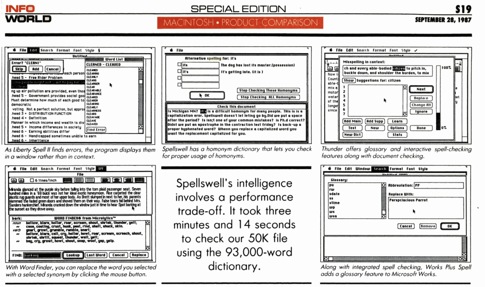

> **摘要**: 本文讨论了苹果在生成性人工智能领域的战略，认为大型语言模型（LLMs）应被视为商品基础设施，而非单一平台或产品。文章指出，虽然苹果尚未全面推出其智能特性，但其提案标志着对生成性AI关键问题的不同理解。苹果采用的“AI极大化”观点认为，通用聊天机器人并不一定会取代复杂软件，而是强调生成性AI是一种技术，应该与用户上下文相结合，作为功能嵌入到系统中。苹果构建了自己的基础模型，但没有提供一个直接的聊天机器人。苹果的模型更加关注用户上下文，允许与第三方的世界模型（如ChatGPT）进行交互，以满足开放性问题。此外，文章还探讨了苹果如何将AI技术集成进用户设备中，以减少成本和提升隐私保护，同时与其他云模型（如OpenAI）形成互补关系。最终，文章表明，苹果的战略可能会在未来的AI市场中带来新的竞争格局。
> 
>  **要点总结**:
>  1. 苹果将生成性AI视为商品基础设施，主张其应嵌入于提供上下文的系统中。
>  2. 苹果开发的基础模型不直接提供聊天机器人功能，而是以多种方式呈现用户请求。
>  3. 苹果的模型注重用户隐私，通过本地和私人云计算减少数据共享。
>  4. 苹果与OpenAI的合作表明其希望通过集成提高自身AI功能，降低对云服务的依赖。
>  5. 文章讨论了生成性AI是否会成为通用工具，改变未来软件开发与应用的模式。

---

## Apple intelligence and AI maximalism

Apple has showed a bunch of cool ideas for generative AI, but much more, it is pointing to most of the big questions and proposing a different answer - that LLMs are commodity infrastructure, not platforms or products.

No-one outside Apple has really used any Apple Intelligence features yet. It won't launch until the autumn, in stages, and even then it won't work on 80 or 90% of the iPhone installed base, since it needs on-device processing that’s only on the iPhone 15 Pro. Nothing is ever as good as the demos (except the original iPhone), Apple might mess up the developer incentives again, and it all might just not be as good as it looks. We’ll find out.

But meanwhile, if you step back from the demos and screenshots and look at the strategy, Apple is pointing to most of the key questions and points of leverage in generative AI, and proposing a thesis for how this is going to work that looks very different to all the hype and evangelism.

The ‘AI Maximalist’ view is that general-purpose chatbots, with multimodal and ‘multi-agentic’ capabilities, will be able to take over broad classes of complex multi-stage tasks and problems that today need lots of different specially-written software, and will also be able to automate whole new class of complex tasks that could never be done in software before, again in one single general-purpose interface. The chatbot might replace all software with a prompt - ‘software is dead’. I’m skeptical about this, as I’ve written [here](https://www.ben-evans.com/benedictevans/2023/10/5/unbundling-ai), but Apple is proposing the opposite: that generative AI is a technology, not a product.

Apple is, I think, signalling a view that generative AI, and ChatGPT itself, is a commodity technology that is most useful when it is:

1. Embedded in a system that gives it broader context about the user (which might be search, social, a device OS, or a vertical application) and
2. Unbundled into individual features (ditto), which are inherently easier to run as small power-efficient models on small power-efficient devices on the edge (paid for by users, not your capex budget) - which is just as well, because…
3. This stuff will never work for the mass-market if we have marginal cost every time the user presses ‘OK’ and we need a fleet of new nuclear power-stations to run it all.

To begin, then: Apple has built an LLM with no chatbot. Apple has built its own [foundation models](https://machinelearning.apple.com/research/introducing-apple-foundation-models), which (on the benchmarks it published) are comparable to anything else on the market, but there’s nowhere that you can plug a raw prompt directly into the model and get a raw output back - there are always sets of buttons and options shaping what you ask, and that’s presented to the user in different ways for different features. In most of these features, there’s no visible bot at all. You don’t ask a question and get a response: instead, your emails are prioritised, or you press ‘summarise’ and a summary appears. You *can* type a request into Siri (and Siri itself is only one of the many features using Apple’s models), but even then you don’t get raw model output back: you get GUI. The LLM is abstracted away as an API call.

This means that Apple’s foundation model won’t suggest putting glue on your pizza, as [Gemini famously did](https://www.theverge.com/2024/5/23/24162896/google-ai-overview-hallucinations-glue-in-pizza), simply because you can’t get it to answer those kinds of open-ended questions at all. Apple is treating this as a technology to enable new classes of features and capabilities, where there is design and product management shaping what the technology does and what the user sees, not as an oracle that you ask for things.

Instead, the 'oracle’ is just one feature, and Apple is drawing a split between a ‘context model’ and a ‘world model’. Apple’s models have access to all the context that your phone has about you, powering those features, and this is all private, both on device and in Apple’s ‘Private Cloud’. But if you ask for ideas for what to make with a photo of your grocery shopping, then this is no longer about your context, and Apple will offer to send that to a third-party world model - today, ChatGPT. A world model does have an open-ended prompt and does give you raw output, and it might tell you to put glue on your pizza, but that’s clearly separated into a different experience where you should have different expectations, and it’s also, of course, OpenAI’s brand risk, not Apple’s. Meanwhile, that world model gets none of your context, only your one-off prompt.

We have yet to see how well Apple’s context model really works, but in principle it does look pretty defensible. Neither OpenAI nor any of the other cloud models from new companies (Anthropic, Mistral etc) have your emails, messages, locations, photos, files and so on. Google does have both a world model, and access to your context if you use Android, but that’s a distinct minority in the USA (while even less of the Android base than the iPhone base would be able to do any of this locally). Microsoft’s AI PCs have some of this context, especially for a *work* context, but the smartphone is the primary device with all the real context for most people now, not the PC. Does Meta have that context? Some of it, maybe. There will be an interesting anti-trust conversation here, at some point. But the point of leverage is that you need to have your own billion-scale platform already before you can build this: you can’t get to it from zero, with a website.

On the other side, how defensible is OpenAI’s position in this relationship? Not very.

Last May [a leaked Google memo](https://www.semianalysis.com/p/google-we-have-no-moat-and-neither) claimed there are no moats in LLMs, because everyone has essentially the same access to training data and there would be good open source models. That’s pretty much what has happened: the only moat is capital, and access to Nvidia chips (for now), and depending on how you count it there are anything from half-a-dozen to a dozen top-tier models, with OpenAI ahead, but not by enough. Apple doesn’t claim its new foundation model is the best for everything, but it does appear to be good enough for the features it wants to provide. This isn’t going to play out like search, or operating systems - there is no sign, yet, of clear winner-takes-all effects. Apple could build its own foundation models - it’s just money.

Hence, OpenAI is being given ([apparently](https://www.bloomberg.com/news/articles/2024-06-12/apple-to-pay-openai-for-chatgpt-through-distribution-not-cash)) ‘free’ distribution to a few hundred million Apple users, for which it bears all the inference costs, in exchange for a chance to upsell to a premium subscription (though looking at all of Apple’s WWDC demos, it’s not clear how it would do that). But it’s also being treated as an interchangeable plug-in. There’s a very obvious parallel here with Google paying Apple $20bn a year to be the default search engine. Apple's AI chief John Giannandrea [made this comparison explicitly](https://daringfireball.net/2024/06/the_talk_show_live_from_wwdc_2024) after the event this week - “I think of it a bit like the way Safari deals with search engines” - and Craig Federighi said that he thought there might be different ‘world models’ used for different questions. By implication, Apple might send a flights question to one world model and a cooking query to another.

But is web search the right comparison, or should we look at Maps? Apple decided that it makes no sense to try to build a search engine as good as Google, and no-one else has really managed it either. On the other hand, Apple did build Maps, and though it messed up badly at the beginning, Apple Maps are now at least ‘good enough,’ because again, there was no real moat except capital. It’s already clear that OpenAI is not the new Google: there will not be one winner.

And, surely, the foundation model that Apple built itself to run in its private cloud IS a ‘world model’, and you *could* ask it for pizza recipes- it’s just that so far, Apple has decided not to offer that UI. Apple is letting OpenAI take the brand risk of creating pizza glue recipes, and making error rates and abuse someone else’s problem, while Apple watches from a safe distance. The next step, probably, is to take bids from Bing and Google for the default slot, but meanwhile, more and more use-cases will be quietly shifted from the third party to Apple’s own models. It’s Apple’s own software that decides where the queries go, after all, and which ones need the third party at all.

Of course, none of this is new - it was obvious when Llama 3 came out (if not far earlier) that LLMs would be commodities sold at marginal cost, and the question would be what product you built on top - hence [OpenAI hired Kevin Weil](https://openai.com/index/openai-welcomes-cfo-cpo/) as head of product. But Apple is also arguing that a whole category of LLM product will be built in places that the cloud LLMs can’t go, or in places where they’re just an API call.

This takes me to a broader point. There’s an old line that everyone in tech is trying to commoditise someone else, give their product away for free, or both. Meta is giving Llama away for free (both the model and weights and, for now, even embedding free queries in its apps) where the hyper-scalers want to charge for models, because Meta wants this to be cheap commodity infrastructure, and it will differentiate with services and features on top. Apple is doing something very similar. A lot of the compute to run Apple Intelligence is in end-user devices paid for by the users, not Apple’s capex budget, and Apple Intelligence is free. (We have no indication on how much the Apple Private Cloud will cost, nor the likely mix of local versus cloud queries.) Nvidia sold $25bn of AI chips last quarter, and the hyper-scalers will probably spend $150bn or so on data centres this year, but the global smartphone market is over $400bn, and the PC market over $200bn, and your users pay for that. These numbers are not *directly* comparable (obviously!), but it’s a *relevant* comparison. No-one can know for sure what this will look like in a few years - the models will get bigger but also more efficient, and the edge will get faster - but there are some very powerful incentives to get as much as possible onto the device.

Commoditisation is often also integration. There was a time when ‘spell check’ was a separate product that you had to buy, for hundreds of dollars, and there were dozens of competing products on the market, but over time it was integrated first into the word processor and then the OS. The same thing happened with the last wave of machine learning - style transfer or image recognition were products for five minutes and then became features. Today ‘summarise this document’ is AI, and you need a cloud LLM that costs $20/month, but tomorrow the OS will do that for free. ‘AI is whatever doesn’t work yet.’

1987: Spell-checkers as stand-alone software. Spellwell was $74, which is $200 adjusted for inflation.

2024: Summarise and rewrite integrated into the OS

I’m also curious what this means for Nvidia. As I often and carefully note, I am not a chips analyst, and actual chips and data centre analysts talk a lot about Nvidia’s moats, both in the silicon itself and in the software for developers that it’s built on top. Apple is big enough to take its own path, just as it did moving the Mac to its own silicon: it controls the software and APIs on top of the silicon that are the basis of those developer network effects, and it has a world class chip team and privileged access to TSMC. Who else compares to that today? Google TPUs? It seems unlikely that many other tech companies, even huge ones, will build their own completely custom silicon-to-GUI AI stack. The place for change is in where the models get run: the full foundation model doesn’t fit on a phone, yet, but the more that the real use cases come from unbuilding that model and the ‘oracle’ into features, the more that the inference could shift to the edge a lot faster. Again, Apple is pointing to the question.

Finally, all of these are still just theses. None of this worked just 18 months ago, and we don’t have product-market fit yet. Anything up to half of the population of many developed world countries has already tried generative AI, but half of those never tried it twice. That’s great awareness for something so new, but it’s not traction. We don’t know what the product will be, nor the market, nor the science, and everything is still changing really fast. There may be new breakthroughs in agents or error rates that change the use cases entirely.

Meanwhile, incumbents always try to make the new thing a feature. Google and Microsoft have spent the last 18 months spraying LLMs all over their products, and so has every enterprise SaaS company: my old colleague Steven Sinofsky says that ‘every text box on the internet is going to get an LLM’. Apple is doing something slightly different - it’s proposing a single context model for everything you do on your phone, and powering features from that, rather than adding disconnected LLM-powered features at disconnected points across the company. But it’s still trying to make the ‘disruptive’ new tech into a feature, and it’s trying to put ChatGPT into a box, limited to a pretty narrow set of use cases, and interchangeable with Anthropic or Gemini.

As I said at the beginning, that’s really the single core question about the future of Generative AI - is this a new general purpose tool, where one product from one company does the work of hundreds of pieces of software from hundreds of companies, or is this a generic technology that will enable features inside products from hundreds or thousands of companies?