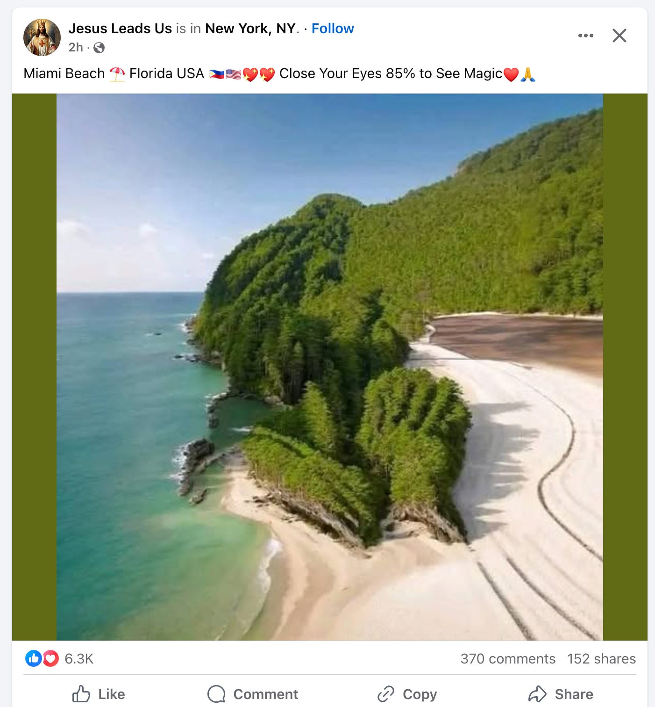

> **摘要**:
>  文章作者分享了自己删除社交媒体和电子邮件应用的经历，探讨了这种选择所带来的心理变化和生活影响。作者发现，通过减少社交媒体的使用，她的生活空间和时间感得到了重新定义，体验到了更深层次的人际沟通和宁静。虽然她没有完全放弃这些平台，但意识到它们在生活中正变得越来越无关紧要。作者还提到，许多人正处于类似的转变期，对于社交媒体的依赖和使用方式亟需重新思考，探索如何在现代生活中找到更有意义的连接。多篇引用的文章指出，减少社交媒体使用可以帮助我们重新认识无聊的重要性，以及如何去体验真实的生活。
> 
>  **要点总结**:
>  1. 删除社交媒体应用让作者重新审视个人时间和注意力的分配，感受到了生活的宁静。
>  2. 许多人正在经历社交媒体的离弃或使用方式的转变，反思这些平台对生活的影响。
>  3. 社交媒体的降低使用和无聊体验帮助我们回归真实生活，并培养更有价值的人际关系。
>  4. 作者通过减少社交媒体使用，发现创造力和人际沟通能力得到了提升。
>  5. 文章提及其他作者和观点，强调了对社交媒体依赖重新审视的必要性与可能性。

---

***If you missed it from earlier this week: [I’ve put together a bunch of ways you can help those in LA \*right now.\*](https://annehelen.substack.com/p/blake-lively-reshoots-the-end-of)***

*We’re also doing another round of “**Ask A Divorced Person**” — where people with questions for divorced people submit their questions, and a group of divorced people (who’ve gone through different types of divorces) answer them. You can get the general idea [here](https://annehelen.substack.com/p/leave-before-there-is-nothing-left).*

If you have a question for a divorced person, you can submit it [here](https://forms.gle/W7oqLmhbzCQQK2Qw7). If you’d like to answer questions *as* a divorced person, you can volunteer [here](https://docs.google.com/forms/d/13kzoMmlmFbDOvYgJsXxuN-nGuXrUtS2vQK37G_GOkfg/edit). (Link is now fixed, it takes you to the right form!)

***And if you open this newsletter all the time, if you forward to your friends and co-workers, if it challenges you to think in new and different ways — [consider subscribing](https://annehelen.substack.com/subscribe?utm_medium=web&utm_source=subscribe-widget).***

[Upgrade Your Subscription](https://annehelen.substack.com/subscribe)

*You get access to the weekly **Things I Read and Loved** at the end of the Sunday newsletter, the massive links/recs posts, the ability to comment, and the knowledge that you’re paying for the stuff that adds value to your life. Plus, there’s the addictive & useful threads: like Friday’s on **[The Most Beautiful Swim You’ve Ever Taken](https://annehelen.substack.com/p/the-most-beautiful-swim-youve-ever)**, and this month’s “**[What Are You Reading](https://annehelen.substack.com/p/what-are-you-reading-in-november)**” (1100+ comments and suggestions!)*

Abandoned Concrete Barges from World War II in the River Thames (Aerial Essex / Getty)

The day before Christmas Eve, I deleted Instagram and my email from my phone. Facebook hasn’t been there for years, and Twitter has been gone for nearly two. For reasons that mystify me — maybe because I hid it on the third page — I only feel like getting on TikTok once or twice a month, and then I watch it like it’s a long movie and then leave it be. My phone was reduced to a texting device with a smattering of essential apps: the camera, of course, but also the weather, maps, browsing. I didn’t make it totally un-useful. I just significantly reduced its potential to fill my time.

It was easy to ignore during the bustle of the holidays. It was usually just in the mornings, when I first woke up, that I realized just how much time I’d devoted to scrolling. There I was, looking at the weather or the snow report for the third time, checking our local NextDoor and feeling dismayed that no one had published a new sunset photo. At night, I’d look at my phone, realize it had nothing to offer me, and throw it onto the bedside table like a cranky toddler bored with a toy. I read and slept in abundance.

It’s not that I didn’t read email, or utterly ignored Instagram — I could still take a look on my computer browser. It’s that I looked at them *far* fewer times. It felt like 2006 in the very best of ways: I could still communicate with others and periodically see pictures from their lives. It’s just that that communication didn’t serve as the score and meter of my life.

I told myself I’d put both Instagram and email back on my phone at the end of the in-between weeks. Days kept passing, and I kept not doing it. One day I had to make a return in town that required a QR code; I forwarded the email to my mom and had *her* show her phone. (I also could’ve just….printed it out).

I read the news of the Los Angeles fires on news sites and in newsletters instead of being barraged by it on Instagram. I open my email on my computer and sort through the accumulation in a massive chunk — like my PO Box, when I haven’t gone for a few days — instead of bit by distracting bit. I find myself diverting my scroll energy to Facebook, where I still have an account to access dahlia groups, but it feels even more gross than before: a wasteland of AI accounts promising blue dahlias and weight loss reels and suggestions to friends of friends who haven’t updated their Facebook accounts in nearly a decade. It’s like a frat house basement at 10 am. *Why the fuck am I here.*

HOW, FOR EXAMPLE, DID THIS GET IN MY FEED

I’ve spent more time than ever before on Substack Notes, but not posting, or even responding to other people’s notes. The algorithm seems to have learned that I like to read newsletters, not posts, and is serving me those links, not others’ endless discussion of what they don’t like about Notes (namely: it’s like everywhere else that they also don’t like).

I’m not quitting Instagram. I may or may not add email to my phone; maybe I’ll just do it when I’m traveling, and it becomes my de facto computer. I’m not trying to convince you to do what I’ve done, and I’m not suggesting I’m a superior or more disciplined person for doing any of this. All I’m saying is: I think I’ve turned the corner. And I think a lot of you have — or are about to — too.

You know how, when people get sober, or fall in love with running, or have a breakthrough in therapy — they can’t stop proselytizing about it? “Proselytize” feels like the right word here, because they really are preaching the good news of a new religion: a way of understanding and occupying the world. To them, it feels so right — and so unbelievable, that it took them this long to find it — that they want others to figure it out *now*, in less time than they did.

But proselytizing doesn’t work, at least not how people think it does, and rarely in lasting ways. People make major decisions in their lives only when they’re ready, and they rarely reach a point of “ready” by people preaching at them. Instead, they slowly absorb examples, arguments, and desires for their own lives, and arrive at a place where they’re malleable to change.

After years of people yelling at me in books, think pieces, and tweets (lol) to “break up with my phone,” “delete your social media accounts,” and “fuck Mark Zuckerberg,” turns out the thing that I needed was a whole conglomeration of quiet arguments and technological shifts that made my phone and the social media accounts on it feel *less precious*. Put differently, I haven’t come to value it less; instead, it’s become less valuable.

This sounds spectacularly self-centered: that you can only quit a thing, or modify your usage of it, when it fails to serve you. But if we think of our phones and social media as addictive products, which they certainly are, then the classic addiction model makes sense: you only consider quitting when the negative impacts (the dead feeling of the soft-brain scroll, the loss of attention span, the weight of comparison, the exposure to trolls, the lack of control over the algorithm) outweigh the positive benefits (the distraction, the serotonin hit, the semblance of connection, the loose ties, the business benefits).

My sense is that a lot of you are at a similar point. The amount of space these technologies take up in our lives — and their ever-diminishing utility — has brought us to a sort of cultural tipping point. I’ve sensed it over the last year, when my social feeds seemed to finish their years-long transformation from a neighborhood populated with friends to a glossy condo development of brands. I could feel it in the responses to my piece, last month, to [Posting Less](https://annehelen.substack.com/p/posting-less), but also in a slew of pieces from other writers, all tracing different pathways to the same conclusion: this isn’t working anymore. What if we stopped trying to make it?

At this point, we’ve had social media around for long enough — and people have been experimenting with decreasing or eliminating it for various lengths of time — that there’s a pretty rich collection of writing on the topic. I thought it might be useful to show you a few recent examples that have set up residency in my brain:

Kate Lindsay [points out](https://embedded.substack.com/p/you-might-just-have-to-be-bored?r=h567&utm_source=pocket_reader&triedRedirect=true) a foundational problem with decreasing phone/app use: we’ve forgotten how to be bored. This has felt true to me for some time, but I appreciated the point that trying to re-acquaint yourself with boredom cold turkey can be a disaster that leads to even greater dependence.

Lindsay has gradually decreased how she uses her phone and social apps, and in so doing, the feeling of *necessity* also decreased. For me, all of this felt impossible until Twitter lost its utility for me — slowly at first, and then I realized I just didn’t want to hang out there. At first, I felt its absence, but then I began leveraging other modes of communication to keep in touch — or just kept in touch *less* (and spent more time doing things that were nourishing in ways that had nothing to do with being online).

And then there’s the fact that boredom is far more than, I dunno, staring out the window on a long car ride when you were eight years old. “Boredom,” Lindsay argues, “is when life happens”:

> Boredom is when you do the dishes, run the errand you’ve been putting off, respond to the text you’ve left on read. Boredom is when you bring a book to read on the subway or make small talk with the person in front of you in line about how slow the pharmacy is. Boredom is when you do the things that make you feel like you have life under control. ***Not*** **being bored is why you always feel busy, why you keep “not having time” to take a package to the post office or work on your novel. You do have time—you just spend it on your phone.** By refusing to ever let your brain rest, you are choosing to watch other people’s lives through a screen at the expense of your own.

She fucking *nails* it, doesn’t she. How obvious, how painful, how hilarious, that two things that most of us feel most stifled by — our lack of time, and our phones — are *deeply fucking related*.

[This argument](https://samkriss.substack.com/p/how-to-live-without-your-phone?r=h567&utm_source=pocket_shared&triedRedirect=true), from Sam Kriss, is not for people who use their phones as their sole computing device. It’s for people who use phones as one of many devices to communicate and navigate the internet. Kriss concedes that the GPS/mapping function of the phone is quite useful — but apart from that, our phones really aren’t doing much that our computers don’t do, they’re just portable and thus available to disrupt any potential boredom.

This point comes about halfway through Kriss’s piece, which is about giving up his phone for 40 days, and I appreciate how he resists the narrative that giving up your phone will change your life — you still have the internet, after all, you just have *slightly less access to it*, and that slight change in access can be meaningful, or at least clarifying.

I’m not interested in getting rid of my phone, I’m just interested in being less bound to it. My experience without email on my phone for the last three weeks has also underlined just how stupid my previous arguments were about its necessity. Nearly *everything* can wait until I can access my computer. QR codes can be printed or screenshotted and texted to yourself — or you can (pretty easily!) download the email app for an afternoon and delete it afterward. If you’re holding tightly to this argument, it’s useful to think about why.

A chaser: “Not using a phone taught me what a phone is really for. It’s not for communicating with other people, getting directions, reading articles, looking at pictures, shopping for products, or playing games. A phone is a device for *muting the anxieties proper to being alive*.”

I entered the New Year with so many ideas for this newsletter: bizarre, thorny, wonderful, *generative*. I felt excited about digging into the big heart of the book. I could attribute some of that creative energy to working less over break, but I’m not that person who comes back from vacation bursting to work. I have more newsletter energy — and more time to execute it — because I’m not spraying that energy all over social media.

Here’s how Julia Fontes [puts it in her post reflecting on the end of her year of “smart phone celibacy”](https://juliefontes.substack.com/p/how-i-lost-the-plot-after-reuniting?r=h567&utm_source=pocket_reader&triedRedirect=true):

> “This post isn’t going to conclude with me quitting all the sites. I do think that the way that they have sucked my attention away from the writing and made my newsletter worse is proof enough that I don’t want to continue to use them in the ways the marketing gurus recommend…..What I know for sure is that one year with the dumb phone culminated in the publication of my first book, and I don’t think that’s a coincidence. I know that moderation of anything that stimulates the dopaminergic response is nearly impossible for me. I am done beating myself up or putting in any kind of moral judgment about what I should or should not be able to control.”

I want to spend less time promoting on social media — or just scrolling, let’s be honest, because that’s how I usually spend time when there to “promote” — and more time making stuff that’s promotable, that I’m proud of, that makes this entire enterprise thrive.

And privacy as valuable. Our lives don’t have to become others’ cheap food for consumption. This one bonked me right on the head:

Here’s Hannah Power, [on leaving Instagram](https://thisiswhatawitchthinksabout.substack.com/p/things-got-really-weird-when-i-got?r=h567&utm_source=pocket_saves&triedRedirect=true):

> “….the weird things that have happened as a direct consequence have been, well, weird. for instance, I haven’t missed it once. not once! I thought I would. I thought I would miss sharing my curated life, my walks through the streets of Lisbon, my pics screaming I am on holiday, but I haven’t. another weird thing that has come from my absence is loving my absence. I didn’t realise that my privacy was luxurious and I was just giving it away for free to people and Mark Zuckerberg. I didn’t realise privacy was a gift, a privilege even. I didn’t realise how cool it was to be somewhere and only you and the person you’re with know it. it was weird that I didn’t know this, or had forgotten this - like I was under a spell.

It reminds me of something Freya Moon [wrote](https://www.freyaindia.co.uk/p/you-dont-need-to-document-everything?r=h567&utm_source=pocket_reader&triedRedirect=true) about the Gen-Z belief that posting is what makes something “real” — a boyfriend, a vacation, a meal. We have mistaken others’ recognition of a thing for actual experiencing the thing. At first, when I left Instagram, I thought (embarrassingly): *but how will people know I’m going skiing, or see all this cozy puzzling, or know that I do indeed have friends and I hung out with them on New Year’s Eve?*

“People” may not know, but I do.

Over the last fifteen years I’ve watched incredibly talented writers who had ignored social media with good reason (they liked writing more than posting, *imagine*) get pulled into starting a Twitter, an Instagram, a Facebook page, *whatever*, because a marketing person at their publisher or an agent or someone they know in the industry convinced them that a social media presence is essential to a successful book launch. I understand where this wisdom is coming from, but I don’t buy it. A brand-new social media profile sells nothing. A Substack with a handful of posts and a listing of upcoming readings does the same thing as sending a big email to your contacts.

I’m not fool enough to believe that a good book will sell just because it’s good. But a book sells through connections, and connections — the sort that make someone say *yes of course let’s do a Q&A for your book!* — are not primarily forged or maintained on social media. We take a look at our past and think of a friend that we made on Twitter or in a Facebook Group and think *this is why I can’t leave!* But those platforms don’t do the same thing they used to. My Instagram account doesn’t sell books. My newsletter — different story.

Plus: what connections are you *also* missing by allocating so much of your creative time to social media? What happens when we consider those losses?

I like what comedian Cynthia Girardian [wrote about the decision to delete her Instagram account](https://cynthiabague.substack.com/p/so-ive-deleted-my-instagram-accountnow?r=h567&utm_source=pocket_reader&triedRedirect=true):

> “….If I started on Instagram at 20 and I am now at the ripe age of 33, that means my whole adult life so far, I’ve spent it developing some sort of addiction to likes and external validation. And this means I will probably suffer from withdrawal syndrome from time to time: sometimes, since being off Instagram, I feel disconnected, isolated and lonely….Nothing seems to keep me as connected and as chronically online as Instagram and my 12.6K followers did, and so the questions remain:
> 
> 👽 Am I sabotaging my opportunities?
> 
> 👽 Are my friends and acquaintances going to forget about me?
> 
> 👽 Am I becoming the weird friend?
> 
> 👽 How am I going to establish contact or keep in touch with people / brands / potential work gigs from now on?
> 
> 👽 How am I going to share with the world the things I do?
> 
> **Not to make this my entire personality from now on, but to my own surprise, I want to offer some resistance and explore these uncomfortable feelings for a while**. I am low-key excited, and I am certain that with time and space, all these questions will answer themselves.”

In other words: what happens when we reintroduce the friction that social media smoothed? What’s worthwhile about re-learning some of the connective skills we’ve lost?

This past Tuesday, I was reading the “What Are You Reading” thread and realized I’d missed [the big investigative piece about Neil Gaiman being an absolute creeper](https://www.vulture.com/article/neil-gaiman-allegations-controversy-amanda-palmer-sandman-madoc.html?origSession=D2310056I8C3YDrVCPzJGxNg0nzMmVzcSekwODYkNmemSqkxTw%3D&_gl=1*qshuya*_gcl_aw*R0NMLjE3MzYwNTEzOTkuQ2p3S0NBaUExZU83QmhBVEVpd0FtMEVlLU0wN05BOWJnVGo3c0xNaFcyczRXd1FVZGl3b2lhWTQtdERhejd4c3VzQ3VlLXhzYi1CLUtSb0NoSmNRQXZEX0J3RQ..*FPAU*ODY2Mzc1MDA2LjE3MzYxOTg4MDY.*_ga*NjM4NzE2Mjg5LjE3MDk1OTEyMTA.*_ga_DNE38RK1HX*MTczNzA1NTYyNi41Mi4xLjE3MzcwNTU2MjYuMC4wLjc1NzQ5MDUwNQ..*_fplc*aXFkMnAzdTJGck1wanNUNzJBSjkzWENWWlglMkJWMVpqZFVPVWxFOVNHNjRPYnpyenA0dWJrYzJ2cDlHMXNZeThrVnpuWnJLJTJCREJYS2o1c2dxdnl5UTRYRUJUU09LSmVBdlpYUjJHVklFQWNncEYlMkJNYzYzczBrZkF6UXdqeUlnJTNEJTNE), which came out the day before. At first, I felt out of touch — and then I realized 1) I could go read it right then, and it would still have the same import; and 2) I could and should be more active about just visiting the websites of the publications I value and love, something I used to do every single time I opened up the computer. There are so many other ways to use the internet — some of them from our very recent past.

Many of you have resisted social media altogether. Others have always had a distant or measured relationship with it — or left when these companies proved, again and again, that they made you (and others) into a person you didn’t particularly like, or that the technology itself was so readily manipulated to serve our worst impulses. But a lot of us are sitting here with lives, both personal and professional, intertwined with these apps. We’ve sunk so much time into them; they hold not insignificant chunks of our recent past. We’ve negotiated misgivings and ambivalence; we’ve crafted complex and simple justifications to stay.

So what is it about *this moment* that makes leaving — or significantly moderating — feel possible? The platforms feel toxic, but they’ve felt toxic for a while. They’re more toxic *and* they’re degrading, overridden by brands and AI. Their utility for connection (the thing that brought us there in the first place!) has deteriorated to the point of uselessness. The cultural norms of 2005 to 2025 were produced and refined via social media, but the homes we built there — the understandings of self — feel unwelcoming and alien.

The world, filtered through the apps, is not the world we want for ourselves. And in many cases, it’s not the actual world we inhabit.

In a recent piece for the *New York Times*, Ezra Klein [argued](https://www.nytimes.com/2025/01/12/opinion/ai-climate-change-low-birth-rates.html?unlocked_article_code=1.o04._nFI.9QZM5nFZ7JPi&smid=url-share) that this feeling of discombobulation can be traced to “the unsteady, unpredictable emergence of a different world.” He’s talking about Trump, of course, and the anti-democracy politics he aims to ram through — but also AI’s maturing power and a rapidly warming planet that offers peepholes into an unspeakably hostile future every month. He concludes the piece with a quote from Antonio Gramsci: “The old world is dying, and the new world struggles to be born: Now is the time of monsters.”

Climate monsters, cultural monsters, political monsters. You can’t fight them by consuming news, or quote-tweet dunking, or sharing a graphic. You can *fight* them through connection. Social apps might be the “easiest” place for that to happen — and by that, I mean it might the place with the least immediate friction — but that does not make them the place for them to gain and exercise power. If this is indeed a new world, we need new tactics, new tools, and new energy. None of which are hiding on Instagram.

I’ve spent the last year oscillating between anger and disenchantment, hope and disillusionment. I want to break everything but also mend it. At times I want to hibernate, to turn inward, to fortify what’s mine — but also understand how vulnerable that will make me to all the challenges to come. How do we relearn how to talk to one another? To live with each other? To think and act with creativity and intention? How do we lead the lives we actually want to live, marked by care and passion?

Dude, I’m working on it! A lot of us are. If someone has an easy answer for you, they have some sort of privilege that’s allowed them to shield themselves from the complications of the modern world. What I do know is this: I have a lot more time to think about these questions, to access empathy and so many other emotions, to experience the textures of each and every day, since I started spending less time on the sites where I’m supposed to document them.

***For our discussion today, I don’t want to talk about the reasons why you have to stay — you don’t need to make the case. Everyone’s dealing with their own situation in the way that feels right to them. There is still very real utility in many corners of social media and moving a community off Facebook is not simple.***

***Instead: how are you \*feeling\* about your current use? What would you like to change? Which argument to stay now feels flimsy \*to you\*? And do you also feel like we’re reaching a pivot point, or am I just high off all my new free time?***

Also: as a way of connecting on smaller issues — and sharing pieces I’d usually share on Instagram or a previous iteration of Twitter — I’ve been playing around with **Substack Chat.** Feel free to totally ignore it, or dip in when you feel like it, whatever feels interesting and generative. It’s very low-key, but the same guidelines apply there as any other Culture Study comments section. You can find all chats [here](https://substack.com/chat/2450).