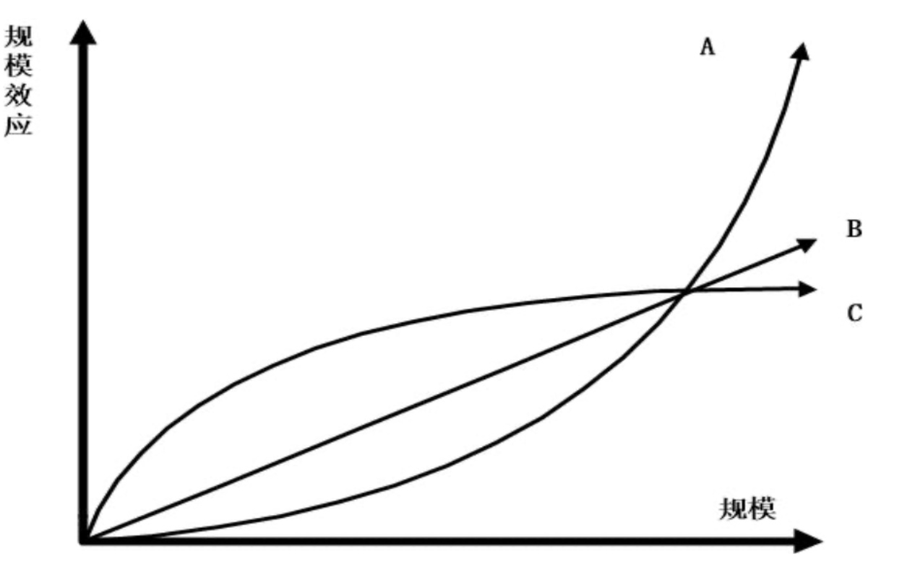
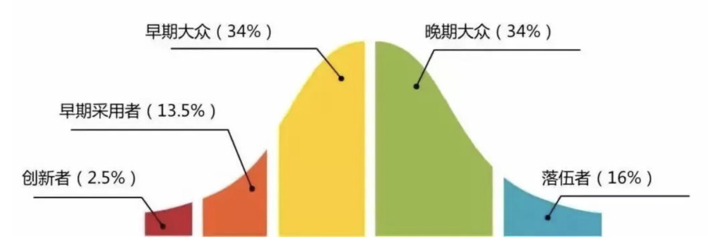

> **摘要**: 文章探讨了市场体量、规模效应以及企业发展中的关键战略。首先，市场体量的判断直接影响投入的合理性，错判可能导致资源浪费或机会丧失。其次，规模效应，如网络效应和市场集中度，决定了企业在竞争中的地位和生存能力。文章还提到马太效应即从众心理在商业决策中的作用，强调企业应在规模效应明显的领域实现快速增长，以增加市场集中度。并且，产业链的角色也不可忽视，链主在行业中的生存能力相对更强。最后，正确的入场时机加上策略选择（如差异化和成本领先）是成功的关键。
> 
>  **要点总结**:
>  1. 投入的合理性依赖于对市场体量的正确判断，以获得战略先机。
>  2. 规模效应是一种关键的商业力量，决定了企业的竞争优势与市场领导地位。
>  3. 马太效应表明从众心理会影响商业决策，企业应尽量专注于规模效应显著的领域。
>  4. 产业链的链主角色在市场竞争中起到关键作用，促使企业在复杂行业中获得主动权。
>  5. 合理的入场时机和策略选择（如差异化与成本领先）是创业成功的重要因素。

---

> 投入的合理性取决于对市场体量的判断。如果判断对了且尽早投入，就获得了战略先机；判断错了，在一个不够大的市场里投入太多钱，或者在一个足够大的市场里投入不足，就会掉到坑里。

## 战略

### 市场体量

- 最重要的因素
- 对市场体量的估算影响投入。  
	**投入的合理性取决于对市场体量的判断** 。  
	如果判断对了且尽早投入，就获得了战略先机;但判断错了，在一个不够大的市场里投入太多钱，比如共享单车，或者在一个足够大的市场里投入不足，就会掉到坑里。

比如外卖，美团一共烧了20亿美金。如果当时按照美国外卖公司GrubHub市值30亿美金估算，就不会投入20亿美金。实际上美团外卖占美团市值1000亿美金。

### 规模效应

- 规模效应是商业世界里的万有引力
- 哪些生意能做大哪些生意本质上就是做不大是一个非常重要的问题，一个非常重要的要素是规模效应。
- 规模效应就像万有引力，万有引力足够大的话就会把其他物质吸过来围绕自己转，万有引力小的话有些物质就会越绕越远。
- 现代生意的规模效应指随着规模增大，成本降低或体验更好
- 规模效应好，应该是规模越大，竞争对手越少。比如微信；反之，淘宝、外卖并不是，即使做得很大，仍然有竞对。
- **总的来说，和人的个体的创意关系很大、和人的个体主观能动性关系很大的就没什么规模效应**

#### 规模效应的形状

1. A曲线最典型的是网络效应，有网络效应的一个例子是互联网本身，公式是互联网的价值和节点数的平方成正比。有网络效应的生意最典型的例子是社交网络，微信是一个非常典型的网状结构，
2. B这条线是淘宝，每多一个用户淘宝都能接纳，淘宝就增加一点价值，但用户和用户之间 没啥竞争，所以淘宝的价值是随着规模线性上升的。这解释了很多问题，淘宝做到今天它 的竞争对手是在变多的，淘宝2003年起家，2010年京东发展得很快，现在拼多多发展得很快，你已经做的这么大了还有竞争对手不断进来这就说明了你的规模效应不够强。
3. C曲线，随着规模的上升，规模到了一个水平后规模效应的增长变缓了，常常是有一些副作用出现了，哪些生意有C曲线的规模效应?有这样曲线的生意一般具有“双边网络且同边负效应”，外卖和淘宝是比较典型的双边网络，它不是完全节点的网络，但不见得所有的双边网络都存在同边负向效应，例如淘宝的供给非常充分接近无限供给，一个用户买一 个商品不会影响另一个用户的购买，但你打个车对旁边的人就是有影响的，司机端也是一 样，单子被抢走了就没了，所以打车就是双边的同边负向竞争。外卖的规模效应比打车稍 好一些，毕竟外卖的同边负效应比较低，商家的服务能力弹性大，配送员也有比较强的拼单能力，但是外卖跟京东比规模效应就弱些。

#### 规模效应的scope

规模效应是在多大的scope里(多大范围内)起作用。

- 比如说全球型的规模效应，就是在中国和在美国有一个用户都会产生正向的用户体验;
- 如果是一个城市型的规模效应，也就是说你在北京有一个商家和在上海有一个商家，一点关系都没有，这就是城市型的;
- 有些是全国型的规模效应，有些是蜂窝型的， 蜂窝型的规模效应就终于轮到外卖了。

#### 要素的规模效应

这是做生意最难的，要区分出到底哪些要素是有规模效应的。很多要素之间是博弈的关系的，首先要知道各个 要素之间有博弈，其次你管理能力要强，再次要知道合适的点在哪里，这个点就是试出来的。

### 马太效应

- 从众产生马太效应
- 几乎所有的领域，大部分决策者都没有有效的信息、知识结构和判断方法出独立判断，所 以大家只能依赖专家或者从众因此产生马太效应。所以我们要尽可能抓住有规模效应的要 素，尽可能减少􏰀规模效应，尽快形成马太效应。

### 市场集中度

- 规模效应、马太效应、􏰂规模效应是 市场集中度的决定性要素
- 市场体量可以很大，如果市场集中度不够高的话，也产生不了很大的企业，典型的行业是餐饮，尤其是中国的餐饮行业。美国也出了麦当劳这样千亿美金的公司，大行业小企业的例子也是很多的。所以不要觉得这个行业很大就立即大规模投入，因为投资人也会看这个行业能不能出大公司，如果是一个大行业小企业的行业，那也会掉到坑里去。
- 市场集中度一般用CR，例如CR3表示行业里最大的3家的市占率，比如中国电信行业的CR3 就是100%，这是方法之一。另一个判断方法是去讨论最后剩下几个企业，最后剩下的企业 的数量要么是1家，要么是2家，要么是3家，要么是7家，要么是无数家。
- 大部分的行业都会剩2-3家，所以要尽快冲到领先的2-3家里，因为不仅你 知道，投资人也知道，如果你不在最前面的2-3家里，投资人就不会给你投钱了。
- 如果行业里有很多家，所以企业经营的关键战略是 差异化，如果一个行业里只有2、3家，就很难差异化，在传统行业或许还可以，在互联网就很难，除非你假定你遇到了一个很弱的同行。
- 美团当时的一个策略——我们要确保自己的体量在行业 前三，因为行业最后只会剩2、3家，投资人只会投前三家，此外要做前三里ROI最高的而 不见得体量是最大的。

### 产业链

- 每个产业链都有链主，链主才是这个行业里生存最好的角色，也在产业变革中是更有主动权的一方。
- 微笑曲线理论：是一个台湾同胞发明的。在一个产业 里面生存最好的是处在最上游接近核心供应资源和最下游接近消费者的企业。沃尔玛和7- 11就处于最接近消费者的地位。这个理论常见于链条比较长或复杂的行业。
- 有些行业比较复杂就涉到生态企业。如亚马逊打造的kindle生态，不仅仅是卖书，还涉及到书的发行、初版等。有的行业没有生态，你硬要搞生态就会掉到坑里去，而Amazon做的事都是让整个行业的效率更高。反过来如果做生态能提高效率，那么你要么成为生态建设者，要么加入那个生态成为一员，否则就会被生态淘汰掉。
- 波特五力模型

### 先发与后发

后发优势：

- 你不需要去说服很多人了，先发者要去说服很多人的痛 苦是很多人完全不能想象的。
- 知道这个事情一定能实现。
- 后发者通常是比较常规的商业思维，而创新者通常思维是很独特，但也因此带来了认知盲区。创新者和后发者的根本差别是创新者通常有思维盲区，而后发者思维盲区会小些。

### 增量与存量

- 衡量增量存量的一个标准就是渗透率，比如一天几百万张机票有多少是通过互联网卖出去的，当这个比值超过50%之后市场格局要变就很难了.
- 在互联网生意里，增量存量的一个影响就是获客成本的差别，不管是打广告还是补贴还是做地推。增量和存量市场的获客成本的差别起码是十倍，这导致进入存量市场单单一个用户获取成本就会导致这个生意不成立。
- 存量市场也是有机会的，这很大程度上取决于你在多大程度上和第一名做差异化。记住迈克波特三战略:成本领先、差异化、专注。

### 高频低频

- 高频更有优势
- 低频也能生存，但要做的很深入如链家、美团餐饮
- 低频可以与高频结合，如在微信里有外卖、链家的入口

### 入场时机

- 入场时间很重要，但很难把握
- 如何判断入场时机：借用马克安德森的结论，如果你相信一件事早晚会发生，你就每3年试一次；老王认为只要没有倒闭，就是早入场比晚入场好，但怎么扛住别倒闭这件事对大公司和小公司都很难。
- 所有伟大的需求都一定会用错误的方法或在错误的时间点试过很多次。如果你有一个机会是第一次出现的，那么你大概率做了一个错误的事情，如果你不是第一次，那么总有人问你，这个事情很多人做过很多次没做成啊。这就涉到这个时间窗是如何打开的，这是有很多社会、经济、科技等多个基础原因共同作用形成的，在这个宏观分析里有一个叫PEST模型(Political, Economic, Social, Technology)，基本上是这几个大 的要素变化形成了短暂的时间窗口。
- 经常是技术变化导致了成本和体验可能性的变化。如智能机让很多业务成为可能
- 从业者的认知变化，正确的认知很难获得，可能要经历多次创业。所以只要能确定公司不倒闭，越早入场越好，因为越早入场你越能积累正确认知，你越可能把握住浪潮。如果有一天创业也好还是在公司内搞个新业务也好，千万不要说兄弟们机会来了这次搞一把大的，那你多半会掉到坑里;你要想着兄弟们我们相信这个领域早晚会成，我们要一直干下去直到这个行业成功。

### 迈克波特三战略

成本领先(Cost Leadership)、差异化(Differentiation)、聚焦(Focus)。  
因为互联网的很多特殊性，导致迈克波特的后两个战略有效性下降了

- 注意!迈克波特三战略虽然很经典，但是需要强调一下的是这个三战略毕竟只是“竞争” 的三战略，而竞争只是商业中的一部分，甚至是不大的一部分，所以不能把迈克波特三战 略理解为战略的全部，所以叫做“迈克波特竞争三战略”可能是更准确的。
- Leadership理解很大程度上体现了传统商业的特征，也就是同品质商品或服务能生产出来， 只是成本不同而已;但是在互联网时代里只要做不到微信同样的规模，你就做不到微信的 用户体验，因为规模就是微信体验的本身。所以今天再来解读Cost Leadership的话，应该 更新为Cost Leadership或者规模效应导致的Experience Leadership。
- Differentiation，在过去商品时代宝马和大众可以差异化为高端与平价的差别，而宝马和奔 驰可以差异化为驾驶与乘坐的差别，但是因为互联网平台的个性化千人千面，我们很难说某个互联网平台是高端或者大众的，所以差异化的空间被大幅挤压。所以在互联网行业要走差异 化路线，很可能需要建设在一个“你的竞争对手组织能力不太强”的假定下才能行得通。(ps：差异化可以有多种如目标用户群里，产品使用方式，全新的产品等)
- Focus这个战略也略有这个问题。互联网行业无论是采用Focus还是Differentiation的战略， 要放大这个战略有效性的一个办法是采用竞争对手难以建设的组织能力，比如京东自营电商的组织能力阿里就一直建设不出来，但是也有同行一度企图用Focus来解读跟美团的竞 争，却没有认识到大家组织能力非常相似。

## strategy(策略) for product

这部分会涉及四个概念，PMF、《创新的扩散》、STP、4P，不要把这四个概念理解的割裂了，他们之间是互相影响互相印证的关系。一个产品或者一个业务最优雅情况下，会 同时符合了这四个概念的理论。

### PMF

- 很多早期公司成败的点就在于是否找到了PMF，不少创业团队没找到PMF却在发力，早早把钱花光了或把信心耗光了;
- 另外一种错误的行为是找到了PMF却没有发力猛搞;更多的团队是在找PMF的过程中丧失信心散掉了。
- 找PMF是很难的，后面的《创新的扩散》、STP、4P就是在帮你找到这个PMF

### 创新的扩散

- 极少情况下会一个产品各阶段用户的接受速度差不多，毕竟iPhone也是做到第四代才大红大紫，一个产品不太可能在一开始就尽善尽美，有一部分用户在产品还很糙的时候就愿意用，要优先匹配这部分用户的需求，根据STP选择ROI最高的市场和产品。
- 在产品设计和市场推广的过程中能分清扩散的阶段和匹配扩散阶段设计产品会极大的提高 ROI，当资金、组织能力、研发能力都上来之后再拓展新的人群，提供更好的产品。
- 不同的人对创新的接受度不一样，有些人是Early Adopter早期接受这个创新的产品，有些人是Early Majority早期大众。这个理论非常重要，如果大家做一个新的产品或一个新的公司，你一定是在创新，你一定要先找到Early Adopter，你要用正确的Segment来找这些人， 无论你做一个多大的市场多通用的产品，你也要在最初的时候有一些Innovator或Early Adopter，否则会因为产品、资源、人力控制不住而失败。
- 那我们如何去找Innovator或Early Adopter呢?最好的情况是你自己就是Innovator或经常和 Innovator混在一起，典型的就是沃兹和乔布斯，所以他们混在那个群体里，乔布斯是销售 能力最强的人，沃兹是动手能力最强的人。那么如何确定这件事当时有商业机会呢?如果 你自己不在Innovator或Early Adopter那个圈子里，这事的难度就大幅上升了。比如说美团 做to B的餐饮软件产品但公司里没人开过餐饮店，开过餐饮店的人也不会做软件。但也并 不是完全没办法，这个时候要用正确的划分来降低自己找到Innovator或Early Adopter的成本。
- 比如小米最开始的口号“为发烧􏰃而生”，把最早的种子用户集中到了MI UI论坛里。创新 产品最开始基本上都是为了一小波人而设计的，几乎没有一开始就做所有人群的产品的。

### STP

S:Segmenting  
T:Targeting  
P:Positioning  
S是对市场做划分，分成很多块，T是在划分完的市场里选一块作为目标市场，P是市场和产品(供给端)的认知连接。

这是一个很重要的PMF的方法论。

#### Segmenting

首先要对市场做划分，要选择正确的坐标系来划分市场，很多事情难解决可能就是坐标系选错了。

**坐标系的划分可以有非常多的维度，把哪些要素选入坐标系中，是非常根本性的影响你对这个行业和生意和产品的看法。**

**做segment不是为了选定最终的市场，而是在选切入点。**

使用不重不漏(Mutually exclusive, collectively exhaustive)，来做划分。 事实上如果选对了划分要素去分析，那么很多时候结果会自己呈现。王兴经常说一句话， 如果你分析得足够好，那么决策会自己呈现的。

用不同的划分要素去描述不同的市场，而如果把要素选得过多市场会被分割得太细以至于无法分析了。

#### Targeting

绝对不是Segmenting搞完了再搞Targeting这样的流水线作业方式，有时候是Targeting找不到好的目标回过头来重新做Segmenting。T如果找不到可能是S的维度 没找好或者颗粒度不对。

**找T的时候，要清楚自己在找切入点还是找目标市场空间** ，这个差别是很大的，比如校内网的切入点是校园市场，但目标市场还是所有的人群。

**选切入点的时候你要选从长期的维度来看对自己最有利的，长期有利的意思是不存在一个市场机会，你看到了别人没看到** ，所以别人也在找机会.你要尽可能避免一种状况就是你选了一个市场机会，别人也选了一个市场机会，各搞了5年之后可能双方发生了交叉竞争的时候发现可能是不平等竞争。

**在Targeting的时候，不光要关注市场的大小，还要关注规模效应和速度。**

T的选择，不同的市场竞争环境不一样，尤其要警惕你的市场空间选得太大了，同行采用迈克波特竞争三战略里的专注这个战略，切掉你一块的市场就足够养活一家公司，这个时候你就面临了被人肢解的风险。

Targeting这件事看起来很简单，但其应用却千变万化，要考虑的要素非常复杂。所以选择T的时候脑子里要存在着产品设计、想着营销效率、想着组织能力、想着资金效率。

亚马逊是在第一天的时候就真正想过切入点的。亚马逊第一天的时候就要做Everything Store，但切入点选了卖书，这个切入点是非常高明的。一个产品最开始的时候用户一定是畏惧的，行业的基础设施也是不完备的，企业的经营方法和系统 一定是不成形的。书这个品类就很好：

1. SKU足够多，无论你在什么城市总有买不到的书，即便有你可能也不知道在哪
2. 美国的书是非常标准化的
3. 在物流仓储上书这个品类不怕压不过期不怕摔
4. 早期电商购物很怕买到假货，但盗版书里的知识也 是真的
5. 书的客单价不算太高
6. 互联网早期用户大多教育水平比较高，跟买书用户的匹配率很高。  
	从这个选择里就看出了，亚马逊是很高明的。

#### Positioning

Positioning是对于用户来说，你的产品是什么，用户为什么要选你的产品。有本书叫《定位》，还有本书叫《二十二条商规》，这里面不需要讲太多。

T更偏需求和客户而P更偏供给和产品，高效的营销是能快速把T和P 关联起来的营销。一个to C的产品经理如果不懂营销那么说明这个产品经理还没入门，要 用最低的成本去建立用户认知。

延伸到产品上来讲，做产品非常重要的一件事是为什么要搞产品，这节课花了很多时间在讲战略之类的，没怎么讲如何做产品就是这个原因。只有知道为什么搞这个产品，才能把需求(Needs)解决地犀利，只有知道战略是什么，才能让产品匹配战略。

### 4P

Price、Product、Place、Promotion(价格、产品、渠道、推广)。这4P理论有人认为有顺序，有人认为没有，老王倾向于认为有顺序，第一是Price，第二是Product，第三是Place， 第四是Promotion。

对于Place，最好的情况是你的STP和渠道产生了共振，比如开发一款二次元游戏，游戏题材和最后的推广渠道都在Bilibili，那么你的目标用户、游戏题材、推广渠道都高度集中于B站，你的成功率就会大幅上升。

STP对产品、设计、推广有很大的影响。要注意 **STP和4P的匹配关系，用STP做完选择之后再分别应用4P。**

今天最厉害的一些商业模式是将4P中的某一个挤压为0 进而获得强大的优势，然后在另一个P里赚钱，而互联网的存在大幅地提升了这种可能性。

互联网的常用单位是比特，现实世界常用单位是原子。互联网那些大部分让人难以理解的事情都和比特与原子的差别有关系。比特和原子有很多根本性区别：

1. 比特的传输速度比原子快，当前比特的传输速度接近光速，原子要慢很多，把一个原子从美国运到中国 即便是飞机运输也需要12小时。
2. 比特的复制成本比原子低很多，比如我们把1G的片 子复制一次接近0成本，但原子的复制成本就高很多了，比如每多造一辆宝马车成本得几十万吧，在有些领域甚至是否可以原样复制都成问题;
3. 比特是可编程的，原子是不可编程的。

## strategy for Operation

运营和经营相关的Strategy非常复杂，时间原因，只讲分层经营和分类经营。

### 分层经营

### 分类经营

## 需求(needs)

1. 需求不可满足性，不是所有需求都能被满足，且不被满足的需求远大于能被满足的