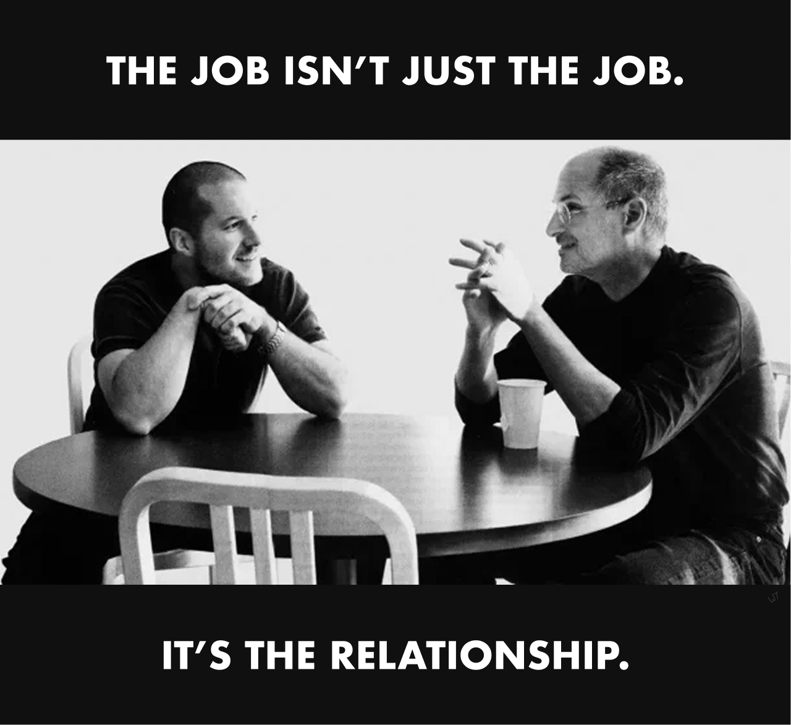

> **摘要**:
>  本文探讨了在大规模自动化后，人类仍然需要扮演的角色，特别是所谓的“关系劳动”。在自动化技术逐渐取代人类的手工和认知工作时，作者提出人类在工作中所需的品格不仅仅是能力，包括亲密关系、承诺和关心等情感因素。关系劳动不仅在现代工作中无处不在，还在团队合作和工作效率中扮演了重要角色。尽管人工智能提升了个人的工作效率和无缝连接性，但人类的存在和合作依然是不可替代的。随着技术普及，能够建立真实信任和情感连接的人际关系将成为未来工作中最珍贵的资产，这促使我们重新思考和评价人际关系的价值，尤其是在医疗、教育等需要高程度人文关怀的领域。
> 
>  **要点总结**:
>  1. 关系劳动是人类在自动化后必须保留的重要工作，涵盖了人际关系、关怀和承诺等元素。
>  2. 在团队协作中，人的存在和互动能够提升工作效率，这种关系能力将成为未来工作的核心优势。
>  3. 尽管技术增强了个人能力，但对人际关系的真正需求依然存在，人类的陪伴是无法被机器替代的。
>  4. 安全的工作仍存在于医疗、教育等领域，这些领域强调人类的情感联系和专业关系。
>  5. 随着工作环境的变化，真实的人际关系将变得更加珍贵，未来对于团队协作的人性化需求会愈发增加。

---

### What remains when we automate most manual labor and cognitive labor?

## I

The myth of progress is that efficiency always wins: that the future belongs to solo geniuses with infinite leverage, aided by armies of machines that run themselves.

First, we automate the hands. Then we automate the head. With each technological wave, what was once skilled human labor becomes infrastructure. But the more we automate, the more we notice what’s missing.

This begs the obvious question: What remains when machines surpass us at manual and cognitive work? When do we prefer a flawed, imperfect human instead of a perfect machine — or an infinite number of them? We’re just beginning to ponder how much we still need people, and how to value them.

In this pursuit, we often point to traits like curiosity, creativity, willpower, attention, [agency](https://x.com/anuatluru/status/1884748104550752573), and [taste](https://www.workingtheorys.com/p/taste-is-eating-silicon-valley). Yes, these will all matter. But this essay isn’t about the ingredients of individual brilliance. It’s about the roles we *want* humans to play, the ones that make us *valuable to each other* beyond any single trait or skill.

I call this the third labor — Relational Labor.[^1]

**Relational labor is an essential layer embedded alongside manual and cognitive labor — rooted in presence, context, commitment, and care.**

It’s the kind of work that doesn’t always show up in metrics, but you feel it in morale, momentum, and trust. And it lives in so many modern roles: *cofounders, assistants, coaches, therapists, creative producers, teachers, social workers, doulas, chiefs of staff.*

Relational labor aligns, animates, and amplifies the other two kinds of labor.

It’s why we hire for [companionship](https://x.com/anuatluru/status/1891182747810414612) as much as competence.

**The job isn’t just the job. It’s the relationship.**

## II

Startups give us a useful mirror.

The cofounder, the coworker — both are underrated. Consider the new aspiration: the billion-dollar solo founder. One person with [infinite leverage](https://www.dwarkesh.com/p/ai-firm), courtesy of AI.

Yes, it’s possible. But it’s also lonely. And limiting. No one dreams of winning in a vacuum.We want people in the room — friends, co-conspirators, witnesses. Most meaningful work demands at least [a few people](https://www.workingtheorys.com/p/silicon-valley-small-business), not just to handle strictly “productive” work, but to breathe life into the quest itself.

Someone who shares the burden, spots what you miss, finishes your half-thoughts, indulges your tangents, and still laughs at your bad jokes. AI might imitate that — with synthetic empathy, simulated guidance, algorithmic support — but one-sided relationships quickly become [sycophantic](https://openai.com/index/expanding-on-sycophancy/).

People keep telling me how many more things I can do on my own now — with AI — and they’re right. I can write, build, launch, sell, automate — forever. I could assign an agent to every task — even companionship. And maybe it would do its job. But it’s so obviously spiritually vacant.

I’m not against a solo dinner or a solo quest once in a while. But I don’t want to live in a world where presence is just a product and relationships are just responsive interfaces. All this newfound leverage hasn’t lowered my need for human co-conspirators. It’s just raised the bar.

All this tech. I still want a teammate.

**AI will flood the zone with intelligence. But as intelligence gets cheaper, presence gets more expensive.** Real, earned, [interpersonal trust](https://x.com/lessin/status/1922326210794717547) will become the rarest currency. And relational labor is how that currency gets minted.

**Working with the right person is exponential. We’ll be reminded of that again soon. The human teammate will be one of the most valuable roles of the future. When tech is everywhere, people are the new edge. Chemistry beats code.**

## III

Marc Andreessen [argues](https://pmarca.substack.com/p/why-ai-wont-cause-unemployment) that many jobs will remain safe from automation because they exist in regulated sectors — like healthcare, education, government.

These jobs are still safe — for now — because they carry risks no machine can yet assume, involve complexity no algorithm can yet automate, or rely on interfaces no technology can yet convincingly fake.

Many of these jobs — doctor, teacher, civil servant — have also been relational at their core. Do we still consciously value human presence in these domains, or do we simply fear its absence — or fear change itself?

Inertia, regulation, and entrenched incentives still hold the line for now. But ultimately, regulation can’t force markets and culture to value what they no longer do, and to employ people they no longer have to.

We’re used to paying for professional relationships, but we justify the cost as payment for *output*. What happens once most ‘output’ is automated, and markets are left to price relationships independently? Will we treat human partnership as a commodity, or watch it become a luxury? As Paul Graham [points out](https://x.com/paulg/status/1924762783893106974), people accept there’s no “fair” price for a commodity — until the commodity is labor.[^2]

Some interactions will get faster and more synthetic. But presence doesn’t scale, and that will make truly human work not just rare, but increasingly unequal. **As teams get smaller and orgs flatten, the leverage of the relational role only grows. With luck, the future will start to look more like the past: relationships at the core.** I’m so bullish on the resurgence of the right-hand man. Hell, maybe even the right-hand renaissance man. 10x is cool, but 1:1 might be more powerful.

---

We’ve automated the hands. We’re automating the heads. What’s left is the heart — the third labor is relational labor: presence, commitment, and care. It’s the work machines can’t replicate because they can’t *relate* to us in the truest sense.

Life is better with good company. And companies, communities, homes are all better when full of life. It’s not about how many people, but about how human.

**In a world of infinite machines with infinite output, the most irreplaceable work won’t be done by those who replace us, but by those who do it with us.**

A timely example — Jobs once called Ive his “spiritual partner at Apple.” Their work was technical and creative. It was also deeply relational.

***This is the first in a two-part essay series. Subscribe to get the next in your inbox.** And if you enjoyed this essay, consider sharing it with a friend or community that may enjoy it too. I welcome reactions, reflections, & thought-provoking questions!*

[^1]: I’m a longtime fan of Sociologist Arlie Hochschild’s thesis on “emotional labor.” I consider relational labor to be a broader umbrella under which emotional labor exists.

[^2]: It is hard to really grasp ‘pricing’ relational labor in a market. We’ve always looked for other ways to triangulate to this value, relying heavily on the manual and cognitive labor bundled with it. With the unbundling of these two from humans, we’re a bit lost.