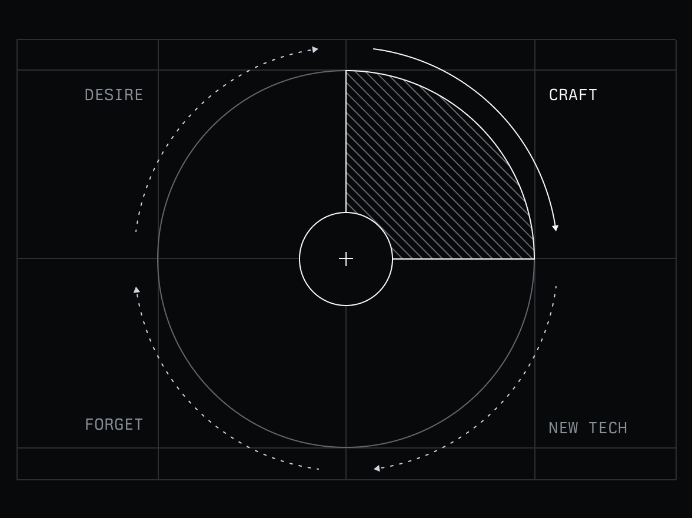

> **摘要**: 文章探讨了现代社会中质量稀缺的原因，认为尽管技术和知识的进步使得产品创作变得更快，但工艺和用心却往往被忽视。作者回顾了从手工艺到工业革命再到现代软件开发的演变，指出这种转变使得质量被量化目标和快速生产取代，从而产生了对工艺的疏远。与此同时，AI的崛起进一步拉远了创造者与成品之间的距离，制作过程中的判断和品味逐渐外包。虽然追求质量并不常见，但作者在Linear公司中坚持以质量为核心，证明了质量能够促进客户的自然推广，从而推动了企业的成功。最终，作者呼吁个人和团队在工作中坚持对质量的追求，并认为这是对自己和业务的责任。
> 
>  **要点总结**:
>  1. 质量稀缺源于对工艺的忽略，追求速度与成本的优化使得产品常常显得粗糙和不精致。
>  2. 随着技术的进步，创作者与作品之间的关系逐渐疏远，导致对工艺的重视减少。
>  3. AI的出现会进一步减少创作中的判断与品味，但工艺的本质无法完全外包。
>  4. 在Linear公司，质量作为核心价值观，带动了用户自发传播和企业增长。
>  5. 个人的对质量的追求是实现高质量产出的起点，这种负责的态度不仅是职业道德，也是良好的商业策略。

---

## Why is quality so rare?

Karri Saarinen ·

*The following is adapted from a [keynote talk](https://www.youtube.com/watch?v=pCil7YNhNCU) I delivered at Config in May 2025. I've edited it slightly for clarity, but wanted to share these thoughts on craft, quality, and the choices we make as creators in an age of AI.*

The modern world has made huge advances in knowledge, technology, and skill. We can build faster than ever. We know more than ever. Yet quality still feels so rare. So many things feel unfinished, broken, or forgettable – why?

That’s the question I've been trying to answer, almost my whole life. I remember as a kid, seeing bikes at the store, some of them just felt wrong. I couldn’t understand why someone would go through the effort of making something and not make it beautiful.

Later in my life, I realized it’s because many don’t care, many opt for cost, and many just do what’s easy. What I was noticing, even as a child, was the presence or absence of craft.

Before machines, everything was made by hand. A tool, a chair, a door. They reflected the skill and care that was put into them. Some things were rough. But when someone puts their full attention into the work, the result could be truly great.

This is what craft is about — the deliberate attention put into making something excellent, not because someone is checking, but because it matters to the maker.

Then came the industrial revolution and mass production. We started losing the connection to craft. We began to optimize for costs, speed, and quantity.

We’ve been living our own version of this in the software industry. In the beginning, small teams crafted software with care. They took pride in what they built.

But over time, the teams grew and the process started to look more like a manufacturing line. As we learned to ship to the cloud multiple times a day, we started to change how we work and think.

“Just ship it.”

“Move fast and break things.”

We replaced purpose with metrics. If it didn't move a metric, it didn't matter. Even we, as designers, stopped asking; “Does this feel right?.” Instead, we started asking: “Does it convert?”

Experiments and A/B testing replaced judgment. Optimizing for a *process* replaced craft.

The interesting thing is that this cycle keeps happening in the same way with each technological advancement, it’s nothing new. In 1927, Earnest Elmo Calkins wrote in The Atlantic:

“The directing minds, absorbed in the new wonder of so many things made so easily \[...\] aggravated that fact by producing the bad design in incredible quantities.”

“We passed from the hand to the machine, we enjoyed our era of the triumph of the machine \[...\] and then we began to miss something in our cheap but ugly products.”

You see this common cycle play out. Craft exists naturally at the beginning. Then technology comes along and makes it easier or quicker to create things, and so we’re pulled away from craftsmanship. But then we start to miss it (in our work and the products we buy) and in response we seek quality, which causes a revival of craft.

The cycle of craft: Craft leads to new technology which enables us to build faster which leads to a phase where we forget the craft followed by a phase where we start longing for craft again

Today, we’re at a familiar moment in the craft cycle. Maybe even bigger than before.

AI feels more like a change in substrate, rather than just another tool. Like electricity, the internet, or the mobile phone, it changes the material conditions of how we make things by putting near-instant creation in everyone’s hands.

While mass production separated the maker’s hand from the object, AI attempts to separate the maker’s judgment and taste from creation itself.

With each prompt, we’re trying to outsource not just labor, but the craft itself — the thinking, the intuition, the care. Yet craft, by its nature, can never be fully outsourced. The qualities that make something truly excellent come from being deeply involved in the entire process.

**Technology makes it faster to build, but harder to care.**

The craft we’ve been discussing is essentially the input that creates quality. When something is crafted with care and attention, it possesses a certain feeling — a quality that’s difficult to define but impossible to miss.

Christopher Alexander called it “quality without a name.” He wrote: “There is a central quality which is the root criterion of life and spirit… It is objective and precise, but it cannot be named.”

It’s when something feels alive. When something feels right, even if you can't exactly describe why. You know when it’s there. And you know when it’s not. Like a door opening and closing perfectly, it’s satisfying.

At Linear, we recently did an [interview series on quality](https://linear.app/quality). My takeaway from those interviews with different makers was that everyone approaches it differently. There isn’t a single right way to operate or create quality.

But one thing was common with everyone: The belief and need to seek that quality. Seeking the feeling of *rightness*, even when it was hard.

While some seek quality, it’s still not that common. Time after time, working in companies and teams, I heard: “Quality doesn’t matter, we have other priorities.”

The conventional wisdom in tech is that quality doesn’t scale. That pursuing craft is too slow, too expensive, too precious for business realities. That at a certain point, you have to choose between growth and craft.

This belief is so pervasive that it’s rarely questioned. Companies optimize for immediate metrics and quick wins, assuming quality will somehow take care of itself (it never does).

While I understood the reasons, I never fully believed in them. In the back of my mind, I always believed that if you actually try to do it, it can work. So when I started Linear, quality became a central part of the business. Not just because it was important to me personally, but also because I saw it as a way to win.

In a crowded market of issue tracking tools, Linear stood out through quality. Quality creates gravity — it pulls people in rather than requiring us to push. One team would experience Linear, tell others, and adoption would spread organically throughout organizations. This natural flywheel of experience to advocacy to adoption to loyalty has powered our growth far more effectively than traditional tactics ever could.

Linear became profitable by year two. And by year four, we had more than 10,000 paying customers with effectively zero marketing spend. Turns out when you build something that feels just *right*, your customers will do your marketing for you.

When I talk about quality, I don’t just mean product quality. I mean the whole customer experience. So, how do we build for quality at Linear?

- **Quality as the north star** **for every team  
	**We evaluate decisions by asking “does this improve quality?” not just “will this ship faster?”
- **Intuition & customers over data  
	**We trust our sense of what feels right and listen closely to users, not just metrics
- **Hire only people who show craft and care  
	**We look for evidence of taste and attention to detail in our [work trials](https://linear.app/blog/why-and-how-we-do-work-trials-at-linear)
- **Small teams using their judgment**  
	We believe 3-5 people with good taste make better decisions than large committees
- **No handoffs, whole team iterates towards “right”  
	**Rather than assembly-line development, we keep teams engaged from concept to completion
- **MVPs for internal use only  
	**We don't ship half-baked experiences; we test incomplete products internally first
- **Zero bugs policy  
	**Issues are fixed within 7 days

I've learned that building quality requires three elements working together: The belief that quality matters fundamentally, the skill and taste to recognize it, and the willingness to care deeply about the user’s experience.

A venn diagram with three circles: Belief, care, and craft. Quality happens at the intersection of these three circles.

The cycles of technology always drive us toward prioritizing speed and cheapness. We forget the craft. We stop paying attention to quality. And while we can’t stop these shifts, we also don’t have to surrender to them.

Quality is a choice we can make every day.

We can choose to care and put it in our work.

We can seek that feeling of *rightness*.

It starts with an individual. It can scale through teams and companies, but it always starts with an individual — **you.** Individuals who seek the quality without a name. Even when it’s not measurable or when the world tells them no.

I genuinely believe it’s the right thing to do, and I know it’s good for business. So If there is one trend I’d like to start, it’s this one. Regardless of what the world around us might tell us, let’s make this choice – **let** ’ **s keep making things we’re proud to put our names on.**

Karri Saarinen ·