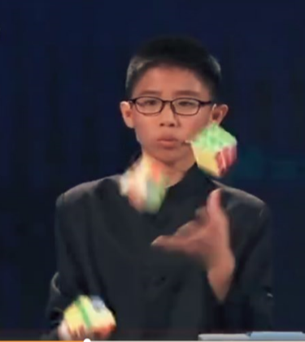

> **摘要**:
>  本文由作者从自身玩魔方的经历切入，探讨了“技能”的真正含义及其反面。作者指出，技能的反面并非“缺乏技能”，而是“解决问题”——当一个人对基础操作不熟练时，就不得不花大量时间解决低层次问题，而无暇展示高层次能力，如同面试中因语法生疏而无法展现算法能力的北大毕业生。技能的另一个反面是“宏大叙事”或空话，即空谈远大目标而疏于实践。要获得真技能，需通过刻意练习将基础操作内化为肌肉记忆，并抓住当下、持续行动，而非沉溺于白日梦。作者以医生技能为例，强调熟练与可靠性胜过纸上谈兵，并罗列了魔方技能的六个层次，最后提出用“还原到初始混乱状态”来考察对魔方的真正精通。
>  
>  **要点总结**:
>  1. **技能的反面是“解决问题”**：缺乏技能时，人会把精力耗费在解决低级、基础的问题上，从而无法展现更高层次的核心能力。
>  2. **技能的另一个反面是“宏大叙事”**：只谈远大理想和目标，却不愿投身于枯燥的基础练习，最终一事无成。
>  3. **提升技能的途径是刻意练习**：将基础操作练至“肌肉记忆”，不再需要刻意思考，才能腾出精力处理高层次问题。
>  4. **行动胜过灵感**：专业技能依赖持续每日工作而非等待灵感，抓住当下、坚持练习方能走向成功。
>  5. **技能有层次之分**：从理论了解、依口诀操作、知其所以然，到熟练运用、创新设计，层次不同，需结合实际情境评估真实水平。

---

## 魔方的技能

大概是在我小学五年级的时候, 大家开始玩魔方，我们家也买了一个。 我和几个小孩折腾了一会, 没搞出什么名堂。我哥摆弄了好一会, 嘿! 弄出一面一样的颜色。后来我也琢磨出来怎么把一面颜色拼出来。 再后来我才知道魔方有一些模式和一些口诀， 按图索骥, 依口诀而行, 就会从一面玩到一面再加一层， 再到加两层, 然后把最上层四个角的颜色搞对, 然后再按照一两个口诀翻十几下, 六面就做好了! 我玩着玩着就把各种模式和口诀都掌握了。 上初中的时候, 我还在课间表演过, 赢得一些同学的好评。

要在当时, 我的简历上一定会在“技能”一栏写上:

> 精通魔方

后来我就不玩魔方了，这样过了二十多年。

几年以前我在一个实习生的桌上又看到了魔方。 我拿起来，似乎不用想, 当年的口诀就在手上. 转啊转，一面, 一层, 两层，哎第三层 口诀是什么来着? 我试了几种可能, 好像都不行，我就放下了魔方。

看来我的简历要改写成:

> 精通魔方到第二层

后来我想, 把第二层拼好, 我只知道找到某个模式, 按照某个口诀执行即可。 但是我并不了解为什么这个口诀能把第二层拼好, 同时又不打乱第一层的结果。 我更不知道如果在执行中走错了几步， 如何随机应变, 挽回局面。离开了口诀的话, 我只能把魔方的一面拼出来。从这点看来, 我的魔方技能应该是

> 能独立够还原一面, 其他看口诀可搞定

那我的这真实的“技能”还值得写上简历么? 看样子是上不了台面了, 那什么是“技能”呢?

技能 - 大家都有技能，一般都觉着自己 “还行”。有了大模型加持的 AI 工具之后，大家的编程技能就更多了还是更少？ 😄 今天我们来说两个和技能有关的故事，希望能帮助大家了解自己。

说到“了解自己”，如果一个人是出于一个完全静态的的状态，没有做任何事情，那么“自己” 是怎么样的，只有他自己知道。 或者，他出于一种哲学意味中的 “我思，故我在”。但是大家也知道这样的名言 “人的本质是一切社会关系的总和“ ， 人要有行动，和别人有互动，才能看出自己在和外界的交互中是一种什么样的存在，外界如何评价自己，也能才能了解自己。

### 技能的一个反面

比如，在你自己所学习或者工作的领域，对于自己的能力，你是否有一个清晰的认知呢？

我曾经面试过一个北大计算机系的毕业生，因为我自己也是北大毕业的，所以对这位学弟还是抱有许多期待。但面试中，我发现他写程序思路很慢而且程序里面小错误很多。

我当然很诧异，问他原因，他说，自己出来找工作之前，特意没做任何准备，就想通过实际的面试看看自己的 **核心实力** ，他还用了一个英语词 **raw talent** 来表达，从这个面试来看，我想他应该看到了，自己的实力的确非常粗糙 （raw）。

面试的最后，他也有点尴尬，但是他表示，自己学习成绩和编程是不错的，就是不熟练，而且他挺想加入公司，他自己有很多创新的想法，想要和优秀的人一起来改变世界。

我当时不知道怎么安慰和开导他，只能说：机遇只偏爱有准备的大脑，就送他走了。

这个面试让我印象深刻，为这个学弟惋惜的同时，我也在想他对自己编程技能的认知，为什么和实际操作的结果会有那么大的差异。

后来微软研究院的同事郭百宁博士推荐我看了一篇文章：是计算机人机交互领域的科学家Bill Buxton 写的《技能的反面》，让我茅塞顿开。

我先问大家：技能的反面，是什么？我们暂停10秒钟，等大家的回答。我提示一下，反面不是“缺乏技能”。

要知道技能, 谁能告诉我 **技能的反面** 是什么?

## 技能的反面

计算机人机交互领域的科学家 [Bill Buxton](http://academic.research.microsoft.com/Author/663628/william-a-s-buxton) 1995 年的一篇文章提到了 “ [The Opposite of Skill](http://www.billbuxton.com/xc.html) ”:

Before reading on, think for a moment, and tell me what is **the opposite of skill**?

I'll even give you a hint: I'm not looking for "unskilled."

\[大家可以花 10 多分钟先 [读一读](http://www.billbuxton.com/xc.html)\]

\[10 分钟就过去了? 您还是 [读一下吧](http://www.billbuxton.com/xc.html)\]

Bill 说技能的反面是 **Problem Solving – “解决问题”**, 这个听起来有点绕， 我们看看 IT 人士熟悉的一个例子吧。 一个 IT 专业的大学生来面试, 简历上写 “ 技能: 精通 Visual Studio C# 编程 ” 。 于是面试官请他实际用 VS IDE 写一段程序 (冒泡排序) 。 一个 “不精通”的面试者的编程过程实际上就是一个“解决问题”的过程。 例如:

· 嗯, 怎么开始一个 C# 的命令行程序呢?

· 定义数组是怎么弄的? 是 “ int \[\] arr ” 还是 “ int arr\[\]”, 还是 ArrayList ， 还是 Array <T> 。 哦, 我平时都是上网查的. 哦, 我不知道还有 MSDN 网站。

· 嗯, 为什么编译没过呢, 哦, 这里少一个分号。

· 嗯, 怎么设断点? 怎么定义命令行参数? 额, 我要查一查 …

你发现他把时间都花在“解决 (低层次) 问题”上了, 你想考察的“算法技能”、 “C# 程序设计技能 ” 都无暇顾及。注意, 这是在他认为非常精通的编程工具和编程语言中出现这样的问题。 你要这样的员工么?

那怎么提高技能呢? 答案很简单, 通过不断的练习, 把那些低层次的问题都解决了, 变成不用经过大脑的自动操作, 然后才有时间和脑力来解决较高层次的问题。

为了更形象地理解这一点，我想分享刚看到的关于“ [手上的茧子](https://weibo.com/2695803543/Qeupz7Q2a) ”的两个小故事。

> 健身的朋友发现，刚开始练的时候，手指根部很快就磨出了很多茧子。他本以为这是努力的勋章，但随着练习深入，他发现当握力上去了，手稳了，器械不再在手里来回滑动摩擦时，反而没那么容易长新茧了，以前的老茧也在褪皮几次后变得不再明显。
> 
> 这让我想起最近看的一期《圆桌派》，文涛跟鲁豫去成都拍一位弹古琴的老师。鲁豫问：“我能摸一下您的手吗？” 老师伸出手来，鲁豫摸完很惊讶：“我以为天天弹琴的老师手上会有很多茧子呢，结果您的手这么光洁。”
> 
> 老师解释说，其实在内行看来，茧子多往往代表琴技不深。因为用了太大的力气、多余的力气，手指和琴弦产生了不必要的摩擦，才会起茧子。真正的高手是不需要用那么大的蛮力的。随着琴艺的精进，手上的茧子也会有一个逐渐脱落的过程。

这个道理放在编程上也是一样。那位面试的学弟，之所以表现得“粗糙（raw）”，就是因为他在那些基础语法、编译环境配置上用了太多的“蛮力”，产生了太多的“摩擦”。他在面试现场不得不分心去 **“磨茧子”（解决低级错误），自然就弹不出流畅的乐章（无法展示核心算法能力）。**

意识到“基础技能很重要”，“我要学好编程”只是第一步，但是这个和 “我已经会用这个技术” 还是有很大的差距的。怎么达到呢？ 还是要说服自己不断刻意练习， **直到脱掉那层“低效的茧子”，形成肌肉记忆** 。

我不确定上面提到的那位同学通过这次面试，有没有更清晰地认识了自己，不过，如果这次挫折能唤醒他，那还是一件好事。

除了这位学弟，我这几年在教学的过程中，也发现很多同学并不了解自己和社会，走向了技能的另一个反面：宏大叙事。

### 技能的另一个反面

技能的另一个反面，就是空话，或者叫宏大叙事。

我曾经在一个课程中给某著名高校的学生出题，让他们计划一个博客网站。 其中一个小组长计划自己的产品半年内就达到三千万用户，一年后达到两亿一千万。

对你没有听错，大学生小组开发网站一年后获得两亿一千万用户！

我刚才上网去核对了一下，这个学生的博客还在网上，只不过，他的项目从来就没有开始过。 作为对比， CSDN 博客网站经过了大约二十年，才达到他计划半年要达到的目标。

学生的计划： [http://blog.sina.com.cn/s/blog\_840494da0100stf7.html](http://blog.sina.com.cn/s/blog_840494da0100stf7.html)

年轻学生都志向远大, 上了一些课, 就很想解决高层次的问题。我最近碰到一些学生就非常想做高层次的“科研”，觉得“工程”是基础, 没意思。而且我“已经知道怎么做了”， 或者理论的高度上说, 所有的“技能”都能总结成简单的 “已经知道怎么做了”，例如:

- 下围棋怎么做？每一步都占据全局价值最大的一点, 直到终局, 即可获胜。
- 打乒乓球怎么做? 把对手打过来的球都打回去, 直到对手的球出界或下网, 即可获胜。
- 博客网站如何能成功？不断地把博主吸引来写博客，直到两亿博主都来了，即可成功。 😄

讲大话都是容易的，大多数情况下，也不用为吹牛交税。但是，很多同学也陷入了一种循环： 刚开始接到一个任务，雄心壮志，发奋图强，觉得半年三千万用户不是梦！ 然后开始锻炼技能，做实际工作； 练过几天，就觉得太枯燥了，开始怀疑有没有用； 没看到成果，接着就进入了懈怠，放弃的阶段； 但看到别人取得成功了，又羡慕嫉妒恨； 于是又开始新一轮的雄心壮志......

怎么跳出这个循环呢？

### 那就要走到白日梦的反面 - 抓住当下

白日梦的反面，不是夜里做梦，而是能否让自己行动起来。梦想是好事，白日梦也无妨，但是我也注意到一种“羡慕别处的生活”的白日梦。这种“羡慕别处的生活”的心理，不珍惜自己目前的状态，总想着“此地不够好”。比如看了一场讲某人在苦难中奋斗成功的鸡汤，有些人会觉得自己上了大学也不够好，希望自己的生活来一点苦难，这样我就没有退路，就可以背水一战了。其实，到了那个地步，就是 “别处的生活”，在那样的处境中，一个人更多的概率就是沉沦或者被苦难吞没，背水一战能成功的是少之又少，否则就不会有各种鸡汤故事了。

怎么让自己行动起来呢？ 抓住当下，做一道编程练习题，可能需要10 分钟，写下总结，可能需要另外的 10分钟。很多人看不起这十几二十分钟，心里焦虑的是我如何改变命运。但是十几二十分钟你都控制不了，想着各种学习之外的八卦，或者世界大国之间的冲突，人类的前途，娱乐明星的悲欢离合... 被各种念头牵挂在“别处”。不能让心定在做练习这个小事情上，怎么能成就你的大事业呢？编程是世界上最容易学的技能之一，你写的程序有错，编译器都明确指出了哪一行出了什么错，那就改错不就完了么？关键是要坐下来开始写程序。

绝大多数技能的习得，是靠刻意练习。练习有两种，私下的、公开的。你练习编程，在自己的电脑上，或者把自己的程序，博客都发表在网上。很多人怕自己做不好——当然更多的是怕别人笑话。

可这完全是心理障碍而已。谁敢规定一个人代码写得不是最高效，博客文笔一般，就不允许发布了？ 另外要认识到，每个人都有自己的课题，没有人有闲心来管你的，直接公开写吧。

现在很多人在工作的时候，都会提倡一种“心流”模式，觉得自己需要进入心流时刻，才能学习，有灵感了，才能开始创造。他们认为自己需要灵感和激情，才能为宏大的目标奋斗，才能成为专业人士。在我看来，这其实是对“心流”的误解。 著名的艺术家 Chuck Close 曾经说过： **我总觉得灵感是属于业余爱好者的, 我们职业人士只是每天持续工作。** 今天你继续昨天的工作，明天你继续今天的工作，最终你会有所成就。

所以，一个人不管当时处于心流状态与否，如果能够迫使自己在心理和情绪上，做到每天都能学习一段时间不放弃，这就会培养“心流”，这就是通向成功的钥匙。 坚持下去，你就会走出白日梦，获得技能，可能真的会实现你曾经吹过的牛哦...

### 医生的技能

讨论一下，如果你是躺在手术台上的病人，下面这些医生的技能如何？ 你希望你的医生是下面的哪一种呢？

a) 刚刚在书上看到你的病例, 还不熟悉手术室的各种工具，开刀的过程中非常认真严谨, 时不时还要停下来翻书看看……

b) 富有创新意识, 开刀时突然想到一个新技术、 新的刀法, 然后马上在你身上试验……

c) 已经成功处理过很多类似的病例，可以一边给你开刀, 一边和护士聊天……

d) 此医生无任何正式文凭或正式医院的认证, 但号称有秘方, 可治百病。

**回到魔方**

**魔方的技能有哪些层次呢? 下面是我粗浅的看法:**

1\. 听说过魔方的玩法, 理论上了解 (懂了 ：通过扭动魔方的各个层面， 直到六面出现一样的颜色为止)

2\. 对口诀知其然, 能在实践中根据某种口诀玩成六面 (楼主在这里)

3\. 对口诀知其所以然, 能够根据情况加以变化

4\. 同上, 唯手熟尔。 十几秒就可以搞定的 (小学冠军们在这里)

5\. 同上, 但是转得特别特别特别快, 几秒就能转好的那些人 (世界冠军们在这里)

6\. 能够设计出新型的魔方，或者创新的玩法 （例如， [同时空中抛接三个魔方并还原](https://weibo.com/1895682211/G9zox6LOZ?type=comment) ）

那怎么才能考察出一个人 “精通”魔方呢? 我想了这样一个办法:

a) 给面试者一个各面打乱颜色的魔方

b) 要求他把六面还原

c) 如果还原了, 要求他把魔方恢复成我最初给他那个混乱的局面, 必须一模一样。

精通魔方的同学, 来吧。

posted @ [SoftwareTeacher](https://www.cnblogs.com/xinz) 阅读(27184) 评论(22) 收藏 [举报](https://report.cnblogs.com/?targetLink=https%3A%2F%2Fwww.cnblogs.com%2Fxinz%2Farchive%2F2011%2F08%2F07%2F2129751.html&targetId=2129751&targetType=0)